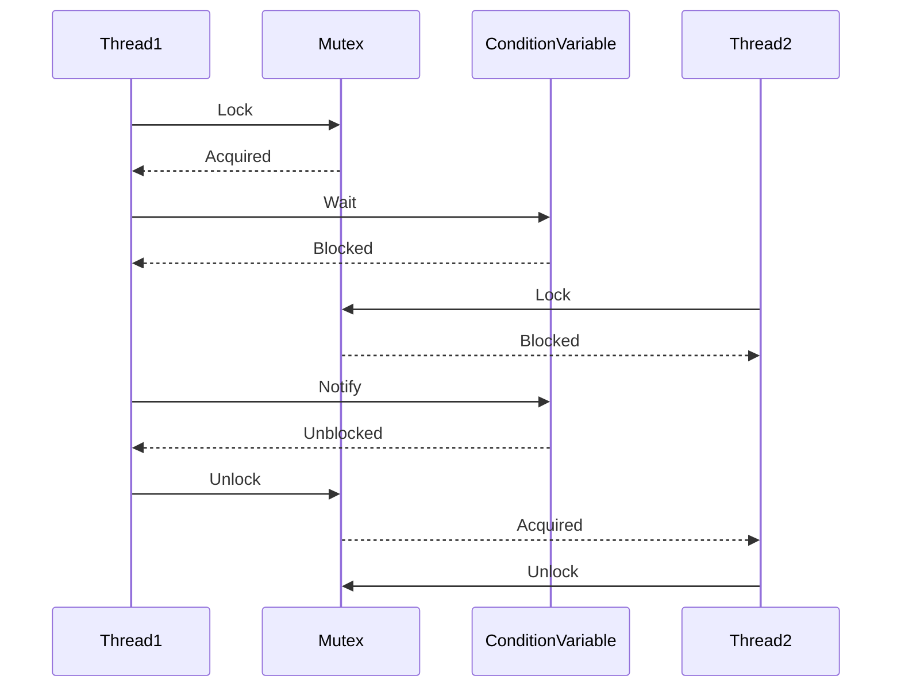

## 7.3 Synchronization Patterns

In the realm of concurrent programming, synchronization is a critical aspect that ensures the correct execution of threads. In C++, synchronization patterns help manage access to shared resources, prevent race conditions, and maintain data consistency. This section delves into the intricacies of synchronization patterns, focusing on mutexes, locks, deadlock avoidance strategies, reader-writer locks, and condition variables. By mastering these patterns, you will be able to design robust and efficient multithreaded applications.

### Using Mutexes and Locks

Mutexes (short for mutual exclusions) are fundamental synchronization primitives that prevent multiple threads from accessing a shared resource simultaneously. They ensure that only one thread can access the critical section of code at a time, thus preventing race conditions.

#### Key Concepts

- **Mutex**: A mutex is a locking mechanism that ensures mutual exclusion. When a thread locks a mutex, other threads attempting to lock it will be blocked until it is unlocked.
- **Lock**: A lock is an abstraction that manages the acquisition and release of a mutex. C++ provides several types of locks, such as `std::lock_guard` and `std::unique_lock`.

#### Code Example: Basic Mutex Usage

```cpp
#include <iostream>
#include <thread>
#include <mutex>

std::mutex mtx; // Mutex for critical section
int counter = 0;

void incrementCounter() {
    for (int i = 0; i < 1000; ++i) {
        std::lock_guard<std::mutex> lock(mtx); // Lock the mutex
        ++counter; // Critical section
    }
}

int main() {
    std::thread t1(incrementCounter);
    std::thread t2(incrementCounter);

    t1.join();
    t2.join();

    std::cout << "Final counter value: " << counter << std::endl;
    return 0;
}
```

In this example, `std::lock_guard` is used to lock the mutex `mtx` during the increment operation, ensuring that only one thread can modify `counter` at a time.

#### Design Considerations

- **Performance**: Mutexes can introduce overhead due to context switching and blocking. Use them judiciously to avoid performance bottlenecks.
- **Deadlock**: Improper use of mutexes can lead to deadlocks, where two or more threads are waiting indefinitely for each other to release locks.

### Deadlock Avoidance Strategies

Deadlocks occur when two or more threads are blocked forever, each waiting for the other to release a lock. To avoid deadlocks, consider the following strategies:

#### 1. Lock Ordering

Establish a global order in which locks must be acquired. By ensuring that all threads acquire locks in the same order, you can prevent circular wait conditions.

#### 2. Try-Lock

Use `std::try_lock` to attempt to acquire multiple locks without blocking. If a lock cannot be acquired, release any already acquired locks and retry.

#### Code Example: Try-Lock

```cpp
#include <iostream>
#include <thread>
#include <mutex>

std::mutex mtx1, mtx2;

void taskA() {
    while (true) {
        std::unique_lock<std::mutex> lock1(mtx1, std::defer_lock);
        std::unique_lock<std::mutex> lock2(mtx2, std::defer_lock);

        if (std::try_lock(lock1, lock2) == -1) {
            // Both locks acquired
            std::cout << "Task A acquired both locks\n";
            break;
        }
    }
}

void taskB() {
    while (true) {
        std::unique_lock<std::mutex> lock1(mtx1, std::defer_lock);
        std::unique_lock<std::mutex> lock2(mtx2, std::defer_lock);

        if (std::try_lock(lock1, lock2) == -1) {
            // Both locks acquired
            std::cout << "Task B acquired both locks\n";
            break;
        }
    }
}

int main() {
    std::thread t1(taskA);
    std::thread t2(taskB);

    t1.join();
    t2.join();

    return 0;
}
```

In this example, `std::try_lock` attempts to lock both `mtx1` and `mtx2`. If it fails to acquire both locks, it releases any acquired locks and retries.

#### 3. Avoid Nested Locks

Minimize the use of nested locks, as they increase the complexity of lock management and the likelihood of deadlocks.

#### 4. Use Timed Locks

Use timed locks like `std::timed_mutex` to specify a timeout period for acquiring a lock. If the lock cannot be acquired within the timeout, the thread can take alternative actions.

### Reader-Writer Locks

Reader-writer locks allow multiple threads to read a shared resource concurrently while ensuring exclusive access for write operations. This pattern is useful when read operations are more frequent than write operations.

#### Key Concepts

- **Read Lock**: Allows multiple threads to read the resource simultaneously.
- **Write Lock**: Ensures exclusive access to the resource for writing.

#### Code Example: Reader-Writer Lock

```cpp
#include <iostream>
#include <thread>
#include <shared_mutex>
#include <vector>

std::shared_mutex rw_mutex;
std::vector<int> data;

void reader(int id) {
    std::shared_lock<std::shared_mutex> lock(rw_mutex);
    std::cout << "Reader " << id << " is reading data\n";
    for (int val : data) {
        std::cout << val << " ";
    }
    std::cout << std::endl;
}

void writer(int id, int value) {
    std::unique_lock<std::shared_mutex> lock(rw_mutex);
    std::cout << "Writer " << id << " is writing data\n";
    data.push_back(value);
}

int main() {
    std::thread t1(reader, 1);
    std::thread t2(writer, 1, 10);
    std::thread t3(reader, 2);

    t1.join();
    t2.join();
    t3.join();

    return 0;
}
```

In this example, `std::shared_mutex` is used to allow multiple readers to access the `data` vector concurrently, while writers have exclusive access.

#### Design Considerations

- **Performance**: Reader-writer locks can improve performance in scenarios with frequent read operations. However, they may introduce overhead due to lock management.
- **Starvation**: Writers may experience starvation if readers continuously hold the lock. Implementing a fair scheduling policy can mitigate this issue.

### Condition Variables and Notifications

Condition variables are synchronization primitives that enable threads to wait for certain conditions to be met. They are used in conjunction with mutexes to coordinate the execution of threads.

#### Key Concepts

- **Condition Variable**: A condition variable allows one or more threads to wait until they are notified by another thread that a condition has been met.
- **Notification**: Threads can be notified using `notify_one` or `notify_all` to wake up waiting threads.

#### Code Example: Condition Variable

```cpp
#include <iostream>
#include <thread>
#include <mutex>
#include <condition_variable>

std::mutex cv_mtx;
std::condition_variable cv;
bool ready = false;

void worker(int id) {
    std::unique_lock<std::mutex> lock(cv_mtx);
    cv.wait(lock, [] { return ready; });
    std::cout << "Worker " << id << " is processing data\n";
}

void signal() {
    std::this_thread::sleep_for(std::chrono::seconds(1));
    {
        std::lock_guard<std::mutex> lock(cv_mtx);
        ready = true;
    }
    cv.notify_all();
}

int main() {
    std::thread t1(worker, 1);
    std::thread t2(worker, 2);
    std::thread t3(signal);

    t1.join();
    t2.join();
    t3.join();

    return 0;
}
```

In this example, `cv.wait` is used to block the worker threads until the `ready` condition is set to true. The `signal` function sets the condition and notifies all waiting threads.

#### Design Considerations

- **Spurious Wakeups**: Condition variables may experience spurious wakeups, where a thread is awakened without a notification. Always check the condition in a loop.
- **Performance**: Condition variables can improve performance by reducing busy-waiting. However, they may introduce complexity in managing conditions and notifications.

### Visualizing Synchronization Patterns

To better understand how these synchronization patterns work, let's visualize the interaction between threads, mutexes, and condition variables using a sequence diagram.



This diagram illustrates the sequence of events when using a mutex and condition variable to synchronize two threads. Thread1 locks the mutex and waits on the condition variable, blocking itself. Thread2 attempts to lock the mutex but is blocked until Thread1 unlocks it.

### Try It Yourself

Experiment with the code examples provided in this section. Try modifying the number of threads, the order of lock acquisition, or the conditions for notifications. Observe how these changes affect the behavior of the program and the synchronization of threads.

### Knowledge Check

- What is the primary purpose of a mutex in concurrent programming?
- How can deadlocks be avoided when using multiple locks?
- What is the difference between a read lock and a write lock in a reader-writer lock?
- How do condition variables facilitate synchronization between threads?

### Conclusion

Synchronization patterns are essential tools for managing concurrency in C++ applications. By understanding and applying these patterns, you can design efficient and robust multithreaded systems. Remember, synchronization is just one aspect of concurrent programming. Continue exploring other patterns and techniques to further enhance your skills.

## Quiz Time!



### What is the primary purpose of a mutex in concurrent programming?

- [x] To ensure mutual exclusion and prevent race conditions
- [ ] To allow multiple threads to access a resource simultaneously
- [ ] To enhance the performance of multithreaded applications
- [ ] To manage memory allocation in concurrent environments

> **Explanation:** A mutex is used to ensure mutual exclusion, allowing only one thread to access a shared resource at a time, thus preventing race conditions.

### How can deadlocks be avoided when using multiple locks?

- [x] By establishing a global order for lock acquisition
- [ ] By using more mutexes
- [ ] By allowing threads to acquire locks in any order
- [ ] By avoiding the use of locks altogether

> **Explanation:** Establishing a global order for lock acquisition prevents circular wait conditions, which are a common cause of deadlocks.

### What is the difference between a read lock and a write lock in a reader-writer lock?

- [x] A read lock allows multiple threads to read simultaneously, while a write lock ensures exclusive access for writing.
- [ ] A read lock ensures exclusive access for reading, while a write lock allows multiple threads to write simultaneously.
- [ ] Both read and write locks allow multiple threads to access the resource simultaneously.
- [ ] Read locks are used for reading, while write locks are used for writing, with no concurrency considerations.

> **Explanation:** A read lock allows multiple threads to read the resource concurrently, while a write lock ensures exclusive access for writing.

### How do condition variables facilitate synchronization between threads?

- [x] By allowing threads to wait for certain conditions to be met before proceeding
- [ ] By providing exclusive access to shared resources
- [ ] By enhancing the performance of multithreaded applications
- [ ] By managing memory allocation in concurrent environments

> **Explanation:** Condition variables allow threads to wait for specific conditions to be met, facilitating synchronization and coordination between threads.

### What is a potential issue with using condition variables?

- [x] Spurious wakeups, where a thread is awakened without a notification
- [ ] Deadlocks, where threads are blocked indefinitely
- [ ] Race conditions, where multiple threads access a resource simultaneously
- [ ] Memory leaks, where memory is not properly deallocated

> **Explanation:** Condition variables may experience spurious wakeups, where a thread is awakened without a notification, requiring the condition to be checked in a loop.

### What is the purpose of `std::lock_guard` in C++?

- [x] To automatically manage the acquisition and release of a mutex
- [ ] To provide a timed lock mechanism
- [ ] To allow multiple threads to access a resource simultaneously
- [ ] To enhance the performance of multithreaded applications

> **Explanation:** `std::lock_guard` automatically manages the acquisition and release of a mutex, ensuring that it is properly unlocked when the lock guard goes out of scope.

### What is a common strategy to prevent writer starvation in reader-writer locks?

- [x] Implementing a fair scheduling policy
- [ ] Allowing readers to always have priority
- [ ] Using more mutexes
- [ ] Avoiding the use of locks altogether

> **Explanation:** Implementing a fair scheduling policy can prevent writer starvation by ensuring that writers are not indefinitely blocked by readers.

### What is the role of `std::try_lock` in deadlock avoidance?

- [x] To attempt acquiring multiple locks without blocking
- [ ] To provide exclusive access to shared resources
- [ ] To enhance the performance of multithreaded applications
- [ ] To manage memory allocation in concurrent environments

> **Explanation:** `std::try_lock` attempts to acquire multiple locks without blocking, allowing threads to release already acquired locks and retry, thus avoiding deadlocks.

### What is the benefit of using timed locks like `std::timed_mutex`?

- [x] To specify a timeout period for acquiring a lock
- [ ] To allow multiple threads to access a resource simultaneously
- [ ] To enhance the performance of multithreaded applications
- [ ] To manage memory allocation in concurrent environments

> **Explanation:** Timed locks like `std::timed_mutex` allow specifying a timeout period for acquiring a lock, enabling threads to take alternative actions if the lock cannot be acquired within the timeout.

### True or False: Condition variables can only notify one thread at a time.

- [ ] True
- [x] False

> **Explanation:** Condition variables can notify one thread using `notify_one` or all waiting threads using `notify_all`.


