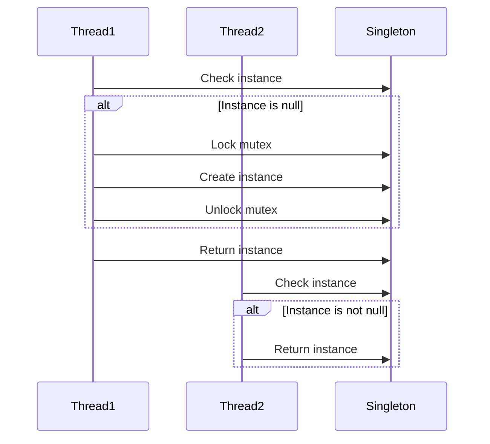

## 7.4 Thread-Safe Initialization

In the realm of concurrent programming, ensuring that resources are initialized safely and efficiently is paramount. Thread-safe initialization is a critical aspect of designing robust multithreaded applications in C++. In this section, we will delve into the intricacies of implementing thread-safe initialization, focusing on the Singleton pattern, the double-checked locking pattern, and the use of `std::call_once` and `std::once_flag`.

### Understanding Thread-Safe Initialization

Thread-safe initialization refers to the process of ensuring that a resource or object is initialized only once, even when accessed by multiple threads simultaneously. This is crucial in preventing race conditions, which can lead to undefined behavior and data corruption.

#### Key Concepts

- **Race Condition**: A situation where the behavior of software depends on the relative timing of events, such as thread execution order.
- **Mutex**: A mutual exclusion object used to prevent multiple threads from accessing a resource simultaneously.
- **Atomic Operations**: Operations that are completed in a single step relative to other threads, preventing race conditions.

### The Singleton Pattern

The Singleton pattern is a design pattern that restricts the instantiation of a class to a single object. This is useful when exactly one object is needed to coordinate actions across a system.

#### Intent

The intent of the Singleton pattern is to ensure that a class has only one instance and provide a global point of access to it.

#### Key Participants

- **Singleton Class**: The class that is restricted to a single instance.
- **Instance Method**: A method that returns the single instance of the class.

#### Applicability

Use the Singleton pattern when:

- Exactly one instance of a class is required.
- The single instance should be accessible by multiple threads.

#### Sample Code Snippet

```cpp
#include <iostream>
#include <mutex>

class Singleton {
public:
    // Public method to get the instance of the Singleton
    static Singleton& getInstance() {
        static Singleton instance; // Guaranteed to be destroyed and instantiated on first use
        return instance;
    }

    // Delete copy constructor and assignment operator
    Singleton(const Singleton&) = delete;
    Singleton& operator=(const Singleton&) = delete;

    void showMessage() {
        std::cout << "Singleton instance accessed." << std::endl;
    }

private:
    // Private constructor to prevent instantiation
    Singleton() {}
};

int main() {
    Singleton& instance = Singleton::getInstance();
    instance.showMessage();
    return 0;
}
```

#### Design Considerations

- **Thread Safety**: The above implementation is thread-safe due to the use of a static local variable, which is initialized only once.
- **Lazy Initialization**: The instance is created only when it is first accessed, saving resources.

### Double-Checked Locking Pattern

The double-checked locking pattern is a technique used to reduce the overhead of acquiring a lock by first testing the locking criterion without actually acquiring the lock.

#### Intent

The intent of double-checked locking is to ensure that a resource is initialized only once, with minimal locking overhead.

#### Key Participants

- **Mutex**: Used to synchronize access to the resource.
- **Volatile Keyword**: Ensures that the variable is read from memory, not a register.

#### Applicability

Use double-checked locking when:

- You need to initialize a resource lazily.
- You want to minimize the performance overhead of locking.

#### Sample Code Snippet

```cpp
#include <iostream>
#include <mutex>

class DoubleCheckedSingleton {
public:
    static DoubleCheckedSingleton* getInstance() {
        if (instance == nullptr) { // First check
            std::lock_guard<std::mutex> lock(mutex_);
            if (instance == nullptr) { // Second check
                instance = new DoubleCheckedSingleton();
            }
        }
        return instance;
    }

    void showMessage() {
        std::cout << "Double-checked Singleton instance accessed." << std::endl;
    }

private:
    DoubleCheckedSingleton() {}
    static DoubleCheckedSingleton* instance;
    static std::mutex mutex_;
};

// Initialize static members
DoubleCheckedSingleton* DoubleCheckedSingleton::instance = nullptr;
std::mutex DoubleCheckedSingleton::mutex_;

int main() {
    DoubleCheckedSingleton* instance = DoubleCheckedSingleton::getInstance();
    instance->showMessage();
    return 0;
}
```

#### Design Considerations

- **Performance**: Reduces the overhead of locking by checking the instance twice.
- **Complexity**: More complex than a simple Singleton, but offers better performance in multithreaded environments.

### Using `std::call_once` and `std::once_flag`

C++11 introduced `std::call_once` and `std::once_flag` to simplify thread-safe initialization. These tools ensure that a function is called only once, even in the presence of multiple threads.

#### Intent

The intent of `std::call_once` is to provide a simple and efficient way to perform one-time initialization in a thread-safe manner.

#### Key Participants

- **std::once_flag**: A flag used to indicate whether a function has been called.
- **std::call_once**: A function that ensures a callable is executed only once.

#### Applicability

Use `std::call_once` when:

- You need to initialize a resource once, safely, across multiple threads.
- You want a simpler alternative to double-checked locking.

#### Sample Code Snippet

```cpp
#include <iostream>
#include <mutex>

class CallOnceSingleton {
public:
    static CallOnceSingleton& getInstance() {
        std::call_once(initFlag, []() {
            instance.reset(new CallOnceSingleton);
        });
        return *instance;
    }

    void showMessage() {
        std::cout << "CallOnce Singleton instance accessed." << std::endl;
    }

private:
    CallOnceSingleton() {}
    static std::unique_ptr<CallOnceSingleton> instance;
    static std::once_flag initFlag;
};

// Initialize static members
std::unique_ptr<CallOnceSingleton> CallOnceSingleton::instance;
std::once_flag CallOnceSingleton::initFlag;

int main() {
    CallOnceSingleton& instance = CallOnceSingleton::getInstance();
    instance.showMessage();
    return 0;
}
```

#### Design Considerations

- **Simplicity**: `std::call_once` simplifies the implementation of thread-safe initialization.
- **Efficiency**: Provides a more efficient solution compared to manual locking mechanisms.

### Differences and Similarities

- **Singleton vs. Double-Checked Locking**: Both ensure a single instance, but double-checked locking reduces locking overhead.
- **Double-Checked Locking vs. `std::call_once`**: `std::call_once` is simpler and less error-prone, but both achieve the same goal of one-time initialization.
- **Singleton vs. `std::call_once`**: `std::call_once` provides a more modern and efficient approach to implementing Singleton.

### Visualizing Thread-Safe Initialization

To better understand the flow of thread-safe initialization, let's visualize the process using a sequence diagram.



### Try It Yourself

To solidify your understanding, try modifying the code examples:

- Implement a thread-safe Singleton using `std::call_once` with a custom deleter.
- Experiment with different locking mechanisms in the double-checked locking example.
- Create a new class that uses `std::call_once` for initialization and test it with multiple threads.

### References and Links

For further reading on thread-safe initialization and concurrency patterns in C++, consider the following resources:

- [C++ Reference for std::call_once](https://en.cppreference.com/w/cpp/thread/call_once)
- [C++ Reference for std::mutex](https://en.cppreference.com/w/cpp/thread/mutex)
- [C++ Reference for std::unique_ptr](https://en.cppreference.com/w/cpp/memory/unique_ptr)

### Knowledge Check

Before moving on, let's review some key concepts:

- What is the primary purpose of thread-safe initialization?
- How does the Singleton pattern ensure a single instance?
- What are the advantages of using `std::call_once` over double-checked locking?

### Embrace the Journey

Remember, mastering thread-safe initialization is just one step in your journey to becoming an expert in C++ concurrency patterns. Keep experimenting, stay curious, and enjoy the process of learning and applying these powerful techniques in your projects.

## Quiz Time!



### What is the primary purpose of thread-safe initialization?

- [x] To ensure a resource is initialized only once in a multithreaded environment.
- [ ] To allow multiple threads to initialize a resource simultaneously.
- [ ] To increase the performance of single-threaded applications.
- [ ] To simplify the code structure.

> **Explanation:** Thread-safe initialization ensures that a resource is initialized only once, even when accessed by multiple threads, preventing race conditions.

### Which pattern is used to restrict the instantiation of a class to a single object?

- [x] Singleton Pattern
- [ ] Observer Pattern
- [ ] Factory Pattern
- [ ] Strategy Pattern

> **Explanation:** The Singleton pattern ensures that a class has only one instance and provides a global point of access to it.

### What is the main advantage of double-checked locking?

- [x] It reduces the overhead of acquiring a lock by checking the locking criterion twice.
- [ ] It simplifies the implementation of thread-safe initialization.
- [ ] It ensures that a resource is initialized multiple times.
- [ ] It eliminates the need for mutexes.

> **Explanation:** Double-checked locking reduces the overhead of acquiring a lock by first testing the locking criterion without actually acquiring the lock.

### What is the role of `std::once_flag` in `std::call_once`?

- [x] It indicates whether a function has been called.
- [ ] It locks a resource for exclusive access.
- [ ] It provides a global point of access to a resource.
- [ ] It initializes a resource multiple times.

> **Explanation:** `std::once_flag` is used to indicate whether a function has been called, ensuring that `std::call_once` executes a callable only once.

### Which of the following is a benefit of using `std::call_once`?

- [x] Simplicity and efficiency in implementing thread-safe initialization.
- [ ] It allows multiple threads to initialize a resource simultaneously.
- [ ] It eliminates the need for static variables.
- [ ] It increases the complexity of the code.

> **Explanation:** `std::call_once` provides a simple and efficient way to perform one-time initialization in a thread-safe manner.

### What is a race condition?

- [x] A situation where the behavior of software depends on the relative timing of events.
- [ ] A design pattern used to ensure thread safety.
- [ ] A method of optimizing code performance.
- [ ] A technique for managing memory.

> **Explanation:** A race condition occurs when the behavior of software depends on the relative timing of events, such as thread execution order, leading to potential data corruption.

### How does the Singleton pattern ensure a single instance?

- [x] By using a static method that returns the single instance of the class.
- [ ] By creating multiple instances and selecting one at random.
- [ ] By using a global variable to store the instance.
- [ ] By allowing multiple threads to create instances simultaneously.

> **Explanation:** The Singleton pattern uses a static method to return the single instance of the class, ensuring that only one instance is created.

### What is the purpose of a mutex in thread-safe initialization?

- [x] To prevent multiple threads from accessing a resource simultaneously.
- [ ] To increase the performance of single-threaded applications.
- [ ] To simplify the code structure.
- [ ] To allow multiple threads to initialize a resource simultaneously.

> **Explanation:** A mutex is used to prevent multiple threads from accessing a resource simultaneously, ensuring thread safety.

### What is the primary difference between double-checked locking and `std::call_once`?

- [x] `std::call_once` is simpler and less error-prone, while double-checked locking requires manual locking.
- [ ] Double-checked locking is more efficient than `std::call_once`.
- [ ] `std::call_once` requires more complex code than double-checked locking.
- [ ] Double-checked locking eliminates the need for mutexes.

> **Explanation:** `std::call_once` is simpler and less error-prone compared to double-checked locking, which requires manual locking mechanisms.

### True or False: `std::call_once` can be used to initialize a resource multiple times.

- [ ] True
- [x] False

> **Explanation:** `std::call_once` ensures that a callable is executed only once, preventing multiple initializations of a resource.


