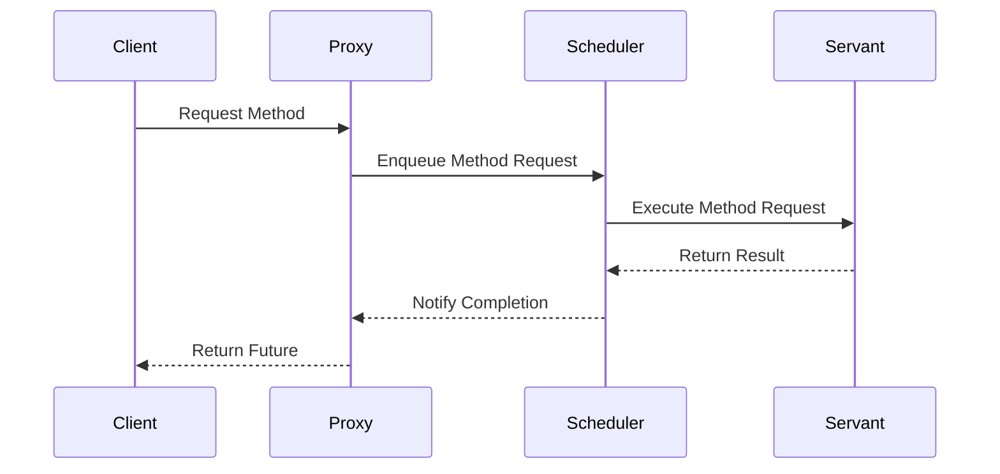

## 7.5 Active Object Pattern

In the realm of concurrent programming, managing the execution of tasks efficiently while maintaining a clear separation between method invocation and execution is crucial. The Active Object Pattern is a powerful design pattern that addresses this need by decoupling method execution from method invocation. This pattern is particularly useful in scenarios where tasks need to be executed asynchronously, allowing the invoking thread to continue its execution without waiting for the task to complete.

### Intent

The primary intent of the Active Object Pattern is to decouple method execution from method invocation to enhance concurrency and responsiveness in applications. By introducing a separate thread or a pool of threads to handle method execution, the pattern allows the main thread to remain responsive and continue processing other tasks.

### Key Participants

1. **Proxy**: Provides an interface for clients to interact with the active object. It encapsulates the method invocation and forwards requests to the scheduler.

2. **Scheduler**: Manages the task queue and decides when and how tasks are executed. It is responsible for dispatching tasks to the appropriate threads.

3. **Method Request**: Represents a task to be executed. It encapsulates the method call and any required parameters.

4. **Servant**: The actual object that performs the task. It contains the business logic that needs to be executed.

5. **Future**: Represents the result of an asynchronous computation. It allows clients to retrieve the result once the computation is complete.

### Applicability

The Active Object Pattern is applicable in scenarios where:

- Tasks need to be executed asynchronously to improve responsiveness.
- There is a need to manage a pool of worker threads efficiently.
- Tasks can be queued and executed in a controlled manner.
- The client should not be blocked while waiting for a task to complete.

### Implementing the Active Object Pattern in C++

Let's explore how to implement the Active Object Pattern in C++ using modern concurrency features such as `std::thread`, `std::mutex`, `std::condition_variable`, and `std::future`.

#### Step 1: Define the Method Request

The Method Request is a crucial component of the Active Object Pattern. It encapsulates the task to be executed along with any necessary parameters.

```cpp
#include <iostream>
#include <functional>
#include <future>

// MethodRequest class encapsulates a task to be executed
class MethodRequest {
public:
    using Task = std::function<void()>;

    explicit MethodRequest(Task task) : task_(std::move(task)) {}

    void execute() {
        task_();
    }

private:
    Task task_;
};
```

#### Step 2: Implement the Scheduler

The Scheduler is responsible for managing the task queue and dispatching tasks to worker threads.

```cpp
#include <queue>
#include <thread>
#include <mutex>
#include <condition_variable>

class Scheduler {
public:
    Scheduler() : stop_(false) {
        worker_ = std::thread(&Scheduler::run, this);
    }

    ~Scheduler() {
        {
            std::unique_lock<std::mutex> lock(mutex_);
            stop_ = true;
        }
        cond_var_.notify_all();
        worker_.join();
    }

    void enqueue(MethodRequest::Task task) {
        {
            std::unique_lock<std::mutex> lock(mutex_);
            tasks_.emplace(std::move(task));
        }
        cond_var_.notify_one();
    }

private:
    void run() {
        while (true) {
            MethodRequest::Task task;
            {
                std::unique_lock<std::mutex> lock(mutex_);
                cond_var_.wait(lock, [this] { return stop_ || !tasks_.empty(); });
                if (stop_ && tasks_.empty()) break;
                task = std::move(tasks_.front());
                tasks_.pop();
            }
            task();
        }
    }

    std::queue<MethodRequest::Task> tasks_;
    std::thread worker_;
    std::mutex mutex_;
    std::condition_variable cond_var_;
    bool stop_;
};
```

#### Step 3: Implement the Proxy

The Proxy provides an interface for clients to interact with the active object. It forwards method requests to the Scheduler.

```cpp
class ActiveObject {
public:
    ActiveObject() : scheduler_(std::make_shared<Scheduler>()) {}

    std::future<void> doWork() {
        auto promise = std::make_shared<std::promise<void>>();
        auto future = promise->get_future();

        scheduler_->enqueue([promise]() {
            // Simulate some work
            std::cout << "Executing task in thread: " << std::this_thread::get_id() << std::endl;
            promise->set_value();
        });

        return future;
    }

private:
    std::shared_ptr<Scheduler> scheduler_;
};
```

#### Step 4: Using the Active Object

Now, let's see how we can use the Active Object in a client application.

```cpp
int main() {
    ActiveObject activeObject;

    auto future1 = activeObject.doWork();
    auto future2 = activeObject.doWork();

    future1.get();
    future2.get();

    std::cout << "Tasks completed." << std::endl;

    return 0;
}
```

### Design Considerations

When implementing the Active Object Pattern, consider the following:

- **Thread Safety**: Ensure that shared resources are accessed in a thread-safe manner using synchronization primitives like mutexes and condition variables.
- **Task Prioritization**: If certain tasks need to be prioritized, consider implementing a priority queue.
- **Error Handling**: Properly handle exceptions that may occur during task execution to prevent the application from crashing.
- **Resource Management**: Manage the lifecycle of threads and other resources to avoid resource leaks.

### Differences and Similarities with Other Patterns

The Active Object Pattern is often compared with the Proxy Pattern and the Command Pattern:

- **Proxy Pattern**: Both patterns involve an intermediary that forwards requests. However, the Active Object Pattern focuses on asynchronous execution, while the Proxy Pattern may not.
- **Command Pattern**: The Command Pattern encapsulates a request as an object, similar to the Method Request in the Active Object Pattern. However, the Command Pattern does not inherently handle asynchronous execution.

### Visualizing the Active Object Pattern

To better understand the Active Object Pattern, let's visualize the interaction between its components using a sequence diagram.



**Diagram Description**: This sequence diagram illustrates the flow of a method request from the client to the proxy, then to the scheduler, and finally to the servant for execution. The result is returned to the client through a future.

### Try It Yourself

To deepen your understanding of the Active Object Pattern, try modifying the code examples:

- **Add Task Prioritization**: Implement a priority queue in the Scheduler to prioritize certain tasks.
- **Handle Exceptions**: Modify the code to handle exceptions that may occur during task execution.
- **Multiple Workers**: Extend the Scheduler to manage a pool of worker threads instead of a single thread.

### References and Further Reading

- [Concurrency in C++](https://en.cppreference.com/w/cpp/thread)
- [C++ Futures and Promises](https://en.cppreference.com/w/cpp/thread/future)
- [Design Patterns: Elements of Reusable Object-Oriented Software](https://en.wikipedia.org/wiki/Design_Patterns)

### Knowledge Check

Let's reinforce your understanding of the Active Object Pattern with a few questions.

## Quiz Time!



### What is the primary intent of the Active Object Pattern?

- [x] To decouple method execution from method invocation.
- [ ] To provide a unified interface to a set of interfaces.
- [ ] To encapsulate a request as an object.
- [ ] To manage a pool of worker threads.

> **Explanation:** The primary intent of the Active Object Pattern is to decouple method execution from method invocation to enhance concurrency and responsiveness.

### Which component of the Active Object Pattern manages the task queue?

- [ ] Proxy
- [x] Scheduler
- [ ] Servant
- [ ] Future

> **Explanation:** The Scheduler is responsible for managing the task queue and dispatching tasks to worker threads.

### What is the role of the Proxy in the Active Object Pattern?

- [x] To provide an interface for clients to interact with the active object.
- [ ] To execute the actual task.
- [ ] To manage the task queue.
- [ ] To represent the result of an asynchronous computation.

> **Explanation:** The Proxy provides an interface for clients to interact with the active object and forwards method requests to the Scheduler.

### How does the Active Object Pattern improve responsiveness?

- [x] By allowing tasks to be executed asynchronously.
- [ ] By executing tasks in the main thread.
- [ ] By blocking the client until the task is complete.
- [ ] By prioritizing certain tasks over others.

> **Explanation:** The Active Object Pattern improves responsiveness by allowing tasks to be executed asynchronously, enabling the client to continue processing other tasks.

### What is a Method Request in the Active Object Pattern?

- [x] A task to be executed.
- [ ] A thread that executes tasks.
- [ ] An interface for clients to interact with the active object.
- [ ] A result of an asynchronous computation.

> **Explanation:** A Method Request represents a task to be executed and encapsulates the method call and any required parameters.

### Which C++ feature is commonly used to represent the result of an asynchronous computation in the Active Object Pattern?

- [ ] std::thread
- [ ] std::mutex
- [x] std::future
- [ ] std::condition_variable

> **Explanation:** `std::future` is commonly used to represent the result of an asynchronous computation in the Active Object Pattern.

### What is the role of the Servant in the Active Object Pattern?

- [ ] To manage the task queue.
- [ ] To provide an interface for clients.
- [x] To perform the actual task.
- [ ] To represent the result of an asynchronous computation.

> **Explanation:** The Servant is the actual object that performs the task and contains the business logic that needs to be executed.

### What is a potential design consideration when implementing the Active Object Pattern?

- [x] Thread safety
- [ ] Redundancy
- [ ] Data encapsulation
- [ ] Code readability

> **Explanation:** Thread safety is a crucial design consideration when implementing the Active Object Pattern to ensure that shared resources are accessed safely.

### Which pattern is often compared with the Active Object Pattern due to its use of an intermediary?

- [ ] Singleton Pattern
- [x] Proxy Pattern
- [ ] Observer Pattern
- [ ] Strategy Pattern

> **Explanation:** The Active Object Pattern is often compared with the Proxy Pattern because both involve an intermediary that forwards requests.

### True or False: The Active Object Pattern inherently handles task prioritization.

- [ ] True
- [x] False

> **Explanation:** False. The Active Object Pattern does not inherently handle task prioritization. Task prioritization can be implemented by using a priority queue in the Scheduler.



Remember, mastering the Active Object Pattern is just the beginning. As you progress, you'll build more complex and efficient concurrent applications. Keep experimenting, stay curious, and enjoy the journey!
