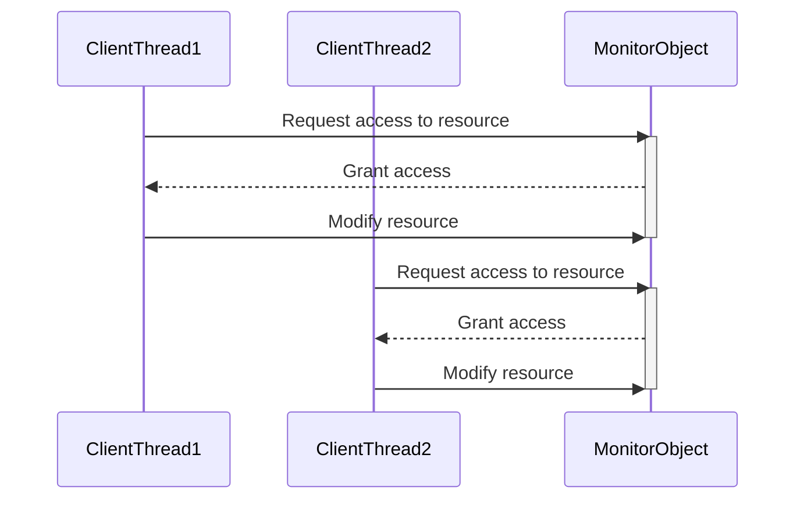

## 7.6 Monitor Object Pattern

In the realm of concurrent programming, managing access to shared resources is a critical challenge. The Monitor Object Pattern is a powerful design pattern that addresses this challenge by encapsulating synchronization mechanisms within objects. This pattern ensures that only one thread can access a shared resource at a time, thereby preventing data races and ensuring thread safety.

### Intent

The primary intent of the Monitor Object Pattern is to synchronize access to shared resources by encapsulating locks within objects. This pattern provides a structured way to manage concurrency, making it easier to write thread-safe code. By using the Monitor Object Pattern, developers can focus on the logic of their application without worrying about the intricacies of thread synchronization.

### Key Participants

1. **Monitor Object**: The object that encapsulates the shared resource and the synchronization mechanism (e.g., mutex or lock). It provides methods for accessing and modifying the resource, ensuring that only one thread can execute these methods at a time.

2. **Client Threads**: Threads that interact with the Monitor Object to access the shared resource. These threads rely on the Monitor Object to manage synchronization.

### Applicability

The Monitor Object Pattern is applicable in scenarios where:

- Multiple threads need to access and modify a shared resource.
- Thread safety is a concern, and data races must be prevented.
- Encapsulation of synchronization logic within objects is desired for better code organization and maintainability.

### Sample Code Snippet

Let's explore a simple example of the Monitor Object Pattern in C++. In this example, we'll implement a thread-safe counter using a Monitor Object.

```cpp
#include <iostream>
#include <mutex>
#include <thread>
#include <vector>

class MonitorCounter {
public:
    MonitorCounter() : count(0) {}

    // Increment the counter safely
    void increment() {
        std::lock_guard<std::mutex> lock(mutex_);
        ++count;
    }

    // Get the current count safely
    int getCount() {
        std::lock_guard<std::mutex> lock(mutex_);
        return count;
    }

private:
    int count;
    std::mutex mutex_;
};

void worker(MonitorCounter& counter) {
    for (int i = 0; i < 1000; ++i) {
        counter.increment();
    }
}

int main() {
    MonitorCounter counter;
    std::vector<std::thread> threads;

    // Create 10 threads that increment the counter
    for (int i = 0; i < 10; ++i) {
        threads.emplace_back(worker, std::ref(counter));
    }

    // Join all threads
    for (auto& thread : threads) {
        thread.join();
    }

    std::cout << "Final count: " << counter.getCount() << std::endl;
    return 0;
}
```

**Explanation:**

- **MonitorCounter Class**: This class encapsulates the counter (`count`) and the mutex (`mutex_`). The `increment` and `getCount` methods use `std::lock_guard` to ensure that only one thread can access the counter at a time.
- **Worker Function**: This function increments the counter 1000 times. It is executed by multiple threads concurrently.
- **Main Function**: This function creates 10 threads, each executing the `worker` function. After all threads complete, it prints the final count.

### Design Considerations

When using the Monitor Object Pattern, consider the following:

- **Granularity of Locks**: Ensure that locks are held for the minimum duration necessary to prevent contention and improve performance.
- **Deadlock Prevention**: Design the Monitor Object to avoid deadlocks by ensuring that locks are acquired in a consistent order.
- **Performance**: While the Monitor Object Pattern simplifies synchronization, it may introduce performance overhead due to locking. Consider using finer-grained locks or lock-free data structures if performance is critical.

### Monitor Pattern vs. Condition Variables

The Monitor Object Pattern and condition variables are both used for synchronization, but they serve different purposes:

- **Monitor Pattern**: Encapsulates synchronization within objects, providing a higher-level abstraction for thread safety. It is ideal for scenarios where the synchronization logic can be encapsulated within a single object.

- **Condition Variables**: Used for more complex synchronization scenarios where threads need to wait for certain conditions to be met. Condition variables allow threads to block until a specific condition is true, providing more flexibility than the Monitor Object Pattern.

### Differences and Similarities

- **Encapsulation**: The Monitor Object Pattern encapsulates synchronization logic within objects, while condition variables are typically used in conjunction with mutexes to manage complex synchronization scenarios.

- **Use Cases**: The Monitor Object Pattern is suitable for simpler synchronization scenarios where the logic can be encapsulated within a single object. Condition variables are more flexible and can be used for complex scenarios where threads need to wait for specific conditions.

- **Complexity**: The Monitor Object Pattern simplifies synchronization by encapsulating it within objects, while condition variables require more complex logic to manage waiting and signaling between threads.

### Visualizing the Monitor Object Pattern

To better understand the Monitor Object Pattern, let's visualize the interaction between client threads and the Monitor Object using a sequence diagram.



**Diagram Description:**

- **ClientThread1 and ClientThread2**: These are the client threads that interact with the Monitor Object.
- **MonitorObject**: This is the Monitor Object that encapsulates the shared resource and synchronization logic.
- **Sequence of Interactions**: The diagram illustrates how client threads request access to the resource, and the Monitor Object grants access one thread at a time, ensuring thread safety.

### Try It Yourself

To deepen your understanding of the Monitor Object Pattern, try modifying the sample code:

1. **Experiment with Different Locking Mechanisms**: Replace `std::lock_guard` with `std::unique_lock` and explore the differences in behavior.

2. **Add More Operations**: Extend the `MonitorCounter` class with additional operations, such as decrementing the counter or resetting it to zero. Ensure that these operations are thread-safe.

3. **Measure Performance**: Use a profiler to measure the performance of the Monitor Object Pattern in different scenarios. Experiment with different numbers of threads and operations to observe the impact on performance.

### Knowledge Check

- **What is the primary intent of the Monitor Object Pattern?**
- **How does the Monitor Object Pattern differ from condition variables?**
- **What are some design considerations when using the Monitor Object Pattern?**

### Embrace the Journey

Remember, mastering concurrency and synchronization is a journey. The Monitor Object Pattern is just one tool in your toolbox. As you continue to explore and experiment with different patterns and techniques, you'll gain a deeper understanding of how to write efficient, thread-safe code. Keep experimenting, stay curious, and enjoy the journey!

## Quiz Time!



### What is the primary intent of the Monitor Object Pattern?

- [x] To synchronize access to shared resources by encapsulating locks within objects.
- [ ] To provide a mechanism for threads to wait for specific conditions to be met.
- [ ] To optimize performance by eliminating the need for locks.
- [ ] To simplify the implementation of condition variables.

> **Explanation:** The primary intent of the Monitor Object Pattern is to synchronize access to shared resources by encapsulating locks within objects.

### How does the Monitor Object Pattern differ from condition variables?

- [x] The Monitor Object Pattern encapsulates synchronization within objects, while condition variables are used for more complex synchronization scenarios.
- [ ] The Monitor Object Pattern is used for complex synchronization scenarios, while condition variables are used for simpler ones.
- [ ] The Monitor Object Pattern eliminates the need for locks, while condition variables require locks.
- [ ] The Monitor Object Pattern is a low-level synchronization mechanism, while condition variables provide a higher-level abstraction.

> **Explanation:** The Monitor Object Pattern encapsulates synchronization within objects, providing a higher-level abstraction, while condition variables are used for more complex synchronization scenarios.

### What is a key participant in the Monitor Object Pattern?

- [x] Monitor Object
- [ ] Condition Variable
- [ ] Semaphore
- [ ] Thread Pool

> **Explanation:** The Monitor Object is a key participant in the Monitor Object Pattern, as it encapsulates the shared resource and synchronization mechanism.

### Which of the following is a design consideration when using the Monitor Object Pattern?

- [x] Granularity of Locks
- [ ] Use of Semaphores
- [ ] Avoiding Condition Variables
- [ ] Implementing Thread Pools

> **Explanation:** Granularity of locks is a design consideration when using the Monitor Object Pattern to prevent contention and improve performance.

### What is a similarity between the Monitor Object Pattern and condition variables?

- [x] Both are used for synchronization.
- [ ] Both encapsulate synchronization logic within objects.
- [ ] Both eliminate the need for locks.
- [ ] Both are used for complex synchronization scenarios.

> **Explanation:** Both the Monitor Object Pattern and condition variables are used for synchronization, but they serve different purposes.

### What is a potential drawback of the Monitor Object Pattern?

- [x] It may introduce performance overhead due to locking.
- [ ] It eliminates the need for locks, which can lead to data races.
- [ ] It is only suitable for complex synchronization scenarios.
- [ ] It requires the use of condition variables.

> **Explanation:** The Monitor Object Pattern may introduce performance overhead due to locking, which can impact performance in some scenarios.

### What is the role of client threads in the Monitor Object Pattern?

- [x] To interact with the Monitor Object to access the shared resource.
- [ ] To manage synchronization logic within objects.
- [ ] To provide a mechanism for waiting for specific conditions to be met.
- [ ] To eliminate the need for locks.

> **Explanation:** Client threads interact with the Monitor Object to access the shared resource, relying on the Monitor Object to manage synchronization.

### Which of the following is NOT a key participant in the Monitor Object Pattern?

- [x] Condition Variable
- [ ] Monitor Object
- [ ] Client Threads
- [ ] Mutex

> **Explanation:** Condition Variable is not a key participant in the Monitor Object Pattern, which focuses on encapsulating synchronization within objects.

### What is a benefit of encapsulating synchronization logic within objects?

- [x] It simplifies code organization and maintainability.
- [ ] It eliminates the need for locks.
- [ ] It provides a mechanism for waiting for specific conditions to be met.
- [ ] It optimizes performance by reducing locking overhead.

> **Explanation:** Encapsulating synchronization logic within objects simplifies code organization and maintainability by providing a structured way to manage concurrency.

### True or False: The Monitor Object Pattern is suitable for scenarios where multiple threads need to access and modify a shared resource.

- [x] True
- [ ] False

> **Explanation:** True. The Monitor Object Pattern is suitable for scenarios where multiple threads need to access and modify a shared resource, ensuring thread safety.


