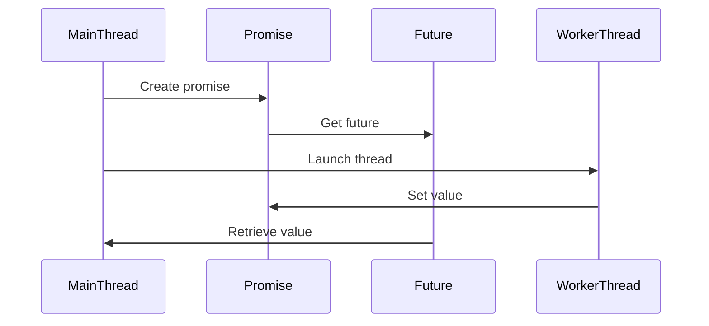

## 7.7 Future and Promise

In the realm of modern C++ programming, handling concurrency and asynchronous operations efficiently is crucial for building responsive and high-performance applications. The `std::future` and `std::promise` constructs, introduced in C++11, provide a robust framework for managing asynchronous tasks, allowing developers to write clean, maintainable, and efficient code. In this section, we will delve into the concepts of futures and promises, explore their usage, and understand how they fit into the broader context of C++ concurrency.

### Understanding Futures and Promises

At the core of asynchronous programming in C++ are the concepts of futures and promises. These constructs provide a mechanism to retrieve the result of an asynchronous operation once it has completed, without blocking the main execution flow.

#### What is a Future?

A `std::future` is an object that represents a value that will be available at some point in the future. It acts as a placeholder for a result that is initially unknown but will be set once the asynchronous operation completes. Futures allow you to retrieve the result of an operation without blocking the main thread, enabling more efficient use of system resources.

#### What is a Promise?

A `std::promise` is an object that is used to set the value of a `std::future`. It acts as a write-end counterpart to the read-end `std::future`. Promises are used by the producer of the result to communicate the outcome of an asynchronous operation to the consumer, who holds the future.

### Using `std::future` and `std::promise`

The `std::future` and `std::promise` are closely linked, with the promise being responsible for setting the value that the future will eventually hold. Let's explore their usage through a simple example.

```cpp
#include <iostream>
#include <thread>
#include <future>

// Function that performs a time-consuming calculation
int calculateSquare(int x) {
    std::this_thread::sleep_for(std::chrono::seconds(2)); // Simulate a delay
    return x * x;
}

int main() {
    // Create a promise and obtain its associated future
    std::promise<int> promise;
    std::future<int> future = promise.get_future();

    // Launch a thread to perform the calculation
    std::thread t([&promise]() {
        int result = calculateSquare(5);
        promise.set_value(result); // Set the result in the promise
    });

    // Wait for the result and retrieve it from the future
    std::cout << "Calculating..." << std::endl;
    int result = future.get(); // This will block until the result is available
    std::cout << "Result: " << result << std::endl;

    t.join(); // Wait for the thread to finish
    return 0;
}
```

In this example, we create a `std::promise` and obtain its associated `std::future`. A separate thread is launched to perform a time-consuming calculation, and once the calculation is complete, the result is set in the promise. The main thread waits for the result using `future.get()`, which blocks until the result is available.

### Using `std::packaged_task`

The `std::packaged_task` is another mechanism for managing asynchronous operations in C++. It wraps a callable object (such as a function or a lambda) and provides a future to retrieve the result of the callable once it has been executed.

```cpp
#include <iostream>
#include <thread>
#include <future>

// Function to be executed asynchronously
int add(int a, int b) {
    return a + b;
}

int main() {
    // Create a packaged_task wrapping the add function
    std::packaged_task<int(int, int)> task(add);
    std::future<int> future = task.get_future();

    // Launch a thread to execute the task
    std::thread t(std::move(task), 3, 4);

    // Retrieve the result from the future
    int result = future.get();
    std::cout << "Result: " << result << std::endl;

    t.join(); // Wait for the thread to finish
    return 0;
}
```

In this example, we use `std::packaged_task` to wrap the `add` function, which takes two integers and returns their sum. We then obtain a future from the packaged task and launch a thread to execute the task. The result of the addition is retrieved using the future.

### Shared Futures (`std::shared_future`)

A `std::shared_future` is a variant of `std::future` that allows multiple threads to access the result of an asynchronous operation. Unlike `std::future`, which can only be moved, a `std::shared_future` can be copied, enabling multiple consumers to wait for and retrieve the result.

```cpp
#include <iostream>
#include <thread>
#include <future>

// Function that performs a calculation
int computeValue() {
    std::this_thread::sleep_for(std::chrono::seconds(1)); // Simulate work
    return 42;
}

int main() {
    // Create a promise and obtain its associated shared_future
    std::promise<int> promise;
    std::shared_future<int> sharedFuture = promise.get_future().share();

    // Launch a thread to perform the calculation
    std::thread t([&promise]() {
        int result = computeValue();
        promise.set_value(result); // Set the result in the promise
    });

    // Multiple threads can access the shared future
    std::thread t1([sharedFuture]() {
        std::cout << "Thread 1: " << sharedFuture.get() << std::endl;
    });

    std::thread t2([sharedFuture]() {
        std::cout << "Thread 2: " << sharedFuture.get() << std::endl;
    });

    t.join();  // Wait for the calculation thread to finish
    t1.join(); // Wait for thread 1 to finish
    t2.join(); // Wait for thread 2 to finish

    return 0;
}
```

In this example, we use a `std::shared_future` to allow multiple threads to access the result of a computation. The shared future is obtained by calling `share()` on the original future. Both `t1` and `t2` threads can retrieve the result using `sharedFuture.get()`.

### Design Considerations

When using futures and promises in C++, there are several design considerations to keep in mind:

- **Exception Handling**: If an exception is thrown during the execution of an asynchronous task, it can be captured and propagated to the future. The consumer can then handle the exception using `future.get()`, which will rethrow the exception.
  
- **Synchronization**: Futures and promises provide a convenient way to synchronize asynchronous operations, but care must be taken to avoid deadlocks and race conditions. Ensure that the promise is set exactly once and that the future is retrieved before the promise is destroyed.

- **Resource Management**: Futures and promises are lightweight constructs, but they still require careful management of resources, especially when dealing with shared futures. Ensure that shared futures are copied only when necessary to avoid unnecessary overhead.

### Differences and Similarities

Futures and promises are often compared to other concurrency constructs, such as condition variables and mutexes. While they serve similar purposes in synchronizing operations, they offer a higher-level abstraction that simplifies code and reduces the potential for errors.

- **Futures vs. Condition Variables**: Futures provide a more intuitive interface for waiting on the result of an asynchronous operation, whereas condition variables require explicit locking and unlocking of mutexes.

- **Promises vs. Mutexes**: Promises offer a cleaner way to communicate the result of an operation between threads, without the need for manual synchronization using mutexes.

### Visualizing Futures and Promises

To better understand the relationship between futures and promises, let's visualize the flow of data between them using a sequence diagram.



In this diagram, the main thread creates a promise and obtains its associated future. A worker thread is launched to perform an asynchronous operation, and once the operation is complete, the result is set in the promise. The main thread then retrieves the result from the future.

### Try It Yourself

To solidify your understanding of futures and promises, try modifying the code examples provided:

- **Experiment with Different Data Types**: Modify the examples to use different data types for the future and promise, such as `std::string` or custom objects.

- **Implement Exception Handling**: Introduce exceptions in the asynchronous tasks and handle them in the main thread using `future.get()`.

- **Use Shared Futures**: Create a scenario where multiple threads need to access the result of a computation, and use `std::shared_future` to facilitate this.

### References and Links

For further reading on futures and promises in C++, consider the following resources:

- [C++ Reference: std::future](https://en.cppreference.com/w/cpp/thread/future)
- [C++ Reference: std::promise](https://en.cppreference.com/w/cpp/thread/promise)
- [C++ Reference: std::packaged_task](https://en.cppreference.com/w/cpp/thread/packaged_task)

### Knowledge Check

Before we conclude, let's reinforce your understanding with a few questions:

1. What is the primary purpose of a `std::future` in C++?
2. How does a `std::promise` relate to a `std::future`?
3. What is the advantage of using `std::shared_future` over `std::future`?
4. How can exceptions be handled when using futures and promises?
5. What is the role of `std::packaged_task` in asynchronous programming?

### Embrace the Journey

Remember, mastering concurrency in C++ is a journey that requires practice and experimentation. As you continue to explore the world of asynchronous programming, keep experimenting, stay curious, and enjoy the journey!

## Quiz Time!



### What is the primary purpose of a `std::future` in C++?

- [x] To represent a value that will be available in the future
- [ ] To execute a task asynchronously
- [ ] To manage thread synchronization
- [ ] To handle exceptions in multithreading

> **Explanation:** A `std::future` represents a value that will be available at some point in the future, allowing asynchronous operations to be synchronized.

### How does a `std::promise` relate to a `std::future`?

- [x] A `std::promise` sets the value that a `std::future` will hold
- [ ] A `std::promise` retrieves the value from a `std::future`
- [ ] A `std::promise` is used to execute tasks asynchronously
- [ ] A `std::promise` manages thread synchronization

> **Explanation:** A `std::promise` is used to set the value that a `std::future` will eventually hold, acting as the write-end counterpart to the future's read-end.

### What is the advantage of using `std::shared_future` over `std::future`?

- [x] It allows multiple threads to access the result of an asynchronous operation
- [ ] It provides better performance for single-threaded applications
- [ ] It simplifies exception handling
- [ ] It automatically manages thread lifecycles

> **Explanation:** A `std::shared_future` can be copied and allows multiple threads to access the result of an asynchronous operation, unlike `std::future`, which can only be moved.

### How can exceptions be handled when using futures and promises?

- [x] Exceptions can be captured and propagated to the future, then handled using `future.get()`
- [ ] Exceptions are automatically ignored in asynchronous operations
- [ ] Exceptions must be handled within the promise
- [ ] Futures and promises do not support exception handling

> **Explanation:** If an exception is thrown during an asynchronous task, it can be captured and propagated to the future, where it can be handled using `future.get()`.

### What is the role of `std::packaged_task` in asynchronous programming?

- [x] To wrap a callable object and provide a future for its result
- [ ] To manage thread synchronization
- [ ] To execute tasks in parallel
- [ ] To handle exceptions in asynchronous operations

> **Explanation:** `std::packaged_task` wraps a callable object (such as a function or lambda) and provides a future to retrieve the result of the callable once it has been executed.

### Which C++ standard introduced `std::future` and `std::promise`?

- [x] C++11
- [ ] C++14
- [ ] C++17
- [ ] C++20

> **Explanation:** `std::future` and `std::promise` were introduced in C++11 as part of the standard library's support for concurrency.

### What function is used to obtain a `std::future` from a `std::promise`?

- [x] `get_future()`
- [ ] `set_value()`
- [ ] `share()`
- [ ] `get()`

> **Explanation:** The `get_future()` function is used to obtain a `std::future` from a `std::promise`.

### What happens if `std::promise::set_value()` is called more than once?

- [x] It results in an exception
- [ ] It updates the value of the future
- [ ] It has no effect
- [ ] It resets the promise

> **Explanation:** Calling `std::promise::set_value()` more than once results in an exception, as the value can only be set once.

### Can a `std::shared_future` be moved?

- [ ] Yes
- [x] No

> **Explanation:** A `std::shared_future` cannot be moved but can be copied, allowing multiple threads to access the result.

### What is the main difference between `std::future` and `std::shared_future`?

- [x] `std::future` can only be moved, while `std::shared_future` can be copied
- [ ] `std::future` supports multiple threads, while `std::shared_future` does not
- [ ] `std::future` is faster than `std::shared_future`
- [ ] `std::future` handles exceptions, while `std::shared_future` does not

> **Explanation:** The main difference is that `std::future` can only be moved, whereas `std::shared_future` can be copied, allowing multiple threads to access the result.


