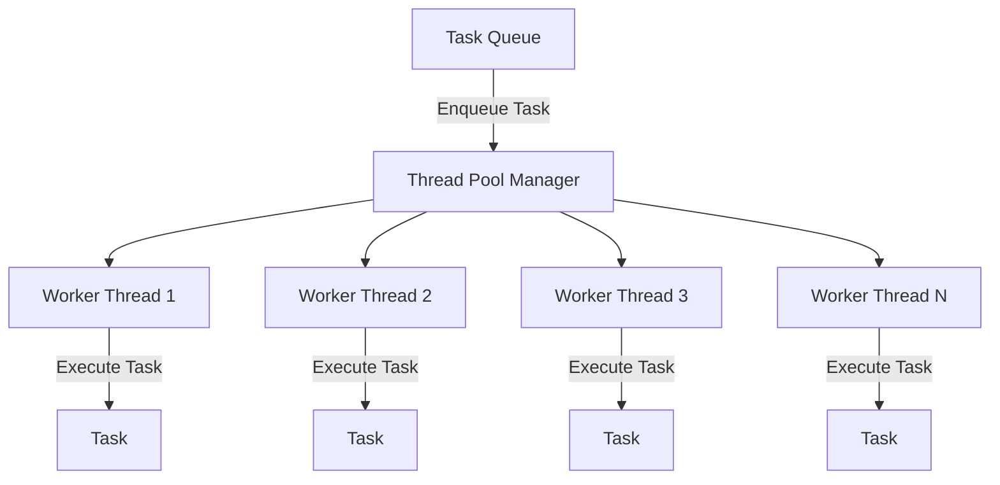

## 7.8 Thread Pools

In the realm of modern C++ programming, efficiently managing multiple threads is crucial for building high-performance applications. Thread pools are a powerful design pattern that allows developers to handle concurrent execution efficiently. In this section, we'll delve into the intricacies of thread pools, exploring their implementation in C++, as well as advanced concepts like work stealing and scheduling.

### Understanding Thread Pools

#### Intent

The primary intent of a thread pool is to manage a collection of reusable threads for executing tasks concurrently. By reusing threads, we can minimize the overhead associated with thread creation and destruction, leading to improved performance and resource utilization.

#### Key Participants

- **Thread Pool Manager**: Oversees the lifecycle of threads and task distribution.
- **Worker Threads**: Execute tasks assigned by the thread pool manager.
- **Task Queue**: Stores tasks waiting to be executed by worker threads.

#### Applicability

Thread pools are particularly useful in scenarios where:

- Tasks are numerous and short-lived.
- The overhead of creating and destroying threads is significant.
- There is a need to limit the number of concurrent threads to avoid resource exhaustion.

### Implementing Thread Pools in C++

Let's explore how to implement a basic thread pool in C++. We'll build a thread pool that can handle tasks submitted to it and execute them using a fixed number of worker threads.

#### Basic Structure

A thread pool typically consists of the following components:

1. **Task Queue**: A thread-safe queue to hold tasks.
2. **Worker Threads**: A fixed number of threads that process tasks from the queue.
3. **Thread Pool Manager**: Manages the worker threads and task queue.

#### Code Example: Basic Thread Pool

```cpp
#include <iostream>
#include <vector>
#include <thread>
#include <queue>
#include <mutex>
#include <condition_variable>
#include <functional>
#include <atomic>

class ThreadPool {
public:
    ThreadPool(size_t numThreads);
    ~ThreadPool();

    void enqueueTask(const std::function<void()>& task);

private:
    std::vector<std::thread> workers;
    std::queue<std::function<void()>> tasks;

    std::mutex queueMutex;
    std::condition_variable condition;
    std::atomic<bool> stop;

    void workerThread();
};

ThreadPool::ThreadPool(size_t numThreads) : stop(false) {
    for (size_t i = 0; i < numThreads; ++i) {
        workers.emplace_back(&ThreadPool::workerThread, this);
    }
}

ThreadPool::~ThreadPool() {
    stop.store(true);
    condition.notify_all();
    for (std::thread &worker : workers) {
        worker.join();
    }
}

void ThreadPool::enqueueTask(const std::function<void()>& task) {
    {
        std::unique_lock<std::mutex> lock(queueMutex);
        tasks.push(task);
    }
    condition.notify_one();
}

void ThreadPool::workerThread() {
    while (!stop.load()) {
        std::function<void()> task;
        {
            std::unique_lock<std::mutex> lock(queueMutex);
            condition.wait(lock, [this] { return stop.load() || !tasks.empty(); });
            if (stop.load() && tasks.empty()) return;
            task = std::move(tasks.front());
            tasks.pop();
        }
        task();
    }
}

int main() {
    ThreadPool pool(4);

    for (int i = 0; i < 8; ++i) {
        pool.enqueueTask([i] {
            std::cout << "Task " << i << " is being processed by thread " << std::this_thread::get_id() << std::endl;
        });
    }

    std::this_thread::sleep_for(std::chrono::seconds(1));
    return 0;
}
```

#### Explanation

- **ThreadPool Constructor**: Initializes the thread pool with a specified number of worker threads. Each thread runs the `workerThread` function.
- **enqueueTask**: Adds a new task to the task queue and notifies one worker thread.
- **workerThread**: Continuously waits for tasks to be available in the queue. Once a task is available, it executes the task.
- **Destructor**: Signals all threads to stop and waits for them to finish.

### Advanced Concepts: Work Stealing and Scheduling

#### Work Stealing

Work stealing is an advanced technique used to balance the load among worker threads. In a work-stealing scheduler, each worker thread has its own task queue. If a thread's queue becomes empty, it can "steal" tasks from other threads' queues. This approach helps in balancing the workload dynamically and improving resource utilization.

#### Implementing Work Stealing

To implement work stealing, we need to modify the basic thread pool structure to support multiple task queues and the ability for threads to steal tasks from each other.

```cpp
#include <deque>
#include <random>

class WorkStealingThreadPool {
public:
    WorkStealingThreadPool(size_t numThreads);
    ~WorkStealingThreadPool();

    void enqueueTask(const std::function<void()>& task);

private:
    std::vector<std::thread> workers;
    std::vector<std::deque<std::function<void()>>> taskQueues;
    std::mutex queueMutex;
    std::condition_variable condition;
    std::atomic<bool> stop;

    void workerThread(size_t index);
    bool stealTask(size_t thiefIndex, std::function<void()>& task);
};

WorkStealingThreadPool::WorkStealingThreadPool(size_t numThreads) : stop(false), taskQueues(numThreads) {
    for (size_t i = 0; i < numThreads; ++i) {
        workers.emplace_back(&WorkStealingThreadPool::workerThread, this, i);
    }
}

WorkStealingThreadPool::~WorkStealingThreadPool() {
    stop.store(true);
    condition.notify_all();
    for (std::thread &worker : workers) {
        worker.join();
    }
}

void WorkStealingThreadPool::enqueueTask(const std::function<void()>& task) {
    {
        std::unique_lock<std::mutex> lock(queueMutex);
        taskQueues[0].push_back(task); // Push task to the first queue for simplicity
    }
    condition.notify_one();
}

void WorkStealingThreadPool::workerThread(size_t index) {
    std::function<void()> task;
    while (!stop.load()) {
        {
            std::unique_lock<std::mutex> lock(queueMutex);
            if (!taskQueues[index].empty()) {
                task = std::move(taskQueues[index].front());
                taskQueues[index].pop_front();
            } else if (stealTask(index, task)) {
                // Successfully stole a task
            } else {
                condition.wait(lock);
                continue;
            }
        }
        task();
    }
}

bool WorkStealingThreadPool::stealTask(size_t thiefIndex, std::function<void()>& task) {
    for (size_t i = 0; i < taskQueues.size(); ++i) {
        if (i != thiefIndex && !taskQueues[i].empty()) {
            task = std::move(taskQueues[i].back());
            taskQueues[i].pop_back();
            return true;
        }
    }
    return false;
}
```

#### Explanation

- **Multiple Task Queues**: Each worker thread has its own task queue.
- **Steal Task**: If a worker's queue is empty, it attempts to steal a task from another queue.
- **Load Balancing**: This approach helps in balancing the workload dynamically across threads.

### Scheduling Strategies

Efficient scheduling is crucial for maximizing the performance of a thread pool. Let's explore some common scheduling strategies:

#### FIFO (First-In-First-Out)

Tasks are executed in the order they are received. This is the simplest scheduling strategy and is suitable for tasks with similar execution times.

#### LIFO (Last-In-First-Out)

Tasks are executed in reverse order of their arrival. This can be beneficial in scenarios where recent tasks are more likely to be relevant or urgent.

#### Priority Scheduling

Tasks are assigned priorities, and higher-priority tasks are executed before lower-priority ones. This requires a priority queue to manage tasks.

#### Round Robin

Tasks are distributed evenly among worker threads in a cyclic manner. This ensures a fair distribution of tasks but may not account for task complexity.

### Design Considerations

When designing a thread pool, consider the following:

- **Thread Count**: The number of threads should be chosen based on the number of available CPU cores and the nature of the tasks.
- **Task Granularity**: Tasks should be sufficiently granular to allow for efficient parallel execution.
- **Resource Management**: Ensure that resources such as memory and file handles are managed properly to avoid leaks.
- **Error Handling**: Implement robust error handling to manage exceptions that may occur during task execution.

### Differences and Similarities with Other Patterns

Thread pools may be confused with other concurrency patterns, such as:

- **Fork-Join Model**: Unlike thread pools, the fork-join model involves dividing tasks into subtasks that are executed concurrently and then joined.
- **Active Object Pattern**: This pattern decouples method execution from method invocation, similar to thread pools, but focuses more on asynchronous method execution.

### Try It Yourself

To deepen your understanding, try modifying the thread pool implementation:

- **Experiment with Different Scheduling Strategies**: Implement a priority-based scheduling system.
- **Enhance Work Stealing**: Optimize the work-stealing mechanism to reduce contention.
- **Measure Performance**: Use profiling tools to measure the performance of your thread pool under different workloads.

### Visualizing Thread Pool Architecture

To better understand the architecture of a thread pool, let's visualize it using a diagram.



**Diagram Description**: This diagram illustrates the flow of tasks in a thread pool. Tasks are enqueued into a task queue, managed by the thread pool manager, and executed by worker threads.

### References and Links

For further reading and deeper dives into thread pools and concurrency in C++, consider the following resources:

- [C++ Reference: Thread Support Library](https://en.cppreference.com/w/cpp/thread)
- [Concurrency in Action by Anthony Williams](https://www.manning.com/books/c-plus-plus-concurrency-in-action)
- [Boost Thread Library](https://www.boost.org/doc/libs/1_81_0/doc/html/thread.html)

### Knowledge Check

- What is the primary purpose of a thread pool?
- How does work stealing improve load balancing in a thread pool?
- What are the key components of a thread pool?
- What are some common scheduling strategies used in thread pools?

### Embrace the Journey

Remember, mastering thread pools and concurrency in C++ is a journey. As you progress, you'll build more efficient and scalable applications. Keep experimenting, stay curious, and enjoy the journey!

## Quiz Time!



### What is the primary purpose of a thread pool?

- [x] To manage a collection of reusable threads for executing tasks concurrently.
- [ ] To create new threads for each task.
- [ ] To execute tasks sequentially.
- [ ] To prioritize tasks based on their complexity.

> **Explanation:** The primary purpose of a thread pool is to manage a collection of reusable threads for executing tasks concurrently, minimizing the overhead of thread creation and destruction.

### How does work stealing improve load balancing in a thread pool?

- [x] By allowing threads to steal tasks from other threads' queues.
- [ ] By assigning tasks based on their priority.
- [ ] By executing tasks in the order they are received.
- [ ] By creating new threads for each task.

> **Explanation:** Work stealing improves load balancing by allowing threads to steal tasks from other threads' queues, ensuring that all threads remain busy and the workload is evenly distributed.

### What are the key components of a thread pool?

- [x] Thread Pool Manager, Worker Threads, Task Queue
- [ ] Task Scheduler, Task Queue, Priority Queue
- [ ] Worker Threads, Task Queue, Timer
- [ ] Thread Pool Manager, Task Scheduler, Worker Threads

> **Explanation:** The key components of a thread pool are the Thread Pool Manager, Worker Threads, and Task Queue, which work together to manage task execution.

### Which scheduling strategy executes tasks in the order they are received?

- [x] FIFO (First-In-First-Out)
- [ ] LIFO (Last-In-First-Out)
- [ ] Priority Scheduling
- [ ] Round Robin

> **Explanation:** FIFO (First-In-First-Out) is a scheduling strategy that executes tasks in the order they are received.

### What is a potential benefit of using LIFO scheduling in a thread pool?

- [x] Recent tasks are more likely to be relevant or urgent.
- [ ] Tasks are executed based on their priority.
- [ ] Tasks are distributed evenly among threads.
- [ ] Tasks are executed in the order they are received.

> **Explanation:** LIFO (Last-In-First-Out) scheduling can be beneficial in scenarios where recent tasks are more likely to be relevant or urgent.

### What should be considered when choosing the number of threads in a thread pool?

- [x] The number of available CPU cores and the nature of the tasks.
- [ ] The size of the task queue.
- [ ] The priority of the tasks.
- [ ] The memory usage of the tasks.

> **Explanation:** When choosing the number of threads in a thread pool, consider the number of available CPU cores and the nature of the tasks to ensure efficient resource utilization.

### What is the role of the Thread Pool Manager?

- [x] To oversee the lifecycle of threads and task distribution.
- [ ] To execute tasks assigned by worker threads.
- [ ] To store tasks waiting to be executed.
- [ ] To create new threads for each task.

> **Explanation:** The Thread Pool Manager oversees the lifecycle of threads and task distribution, ensuring efficient task execution.

### What is a common use case for thread pools?

- [x] Scenarios where tasks are numerous and short-lived.
- [ ] Scenarios where tasks require sequential execution.
- [ ] Scenarios where tasks are long-running and complex.
- [ ] Scenarios where tasks are executed based on their priority.

> **Explanation:** Thread pools are commonly used in scenarios where tasks are numerous and short-lived, minimizing the overhead of thread creation and destruction.

### How can you enhance work stealing in a thread pool?

- [x] By optimizing the work-stealing mechanism to reduce contention.
- [ ] By increasing the number of threads.
- [ ] By decreasing the size of the task queue.
- [ ] By prioritizing tasks based on their complexity.

> **Explanation:** Enhancing work stealing in a thread pool involves optimizing the work-stealing mechanism to reduce contention and improve load balancing.

### True or False: Thread pools are only useful for CPU-bound tasks.

- [ ] True
- [x] False

> **Explanation:** False. Thread pools are useful for both CPU-bound and I/O-bound tasks, as they help manage concurrent execution efficiently.


