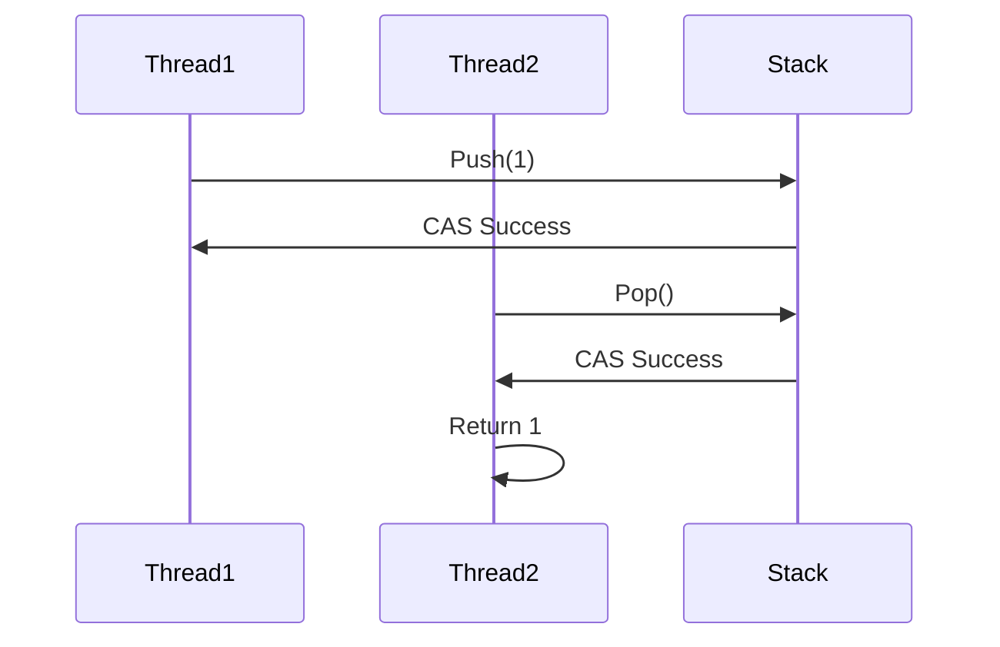

## 7.9 Lock-Free Programming

Lock-free programming is a powerful technique in concurrent programming that allows multiple threads to operate on shared data without the need for locks. This approach can lead to significant performance improvements, especially in high-concurrency environments. In this section, we will delve into the concepts of lock-free programming in C++, focusing on atomic operations, lock-free data structures, compare-and-swap (CAS) operations, and memory ordering.

### Understanding Lock-Free Programming

Lock-free programming is a method of designing algorithms and data structures that allow multiple threads to access shared resources without the use of locks. This can help avoid common concurrency issues such as deadlocks and priority inversion, and can improve performance by reducing contention between threads.

#### Key Concepts

- **Atomic Operations**: Operations that are completed in a single step relative to other threads. They are indivisible and ensure that no other thread can observe the operation in an incomplete state.
- **Lock-Free Data Structures**: Data structures that allow multiple threads to perform operations without locking. They ensure that at least one thread makes progress in a finite number of steps.
- **Compare-and-Swap (CAS)**: A common atomic operation used to implement lock-free data structures. It compares the current value of a variable to an expected value and, if they match, swaps it with a new value.
- **Memory Ordering**: The order in which operations are performed in memory. In concurrent programming, it's crucial to ensure that operations are executed in the correct order to maintain consistency.

### Atomic Operations in C++

C++ provides a rich set of atomic operations that are essential for implementing lock-free programming. These operations are part of the `<atomic>` library and include atomic variables and functions that operate on them.

#### Atomic Variables

Atomic variables are special types of variables that support atomic operations. They are defined in the `<atomic>` header and include types such as `std::atomic<int>`, `std::atomic<bool>`, and `std::atomic_flag`.

```cpp
#include <atomic>

std::atomic<int> counter(0);
std::atomic<bool> flag(false);
std::atomic_flag lock = ATOMIC_FLAG_INIT;
```

#### Atomic Operations

Atomic operations are operations that are guaranteed to be performed atomically. They include operations such as load, store, exchange, and compare-and-swap.

- **Load and Store**: These operations read and write the value of an atomic variable.

  ```cpp
  int value = counter.load();
  counter.store(value + 1);
  ```

- **Exchange**: This operation atomically replaces the value of an atomic variable with a new value and returns the old value.

  ```cpp
  int old_value = counter.exchange(5);
  ```

- **Compare-and-Swap (CAS)**: This operation compares the current value of an atomic variable with an expected value and, if they match, replaces it with a new value.

  ```cpp
  int expected = 0;
  int desired = 1;
  bool success = counter.compare_exchange_strong(expected, desired);
  ```

### Implementing Lock-Free Data Structures

Lock-free data structures are designed to allow multiple threads to perform operations without locking. They are often implemented using atomic operations and CAS.

#### Lock-Free Stack

A lock-free stack is a stack data structure that allows multiple threads to push and pop elements without locking. It can be implemented using atomic operations and CAS.

```cpp
#include <atomic>
#include <memory>

template <typename T>
class LockFreeStack {
private:
    struct Node {
        T data;
        std::shared_ptr<Node> next;
        Node(T const& data_) : data(data_) {}
    };

    std::atomic<std::shared_ptr<Node>> head;

public:
    void push(T const& data) {
        std::shared_ptr<Node> new_node = std::make_shared<Node>(data);
        new_node->next = head.load();
        while (!head.compare_exchange_weak(new_node->next, new_node));
    }

    std::shared_ptr<T> pop() {
        std::shared_ptr<Node> old_head = head.load();
        while (old_head && !head.compare_exchange_weak(old_head, old_head->next));
        return old_head ? std::make_shared<T>(old_head->data) : std::shared_ptr<T>();
    }
};
```

#### Key Points

- **Atomic Operations**: The stack uses atomic operations to ensure that the `head` pointer is updated atomically.
- **CAS**: The `compare_exchange_weak` operation is used to update the `head` pointer only if it matches the expected value.

### Compare-and-Swap (CAS) Operations

CAS is a fundamental operation in lock-free programming. It allows a thread to update a variable only if it has not been changed by another thread since it was last read. This operation is crucial for implementing lock-free data structures.

#### How CAS Works

1. **Read**: The current value of the variable is read.
2. **Compare**: The current value is compared with an expected value.
3. **Swap**: If the current value matches the expected value, it is replaced with a new value.

#### Example of CAS

```cpp
#include <atomic>
#include <iostream>

std::atomic<int> value(0);

void increment_if_zero() {
    int expected = 0;
    int desired = 1;
    if (value.compare_exchange_strong(expected, desired)) {
        std::cout << "Value was zero, incremented to " << value.load() << std::endl;
    } else {
        std::cout << "Value was not zero, current value is " << value.load() << std::endl;
    }
}
```

### Memory Ordering and Fences

Memory ordering is a critical aspect of concurrent programming. It determines the order in which operations are performed in memory, which can affect the consistency of shared data.

#### Memory Orderings

C++ provides several memory orderings that can be used with atomic operations:

- **memory_order_relaxed**: No ordering constraints. Operations can be reordered freely.
- **memory_order_acquire**: Ensures that subsequent operations are not moved before the acquire.
- **memory_order_release**: Ensures that previous operations are not moved after the release.
- **memory_order_acq_rel**: Combines acquire and release semantics.
- **memory_order_seq_cst**: Provides sequential consistency, the strongest ordering.

#### Using Memory Orderings

Memory orderings can be specified as arguments to atomic operations to control the ordering of operations.

```cpp
#include <atomic>

std::atomic<int> data(0);
std::atomic<bool> ready(false);

void producer() {
    data.store(42, std::memory_order_relaxed);
    ready.store(true, std::memory_order_release);
}

void consumer() {
    while (!ready.load(std::memory_order_acquire));
    std::cout << "Data is " << data.load(std::memory_order_relaxed) << std::endl;
}
```

### Implementing Lock-Free Queues

Lock-free queues are another common lock-free data structure. They allow multiple threads to enqueue and dequeue elements without locking.

#### Lock-Free Queue Example

```cpp
#include <atomic>
#include <memory>

template <typename T>
class LockFreeQueue {
private:
    struct Node {
        std::shared_ptr<T> data;
        std::atomic<Node*> next;
        Node() : next(nullptr) {}
    };

    std::atomic<Node*> head;
    std::atomic<Node*> tail;

public:
    LockFreeQueue() {
        Node* dummy = new Node;
        head.store(dummy);
        tail.store(dummy);
    }

    ~LockFreeQueue() {
        while (Node* old_head = head.load()) {
            head.store(old_head->next);
            delete old_head;
        }
    }

    void enqueue(T value) {
        std::shared_ptr<T> new_data = std::make_shared<T>(value);
        Node* new_node = new Node;
        Node* old_tail = tail.load();

        while (!old_tail->next.compare_exchange_weak(new_node->next, new_node)) {
            old_tail = old_tail->next;
        }
        old_tail->data.swap(new_data);
        tail.compare_exchange_strong(old_tail, new_node);
    }

    std::shared_ptr<T> dequeue() {
        Node* old_head = head.load();
        while (old_head != tail.load()) {
            if (head.compare_exchange_weak(old_head, old_head->next)) {
                std::shared_ptr<T> result;
                result.swap(old_head->data);
                delete old_head;
                return result;
            }
            old_head = head.load();
        }
        return std::shared_ptr<T>();
    }
};
```

#### Key Points

- **Dummy Node**: The queue uses a dummy node to simplify the implementation.
- **Atomic Operations**: The `head` and `tail` pointers are updated atomically using CAS.

### Design Considerations

When implementing lock-free data structures, there are several important considerations to keep in mind:

- **Progress Guarantees**: Lock-free data structures should ensure that at least one thread makes progress in a finite number of steps.
- **ABA Problem**: The ABA problem occurs when a variable is modified and then changed back to its original value, causing CAS to succeed incorrectly. Solutions include using version counters or hazard pointers.
- **Memory Reclamation**: Proper memory management is crucial to avoid memory leaks. Techniques such as reference counting or hazard pointers can be used.

### Differences and Similarities with Other Patterns

Lock-free programming is often compared to other concurrency patterns, such as lock-based programming and wait-free programming.

- **Lock-Based Programming**: Uses locks to synchronize access to shared data. It can lead to deadlocks and priority inversion but is easier to implement.
- **Wait-Free Programming**: Guarantees that every thread will complete its operation in a finite number of steps. It is more complex to implement than lock-free programming but provides stronger progress guarantees.

### Visualizing Lock-Free Programming

To better understand lock-free programming, let's visualize the operations involved in a lock-free stack using a sequence diagram.



### Try It Yourself

To get hands-on experience with lock-free programming, try modifying the code examples provided in this section. Here are some suggestions:

- **Modify the Lock-Free Stack**: Add a method to check if the stack is empty.
- **Enhance the Lock-Free Queue**: Implement a method to get the size of the queue.
- **Experiment with Memory Orderings**: Change the memory orderings in the examples and observe the effects on the program's behavior.

### References and Further Reading

For more information on lock-free programming and related topics, consider the following resources:

- [C++ Reference: `<atomic>`](https://en.cppreference.com/w/cpp/atomic)
- [Herb Sutter's "Atomic Weapons"](https://www.drdobbs.com/parallel/atomic-weapons-the-c-memory-model-and-m/240169421)
- [Concurrency in Action by Anthony Williams](https://www.manning.com/books/c-plus-plus-concurrency-in-action)

### Knowledge Check

Before moving on, let's review some key points:

- **What is lock-free programming?** It's a method of designing algorithms and data structures that allow multiple threads to access shared resources without locks.
- **What is CAS?** Compare-and-swap is an atomic operation that updates a variable only if it has not been changed by another thread since it was last read.
- **What are memory orderings?** They determine the order in which operations are performed in memory, affecting the consistency of shared data.

### Embrace the Journey

Remember, mastering lock-free programming takes practice and patience. As you continue to explore this powerful technique, you'll gain a deeper understanding of concurrency and multithreading in C++. Keep experimenting, stay curious, and enjoy the journey!

## Quiz Time!



### What is the primary advantage of lock-free programming?

- [x] It allows multiple threads to operate on shared data without the need for locks.
- [ ] It simplifies the implementation of concurrent algorithms.
- [ ] It guarantees that every thread will complete its operation in a finite number of steps.
- [ ] It eliminates the need for atomic operations.

> **Explanation:** Lock-free programming allows multiple threads to operate on shared data without the need for locks, which can improve performance by reducing contention.

### Which of the following is an atomic operation provided by C++?

- [ ] mutex_lock
- [x] compare_exchange_strong
- [ ] thread_join
- [ ] semaphore_wait

> **Explanation:** `compare_exchange_strong` is an atomic operation provided by C++ for implementing lock-free data structures.

### What is the ABA problem in lock-free programming?

- [ ] A problem where a variable is modified and then changed back to its original value, causing CAS to succeed incorrectly.
- [x] A problem where two threads attempt to access the same variable simultaneously.
- [ ] A problem where a thread is unable to acquire a lock.
- [ ] A problem where memory is not properly reclaimed.

> **Explanation:** The ABA problem occurs when a variable is modified and then changed back to its original value, causing CAS to succeed incorrectly.

### What is the purpose of memory orderings in atomic operations?

- [x] To control the order in which operations are performed in memory.
- [ ] To ensure that atomic operations are performed in parallel.
- [ ] To prevent deadlocks in concurrent programming.
- [ ] To simplify the implementation of lock-free data structures.

> **Explanation:** Memory orderings control the order in which operations are performed in memory, which can affect the consistency of shared data.

### Which memory ordering provides the strongest ordering guarantees?

- [ ] memory_order_relaxed
- [ ] memory_order_acquire
- [ ] memory_order_release
- [x] memory_order_seq_cst

> **Explanation:** `memory_order_seq_cst` provides sequential consistency, the strongest ordering guarantees.

### What is a key feature of lock-free data structures?

- [ ] They use locks to synchronize access to shared data.
- [x] They ensure that at least one thread makes progress in a finite number of steps.
- [ ] They guarantee that every thread will complete its operation in a finite number of steps.
- [ ] They simplify the implementation of concurrent algorithms.

> **Explanation:** Lock-free data structures ensure that at least one thread makes progress in a finite number of steps.

### How can the ABA problem be mitigated in lock-free programming?

- [ ] By using mutexes to synchronize access to shared data.
- [x] By using version counters or hazard pointers.
- [ ] By using memory orderings to control the order of operations.
- [ ] By using wait-free programming techniques.

> **Explanation:** The ABA problem can be mitigated by using version counters or hazard pointers to detect changes to a variable.

### What is a common use case for lock-free programming?

- [ ] Implementing simple sequential algorithms.
- [x] Implementing high-concurrency data structures.
- [ ] Implementing single-threaded applications.
- [ ] Implementing lock-based synchronization mechanisms.

> **Explanation:** Lock-free programming is commonly used to implement high-concurrency data structures.

### What is the difference between lock-free and wait-free programming?

- [x] Lock-free programming ensures that at least one thread makes progress, while wait-free programming guarantees that every thread will complete its operation in a finite number of steps.
- [ ] Lock-free programming uses locks, while wait-free programming does not.
- [ ] Lock-free programming is easier to implement than wait-free programming.
- [ ] Lock-free programming provides stronger progress guarantees than wait-free programming.

> **Explanation:** Lock-free programming ensures that at least one thread makes progress, while wait-free programming guarantees that every thread will complete its operation in a finite number of steps.

### True or False: Lock-free programming eliminates the need for atomic operations.

- [ ] True
- [x] False

> **Explanation:** Lock-free programming relies on atomic operations to ensure that operations on shared data are performed atomically.


