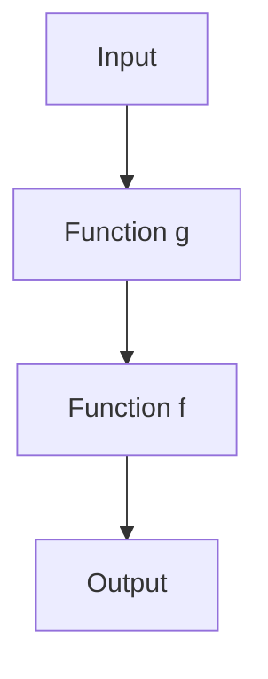
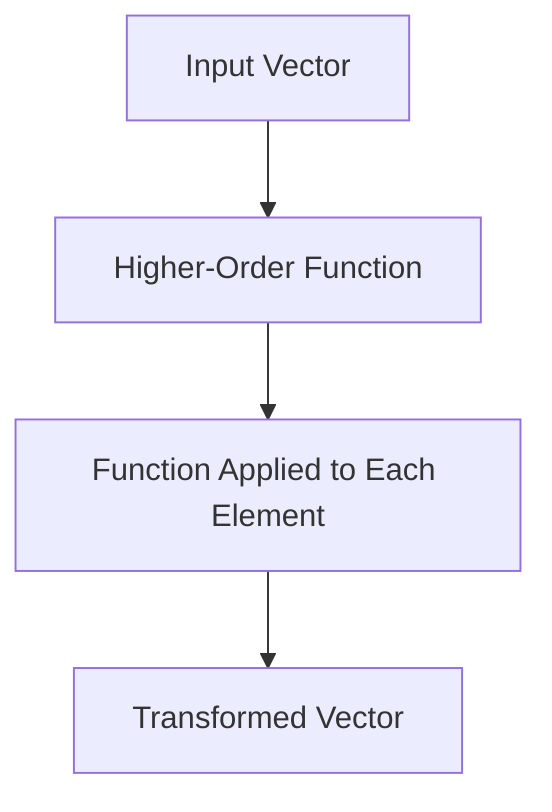

## 8.1 Introduction to Functional Programming Concepts

Functional programming is a paradigm that treats computation as the evaluation of mathematical functions and avoids changing state or mutable data. In C++, a language traditionally known for its imperative and object-oriented capabilities, embracing functional programming can lead to more predictable, maintainable, and robust code. Let's delve into the core concepts of functional programming and see how they can be applied in C++.

### Immutability

Immutability is a fundamental concept in functional programming. It refers to the idea that once a data structure is created, it cannot be changed. This concept helps prevent side effects, making programs easier to understand and debug. In C++, immutability can be achieved using `const` qualifiers.

#### Benefits of Immutability

- **Predictability**: Immutable data structures lead to predictable code behavior since they do not change state after creation.
- **Thread Safety**: Immutability naturally leads to thread-safe code, as concurrent threads cannot alter immutable data.
- **Easier Debugging**: With immutable data, you can be sure that data remains consistent throughout the program's execution.

#### Implementing Immutability in C++

Let's look at an example of how immutability can be implemented in C++:

```cpp
#include <iostream>
#include <vector>

class ImmutableVector {
public:
    ImmutableVector(const std::vector<int>& data) : data_(data) {}

    int get(int index) const {
        return data_.at(index);
    }

    size_t size() const {
        return data_.size();
    }

private:
    const std::vector<int> data_;
};

int main() {
    std::vector<int> data = {1, 2, 3, 4, 5};
    ImmutableVector iv(data);

    std::cout << "Element at index 2: " << iv.get(2) << std::endl;
    std::cout << "Size of vector: " << iv.size() << std::endl;

    return 0;
}
```

In this example, `ImmutableVector` encapsulates a `std::vector<int>` and ensures that it cannot be modified after creation. The `const` keyword is used to enforce immutability.

#### Try It Yourself

Experiment with the `ImmutableVector` class by trying to modify its data after creation. Observe how the `const` keyword prevents any changes, reinforcing the concept of immutability.

### Pure Functions

A pure function is a function where the output value is determined only by its input values, without observable side effects. This means that calling a pure function with the same arguments will always produce the same result.

#### Characteristics of Pure Functions

- **Deterministic**: Always produces the same output for the same input.
- **No Side Effects**: Does not alter any state or interact with the outside world (e.g., no I/O operations).

#### Implementing Pure Functions in C++

Here's an example of a pure function in C++:

```cpp
#include <iostream>

// A pure function that calculates the square of a number
int square(int x) {
    return x * x;
}

int main() {
    std::cout << "Square of 5: " << square(5) << std::endl;
    std::cout << "Square of 5 again: " << square(5) << std::endl;

    return 0;
}
```

The `square` function is pure because it always returns the same result for the same input and does not modify any external state.

#### Try It Yourself

Modify the `square` function to include a side effect, such as printing to the console. Observe how this changes the function's purity.

### Function Composition

Function composition is the process of combining two or more functions to produce a new function. This concept allows for building complex operations from simpler ones, promoting code reuse and modularity.

#### Benefits of Function Composition

- **Modularity**: Breaks down complex operations into simpler, reusable functions.
- **Readability**: Makes code easier to understand by expressing complex operations in terms of simpler ones.

#### Implementing Function Composition in C++

Let's see how function composition can be implemented in C++:

```cpp
#include <iostream>
#include <functional>

// A function that adds two numbers
int add(int a, int b) {
    return a + b;
}

// A function that multiplies two numbers
int multiply(int a, int b) {
    return a * b;
}

// A function that composes two functions
std::function<int(int, int)> compose(std::function<int(int, int)> f, std::function<int(int, int)> g) {
    return [f, g](int x, int y) {
        return f(g(x, y), y);
    };
}

int main() {
    auto addThenMultiply = compose(multiply, add);

    std::cout << "Result of addThenMultiply(2, 3): " << addThenMultiply(2, 3) << std::endl;

    return 0;
}
```

In this example, we define two functions, `add` and `multiply`, and use a `compose` function to create a new function that first adds two numbers and then multiplies the result by the second number.

#### Try It Yourself

Create your own functions and use the `compose` function to combine them in different ways. Experiment with different combinations to see how function composition works in practice.

### Higher-Order Functions

Higher-order functions are functions that can take other functions as arguments or return them as results. They are a powerful tool in functional programming, enabling more abstract and flexible code.

#### Benefits of Higher-Order Functions

- **Abstraction**: Allows for more abstract and flexible code by operating on functions.
- **Code Reuse**: Facilitates code reuse by enabling generic operations on functions.

#### Implementing Higher-Order Functions in C++

Here's an example of a higher-order function in C++:

```cpp
#include <iostream>
#include <vector>
#include <algorithm>

// A higher-order function that applies a function to each element of a vector
void applyFunction(std::vector<int>& vec, std::function<int(int)> func) {
    std::transform(vec.begin(), vec.end(), vec.begin(), func);
}

int main() {
    std::vector<int> numbers = {1, 2, 3, 4, 5};

    // A lambda function to double a number
    auto doubleNumber = [](int x) { return x * 2; };

    applyFunction(numbers, doubleNumber);

    for (int num : numbers) {
        std::cout << num << " ";
    }
    std::cout << std::endl;

    return 0;
}
```

In this example, `applyFunction` is a higher-order function that takes a vector and a function as arguments. It applies the function to each element of the vector.

#### Try It Yourself

Create your own higher-order functions that operate on different types of data structures. Experiment with different functions to see how higher-order functions can be used to abstract and generalize operations.

### Visualizing Functional Programming Concepts

To better understand the flow of data and operations in functional programming, let's visualize the process of function composition and higher-order functions using Mermaid.js diagrams.

#### Function Composition Flowchart



**Caption**: This flowchart illustrates the process of function composition, where the output of function `g` becomes the input to function `f`, resulting in the final output.

#### Higher-Order Function Flowchart



**Caption**: This flowchart shows how a higher-order function applies a given function to each element of an input vector, resulting in a transformed vector.

### References and Links

For further reading on functional programming concepts in C++, consider exploring the following resources:

- [Functional Programming in C++](https://www.oreilly.com/library/view/functional-programming-in/9781492047330/) - A comprehensive guide to functional programming in C++.
- [C++ Programming Language](https://en.cppreference.com/w/) - A reference for C++ language features and standard library.
- [Boost Libraries](https://www.boost.org/) - A collection of peer-reviewed portable C++ source libraries.

### Knowledge Check

- **What is immutability, and why is it important in functional programming?**
- **How do pure functions differ from impure functions?**
- **What are the benefits of function composition?**
- **How can higher-order functions be used to abstract operations in C++?**

### Embrace the Journey

Remember, this is just the beginning of your journey into functional programming in C++. As you progress, you'll discover more advanced concepts and techniques that will further enhance your software design skills. Keep experimenting, stay curious, and enjoy the journey!

## Quiz Time!



### What is immutability in functional programming?

- [x] The concept that data structures cannot be changed after they are created.
- [ ] The ability to change data structures at runtime.
- [ ] A method to optimize memory usage.
- [ ] A technique to improve code readability.

> **Explanation:** Immutability refers to the idea that once a data structure is created, it cannot be modified, which helps prevent side effects.

### Which of the following is a characteristic of pure functions?

- [x] They always produce the same output for the same input.
- [ ] They can modify global variables.
- [ ] They perform I/O operations.
- [ ] They rely on external state.

> **Explanation:** Pure functions are deterministic and do not have side effects, meaning they always produce the same output for the same input.

### What is function composition?

- [x] The process of combining two or more functions to create a new function.
- [ ] The act of writing multiple functions in a single file.
- [ ] A method to increase code execution speed.
- [ ] A way to reduce memory usage.

> **Explanation:** Function composition involves combining functions to create a new function that performs a sequence of operations.

### How do higher-order functions operate?

- [x] They take other functions as arguments or return them as results.
- [ ] They only operate on primitive data types.
- [ ] They cannot be used with lambda expressions.
- [ ] They are specific to object-oriented programming.

> **Explanation:** Higher-order functions can take functions as arguments or return them, allowing for more abstract and flexible code.

### What is the main benefit of using immutability in concurrent programming?

- [x] It naturally leads to thread-safe code.
- [ ] It reduces the number of lines of code.
- [ ] It increases execution speed.
- [ ] It simplifies the syntax of the language.

> **Explanation:** Immutability ensures that data cannot be altered, which makes concurrent programming safer and easier to manage.

### Which C++ keyword is used to enforce immutability?

- [x] `const`
- [ ] `static`
- [ ] `mutable`
- [ ] `volatile`

> **Explanation:** The `const` keyword in C++ is used to declare variables or data members as immutable.

### What is a common use case for higher-order functions?

- [x] Abstracting operations on collections of data.
- [ ] Writing low-level system code.
- [ ] Managing memory allocation.
- [ ] Performing hardware-specific optimizations.

> **Explanation:** Higher-order functions are often used to abstract operations on collections, allowing for more generalized and reusable code.

### What does a pure function avoid?

- [x] Side effects
- [ ] Returning values
- [ ] Using parameters
- [ ] Being called multiple times

> **Explanation:** Pure functions avoid side effects, meaning they do not alter any state or interact with the outside world.

### How can function composition improve code readability?

- [x] By expressing complex operations in terms of simpler ones.
- [ ] By reducing the number of functions in a program.
- [ ] By eliminating the need for comments.
- [ ] By using shorter variable names.

> **Explanation:** Function composition allows complex operations to be expressed as a sequence of simpler functions, improving readability.

### True or False: Higher-order functions can only return other functions.

- [ ] True
- [x] False

> **Explanation:** Higher-order functions can both take functions as arguments and return them as results.


