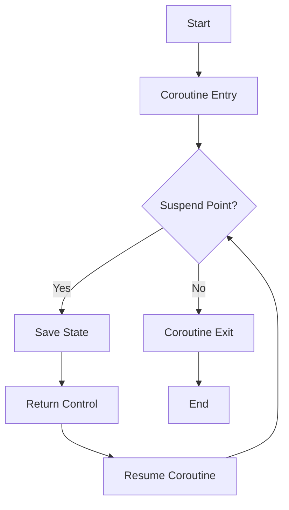

## 8.10 Coroutines and Asynchronous Programming

In the realm of modern C++ programming, coroutines and asynchronous programming have emerged as powerful tools for building efficient and responsive applications. With the introduction of coroutines in C++20, developers can now write asynchronous code that is both easier to read and maintain. This section will guide you through the concepts of coroutines and asynchronous programming, demonstrating how to implement generators, async tasks, state machines, and lazy computations using C++20.

### Understanding Coroutines in C++20

Coroutines are a generalization of subroutines that allow you to pause and resume execution at certain points. Unlike traditional functions, coroutines can suspend their execution and return control to the caller, resuming from the same point later. This makes them particularly useful for asynchronous programming, where tasks can be paused while waiting for external events or data.

#### Key Concepts of Coroutines

1. **Suspend and Resume**: Coroutines can suspend their execution at certain points and resume later, allowing for non-blocking operations.
2. **Coroutine State**: The state of a coroutine is preserved between suspensions, enabling it to maintain context.
3. **Coroutine Handles**: These are used to manage the lifecycle of coroutines, including suspension and resumption.

### Implementing Generators with Coroutines

Generators are a type of coroutine that produce a sequence of values over time, yielding each value to the caller. In C++, generators can be implemented using coroutines to create iterators that lazily compute values.

#### Example: Fibonacci Sequence Generator

Let's implement a simple generator that produces the Fibonacci sequence:

```cpp
#include <coroutine>
#include <iostream>
#include <optional>

template<typename T>
struct Generator {
    struct promise_type {
        T current_value;
        std::suspend_always yield_value(T value) {
            current_value = value;
            return {};
        }
        std::suspend_always initial_suspend() { return {}; }
        std::suspend_always final_suspend() noexcept { return {}; }
        Generator get_return_object() { return Generator{std::coroutine_handle<promise_type>::from_promise(*this)}; }
        void return_void() {}
        void unhandled_exception() { std::terminate(); }
    };

    std::coroutine_handle<promise_type> handle;

    explicit Generator(std::coroutine_handle<promise_type> h) : handle(h) {}
    ~Generator() { if (handle) handle.destroy(); }

    struct iterator {
        std::coroutine_handle<promise_type> handle;
        bool done;

        iterator(std::coroutine_handle<promise_type> h, bool d) : handle(h), done(d) {}

        iterator& operator++() {
            handle.resume();
            done = handle.done();
            return *this;
        }

        T operator*() const { return handle.promise().current_value; }
        bool operator==(std::default_sentinel_t) const { return done; }
    };

    iterator begin() {
        handle.resume();
        return iterator{handle, handle.done()};
    }

    std::default_sentinel_t end() { return {}; }
};

Generator<int> fibonacci() {
    int a = 0, b = 1;
    while (true) {
        co_yield a;
        auto next = a + b;
        a = b;
        b = next;
    }
}

int main() {
    for (auto i : fibonacci()) {
        if (i > 100) break;
        std::cout << i << " ";
    }
    return 0;
}
```

In this example, the `fibonacci` function is a coroutine that yields Fibonacci numbers. The `Generator` class manages the coroutine's state and provides an iterator interface.

### Asynchronous Tasks with Coroutines

Coroutines can also be used to implement asynchronous tasks, allowing you to write non-blocking code that waits for operations to complete without freezing the entire program.

#### Example: Asynchronous File Reader

Consider an asynchronous file reader that reads data from a file without blocking the main thread:

```cpp
#include <coroutine>
#include <fstream>
#include <iostream>
#include <string>
#include <thread>

struct FileReader {
    struct promise_type {
        std::string result;
        std::suspend_always initial_suspend() { return {}; }
        std::suspend_always final_suspend() noexcept { return {}; }
        FileReader get_return_object() { return FileReader{std::coroutine_handle<promise_type>::from_promise(*this)}; }
        void return_value(std::string value) { result = std::move(value); }
        void unhandled_exception() { std::terminate(); }
    };

    std::coroutine_handle<promise_type> handle;

    explicit FileReader(std::coroutine_handle<promise_type> h) : handle(h) {}
    ~FileReader() { if (handle) handle.destroy(); }

    std::string get() {
        handle.resume();
        return handle.promise().result;
    }
};

FileReader readFileAsync(const std::string& filename) {
    std::ifstream file(filename);
    std::string content((std::istreambuf_iterator<char>(file)), std::istreambuf_iterator<char>());
    co_return content;
}

int main() {
    auto fileContent = readFileAsync("example.txt").get();
    std::cout << "File content: " << fileContent << std::endl;
    return 0;
}
```

In this example, `readFileAsync` is a coroutine that reads a file asynchronously. The `FileReader` class manages the coroutine's lifecycle and retrieves the file content once the operation is complete.

### Coroutines for State Machines

Coroutines can be effectively used to implement state machines, where each state is represented by a coroutine. This approach simplifies the management of complex state transitions.

#### Example: Simple Traffic Light State Machine

Let's create a simple traffic light state machine using coroutines:

```cpp
#include <coroutine>
#include <iostream>
#include <string>
#include <thread>

struct TrafficLight {
    struct promise_type {
        std::string state;
        std::suspend_always yield_value(std::string value) {
            state = value;
            return {};
        }
        std::suspend_always initial_suspend() { return {}; }
        std::suspend_always final_suspend() noexcept { return {}; }
        TrafficLight get_return_object() { return TrafficLight{std::coroutine_handle<promise_type>::from_promise(*this)}; }
        void return_void() {}
        void unhandled_exception() { std::terminate(); }
    };

    std::coroutine_handle<promise_type> handle;

    explicit TrafficLight(std::coroutine_handle<promise_type> h) : handle(h) {}
    ~TrafficLight() { if (handle) handle.destroy(); }

    struct iterator {
        std::coroutine_handle<promise_type> handle;
        bool done;

        iterator(std::coroutine_handle<promise_type> h, bool d) : handle(h), done(d) {}

        iterator& operator++() {
            handle.resume();
            done = handle.done();
            return *this;
        }

        std::string operator*() const { return handle.promise().state; }
        bool operator==(std::default_sentinel_t) const { return done; }
    };

    iterator begin() {
        handle.resume();
        return iterator{handle, handle.done()};
    }

    std::default_sentinel_t end() { return {}; }
};

TrafficLight trafficLight() {
    while (true) {
        co_yield "Green";
        std::this_thread::sleep_for(std::chrono::seconds(5));
        co_yield "Yellow";
        std::this_thread::sleep_for(std::chrono::seconds(2));
        co_yield "Red";
        std::this_thread::sleep_for(std::chrono::seconds(5));
    }
}

int main() {
    for (auto state : trafficLight()) {
        std::cout << "Traffic light is " << state << std::endl;
    }
    return 0;
}
```

In this example, the `trafficLight` coroutine represents a traffic light state machine, cycling through "Green," "Yellow," and "Red" states.

### Lazy Computations with Coroutines

Coroutines can also be used for lazy computations, where results are computed on-demand rather than upfront. This can improve performance by avoiding unnecessary calculations.

#### Example: Lazy Evaluation of a Mathematical Series

Consider a coroutine that lazily evaluates a mathematical series:

```cpp
#include <coroutine>
#include <iostream>
#include <cmath>

template<typename T>
struct LazySeries {
    struct promise_type {
        T current_value;
        std::suspend_always yield_value(T value) {
            current_value = value;
            return {};
        }
        std::suspend_always initial_suspend() { return {}; }
        std::suspend_always final_suspend() noexcept { return {}; }
        LazySeries get_return_object() { return LazySeries{std::coroutine_handle<promise_type>::from_promise(*this)}; }
        void return_void() {}
        void unhandled_exception() { std::terminate(); }
    };

    std::coroutine_handle<promise_type> handle;

    explicit LazySeries(std::coroutine_handle<promise_type> h) : handle(h) {}
    ~LazySeries() { if (handle) handle.destroy(); }

    struct iterator {
        std::coroutine_handle<promise_type> handle;
        bool done;

        iterator(std::coroutine_handle<promise_type> h, bool d) : handle(h), done(d) {}

        iterator& operator++() {
            handle.resume();
            done = handle.done();
            return *this;
        }

        T operator*() const { return handle.promise().current_value; }
        bool operator==(std::default_sentinel_t) const { return done; }
    };

    iterator begin() {
        handle.resume();
        return iterator{handle, handle.done()};
    }

    std::default_sentinel_t end() { return {}; }
};

LazySeries<double> exponentialSeries(double x) {
    double term = 1.0;
    double sum = term;
    int n = 1;
    while (true) {
        co_yield sum;
        term *= x / n;
        sum += term;
        ++n;
    }
}

int main() {
    auto series = exponentialSeries(1.0);
    int count = 0;
    for (auto value : series) {
        std::cout << "e^1 approximation: " << value << std::endl;
        if (++count == 10) break;
    }
    return 0;
}
```

In this example, the `exponentialSeries` coroutine lazily computes the terms of the exponential series, yielding each partial sum.

### Visualizing Coroutines and Asynchronous Programming

To better understand the flow of coroutines and asynchronous programming, let's visualize the process using a flowchart.



**Diagram Description**: This flowchart illustrates the lifecycle of a coroutine, starting from entry, encountering a suspend point, saving state, returning control, and resuming execution until exit.

### Design Considerations

When implementing coroutines and asynchronous programming in C++, consider the following:

- **Performance**: Coroutines can improve performance by avoiding blocking operations, but they may introduce overhead due to state management.
- **Complexity**: While coroutines simplify asynchronous code, they can increase complexity if not managed properly.
- **Resource Management**: Ensure that resources are properly managed and released, especially in the presence of exceptions.

### Differences and Similarities with Other Patterns

Coroutines share similarities with other asynchronous patterns, such as futures and promises, but they offer more flexibility in managing control flow. Unlike traditional callback-based approaches, coroutines provide a more linear and readable code structure.

### Try It Yourself

Experiment with the provided code examples by modifying the coroutine logic or adding additional features. For instance, try implementing a coroutine that generates prime numbers or reads multiple files asynchronously.

### References and Further Reading

- [C++ Coroutines Proposal](http://www.open-std.org/jtc1/sc22/wg21/docs/papers/2018/p0912r5.html)
- [C++20 Coroutines Documentation](https://en.cppreference.com/w/cpp/language/coroutines)
- [Asynchronous Programming in C++](https://www.modernescpp.com/index.php/c-20-coroutines)

### Knowledge Check

- What are the key benefits of using coroutines in C++20?
- How do coroutines differ from traditional asynchronous programming techniques?
- Implement a coroutine that generates a sequence of prime numbers.

### Embrace the Journey

Remember, mastering coroutines and asynchronous programming is a journey. As you experiment and build more complex applications, you'll gain a deeper understanding of these powerful tools. Keep exploring, stay curious, and enjoy the process!

## Quiz Time!



### What is a coroutine in C++20?

- [x] A generalization of subroutines that can pause and resume execution
- [ ] A function that executes asynchronously without pausing
- [ ] A type of loop that runs indefinitely
- [ ] A method for managing memory allocation

> **Explanation:** Coroutines in C++20 are a generalization of subroutines that allow pausing and resuming execution, which is useful for asynchronous programming.

### Which keyword is used to yield a value in a coroutine?

- [x] `co_yield`
- [ ] `yield`
- [ ] `return`
- [ ] `co_return`

> **Explanation:** The `co_yield` keyword is used in coroutines to yield a value back to the caller.

### What is the purpose of the `suspend_always` type in a coroutine?

- [x] To indicate that the coroutine should always suspend at a certain point
- [ ] To ensure the coroutine never suspends
- [ ] To manage memory allocation within the coroutine
- [ ] To handle exceptions in the coroutine

> **Explanation:** `suspend_always` is used to indicate that the coroutine should suspend at certain points, allowing control to return to the caller.

### How can coroutines improve performance in C++ applications?

- [x] By avoiding blocking operations and allowing other tasks to run
- [ ] By increasing the speed of loop iterations
- [ ] By reducing memory usage
- [ ] By simplifying syntax

> **Explanation:** Coroutines improve performance by avoiding blocking operations, allowing other tasks to run concurrently.

### What is a key advantage of using coroutines over traditional callback-based asynchronous programming?

- [x] More linear and readable code structure
- [ ] Faster execution times
- [ ] Reduced memory usage
- [ ] Automatic error handling

> **Explanation:** Coroutines provide a more linear and readable code structure compared to traditional callback-based approaches.

### Which of the following is a valid use case for coroutines?

- [x] Implementing a state machine
- [ ] Managing memory allocation
- [ ] Compiling code
- [ ] Encrypting data

> **Explanation:** Coroutines can be used to implement state machines, allowing for easy management of state transitions.

### What is the role of a promise type in a coroutine?

- [x] To manage the state and lifecycle of the coroutine
- [ ] To handle exceptions within the coroutine
- [ ] To allocate memory for the coroutine
- [ ] To optimize performance

> **Explanation:** The promise type manages the state and lifecycle of the coroutine, including handling return values and exceptions.

### How do coroutines handle exceptions?

- [x] By using the `unhandled_exception` method in the promise type
- [ ] By automatically retrying the operation
- [ ] By ignoring them
- [ ] By logging them to a file

> **Explanation:** Coroutines handle exceptions using the `unhandled_exception` method in the promise type, which can be customized to manage exceptions.

### Can coroutines be used for lazy computations?

- [x] True
- [ ] False

> **Explanation:** Coroutines can be used for lazy computations, where results are computed on-demand rather than upfront.

### What is the benefit of using a coroutine for a generator pattern?

- [x] It allows for lazy evaluation and on-demand computation of values
- [ ] It speeds up the computation of all values at once
- [ ] It reduces memory usage by storing all values in advance
- [ ] It simplifies the syntax of the generator function

> **Explanation:** Using a coroutine for a generator pattern allows for lazy evaluation and on-demand computation of values, improving efficiency.


