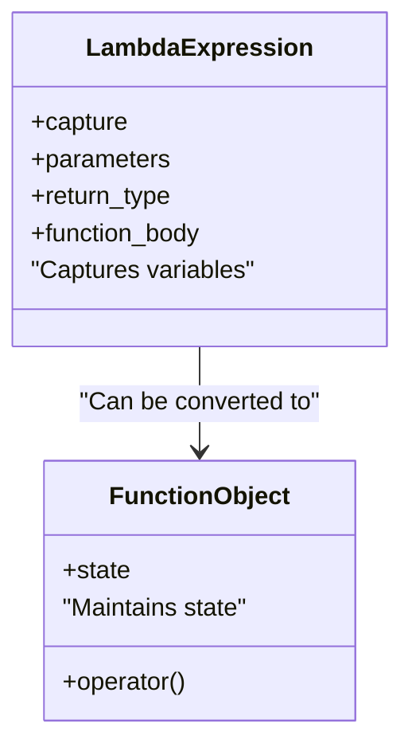

## 8.2 Lambda Expressions and Function Objects

In modern C++ programming, lambda expressions and function objects have become indispensable tools for developers. They provide a concise and expressive way to define anonymous functions, encapsulate behavior, and enhance the flexibility of your code. In this section, we will delve into the intricacies of lambda expressions and function objects, exploring their syntax, usage, and benefits in C++.

### Understanding Lambda Expressions

Lambda expressions, introduced in C++11, allow you to define anonymous functions directly within your code. These expressions are particularly useful for short, throwaway functions that are used only once or a few times. Lambda expressions are defined using the following syntax:

```cpp
[capture](parameters) -> return_type {
    // function body
};
```

- **Capture**: Specifies which variables from the surrounding scope are accessible within the lambda.
- **Parameters**: Defines the input parameters for the lambda.
- **Return Type**: Specifies the return type of the lambda function. If omitted, the compiler will deduce it.
- **Function Body**: Contains the code to be executed when the lambda is called.

#### Example: Basic Lambda Expression

Let's start with a simple example to illustrate the basic structure of a lambda expression:

```cpp
#include <iostream>

int main() {
    auto greet = []() {
        std::cout << "Hello, World!" << std::endl;
    };

    greet(); // Output: Hello, World!
    return 0;
}
```

In this example, we define a lambda expression `greet` that prints "Hello, World!" to the console. The lambda is then called like a regular function.

### Capturing Variables with Lambdas

One of the powerful features of lambda expressions is their ability to capture variables from the surrounding scope. This allows lambdas to access and modify local variables, providing a way to encapsulate state within a function.

#### Capture Modes

Lambdas can capture variables by value or by reference:

- **By Value (`[=]`)**: Captures a copy of the variable. Changes to the variable inside the lambda do not affect the original variable.
- **By Reference (`[&]`)**: Captures a reference to the variable. Changes to the variable inside the lambda affect the original variable.

You can also capture specific variables by specifying them explicitly:

- **By Value (`[x]`)**: Captures a copy of `x`.
- **By Reference (`[&x]`)**: Captures a reference to `x`.

#### Example: Capturing Variables

Consider the following example that demonstrates variable capturing:

```cpp
#include <iostream>

int main() {
    int x = 10;
    int y = 20;

    auto captureByValue = [=]() {
        std::cout << "Capture by value: x = " << x << ", y = " << y << std::endl;
    };

    auto captureByReference = [&]() {
        x += 10;
        y += 10;
        std::cout << "Capture by reference: x = " << x << ", y = " << y << std::endl;
    };

    captureByValue(); // Output: Capture by value: x = 10, y = 20
    captureByReference(); // Output: Capture by reference: x = 20, y = 30

    std::cout << "After lambda calls: x = " << x << ", y = " << y << std::endl;
    // Output: After lambda calls: x = 20, y = 30

    return 0;
}
```

In this example, `captureByValue` captures `x` and `y` by value, while `captureByReference` captures them by reference. Notice how changes made inside the reference-capturing lambda affect the original variables.

### Using Lambdas with STL Algorithms

Lambda expressions are particularly useful when working with the Standard Template Library (STL) algorithms. They allow you to define custom behavior inline, making your code more readable and concise.

#### Example: Using Lambdas with `std::for_each`

The `std::for_each` algorithm applies a function to each element in a range. Using a lambda expression, you can easily define this function:

```cpp
#include <iostream>
#include <vector>
#include <algorithm>

int main() {
    std::vector<int> numbers = {1, 2, 3, 4, 5};

    std::for_each(numbers.begin(), numbers.end(), [](int n) {
        std::cout << n << " ";
    });

    std::cout << std::endl; // Output: 1 2 3 4 5

    return 0;
}
```

In this example, the lambda expression is used to print each element of the `numbers` vector.

#### Example: Using Lambdas with `std::sort`

Lambdas can also be used to define custom sorting criteria with `std::sort`:

```cpp
#include <iostream>
#include <vector>
#include <algorithm>

int main() {
    std::vector<int> numbers = {5, 3, 2, 4, 1};

    std::sort(numbers.begin(), numbers.end(), [](int a, int b) {
        return a < b; // Sort in ascending order
    });

    for (int n : numbers) {
        std::cout << n << " ";
    }

    std::cout << std::endl; // Output: 1 2 3 4 5

    return 0;
}
```

Here, the lambda expression defines the sorting criteria for `std::sort`, sorting the elements in ascending order.

### Generic Lambdas (C++14)

C++14 introduced generic lambdas, which allow you to define lambdas with template-like behavior. This means you can write lambdas that work with any type of input, similar to function templates.

#### Example: Generic Lambda

Consider the following example of a generic lambda:

```cpp
#include <iostream>

int main() {
    auto add = [](auto a, auto b) {
        return a + b;
    };

    std::cout << "Sum of integers: " << add(3, 4) << std::endl; // Output: 7
    std::cout << "Sum of doubles: " << add(3.5, 4.5) << std::endl; // Output: 8

    return 0;
}
```

In this example, the lambda `add` can accept arguments of any type, as long as the `+` operator is defined for them. This makes the lambda highly versatile and reusable.

### Lambdas in Templates

Lambdas can be used within templates to provide inline function definitions that are specific to the template parameters. This can lead to more flexible and efficient code.

#### Example: Lambdas in Templates

Let's explore how lambdas can be used in conjunction with templates:

```cpp
#include <iostream>
#include <vector>
#include <algorithm>

template<typename T>
void printElements(const std::vector<T>& elements) {
    std::for_each(elements.begin(), elements.end(), [](const T& element) {
        std::cout << element << " ";
    });
    std::cout << std::endl;
}

int main() {
    std::vector<int> intVec = {1, 2, 3, 4, 5};
    std::vector<std::string> stringVec = {"Hello", "World"};

    printElements(intVec); // Output: 1 2 3 4 5
    printElements(stringVec); // Output: Hello World

    return 0;
}
```

In this example, the `printElements` function template uses a lambda expression to print each element of a vector. The lambda is defined inline within the template, making it adaptable to any type `T`.

### Function Objects (Functors)

Function objects, or functors, are objects that can be called as if they were ordinary functions. They are defined by overloading the `operator()` in a class. Functors are useful when you need to maintain state or when a lambda expression is too limited.

#### Example: Basic Functor

Let's create a simple functor that multiplies a number by a fixed factor:

```cpp
#include <iostream>

class Multiplier {
public:
    Multiplier(int factor) : factor_(factor) {}

    int operator()(int value) const {
        return value * factor_;
    }

private:
    int factor_;
};

int main() {
    Multiplier timesTwo(2);
    std::cout << "3 times 2 is " << timesTwo(3) << std::endl; // Output: 6

    return 0;
}
```

In this example, `Multiplier` is a functor that multiplies its input by a specified factor. The state (factor) is stored within the object, allowing for more complex behavior than a simple lambda.

### Advantages of Lambdas and Functors

Both lambda expressions and function objects have their own advantages:

- **Lambdas**: Provide a concise and inline way to define short-lived functions. Ideal for use with STL algorithms and when capturing variables from the surrounding scope.
- **Functors**: Offer more flexibility and can maintain state. Useful when a function needs to be reused or when the logic is too complex for a lambda.

### Visualizing Lambda Expressions and Function Objects

To better understand the relationship between lambda expressions and function objects, let's visualize their interaction:



This diagram illustrates how lambda expressions can be converted into function objects, with lambdas capturing variables and function objects maintaining state.

### Try It Yourself

Experiment with the code examples provided in this section. Try modifying the lambda expressions to capture different variables or change the sorting criteria in the `std::sort` example. You can also create your own functors to perform various operations.

### References and Further Reading

- [Lambda Expressions in C++](https://en.cppreference.com/w/cpp/language/lambda)
- [Function Objects in C++](https://en.cppreference.com/w/cpp/utility/functional)
- [STL Algorithms](https://en.cppreference.com/w/cpp/algorithm)

### Knowledge Check

Let's reinforce what we've learned with a few questions:

1. What is the primary purpose of lambda expressions in C++?
2. How do you capture variables by reference in a lambda expression?
3. What is a functor, and how does it differ from a lambda expression?
4. How can you use lambdas with STL algorithms?

### Embrace the Journey

Remember, mastering lambda expressions and function objects is just one step in your journey to becoming a C++ expert. Keep experimenting, stay curious, and enjoy the process of learning and applying these powerful tools in your software development projects.

## Quiz Time!



### What is a lambda expression in C++?

- [x] An anonymous function that can capture variables from its surrounding scope.
- [ ] A named function that cannot capture variables.
- [ ] A class that overloads the `operator()`.
- [ ] A type of pointer used for function calls.

> **Explanation:** A lambda expression is an anonymous function that can capture variables from its surrounding scope, allowing for concise and flexible function definitions.

### How do you capture variables by reference in a lambda expression?

- [ ] Using `[=]`
- [x] Using `[&]`
- [ ] Using `[capture]`
- [ ] Using `[ref]`

> **Explanation:** The `[&]` syntax is used to capture variables by reference in a lambda expression, allowing the lambda to modify the original variables.

### What is the main advantage of using lambdas with STL algorithms?

- [x] They allow for concise and inline function definitions.
- [ ] They require less memory than function objects.
- [ ] They can only be used with `std::sort`.
- [ ] They automatically optimize the algorithm's performance.

> **Explanation:** Lambdas provide a concise and inline way to define functions, making them ideal for use with STL algorithms where custom behavior is needed.

### What is a functor in C++?

- [x] An object that can be called like a function by overloading the `operator()`.
- [ ] A type of lambda expression.
- [ ] A built-in C++ function.
- [ ] A pointer to a function.

> **Explanation:** A functor is an object that can be called like a function by overloading the `operator()`, allowing it to maintain state and encapsulate behavior.

### How can you define a generic lambda in C++14?

- [x] By using `auto` as the parameter type.
- [ ] By specifying a template parameter.
- [ ] By using `decltype`.
- [ ] By using `constexpr`.

> **Explanation:** C++14 allows for generic lambdas by using `auto` as the parameter type, enabling the lambda to accept arguments of any type.

### Which capture mode allows a lambda to modify the original variables?

- [ ] By value
- [x] By reference
- [ ] By copy
- [ ] By pointer

> **Explanation:** Capturing by reference allows a lambda to modify the original variables, as it captures a reference to them.

### What is the syntax for capturing all variables by value in a lambda?

- [x] `[=]`
- [ ] `[&]`
- [ ] `[value]`
- [ ] `[copy]`

> **Explanation:** The `[=]` syntax captures all variables by value, creating copies of them for use within the lambda.

### What is the purpose of the `operator()` in a functor?

- [x] To allow the object to be called like a function.
- [ ] To define the object's constructor.
- [ ] To overload arithmetic operators.
- [ ] To implement the object's destructor.

> **Explanation:** The `operator()` is overloaded in a functor to allow the object to be called like a function, enabling it to encapsulate behavior.

### Can lambdas be used within templates?

- [x] True
- [ ] False

> **Explanation:** Lambdas can be used within templates to provide inline function definitions that are specific to the template parameters, enhancing flexibility and efficiency.

### What is the benefit of using lambdas over traditional function pointers?

- [x] Lambdas provide a more concise and readable syntax.
- [ ] Lambdas are faster than function pointers.
- [ ] Lambdas cannot capture variables.
- [ ] Lambdas are only available in C++20.

> **Explanation:** Lambdas provide a more concise and readable syntax compared to traditional function pointers, and they can capture variables from their surrounding scope.


