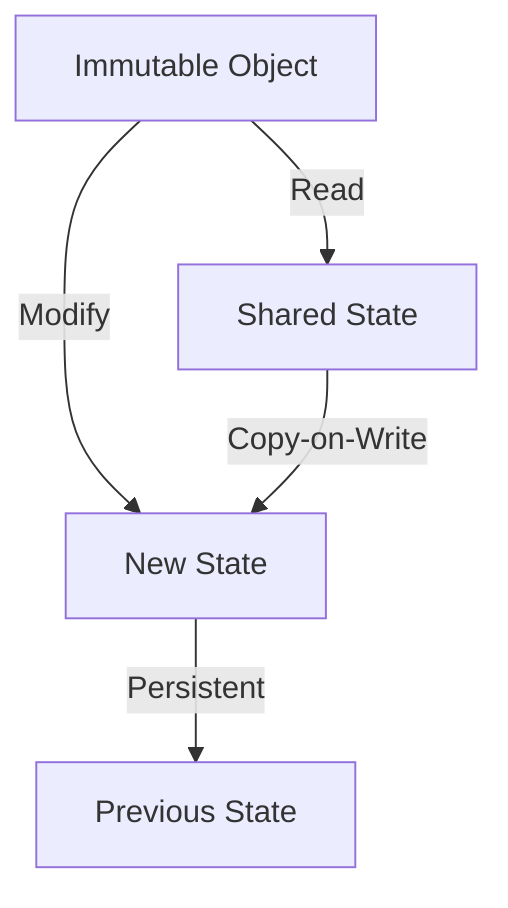

## 8.5 Immutable Data Structures

In the realm of C++ programming, immutable data structures play a pivotal role in enhancing software reliability, maintainability, and performance. By understanding and implementing concepts such as const-correctness, copy-on-write techniques, and persistent data structures, developers can create robust applications that are easier to reason about and less prone to errors. In this section, we will delve into these concepts, providing clear explanations, practical examples, and insights into their application in modern C++ development.

### Understanding Immutability

Immutability refers to the property of an object whose state cannot be modified after it is created. Immutable objects offer several advantages, including thread safety, simplicity in reasoning about code, and reduced risk of unintended side effects. In C++, immutability is often achieved through the use of `const` qualifiers, which prevent modification of data.

### Implementing Const-Correctness

Const-correctness is a fundamental principle in C++ that ensures the immutability of objects where appropriate. By using the `const` keyword, developers can specify that certain variables, function parameters, or member functions should not alter the state of an object.

#### Const Variables

To declare a constant variable, use the `const` keyword before the type:

```cpp
const int maxConnections = 100;
```

This declaration ensures that `maxConnections` cannot be modified after initialization.

#### Const Member Functions

Member functions can be marked as `const` to indicate that they do not modify the object's state:

```cpp
class Account {
public:
    double getBalance() const {
        return balance;
    }

private:
    double balance;
};
```

In this example, `getBalance()` is a const member function, meaning it cannot modify any member variables of the `Account` class.

#### Const Pointers and References

Pointers and references can also be made constant:

```cpp
const int* ptr; // Pointer to a constant integer
int* const ptr2 = &value; // Constant pointer to an integer
const int* const ptr3 = &value; // Constant pointer to a constant integer
```

Each of these declarations serves a different purpose and restricts modification in specific ways.

### Copy-on-Write Techniques

Copy-on-write (COW) is an optimization strategy used to delay the copying of an object until it is modified. This technique is particularly useful in scenarios where multiple objects share the same data, and copying is expensive.

#### Implementing Copy-on-Write

To implement COW, you need to maintain a reference count and perform a deep copy only when a write operation is attempted. Here's a basic example:

```cpp
class CowString {
public:
    CowString(const std::string& str) : data(new std::string(str)), refCount(new int(1)) {}

    CowString(const CowString& other) : data(other.data), refCount(other.refCount) {
        ++(*refCount);
    }

    ~CowString() {
        if (--(*refCount) == 0) {
            delete data;
            delete refCount;
        }
    }

    void modify(char c, size_t index) {
        if (*refCount > 1) {
            --(*refCount);
            data = new std::string(*data);
            refCount = new int(1);
        }
        (*data)[index] = c;
    }

    const std::string& get() const {
        return *data;
    }

private:
    std::string* data;
    int* refCount;
};
```

In this example, `CowString` uses reference counting to manage shared data and performs a deep copy only when `modify()` is called.

### Persistent Data Structures

Persistent data structures retain their previous versions when modified, allowing access to historical states. They are particularly useful in functional programming and applications requiring undo functionality.

#### Implementing Persistent Data Structures

To implement a persistent data structure, you can use techniques such as path copying or structural sharing. Here's a simple example using a persistent list:

```cpp
#include <memory>

template <typename T>
class PersistentList {
public:
    PersistentList() : head(nullptr) {}

    PersistentList<T> prepend(const T& value) const {
        return PersistentList(std::make_shared<Node>(value, head));
    }

    const T& front() const {
        return head->value;
    }

private:
    struct Node {
        Node(const T& value, std::shared_ptr<Node> next) : value(value), next(next) {}
        T value;
        std::shared_ptr<Node> next;
    };

    PersistentList(std::shared_ptr<Node> head) : head(head) {}

    std::shared_ptr<Node> head;
};
```

In this example, `PersistentList` uses shared pointers to maintain references to nodes, allowing for efficient structural sharing.

### Visualizing Immutable Data Structures

To better understand the concepts of immutable data structures, let's visualize the relationship between objects and their states using a diagram.



**Diagram Description:** This diagram illustrates how an immutable object can read from a shared state, modify it to create a new state, and maintain previous states using copy-on-write and persistence techniques.

### Key Considerations and Best Practices

- **When to Use Immutability:** Use immutable data structures when thread safety, simplicity, and predictability are priorities. They are particularly beneficial in multi-threaded environments and functional programming paradigms.
- **Performance Implications:** While immutability can improve safety and reasoning, it may introduce performance overhead due to increased memory usage and copying. Use techniques like copy-on-write to mitigate these costs.
- **C++ Specific Features:** Leverage C++ features such as `const`, smart pointers, and templates to implement immutable data structures efficiently.

### Differences and Similarities with Other Patterns

Immutable data structures share similarities with patterns like the Singleton pattern in terms of shared state management. However, they differ in their focus on immutability and historical state retention. Understanding these distinctions is crucial for selecting the right pattern for your needs.

### Try It Yourself

Experiment with the provided code examples by modifying them to suit different scenarios. For instance, try implementing a persistent stack or queue using similar techniques. This hands-on approach will deepen your understanding of immutable data structures and their applications.

### References and Further Reading

- [C++ Reference - Const](https://en.cppreference.com/w/cpp/language/const)
- [C++ Reference - Smart Pointers](https://en.cppreference.com/w/cpp/memory)
- [Boost Library - Persistent Data Structures](https://www.boost.org/doc/libs/release/libs/persistent/)

### Knowledge Check

- **What is the primary benefit of using immutable data structures?**
- **How does copy-on-write improve performance in shared data scenarios?**
- **What are the key differences between const-correctness and immutability?**

### Embrace the Journey

Remember, mastering immutable data structures is just one step in your journey as a C++ developer. As you continue to explore and apply these concepts, you'll find new ways to enhance your software design and architecture. Keep experimenting, stay curious, and enjoy the process!

## Quiz Time!



### What is the primary benefit of using immutable data structures?

- [x] Thread safety and predictability
- [ ] Reduced memory usage
- [ ] Faster execution
- [ ] Simplified syntax

> **Explanation:** Immutable data structures provide thread safety and predictability by ensuring that their state cannot be modified after creation.

### How does copy-on-write improve performance?

- [x] By delaying the copying of data until modification
- [ ] By reducing the size of data structures
- [ ] By increasing the speed of data access
- [ ] By simplifying the code

> **Explanation:** Copy-on-write improves performance by delaying the copying of data until it is modified, reducing unnecessary duplication.

### What is const-correctness?

- [x] Ensuring that objects are not modified unexpectedly
- [ ] A technique for optimizing memory usage
- [ ] A method for increasing execution speed
- [ ] A way to simplify code syntax

> **Explanation:** Const-correctness ensures that objects are not modified unexpectedly by using the `const` keyword to enforce immutability.

### Which C++ feature is commonly used to implement immutability?

- [x] Const keyword
- [ ] Pointers
- [ ] Inline functions
- [ ] Macros

> **Explanation:** The `const` keyword is commonly used in C++ to implement immutability by preventing modification of variables and functions.

### What is a persistent data structure?

- [x] A structure that retains previous versions when modified
- [ ] A structure that uses minimal memory
- [ ] A structure that executes operations quickly
- [ ] A structure that simplifies code

> **Explanation:** A persistent data structure retains previous versions of itself when modified, allowing access to historical states.

### What is the main advantage of using shared pointers in persistent data structures?

- [x] Efficient structural sharing
- [ ] Faster execution
- [ ] Reduced memory usage
- [ ] Simplified syntax

> **Explanation:** Shared pointers enable efficient structural sharing by managing references to shared data, reducing duplication.

### How can immutability be beneficial in multi-threaded environments?

- [x] By ensuring thread safety and reducing race conditions
- [ ] By increasing execution speed
- [ ] By reducing memory usage
- [ ] By simplifying code syntax

> **Explanation:** Immutability ensures thread safety and reduces race conditions in multi-threaded environments by preventing shared state modification.

### What is the role of the `const` keyword in C++?

- [x] To enforce immutability and prevent modification
- [ ] To optimize memory usage
- [ ] To increase execution speed
- [ ] To simplify code syntax

> **Explanation:** The `const` keyword enforces immutability by preventing modification of variables and functions, ensuring stable interfaces.

### Which technique is used to implement persistent data structures?

- [x] Path copying or structural sharing
- [ ] Memory pooling
- [ ] Inline functions
- [ ] Macros

> **Explanation:** Path copying or structural sharing is used to implement persistent data structures, allowing efficient access to historical states.

### True or False: Immutability can introduce performance overhead.

- [x] True
- [ ] False

> **Explanation:** While immutability offers benefits like thread safety, it can introduce performance overhead due to increased memory usage and copying.


