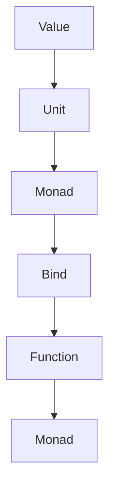

## 8.6 Monads and Functors in C++

In the realm of functional programming, monads and functors are powerful abstractions that allow developers to handle computations in a structured way. While C++ is traditionally an object-oriented language, it has embraced functional programming paradigms, especially with the advent of modern C++ standards. In this section, we will delve into the concepts of monads and functors, explore their implementation in C++, and understand how they can be used to write cleaner, more maintainable code.

### Understanding Monads in the Context of C++

Monads are a design pattern used to handle program-wide concerns in a functional way, such as state management, I/O, exceptions, etc. They encapsulate values along with a context, providing a way to chain operations while abstracting away the underlying complexity.

#### What is a Monad?

A monad is essentially a type constructor with two operations: `bind` (also known as `flatMap` in some languages) and `unit` (or `return`). These operations must satisfy three laws: left identity, right identity, and associativity.

- **Unit (Return):** This operation takes a value and wraps it in a monadic context.
- **Bind (FlatMap):** This operation takes a monadic value and a function that returns a monadic value, then applies the function to the unwrapped value and returns a new monad.

##### Monad Laws

1. **Left Identity:** `unit(x).bind(f)` is equivalent to `f(x)`.
2. **Right Identity:** `m.bind(unit)` is equivalent to `m`.
3. **Associativity:** `(m.bind(f)).bind(g)` is equivalent to `m.bind(x => f(x).bind(g))`.

These laws ensure that monads behave consistently, allowing for predictable composition of operations.

#### Implementing Monad-Like Structures in C++

While C++ does not have native support for monads, we can implement monad-like structures using templates and operator overloading. Let's consider a simple example using a `Maybe` monad, which represents an optional value that may or may not be present.

```cpp
#include <iostream>
#include <functional>
#include <optional>

template <typename T>
class Maybe {
public:
    Maybe() : value(std::nullopt) {}
    Maybe(T val) : value(val) {}

    template <typename Func>
    auto bind(Func func) -> Maybe<decltype(func(std::declval<T>()))> {
        if (value) {
            return func(*value);
        }
        return Maybe<decltype(func(std::declval<T>()))>();
    }

    T getValueOr(T defaultValue) const {
        return value.value_or(defaultValue);
    }

private:
    std::optional<T> value;
};

// Example usage
int main() {
    auto addFive = [](int x) { return Maybe<int>(x + 5); };
    Maybe<int> maybeValue(10);

    auto result = maybeValue.bind(addFive).bind(addFive);
    std::cout << "Result: " << result.getValueOr(0) << std::endl; // Output: Result: 20

    Maybe<int> emptyValue;
    auto emptyResult = emptyValue.bind(addFive);
    std::cout << "Empty Result: " << emptyResult.getValueOr(0) << std::endl; // Output: Empty Result: 0

    return 0;
}
```

In this example, the `Maybe` class encapsulates an optional value, and the `bind` method allows chaining operations that may or may not produce a value.

### `expected` and `optional` Monads

C++17 introduced the `std::optional` type, which is a simple monadic structure that represents an optional value. C++20 further introduced `std::expected`, which represents a value or an error, making it suitable for error handling.

#### Using `std::optional`

`std::optional` is a lightweight, type-safe way to represent "a value or nothing." It is particularly useful for functions that may fail to return a meaningful result.

```cpp
#include <iostream>
#include <optional>
#include <string>

std::optional<std::string> findNameById(int id) {
    if (id == 1) {
        return "Alice";
    } else if (id == 2) {
        return "Bob";
    }
    return std::nullopt;
}

int main() {
    auto name = findNameById(1);
    if (name) {
        std::cout << "Name: " << *name << std::endl;
    } else {
        std::cout << "Name not found." << std::endl;
    }

    auto missingName = findNameById(3);
    std::cout << "Missing Name: " << missingName.value_or("Unknown") << std::endl;

    return 0;
}
```

In this example, `findNameById` returns an `std::optional<std::string>`, allowing the caller to handle the case where the name is not found.

#### Using `std::expected`

`std::expected` is a proposed addition to the C++ standard library, designed to handle operations that can fail. It is similar to `std::optional`, but it also carries an error value.

```cpp
#include <iostream>
#include <string>
#include <system_error>
#include <expected>

std::expected<int, std::string> divide(int numerator, int denominator) {
    if (denominator == 0) {
        return std::unexpected("Division by zero");
    }
    return numerator / denominator;
}

int main() {
    auto result = divide(10, 2);
    if (result) {
        std::cout << "Result: " << *result << std::endl;
    } else {
        std::cout << "Error: " << result.error() << std::endl;
    }

    auto errorResult = divide(10, 0);
    if (!errorResult) {
        std::cout << "Error: " << errorResult.error() << std::endl;
    }

    return 0;
}
```

In this example, `divide` returns an `std::expected<int, std::string>`, allowing the caller to handle both successful and error cases.

### Functors in C++

Functors, or function objects, are objects that can be called as if they were functions. In C++, a functor is any object that implements the `operator()`. Functors are a key concept in functional programming and are widely used in the Standard Template Library (STL).

#### What is a Functor?

A functor is an object that can be invoked or called as if it were a regular function. This is achieved by overloading the `operator()` in a class.

```cpp
#include <iostream>

class Adder {
public:
    Adder(int increment) : increment(increment) {}

    int operator()(int value) const {
        return value + increment;
    }

private:
    int increment;
};

int main() {
    Adder addFive(5);
    std::cout << "Result: " << addFive(10) << std::endl; // Output: Result: 15

    return 0;
}
```

In this example, `Adder` is a functor that adds a specified increment to a given value.

#### Functors in the STL

The STL makes extensive use of functors. For instance, algorithms like `std::sort` can take a functor as a comparator.

```cpp
#include <iostream>
#include <vector>
#include <algorithm>

struct Compare {
    bool operator()(int a, int b) const {
        return a > b;
    }
};

int main() {
    std::vector<int> numbers = {1, 3, 5, 2, 4};
    std::sort(numbers.begin(), numbers.end(), Compare());

    for (int num : numbers) {
        std::cout << num << " ";
    }
    std::cout << std::endl; // Output: 5 4 3 2 1

    return 0;
}
```

Here, `Compare` is a functor used to sort the vector in descending order.

### Visualizing Monads and Functors

To better understand the flow of data and operations in monads and functors, let's visualize these concepts using Mermaid.js diagrams.

#### Monad Flow Diagram



**Caption:** This diagram illustrates the flow of data in a monadic operation. A value is wrapped in a monad using the `unit` operation, then transformed through a series of `bind` operations.

#### Functor Flow Diagram

```mermaid
graph TD;
    A[Functor] --> B[Operator()]
    B --> C[Function Call]
    C --> D[Result]
```

**Caption:** This diagram shows how a functor is invoked. The functor's `operator()` is called, resulting in a function call that produces a result.

### Design Considerations

When implementing monads and functors in C++, consider the following:

- **Type Safety:** Ensure that your monadic structures are type-safe, leveraging C++'s strong typing system.
- **Performance:** Be mindful of performance implications, especially when dealing with large data structures or complex operations.
- **Error Handling:** Use `std::optional` and `std::expected` to handle errors gracefully without resorting to exceptions.

### Differences and Similarities

Monads and functors are often confused due to their similar roles in functional programming. However, they serve different purposes:

- **Functors** are about applying a function to a wrapped value.
- **Monads** are about chaining operations while managing context (e.g., error handling, state).

### Try It Yourself

Experiment with the provided code examples by modifying the operations or adding new functions. Try creating your own monadic structures or functors to deepen your understanding.

### Knowledge Check

- Explain the difference between a monad and a functor.
- Implement a simple `Maybe` monad in C++.
- Use `std::optional` to handle a function that may not return a value.

### Embrace the Journey

Remember, mastering monads and functors in C++ is a journey. As you progress, you'll find new ways to leverage these concepts to write more robust and maintainable code. Keep experimenting, stay curious, and enjoy the journey!

## Quiz Time!



### What is a monad in the context of C++?

- [x] A type constructor with operations `bind` and `unit` that satisfies specific laws.
- [ ] A function that can be called as an object.
- [ ] A type that represents a value or nothing.
- [ ] A design pattern for error handling.

> **Explanation:** A monad is a type constructor with operations `bind` and `unit`, which must satisfy the monad laws: left identity, right identity, and associativity.

### Which C++ feature is similar to a monad?

- [ ] std::function
- [x] std::optional
- [ ] std::vector
- [ ] std::map

> **Explanation:** `std::optional` is similar to a monad as it encapsulates a value that may or may not be present, allowing for safe chaining of operations.

### What is the purpose of a functor in C++?

- [ ] To manage stateful computations.
- [x] To allow objects to be called like functions.
- [ ] To handle errors in a functional way.
- [ ] To encapsulate a sequence of operations.

> **Explanation:** A functor in C++ is an object that can be called like a function, achieved by overloading the `operator()`.

### Which operation is not part of a monad?

- [ ] bind
- [ ] unit
- [x] map
- [ ] flatMap

> **Explanation:** `map` is not a monadic operation; it is typically associated with functors. Monads use `bind` and `unit`.

### What is the main difference between a functor and a monad?

- [x] Functors apply a function to a wrapped value, while monads chain operations with context.
- [ ] Functors handle errors, while monads manage state.
- [ ] Functors are only used in C++, while monads are universal.
- [ ] Functors and monads are the same in functional programming.

> **Explanation:** Functors apply a function to a wrapped value, while monads allow chaining operations while managing context.

### How can you represent an optional value in C++?

- [x] Using std::optional
- [ ] Using std::vector
- [ ] Using std::map
- [ ] Using std::function

> **Explanation:** `std::optional` is used to represent an optional value that may or may not be present.

### What does the `bind` operation do in a monad?

- [ ] It creates a new monad.
- [x] It applies a function to a monadic value and returns a new monad.
- [ ] It initializes a monadic value.
- [ ] It checks if a monadic value is present.

> **Explanation:** The `bind` operation applies a function to a monadic value and returns a new monad, allowing for chaining operations.

### Which C++ standard introduced `std::optional`?

- [ ] C++11
- [ ] C++14
- [x] C++17
- [ ] C++20

> **Explanation:** `std::optional` was introduced in C++17 to represent optional values.

### What is the purpose of `std::expected` in C++?

- [x] To represent a value or an error in a type-safe way.
- [ ] To encapsulate a sequence of operations.
- [ ] To manage stateful computations.
- [ ] To allow objects to be called like functions.

> **Explanation:** `std::expected` represents a value or an error, providing a type-safe way to handle operations that can fail.

### True or False: Monads and functors are the same concept in functional programming.

- [ ] True
- [x] False

> **Explanation:** Monads and functors are different concepts. Functors apply functions to wrapped values, while monads chain operations with context management.


