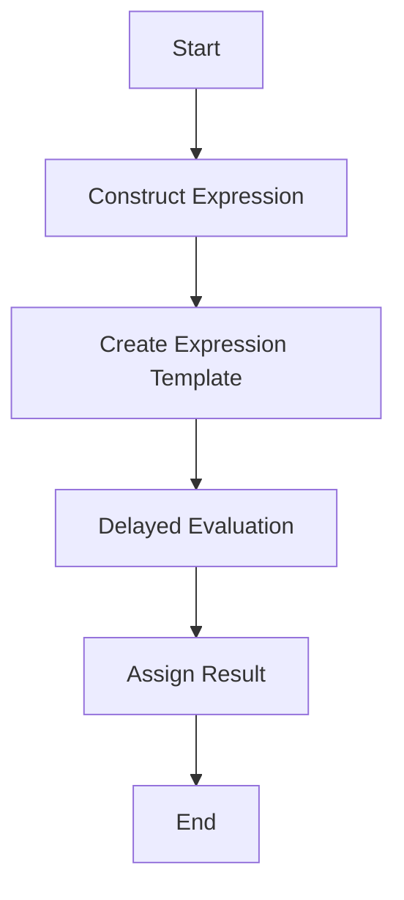

## 8.7 Expression Templates

Expression templates are a powerful C++ technique used to implement domain-specific languages (DSLs) and optimize code through delayed evaluation. This advanced programming concept allows developers to write code that is both expressive and efficient, making it particularly useful in performance-critical applications such as scientific computing and graphics processing. In this section, we'll explore the fundamentals of expression templates, their implementation, and their benefits.

### Introduction to Expression Templates

Expression templates are a C++ idiom that leverages template metaprogramming to represent expressions as types. This technique allows for the construction of complex expressions that can be evaluated at compile time, resulting in highly optimized code. Expression templates are particularly useful in scenarios where traditional operator overloading would result in inefficient code due to the creation of temporary objects.

#### Key Concepts

- **Domain-Specific Languages (DSLs):** A DSL is a specialized language tailored to a specific application domain. Expression templates enable the creation of DSLs within C++, allowing developers to write code that closely resembles mathematical notation or other domain-specific syntax.

- **Delayed Evaluation:** This refers to the postponement of expression evaluation until it is explicitly required. By delaying evaluation, expression templates can eliminate unnecessary temporary objects and reduce runtime overhead.

- **Template Metaprogramming:** A technique in C++ that uses templates to perform computations at compile time. Expression templates rely heavily on template metaprogramming to construct and manipulate expressions.

### Implementing Domain-Specific Languages (DSLs)

Expression templates provide a powerful mechanism for implementing DSLs within C++. By representing expressions as types, developers can create a syntax that closely resembles the domain-specific notation. This approach not only enhances code readability but also allows for significant performance optimizations.

#### Example: A Simple Vector DSL

Let's consider a simple example of a vector arithmetic DSL using expression templates. We'll define a `Vector` class and implement basic arithmetic operations such as addition and subtraction using expression templates.

```cpp
#include <iostream>
#include <vector>

// Forward declaration of template classes
template<typename L, typename R>
class AddExpression;

template<typename L, typename R>
class SubtractExpression;

// Base class for expression templates
template<typename E>
class Expression {
public:
    const E& self() const { return static_cast<const E&>(*this); }
};

// Vector class
class Vector : public Expression<Vector> {
    std::vector<double> data;
public:
    Vector(size_t size) : data(size) {}

    // Access operator
    double& operator[](size_t i) { return data[i]; }
    const double& operator[](size_t i) const { return data[i]; }

    size_t size() const { return data.size(); }

    // Assignment operator for expression templates
    template<typename E>
    Vector& operator=(const Expression<E>& expr) {
        const E& e = expr.self();
        for (size_t i = 0; i < size(); ++i) {
            data[i] = e[i];
        }
        return *this;
    }
};

// Addition expression template
template<typename L, typename R>
class AddExpression : public Expression<AddExpression<L, R>> {
    const L& lhs;
    const R& rhs;
public:
    AddExpression(const L& lhs, const R& rhs) : lhs(lhs), rhs(rhs) {}

    double operator[](size_t i) const { return lhs[i] + rhs[i]; }
    size_t size() const { return lhs.size(); }
};

// Subtraction expression template
template<typename L, typename R>
class SubtractExpression : public Expression<SubtractExpression<L, R>> {
    const L& lhs;
    const R& rhs;
public:
    SubtractExpression(const L& lhs, const R& rhs) : lhs(lhs), rhs(rhs) {}

    double operator[](size_t i) const { return lhs[i] - rhs[i]; }
    size_t size() const { return lhs.size(); }
};

// Operator overloads for vector arithmetic
template<typename L, typename R>
AddExpression<L, R> operator+(const Expression<L>& lhs, const Expression<R>& rhs) {
    return AddExpression<L, R>(lhs.self(), rhs.self());
}

template<typename L, typename R>
SubtractExpression<L, R> operator-(const Expression<L>& lhs, const Expression<R>& rhs) {
    return SubtractExpression<L, R>(lhs.self(), rhs.self());
}

int main() {
    Vector v1(3), v2(3), v3(3);
    v1[0] = 1.0; v1[1] = 2.0; v1[2] = 3.0;
    v2[0] = 4.0; v2[1] = 5.0; v2[2] = 6.0;

    // Use expression templates for vector arithmetic
    v3 = v1 + v2 - v1;

    for (size_t i = 0; i < v3.size(); ++i) {
        std::cout << v3[i] << " ";
    }
    std::cout << std::endl;

    return 0;
}
```

In this example, we define a `Vector` class that supports arithmetic operations using expression templates. The `AddExpression` and `SubtractExpression` classes represent addition and subtraction operations, respectively. By overloading the `+` and `-` operators, we can construct complex expressions that are evaluated efficiently.

### Optimizing Code with Expression Templates

Expression templates offer significant performance benefits by eliminating unnecessary temporary objects and reducing runtime overhead. This optimization is achieved through delayed evaluation, where expressions are constructed as types and evaluated only when needed.

#### Delayed Evaluation

Delayed evaluation is a key feature of expression templates that allows for efficient computation. By representing expressions as types, we can defer their evaluation until the result is explicitly required. This approach avoids the creation of temporary objects and minimizes memory allocations.

#### Example: Matrix Multiplication

Let's extend our previous example to include matrix multiplication using expression templates. We'll define a `Matrix` class and implement matrix multiplication using delayed evaluation.

```cpp
#include <iostream>
#include <vector>

// Forward declaration of template classes
template<typename L, typename R>
class MultiplyExpression;

// Base class for expression templates
template<typename E>
class Expression {
public:
    const E& self() const { return static_cast<const E&>(*this); }
};

// Matrix class
class Matrix : public Expression<Matrix> {
    std::vector<std::vector<double>> data;
public:
    Matrix(size_t rows, size_t cols) : data(rows, std::vector<double>(cols)) {}

    // Access operator
    double& operator()(size_t i, size_t j) { return data[i][j]; }
    const double& operator()(size_t i, size_t j) const { return data[i][j]; }

    size_t rows() const { return data.size(); }
    size_t cols() const { return data[0].size(); }

    // Assignment operator for expression templates
    template<typename E>
    Matrix& operator=(const Expression<E>& expr) {
        const E& e = expr.self();
        for (size_t i = 0; i < rows(); ++i) {
            for (size_t j = 0; j < cols(); ++j) {
                data[i][j] = e(i, j);
            }
        }
        return *this;
    }
};

// Multiplication expression template
template<typename L, typename R>
class MultiplyExpression : public Expression<MultiplyExpression<L, R>> {
    const L& lhs;
    const R& rhs;
public:
    MultiplyExpression(const L& lhs, const R& rhs) : lhs(lhs), rhs(rhs) {}

    double operator()(size_t i, size_t j) const {
        double sum = 0.0;
        for (size_t k = 0; k < lhs.cols(); ++k) {
            sum += lhs(i, k) * rhs(k, j);
        }
        return sum;
    }

    size_t rows() const { return lhs.rows(); }
    size_t cols() const { return rhs.cols(); }
};

// Operator overload for matrix multiplication
template<typename L, typename R>
MultiplyExpression<L, R> operator*(const Expression<L>& lhs, const Expression<R>& rhs) {
    return MultiplyExpression<L, R>(lhs.self(), rhs.self());
}

int main() {
    Matrix m1(2, 3), m2(3, 2), m3(2, 2);
    m1(0, 0) = 1.0; m1(0, 1) = 2.0; m1(0, 2) = 3.0;
    m1(1, 0) = 4.0; m1(1, 1) = 5.0; m1(1, 2) = 6.0;

    m2(0, 0) = 7.0; m2(0, 1) = 8.0;
    m2(1, 0) = 9.0; m2(1, 1) = 10.0;
    m2(2, 0) = 11.0; m2(2, 1) = 12.0;

    // Use expression templates for matrix multiplication
    m3 = m1 * m2;

    for (size_t i = 0; i < m3.rows(); ++i) {
        for (size_t j = 0; j < m3.cols(); ++j) {
            std::cout << m3(i, j) << " ";
        }
        std::cout << std::endl;
    }

    return 0;
}
```

In this example, we define a `Matrix` class and a `MultiplyExpression` class to represent matrix multiplication. The `operator*` overload constructs a `MultiplyExpression` object, which is evaluated only when the result is assigned to a `Matrix` object. This approach avoids the creation of temporary matrices and reduces memory allocations.

### Visualizing Expression Templates

To better understand how expression templates work, let's visualize the process of constructing and evaluating expressions using a simple flowchart.



**Figure 1: Expression Template Workflow**

In this flowchart, we start by constructing an expression using operator overloads. The expression is represented as an expression template, which is evaluated only when the result is assigned to a variable. This delayed evaluation minimizes runtime overhead and optimizes performance.

### Design Considerations

When implementing expression templates, there are several design considerations to keep in mind:

- **Complexity:** Expression templates can introduce complexity into your codebase. It's important to balance the benefits of optimization with the maintainability of your code.

- **Compile-Time Overhead:** Since expression templates rely on template metaprogramming, they can increase compile-time overhead. Ensure that your build system can handle the additional complexity.

- **Type Safety:** Expression templates can improve type safety by enforcing constraints at compile time. However, they can also introduce subtle bugs if not implemented correctly.

- **Performance:** While expression templates can significantly improve performance, they may not be suitable for all applications. Consider the specific requirements of your application before adopting this technique.

### Differences and Similarities with Other Patterns

Expression templates share similarities with other C++ idioms, such as:

- **Operator Overloading:** Both expression templates and operator overloading allow for the creation of intuitive syntax. However, expression templates offer additional performance benefits through delayed evaluation.

- **Template Metaprogramming:** Expression templates are a form of template metaprogramming, which allows for compile-time computation. Other forms of template metaprogramming include type traits and SFINAE (Substitution Failure Is Not An Error).

- **Lazy Evaluation:** Expression templates leverage lazy evaluation to optimize performance. Other patterns that use lazy evaluation include the Proxy pattern and the Flyweight pattern.

### Try It Yourself

To gain a deeper understanding of expression templates, try modifying the code examples provided in this section. Experiment with different arithmetic operations, such as division and multiplication, and observe how expression templates optimize performance.

- **Challenge:** Implement a new operation, such as element-wise multiplication, using expression templates. Compare the performance of your implementation with a traditional approach that uses temporary objects.

- **Experiment:** Modify the `Vector` and `Matrix` classes to support different data types, such as `int` or `float`. Observe how expression templates handle type conversions and optimizations.

### References and Further Reading

- [C++ Templates: The Complete Guide](https://www.amazon.com/C-Templates-Complete-Guide-2nd/dp/0321714121) by David Vandevoorde and Nicolai M. Josuttis
- [Modern C++ Design: Generic Programming and Design Patterns Applied](https://www.amazon.com/Modern-Design-Generic-Programming-Patterns/dp/0201704315) by Andrei Alexandrescu
- [C++ Programming Language](https://www.stroustrup.com/4th.html) by Bjarne Stroustrup

### Knowledge Check

Before moving on to the next section, take a moment to review the key concepts covered in this section. Consider the following questions:

- What are expression templates, and how do they optimize performance?
- How do expression templates enable the creation of domain-specific languages?
- What are the key design considerations when implementing expression templates?

### Embrace the Journey

Remember, mastering expression templates is just one step in your journey as a C++ developer. As you continue to explore advanced C++ techniques, you'll gain a deeper understanding of the language and its capabilities. Keep experimenting, stay curious, and enjoy the journey!

## Quiz Time!



### What is the primary purpose of expression templates in C++?

- [x] To optimize code by eliminating temporary objects
- [ ] To simplify syntax for beginners
- [ ] To replace all forms of operator overloading
- [ ] To provide a graphical user interface

> **Explanation:** Expression templates optimize code by eliminating temporary objects and reducing runtime overhead through delayed evaluation.

### How do expression templates enable the creation of domain-specific languages (DSLs)?

- [x] By representing expressions as types that resemble domain-specific notation
- [ ] By using macros to define new syntax
- [ ] By converting C++ code into a different programming language
- [ ] By restricting the use of templates

> **Explanation:** Expression templates allow developers to create syntax that closely resembles domain-specific notation, enhancing code readability and performance.

### What is delayed evaluation in the context of expression templates?

- [x] Postponing the evaluation of expressions until the result is explicitly required
- [ ] Evaluating expressions immediately at runtime
- [ ] Using a separate thread for evaluation
- [ ] Ignoring evaluation altogether

> **Explanation:** Delayed evaluation refers to postponing the evaluation of expressions until the result is explicitly required, minimizing runtime overhead.

### Which of the following is a potential drawback of using expression templates?

- [x] Increased compile-time overhead
- [ ] Decreased code readability
- [ ] Lack of support for operator overloading
- [ ] Inability to use templates

> **Explanation:** Expression templates can increase compile-time overhead due to their reliance on template metaprogramming.

### In the provided vector arithmetic example, what does the `AddExpression` class represent?

- [x] An addition operation between two vectors
- [ ] A subtraction operation between two vectors
- [ ] A multiplication operation between two vectors
- [ ] A division operation between two vectors

> **Explanation:** The `AddExpression` class represents an addition operation between two vectors, constructed using expression templates.

### What is a key benefit of using expression templates for matrix multiplication?

- [x] Avoiding the creation of temporary matrices
- [ ] Simplifying the syntax for matrix operations
- [ ] Allowing matrices to be used as function arguments
- [ ] Enabling matrices to store different data types

> **Explanation:** Expression templates avoid the creation of temporary matrices, optimizing performance by reducing memory allocations.

### How do expression templates improve type safety?

- [x] By enforcing constraints at compile time
- [ ] By allowing dynamic type checking
- [ ] By using macros for type definitions
- [ ] By eliminating the need for type declarations

> **Explanation:** Expression templates improve type safety by enforcing constraints at compile time, reducing the likelihood of runtime errors.

### Which of the following is a similarity between expression templates and operator overloading?

- [x] Both allow for the creation of intuitive syntax
- [ ] Both eliminate the need for templates
- [ ] Both require the use of macros
- [ ] Both are limited to arithmetic operations

> **Explanation:** Both expression templates and operator overloading allow for the creation of intuitive syntax, enhancing code readability.

### What is a common use case for expression templates?

- [x] Scientific computing and graphics processing
- [ ] Web development and UI design
- [ ] Database management and querying
- [ ] Network programming and socket communication

> **Explanation:** Expression templates are commonly used in performance-critical applications such as scientific computing and graphics processing.

### True or False: Expression templates can only be used with arithmetic operations.

- [ ] True
- [x] False

> **Explanation:** Expression templates can be used for a wide range of operations, not limited to arithmetic, including logical and relational operations.


