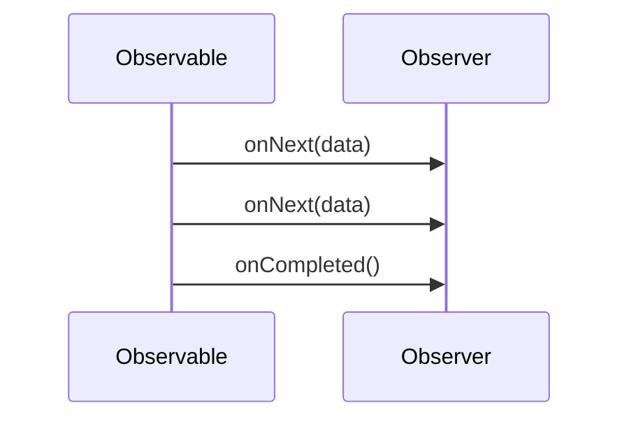

## 8.8 Functional Reactive Programming

Functional Reactive Programming (FRP) is a programming paradigm for reactive programming using the building blocks of functional programming. It is particularly useful for handling asynchronous data streams and event-driven applications. In this section, we will delve into the core concepts of FRP, explore how to implement reactive streams in C++ using RxCpp, and understand the roles of observables and observers.

### Introduction to Functional Reactive Programming

Functional Reactive Programming combines the principles of functional programming with reactive programming. It allows developers to work with asynchronous data streams and propagate changes automatically. This paradigm is particularly powerful for applications that require dynamic and responsive user interfaces, real-time data processing, and complex event handling.

#### Key Concepts of Reactive Programming

1. **Data Streams**: In FRP, data is represented as streams that can be manipulated using functional operators. These streams can be continuous or discrete, representing events over time.

2. **Observables**: Observables are the core abstraction in FRP. They represent a sequence of data or events that can be observed and reacted to.

3. **Observers**: Observers subscribe to observables to receive data or event notifications. They define how to handle each piece of data emitted by the observable.

4. **Operators**: Operators are functions that allow you to transform, filter, combine, and manipulate data streams.

5. **Schedulers**: Schedulers control the execution context of observables, enabling concurrency and parallelism.

### Implementing Reactive Streams in C++ with RxCpp

RxCpp is a library that brings the power of Reactive Extensions (Rx) to C++. It provides a rich set of operators and abstractions for working with asynchronous data streams. Let's explore how to use RxCpp to implement reactive streams in C++.

#### Setting Up RxCpp

To get started with RxCpp, you need to include the library in your project. You can install RxCpp using a package manager like vcpkg or Conan, or you can download it from its [GitHub repository](https://github.com/ReactiveX/RxCpp).

```cpp
#include <rxcpp/rx.hpp>

namespace rx = rxcpp;
namespace rxu = rxcpp::util;
```

#### Creating Observables

An observable is a data source that emits items over time. In RxCpp, you can create observables using factory functions like `rx::observable<>::create` or from existing data structures.

```cpp
auto values = rx::observable<>::create<int>(
    [](rx::subscriber<int> s){
        s.on_next(1);
        s.on_next(2);
        s.on_next(3);
        s.on_completed();
    }
);
```

In this example, we create an observable that emits three integer values and then completes.

#### Subscribing to Observables

To receive data from an observable, you need to subscribe an observer to it. The observer defines how to handle each emitted item, errors, and completion.

```cpp
values.subscribe(
    [](int v) { std::cout << "OnNext: " << v << std::endl; },
    []() { std::cout << "OnCompleted" << std::endl; }
);
```

This code subscribes to the `values` observable and prints each emitted value to the console.

#### Using Operators

Operators are used to transform and manipulate data streams. RxCpp provides a wide range of operators, such as `map`, `filter`, `merge`, and `combine_latest`.

```cpp
auto transformed = values.map([](int v) { return v * 10; });

transformed.subscribe(
    [](int v) { std::cout << "Transformed OnNext: " << v << std::endl; },
    []() { std::cout << "Transformed OnCompleted" << std::endl; }
);
```

Here, we use the `map` operator to multiply each emitted value by 10.

### Observables and Observers

Observables and observers are the fundamental components of FRP. Let's explore their roles and how they interact in a reactive system.

#### Observables

Observables represent a stream of data or events. They can emit zero or more items and can complete or error out. Observables are lazy, meaning they don't emit items until an observer subscribes to them.

##### Types of Observables

1. **Cold Observables**: These observables start emitting items only when an observer subscribes. Each observer receives the full sequence of items from the start.

2. **Hot Observables**: These observables emit items regardless of whether there are subscribers. Observers receive only the items emitted after they subscribe.

#### Observers

Observers consume data emitted by observables. They define three main handlers:

1. **OnNext**: Handles each emitted item.
2. **OnError**: Handles any errors that occur.
3. **OnCompleted**: Handles the completion of the observable sequence.

```cpp
auto observer = rx::make_subscriber<int>(
    [](int v) { std::cout << "Observer OnNext: " << v << std::endl; },
    [](std::exception_ptr ep) { std::cout << "Observer OnError" << std::endl; },
    []() { std::cout << "Observer OnCompleted" << std::endl; }
);

values.subscribe(observer);
```

### Advanced Concepts in RxCpp

RxCpp provides advanced features for handling complex scenarios in reactive programming.

#### Combining Observables

You can combine multiple observables using operators like `merge`, `zip`, and `combine_latest`.

```cpp
auto obs1 = rx::observable<>::just(1, 2, 3);
auto obs2 = rx::observable<>::just(4, 5, 6);

auto combined = obs1.concat(obs2);

combined.subscribe(
    [](int v) { std::cout << "Combined OnNext: " << v << std::endl; },
    []() { std::cout << "Combined OnCompleted" << std::endl; }
);
```

#### Error Handling

RxCpp provides operators for error handling, such as `catch` and `retry`.

```cpp
auto errorObservable = rx::observable<>::create<int>(
    [](rx::subscriber<int> s){
        s.on_next(1);
        s.on_error(std::make_exception_ptr(std::runtime_error("Error")));
    }
);

errorObservable
    .catch_error([](std::exception_ptr ep) {
        return rx::observable<>::just(0);
    })
    .subscribe(
        [](int v) { std::cout << "ErrorHandled OnNext: " << v << std::endl; },
        []() { std::cout << "ErrorHandled OnCompleted" << std::endl; }
    );
```

#### Schedulers and Concurrency

Schedulers in RxCpp control the execution context of observables. They enable concurrency and parallelism.

```cpp
auto values = rx::observable<>::range(1, 5)
    .observe_on(rx::observe_on_event_loop());

values.subscribe(
    [](int v) { std::cout << "Scheduled OnNext: " << v << std::endl; },
    []() { std::cout << "Scheduled OnCompleted" << std::endl; }
);
```

### Visualizing Reactive Streams

To better understand the flow of data in reactive streams, let's visualize the interaction between observables and observers using Mermaid.js.



This diagram illustrates the sequence of events between an observable and an observer, showing how data flows from the observable to the observer.

### Try It Yourself

Now that we've covered the basics of functional reactive programming in C++, it's time to experiment with the concepts. Try modifying the code examples to:

- Create a new observable that emits a sequence of strings.
- Use the `filter` operator to emit only even numbers from a sequence.
- Implement error handling for an observable that might throw exceptions.

### References and Further Reading

- [RxCpp GitHub Repository](https://github.com/ReactiveX/RxCpp)
- [ReactiveX Documentation](http://reactivex.io/documentation/observable.html)
- [Functional Reactive Programming Overview](https://en.wikipedia.org/wiki/Functional_reactive_programming)

### Knowledge Check

Before we conclude, let's reinforce what we've learned with a few questions:

- What is the main purpose of functional reactive programming?
- How do observables and observers interact in a reactive system?
- What role do operators play in RxCpp?

### Embrace the Journey

Remember, mastering functional reactive programming is a journey. As you continue to explore and experiment with these concepts, you'll gain a deeper understanding of how to build responsive and efficient applications. Stay curious, keep experimenting, and enjoy the process!

## Quiz Time!



### What is the primary purpose of Functional Reactive Programming?

- [x] To handle asynchronous data streams and event-driven applications.
- [ ] To improve memory management in C++.
- [ ] To simplify syntax in C++.
- [ ] To enhance security in software design.

> **Explanation:** Functional Reactive Programming is designed to handle asynchronous data streams and event-driven applications by combining functional programming principles with reactive programming.

### In RxCpp, what is an observable?

- [x] A data source that emits items over time.
- [ ] A function that processes data.
- [ ] A variable that stores data.
- [ ] A class that manages memory.

> **Explanation:** An observable in RxCpp is a data source that emits items over time, which can be observed and reacted to by observers.

### What is the role of an observer in a reactive system?

- [x] To consume data emitted by observables.
- [ ] To generate new data streams.
- [ ] To manage memory allocation.
- [ ] To handle network communication.

> **Explanation:** An observer in a reactive system consumes data emitted by observables and defines how to handle each piece of data.

### Which operator in RxCpp is used to transform data streams?

- [x] map
- [ ] filter
- [ ] merge
- [ ] concat

> **Explanation:** The `map` operator in RxCpp is used to transform data streams by applying a function to each emitted item.

### How do you handle errors in RxCpp?

- [x] Using operators like `catch` and `retry`.
- [ ] By using try-catch blocks.
- [ ] By ignoring them.
- [ ] By logging them to a file.

> **Explanation:** In RxCpp, errors are handled using operators like `catch` and `retry`, which allow you to define how to handle errors in a reactive stream.

### What is a cold observable?

- [x] An observable that starts emitting items only when an observer subscribes.
- [ ] An observable that emits items regardless of subscribers.
- [ ] An observable that never emits items.
- [ ] An observable that only emits errors.

> **Explanation:** A cold observable starts emitting items only when an observer subscribes, ensuring each observer receives the full sequence of items from the start.

### What is the purpose of schedulers in RxCpp?

- [x] To control the execution context of observables.
- [ ] To manage memory allocation.
- [ ] To handle network communication.
- [ ] To generate new data streams.

> **Explanation:** Schedulers in RxCpp control the execution context of observables, enabling concurrency and parallelism in reactive streams.

### What does the `filter` operator do in RxCpp?

- [x] Emits only items that satisfy a specified condition.
- [ ] Transforms each emitted item.
- [ ] Combines multiple observables.
- [ ] Handles errors in the stream.

> **Explanation:** The `filter` operator in RxCpp emits only items that satisfy a specified condition, allowing you to filter data streams based on criteria.

### What is the difference between hot and cold observables?

- [x] Hot observables emit items regardless of subscribers, while cold observables start emitting when subscribed.
- [ ] Hot observables are faster than cold observables.
- [ ] Cold observables are used for error handling.
- [ ] Hot observables are used for network communication.

> **Explanation:** Hot observables emit items regardless of subscribers, while cold observables start emitting items only when an observer subscribes.

### True or False: Observables in RxCpp are eager by default.

- [ ] True
- [x] False

> **Explanation:** Observables in RxCpp are lazy by default, meaning they don't emit items until an observer subscribes to them.


