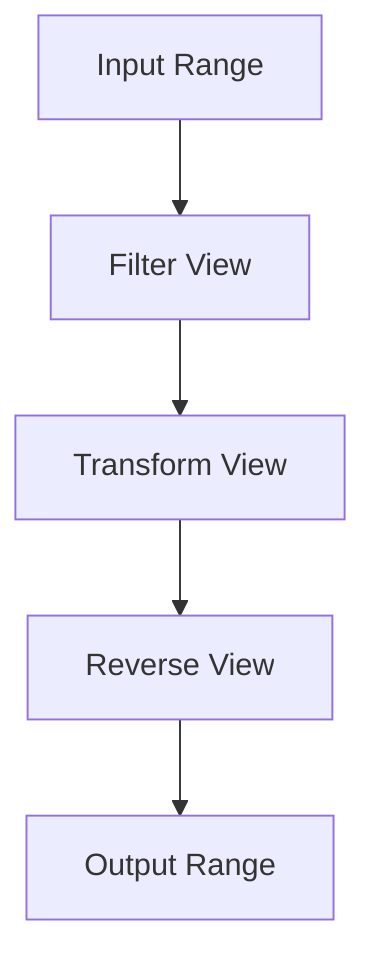

## 8.9 Range Library (C++20)

The C++20 Range Library introduces a powerful paradigm shift in how we handle sequences of data. By leveraging lazy evaluation and composing operations, the Range Library enhances the expressiveness and efficiency of C++ code. In this section, we'll explore the core concepts of the Range Library, delve into lazy evaluation, and demonstrate how to compose operations using ranges. We'll also cover writing custom views and actions to extend the functionality of the Range Library.

### Introduction to the Range Library

The Range Library in C++20 is a significant addition to the Standard Library, designed to provide a more flexible and expressive way to work with sequences of data. It builds upon the existing iterator-based approach, offering a more intuitive and powerful interface for handling collections.

#### Key Concepts

- **Ranges**: A range is an abstraction that represents a sequence of elements. It can be thought of as a pair of iterators, but with additional capabilities.
- **Views**: Views are lightweight, non-owning adaptors that transform or filter ranges without modifying the underlying data.
- **Actions**: Actions are operations that can be applied to ranges to produce new ranges or results.

### Lazy Evaluation in Ranges

Lazy evaluation is a core concept in the Range Library, allowing operations to be deferred until the result is actually needed. This can lead to significant performance improvements, as unnecessary computations are avoided.

#### Benefits of Lazy Evaluation

- **Efficiency**: By deferring computations, lazy evaluation reduces the overhead of unnecessary operations.
- **Composability**: Lazy evaluation allows for the composition of complex operations without immediate execution, enabling more readable and maintainable code.
- **Resource Management**: It minimizes resource usage by only performing operations when necessary.

#### Example: Lazy Evaluation with Ranges

Let's consider an example where we use lazy evaluation to filter and transform a sequence of numbers:

```cpp
#include <iostream>
#include <ranges>
#include <vector>

int main() {
    std::vector<int> numbers = {1, 2, 3, 4, 5, 6, 7, 8, 9, 10};

    auto even_numbers = numbers | std::views::filter([](int n) { return n % 2 == 0; })
                                | std::views::transform([](int n) { return n * n; });

    for (int n : even_numbers) {
        std::cout << n << " ";
    }
    // Output: 4 16 36 64 100

    return 0;
}
```

In this example, the `filter` and `transform` operations are applied lazily. The computations are only performed when the elements are accessed in the loop.

### Composing Operations with Ranges

The Range Library allows for the seamless composition of operations, enabling developers to build complex data processing pipelines with ease.

#### Composing with Views

Views in the Range Library are composable, meaning you can chain multiple view operations together to create a pipeline of transformations.

##### Example: Composing Views

```cpp
#include <iostream>
#include <ranges>
#include <vector>

int main() {
    std::vector<int> data = {1, 2, 3, 4, 5, 6, 7, 8, 9, 10};

    auto processed_data = data | std::views::filter([](int x) { return x % 2 == 0; })
                               | std::views::transform([](int x) { return x * x; })
                               | std::views::reverse;

    for (int x : processed_data) {
        std::cout << x << " ";
    }
    // Output: 100 64 36 16 4

    return 0;
}
```

In this example, we compose three operations: filtering even numbers, squaring them, and then reversing the sequence. The operations are applied in a lazy manner, ensuring efficiency.

#### Writing Custom Views and Actions

The Range Library is extensible, allowing you to define custom views and actions to suit your specific needs.

##### Creating Custom Views

To create a custom view, you need to define a class that models the view interface. This involves implementing the necessary iterator and sentinel types.

###### Example: Custom View

```cpp
#include <iostream>
#include <ranges>
#include <vector>

template <typename Range>
class custom_view : public std::ranges::view_interface<custom_view<Range>> {
public:
    custom_view(Range& range) : range_(range) {}

    auto begin() { return std::begin(range_); }
    auto end() { return std::end(range_); }

private:
    Range& range_;
};

int main() {
    std::vector<int> numbers = {1, 2, 3, 4, 5};

    custom_view view(numbers);

    for (int n : view) {
        std::cout << n << " ";
    }
    // Output: 1 2 3 4 5

    return 0;
}
```

In this example, we define a simple custom view that wraps a range. The `custom_view` class inherits from `std::ranges::view_interface`, which provides the necessary interface for a view.

##### Creating Custom Actions

Custom actions can be defined to extend the functionality of the Range Library. Actions are operations that can be applied to ranges to produce new ranges or results.

###### Example: Custom Action

```cpp
#include <iostream>
#include <ranges>
#include <vector>

template <typename Range>
class custom_action {
public:
    custom_action(Range& range) : range_(range) {}

    void apply() {
        for (auto& n : range_) {
            n *= 2;
        }
    }

private:
    Range& range_;
};

int main() {
    std::vector<int> numbers = {1, 2, 3, 4, 5};

    custom_action action(numbers);
    action.apply();

    for (int n : numbers) {
        std::cout << n << " ";
    }
    // Output: 2 4 6 8 10

    return 0;
}
```

In this example, we define a custom action that doubles each element in the range. The `custom_action` class provides an `apply` method that performs the operation.

### Visualizing Range Operations

To better understand how range operations work, let's visualize the process of composing operations using a flowchart.



**Figure 1**: Visualizing the composition of range operations. The input range is filtered, transformed, and reversed to produce the output range.

### Try It Yourself

Now that we've covered the basics of the Range Library, try experimenting with the code examples. Here are some suggestions:

- Modify the filter condition to select odd numbers instead of even numbers.
- Add an additional transformation to the pipeline, such as adding a constant value to each element.
- Create a custom view that skips every other element in the range.

### References and Further Reading

For more information on the C++20 Range Library, consider exploring the following resources:

- [C++ Reference: Ranges](https://en.cppreference.com/w/cpp/ranges)
- [The C++ Programming Language by Bjarne Stroustrup](https://www.stroustrup.com/)
- [Effective Modern C++ by Scott Meyers](https://www.oreilly.com/library/view/effective-modern-c/9781491908419/)

### Knowledge Check

Before we wrap up, let's review some key concepts:

- What is lazy evaluation, and how does it benefit range operations?
- How can you compose multiple operations using views in the Range Library?
- What are custom views and actions, and how can they be used to extend the Range Library?

### Embrace the Journey

Remember, mastering the Range Library is just one step in your journey as a C++ developer. As you continue to explore the capabilities of C++20, you'll discover new ways to write efficient and expressive code. Keep experimenting, stay curious, and enjoy the journey!

## Quiz Time!



### What is the primary benefit of lazy evaluation in the C++20 Range Library?

- [x] It defers computations until results are needed, improving efficiency.
- [ ] It allows for immediate execution of operations.
- [ ] It simplifies the syntax of range operations.
- [ ] It automatically parallelizes computations.

> **Explanation:** Lazy evaluation defers computations until the results are needed, which can lead to performance improvements by avoiding unnecessary operations.

### Which of the following is a key feature of views in the C++20 Range Library?

- [x] Views are lightweight, non-owning adaptors.
- [ ] Views modify the underlying data.
- [ ] Views are heavy, owning adaptors.
- [ ] Views require copying the entire range.

> **Explanation:** Views are lightweight, non-owning adaptors that transform or filter ranges without modifying the underlying data.

### How can you compose multiple operations in the C++20 Range Library?

- [x] By chaining view operations.
- [ ] By using macros.
- [ ] By writing separate functions for each operation.
- [ ] By using inheritance.

> **Explanation:** You can compose multiple operations by chaining view operations, creating a pipeline of transformations.

### What is a custom view in the C++20 Range Library?

- [x] A class that models the view interface to adapt ranges.
- [ ] A function that modifies the underlying data.
- [ ] A built-in view provided by the standard library.
- [ ] A macro that defines a new range operation.

> **Explanation:** A custom view is a class that models the view interface, allowing you to adapt ranges to suit specific needs.

### What is the role of actions in the C++20 Range Library?

- [x] Actions are operations applied to ranges to produce new ranges or results.
- [ ] Actions are used to modify the syntax of range operations.
- [ ] Actions are built-in views provided by the standard library.
- [ ] Actions are macros that define new range operations.

> **Explanation:** Actions are operations that can be applied to ranges to produce new ranges or results, extending the functionality of the Range Library.

### Which of the following is an example of a custom action?

- [x] A class that doubles each element in a range.
- [ ] A view that filters even numbers.
- [ ] A built-in function that reverses a range.
- [ ] A macro that defines a new range operation.

> **Explanation:** A custom action is a class that performs a specific operation on a range, such as doubling each element.

### What is the purpose of the `std::ranges::view_interface`?

- [x] It provides the necessary interface for a custom view.
- [ ] It modifies the underlying data of a range.
- [ ] It is a built-in view provided by the standard library.
- [ ] It defines a new range operation.

> **Explanation:** The `std::ranges::view_interface` provides the necessary interface for a custom view, allowing you to define new views.

### How does lazy evaluation affect resource management?

- [x] It minimizes resource usage by deferring operations until necessary.
- [ ] It increases resource usage by performing operations immediately.
- [ ] It has no impact on resource management.
- [ ] It requires additional resources for deferred operations.

> **Explanation:** Lazy evaluation minimizes resource usage by deferring operations until they are necessary, reducing overhead.

### What is the output of the following code snippet?

```cpp
std::vector<int> numbers = {1, 2, 3, 4, 5};
auto even_numbers = numbers | std::views::filter([](int n) { return n % 2 == 0; });
for (int n : even_numbers) {
    std::cout << n << " ";
}
```

- [x] 2 4
- [ ] 1 3 5
- [ ] 1 2 3 4 5
- [ ] 2 4 6 8 10

> **Explanation:** The code filters the even numbers from the vector, resulting in the output "2 4".

### True or False: The C++20 Range Library requires copying the entire range for each operation.

- [ ] True
- [x] False

> **Explanation:** False. The C++20 Range Library uses views, which are lightweight, non-owning adaptors that do not require copying the entire range for each operation.


