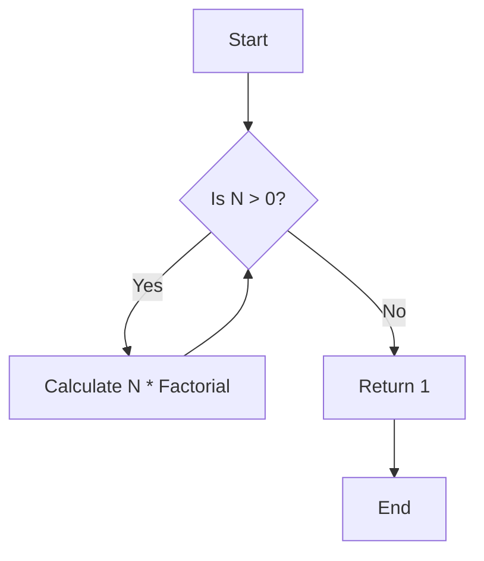
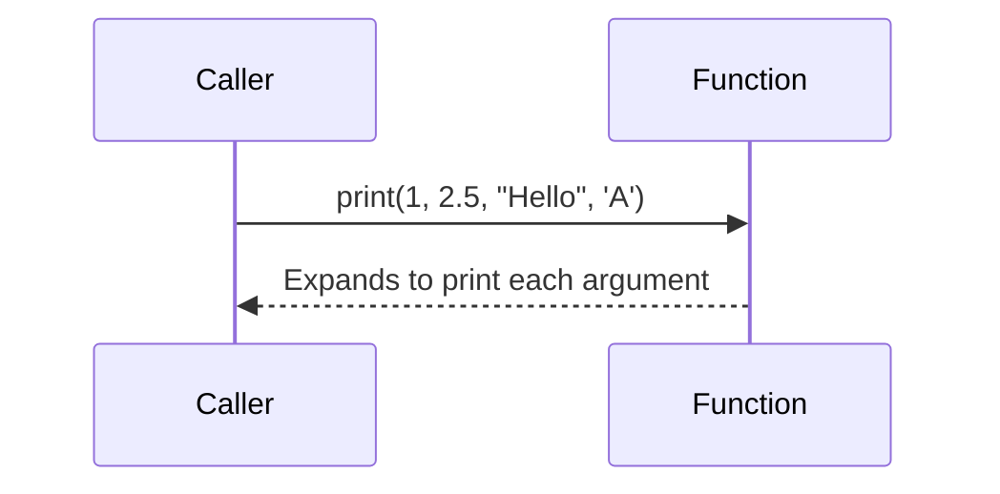
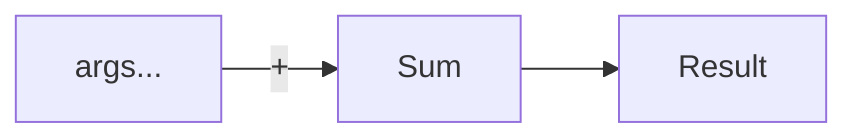

## 9.1 Advanced Template Techniques

In the realm of C++ programming, templates are a powerful feature that allows developers to write generic and reusable code. As we delve into advanced template techniques, we will explore the intricacies of template metaprogramming, variadic templates, and fold expressions. These techniques enable us to create efficient, type-safe, and highly reusable code structures, paving the way for sophisticated software design.

### Template Metaprogramming

Template metaprogramming is a technique in C++ that leverages the template system to perform computations at compile time. This can lead to more efficient code by offloading work from runtime to compile time. It is a powerful tool for creating generic libraries and frameworks.

#### Understanding Template Metaprogramming

Template metaprogramming involves writing code that is executed by the compiler rather than the runtime environment. This allows for the creation of highly optimized and type-safe code. The key to template metaprogramming is the use of recursive templates and specialization.

##### Example: Compile-Time Factorial Calculation

Let's consider a simple example of calculating a factorial using template metaprogramming:

```cpp
template<int N>
struct Factorial {
    static const int value = N * Factorial<N - 1>::value;
};

template<>
struct Factorial<0> {
    static const int value = 1;
};

int main() {
    std::cout << "Factorial of 5: " << Factorial<5>::value << std::endl;
    return 0;
}
```

In this example, the `Factorial` struct recursively calculates the factorial of a number at compile time. The base case is specialized for `N = 0`, which returns 1.

#### Key Concepts in Template Metaprogramming

- **Recursion**: Templates can be recursively instantiated to perform calculations.
- **Specialization**: Allows for defining specific behavior for particular template arguments.
- **Type Traits**: Utilities that provide information about types at compile time.

##### Type Traits Example

Type traits are an essential part of template metaprogramming. They allow us to query and manipulate types at compile time.

```cpp
#include <type_traits>

template<typename T>
void checkType() {
    if (std::is_integral<T>::value) {
        std::cout << "Type is integral." << std::endl;
    } else {
        std::cout << "Type is not integral." << std::endl;
    }
}

int main() {
    checkType<int>();    // Output: Type is integral.
    checkType<double>(); // Output: Type is not integral.
    return 0;
}
```

In this example, `std::is_integral` is a type trait that checks if a type is an integral type.

### Variadic Templates

Variadic templates are a feature introduced in C++11 that allows templates to accept an arbitrary number of template arguments. This is particularly useful for creating flexible and generic functions or classes.

#### Understanding Variadic Templates

Variadic templates use template parameter packs to handle multiple template arguments. A parameter pack can be expanded using the ellipsis (`...`) syntax.

##### Example: Variadic Function Template

Let's look at a simple example of a variadic function template:

```cpp
#include <iostream>

template<typename... Args>
void print(Args... args) {
    (std::cout << ... << args) << std::endl;
}

int main() {
    print(1, 2.5, "Hello", 'A');
    return 0;
}
```

In this example, the `print` function can accept any number of arguments of any type and print them to the console. The ellipsis syntax is used to expand the parameter pack.

#### Key Concepts in Variadic Templates

- **Parameter Packs**: A mechanism to handle multiple template parameters.
- **Pack Expansion**: The process of expanding a parameter pack into individual arguments.

##### Variadic Class Template Example

Variadic templates can also be used with class templates:

```cpp
#include <tuple>

template<typename... Args>
class MyTuple {
public:
    MyTuple(Args... args) : data(args...) {}

    void print() {
        printTuple(data, std::index_sequence_for<Args...>{});
    }

private:
    std::tuple<Args...> data;

    template<std::size_t... Is>
    void printTuple(const std::tuple<Args...>& t, std::index_sequence<Is...>) {
        ((std::cout << std::get<Is>(t) << " "), ...) << std::endl;
    }
};

int main() {
    MyTuple<int, double, std::string> myTuple(1, 2.5, "Hello");
    myTuple.print();
    return 0;
}
```

In this example, `MyTuple` is a variadic class template that stores its arguments in a `std::tuple`. The `print` function uses pack expansion to print each element of the tuple.

### Fold Expressions

Fold expressions, introduced in C++17, provide a concise way to apply binary operators to parameter packs. They simplify the process of reducing a parameter pack to a single value.

#### Understanding Fold Expressions

Fold expressions allow us to apply an operator to a parameter pack, either from left to right or right to left. There are four types of fold expressions:

- **Unary left fold**: `( ... op pack )`
- **Unary right fold**: `( pack op ... )`
- **Binary left fold**: `( init op ... op pack )`
- **Binary right fold**: `( pack op ... op init )`

##### Example: Sum of Numbers

Let's see an example of using a fold expression to calculate the sum of numbers:

```cpp
#include <iostream>

template<typename... Args>
auto sum(Args... args) {
    return (args + ...);
}

int main() {
    std::cout << "Sum: " << sum(1, 2, 3, 4, 5) << std::endl;
    return 0;
}
```

In this example, the `sum` function uses a unary left fold to add all the arguments together.

#### Key Concepts in Fold Expressions

- **Operator Application**: Fold expressions apply an operator to each element in a parameter pack.
- **Initial Value**: Binary folds allow specifying an initial value for the operation.

##### Fold Expression with Initial Value

Let's modify the previous example to include an initial value:

```cpp
template<typename... Args>
auto sumWithInit(int init, Args... args) {
    return (init + ... + args);
}

int main() {
    std::cout << "Sum with initial value: " << sumWithInit(10, 1, 2, 3, 4, 5) << std::endl;
    return 0;
}
```

Here, `sumWithInit` uses a binary left fold with an initial value of 10.

### Visualizing Template Techniques

To better understand these concepts, let's visualize how template metaprogramming, variadic templates, and fold expressions work together.

#### Template Metaprogramming Flowchart



This flowchart represents the recursive process of calculating a factorial using template metaprogramming.

#### Variadic Template Expansion



This sequence diagram illustrates how a variadic template function expands its arguments.

#### Fold Expression Process



This graph shows the process of applying a fold expression to sum a parameter pack.

### Try It Yourself

Experiment with the code examples provided above. Try modifying the `Factorial` template to calculate other mathematical functions, such as Fibonacci numbers. For variadic templates, create a function that concatenates strings. For fold expressions, try using different operators, such as multiplication or logical AND.

### References and Links

- [C++ Templates: The Complete Guide](https://www.amazon.com/C-Templates-Complete-Guide-2nd/dp/0321714121) by David Vandevoorde, Nicolai M. Josuttis, and Doug Gregor.
- [cppreference.com](https://en.cppreference.com/w/) for detailed documentation on C++ templates and metaprogramming.
- [C++ Standards Committee](https://isocpp.org/std/the-standard) for the latest updates on C++ standards.

### Knowledge Check

- What is template metaprogramming, and how does it differ from runtime programming?
- How do variadic templates enhance the flexibility of template functions and classes?
- What are fold expressions, and how do they simplify operations on parameter packs?

### Embrace the Journey

Remember, mastering advanced template techniques in C++ is a journey. As you explore these concepts, you'll gain a deeper understanding of how to write efficient and reusable code. Keep experimenting, stay curious, and enjoy the process of discovery!

## Quiz Time!



### What is the primary advantage of template metaprogramming?

- [x] Compile-time computation
- [ ] Runtime efficiency
- [ ] Easier debugging
- [ ] Simpler syntax

> **Explanation:** Template metaprogramming allows computations to be performed at compile time, reducing runtime overhead.

### Which feature allows templates to accept an arbitrary number of arguments?

- [ ] Fold expressions
- [x] Variadic templates
- [ ] Type traits
- [ ] Template specialization

> **Explanation:** Variadic templates allow functions and classes to accept a variable number of template parameters.

### What is a fold expression used for?

- [ ] Expanding parameter packs
- [x] Applying operators to parameter packs
- [ ] Specializing templates
- [ ] Defining type traits

> **Explanation:** Fold expressions apply a binary operator to a parameter pack, reducing it to a single value.

### How does a unary left fold expression operate?

- [x] From left to right
- [ ] From right to left
- [ ] With an initial value
- [ ] Without an operator

> **Explanation:** A unary left fold expression applies an operator from left to right across a parameter pack.

### What is a key benefit of using type traits in template metaprogramming?

- [x] Compile-time type information
- [ ] Runtime type checking
- [ ] Simplified syntax
- [ ] Faster compilation

> **Explanation:** Type traits provide information about types at compile time, enabling more flexible template programming.

### Which C++ version introduced variadic templates?

- [ ] C++03
- [x] C++11
- [ ] C++14
- [ ] C++17

> **Explanation:** Variadic templates were introduced in C++11, allowing for more flexible template definitions.

### What does the ellipsis (`...`) syntax in variadic templates represent?

- [x] Parameter pack expansion
- [ ] Template specialization
- [ ] Type deduction
- [ ] Function overloading

> **Explanation:** The ellipsis syntax is used to expand a parameter pack into individual arguments.

### In a fold expression, what does the term "initial value" refer to?

- [ ] The first element of the pack
- [x] A starting value for the operation
- [ ] The result of the fold
- [ ] The operator used

> **Explanation:** An initial value is used in binary folds to provide a starting point for the operation.

### What is the purpose of template specialization?

- [x] Defining specific behavior for certain template arguments
- [ ] Expanding parameter packs
- [ ] Applying operators to packs
- [ ] Providing runtime type information

> **Explanation:** Template specialization allows for defining specific behavior for particular template arguments.

### True or False: Fold expressions can only be used with arithmetic operators.

- [ ] True
- [x] False

> **Explanation:** Fold expressions can be used with any binary operator, not just arithmetic ones.


