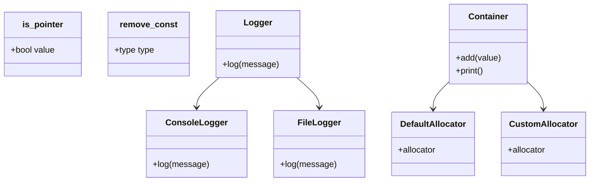

## 9.2 Traits and Policies

In the realm of C++ programming, the concepts of traits and policies are pivotal for creating flexible, efficient, and reusable code. These paradigms allow developers to make decisions at compile time, optimizing performance and enhancing type safety. In this section, we will delve into the intricacies of implementing type traits and policies, explore the `std::type_traits` library, and understand how these tools can be leveraged for compile-time decisions.

### Introduction to Traits and Policies

Traits and policies in C++ serve as a mechanism to encode information about types and to control behavior through templates. They are instrumental in generic programming, allowing developers to write code that is both type-agnostic and highly optimized.

#### Traits

Traits are a form of metaprogramming that provide a way to associate properties or characteristics with types. They are typically implemented as template structures or classes that define static members or types. Traits enable compile-time introspection and decision-making, allowing the compiler to optimize code paths based on type information.

#### Policies

Policies, on the other hand, are a design pattern used to configure or modify the behavior of a class or function. They are often implemented using template parameters, allowing for flexible and reusable code. Policies enable the customization of algorithms or data structures without altering their core logic.

### Implementing Type Traits

Type traits are a fundamental aspect of C++ metaprogramming. They allow developers to query and manipulate type information at compile time. Let's explore how to implement type traits and use them effectively.

#### Basic Type Traits

A simple type trait can be implemented using a template structure. Consider the following example, which checks if a type is a pointer:

```cpp
template<typename T>
struct is_pointer {
    static const bool value = false;
};

template<typename T>
struct is_pointer<T*> {
    static const bool value = true;
};

// Usage
int main() {
    std::cout << std::boolalpha;
    std::cout << "is_pointer<int>: " << is_pointer<int>::value << std::endl; // false
    std::cout << "is_pointer<int*>: " << is_pointer<int*>::value << std::endl; // true
    return 0;
}
```

In this example, we define a primary template `is_pointer` that defaults to `false`. We then specialize the template for pointer types, setting the `value` to `true`. This allows us to determine if a given type is a pointer at compile time.

#### Advanced Type Traits

For more complex scenarios, type traits can be used to perform operations such as type transformations. Consider a trait that removes the const qualifier from a type:

```cpp
template<typename T>
struct remove_const {
    using type = T;
};

template<typename T>
struct remove_const<const T> {
    using type = T;
};

// Usage
int main() {
    std::cout << std::boolalpha;
    std::cout << "is_same<int, remove_const<const int>::type>: "
              << std::is_same<int, remove_const<const int>::type>::value << std::endl; // true
    return 0;
}
```

Here, the `remove_const` trait defines a `type` member that represents the non-const version of the input type. This trait can be used to strip const qualifiers from types at compile time.

### Using Traits for Compile-Time Decisions

Traits are particularly useful for making decisions at compile time, allowing the compiler to generate optimized code paths based on type information.

#### Compile-Time If-Else

The `std::conditional` type trait can be used to implement a compile-time if-else construct. This allows for selecting different types based on a condition:

```cpp
#include <type_traits>

template<bool B, typename T, typename F>
using conditional_t = typename std::conditional<B, T, F>::type;

// Usage
int main() {
    using type = conditional_t<(sizeof(int) > 2), long, short>;
    std::cout << "Selected type size: " << sizeof(type) << std::endl;
    return 0;
}
```

In this example, `conditional_t` selects `long` if the size of `int` is greater than 2, otherwise it selects `short`. This decision is made at compile time, resulting in optimized code.

#### SFINAE (Substitution Failure Is Not An Error)

SFINAE is a powerful feature of C++ templates that allows for the graceful handling of template instantiation failures. It is often used in conjunction with traits to enable or disable functions based on type properties.

```cpp
#include <iostream>
#include <type_traits>

template<typename T>
typename std::enable_if<std::is_integral<T>::value, void>::type
print(T value) {
    std::cout << "Integral: " << value << std::endl;
}

template<typename T>
typename std::enable_if<std::is_floating_point<T>::value, void>::type
print(T value) {
    std::cout << "Floating point: " << value << std::endl;
}

// Usage
int main() {
    print(42);       // Integral
    print(3.14);     // Floating point
    return 0;
}
```

In this example, we use `std::enable_if` to conditionally enable different overloads of the `print` function based on whether the input type is integral or floating-point. This technique allows for highly flexible and type-safe code.

### The `std::type_traits` Library

The C++ Standard Library provides a comprehensive set of type traits in the `std::type_traits` header. These traits cover a wide range of type properties and transformations, making them an invaluable tool for generic programming.

#### Commonly Used Type Traits

Here are some of the most commonly used type traits from the `std::type_traits` library:

- `std::is_integral`: Checks if a type is an integral type.
- `std::is_floating_point`: Checks if a type is a floating-point type.
- `std::is_pointer`: Checks if a type is a pointer.
- `std::remove_const`: Removes the const qualifier from a type.
- `std::remove_reference`: Removes the reference qualifier from a type.
- `std::conditional`: Selects one of two types based on a condition.

#### Example: Using `std::type_traits`

Let's see how these traits can be used in practice:

```cpp
#include <iostream>
#include <type_traits>

template<typename T>
void checkType() {
    if (std::is_integral<T>::value) {
        std::cout << "Type is integral." << std::endl;
    } else if (std::is_floating_point<T>::value) {
        std::cout << "Type is floating point." << std::endl;
    } else {
        std::cout << "Type is unknown." << std::endl;
    }
}

// Usage
int main() {
    checkType<int>();           // Type is integral.
    checkType<double>();        // Type is floating point.
    checkType<std::string>();   // Type is unknown.
    return 0;
}
```

In this example, we use `std::is_integral` and `std::is_floating_point` to determine the type category of a template parameter and print a corresponding message.

### Policy-Based Design

Policy-based design is a powerful technique for creating flexible and reusable software components. It allows developers to define policies as template parameters, enabling the customization of behavior without modifying the core logic.

#### Implementing Policies

A policy is typically implemented as a class or structure that defines a specific behavior. Consider the following example, which demonstrates a simple logging policy:

```cpp
#include <iostream>

// Logging policies
struct ConsoleLogger {
    static void log(const std::string& message) {
        std::cout << "Console: " << message << std::endl;
    }
};

struct FileLogger {
    static void log(const std::string& message) {
        // Simulate file logging
        std::cout << "File: " << message << std::endl;
    }
};

// Logger class with policy
template<typename LoggerPolicy>
class Logger {
public:
    void log(const std::string& message) {
        LoggerPolicy::log(message);
    }
};

// Usage
int main() {
    Logger<ConsoleLogger> consoleLogger;
    consoleLogger.log("Hello, Console!");

    Logger<FileLogger> fileLogger;
    fileLogger.log("Hello, File!");

    return 0;
}
```

In this example, we define two logging policies: `ConsoleLogger` and `FileLogger`. The `Logger` class takes a logging policy as a template parameter, allowing us to switch between different logging behaviors without changing the class itself.

#### Combining Traits and Policies

Traits and policies can be combined to create highly flexible and efficient software components. Consider a scenario where we want to implement a container that can be customized with different allocation policies:

```cpp
#include <iostream>
#include <vector>

// Allocation policies
struct DefaultAllocator {
    template<typename T>
    using allocator = std::allocator<T>;
};

struct CustomAllocator {
    template<typename T>
    using allocator = std::allocator<T>; // Replace with custom allocator
};

// Container with policy
template<typename T, typename AllocPolicy = DefaultAllocator>
class Container {
    using AllocatorType = typename AllocPolicy::template allocator<T>;
    std::vector<T, AllocatorType> data;
public:
    void add(const T& value) {
        data.push_back(value);
    }
    void print() const {
        for (const auto& item : data) {
            std::cout << item << " ";
        }
        std::cout << std::endl;
    }
};

// Usage
int main() {
    Container<int> defaultContainer;
    defaultContainer.add(1);
    defaultContainer.add(2);
    defaultContainer.print(); // 1 2

    Container<int, CustomAllocator> customContainer;
    customContainer.add(3);
    customContainer.add(4);
    customContainer.print(); // 3 4

    return 0;
}
```

In this example, we define two allocation policies: `DefaultAllocator` and `CustomAllocator`. The `Container` class takes an allocation policy as a template parameter, allowing us to customize the memory allocation strategy without altering the container's logic.

### Visualizing Traits and Policies

To better understand the relationship between traits, policies, and their usage in C++, let's visualize these concepts using a class diagram.



**Diagram Description:** This class diagram illustrates the relationships between traits (`is_pointer`, `remove_const`), policies (`ConsoleLogger`, `FileLogger`, `DefaultAllocator`, `CustomAllocator`), and their usage in classes (`Logger`, `Container`). The diagram highlights how traits and policies can be combined to create flexible and reusable components.

### Design Considerations

When implementing traits and policies, it's important to consider the following design aspects:

- **Compile-Time Efficiency:** Traits and policies should be designed to minimize runtime overhead. By leveraging compile-time decisions, we can optimize performance and reduce the need for runtime checks.
- **Flexibility and Reusability:** Policies should be designed to be easily interchangeable, allowing for the customization of behavior without modifying the core logic. This promotes code reuse and simplifies maintenance.
- **Type Safety:** Traits and policies should be used to enforce type safety and prevent errors. By encoding type information and behavior in templates, we can catch potential issues at compile time.

### Differences and Similarities

Traits and policies are often used together, but they serve distinct purposes:

- **Traits** are used to encode type information and properties, enabling compile-time introspection and decision-making.
- **Policies** are used to configure or modify behavior, allowing for flexible and reusable code.

While traits focus on type properties, policies focus on behavior customization. Together, they provide a powerful toolkit for generic programming in C++.

### Try It Yourself

To reinforce your understanding of traits and policies, try modifying the code examples provided in this section:

1. **Extend the `is_pointer` Trait:** Add support for smart pointers such as `std::unique_ptr` and `std::shared_ptr`.
2. **Create a New Logging Policy:** Implement a `NetworkLogger` policy that simulates sending log messages over a network.
3. **Customize the Container:** Implement a `CustomAllocator` that uses a different memory allocation strategy, such as a memory pool.

### Knowledge Check

Let's summarize the key takeaways from this section:

- **Traits** are used for compile-time type introspection and decision-making.
- **Policies** allow for the customization of behavior through template parameters.
- The `std::type_traits` library provides a comprehensive set of type traits for generic programming.
- Traits and policies can be combined to create flexible and efficient software components.

### Embrace the Journey

Remember, mastering traits and policies is just the beginning of your journey in C++ metaprogramming. As you continue to explore these concepts, you'll discover new ways to optimize your code and enhance its flexibility. Keep experimenting, stay curious, and enjoy the journey!

## Quiz Time!



### What is the primary purpose of traits in C++?

- [x] To provide compile-time type introspection and decision-making
- [ ] To configure or modify behavior
- [ ] To manage memory allocation
- [ ] To handle runtime errors

> **Explanation:** Traits are used for compile-time type introspection and decision-making, allowing the compiler to optimize code paths based on type information.

### How are policies typically implemented in C++?

- [x] As template parameters that define specific behavior
- [ ] As runtime objects that manage resources
- [ ] As macros that expand into code
- [ ] As functions that handle exceptions

> **Explanation:** Policies are implemented as template parameters that define specific behavior, allowing for flexible and reusable code.

### Which of the following is a commonly used type trait in the `std::type_traits` library?

- [x] `std::is_integral`
- [ ] `std::is_pointer`
- [ ] `std::is_floating_point`
- [ ] `std::remove_const`

> **Explanation:** `std::is_integral` is a commonly used type trait in the `std::type_traits` library that checks if a type is an integral type.

### What does the `std::conditional` type trait do?

- [x] Selects one of two types based on a condition
- [ ] Removes the const qualifier from a type
- [ ] Checks if a type is a pointer
- [ ] Enables or disables functions based on type properties

> **Explanation:** The `std::conditional` type trait selects one of two types based on a condition, allowing for compile-time if-else constructs.

### What is SFINAE in C++?

- [x] A feature that allows for the graceful handling of template instantiation failures
- [ ] A mechanism for managing memory allocation
- [ ] A method for handling runtime errors
- [ ] A technique for optimizing code execution

> **Explanation:** SFINAE (Substitution Failure Is Not An Error) is a feature that allows for the graceful handling of template instantiation failures, often used in conjunction with traits to enable or disable functions based on type properties.

### How can traits and policies be combined in C++?

- [x] By using traits for type introspection and policies for behavior customization
- [ ] By using traits for memory management and policies for error handling
- [ ] By using traits for runtime decisions and policies for compile-time decisions
- [ ] By using traits for exception handling and policies for logging

> **Explanation:** Traits and policies can be combined by using traits for type introspection and policies for behavior customization, creating flexible and efficient software components.

### What is the benefit of using compile-time decisions in C++?

- [x] Optimized performance and reduced runtime overhead
- [ ] Simplified error handling
- [ ] Enhanced memory management
- [ ] Improved user interface design

> **Explanation:** Compile-time decisions optimize performance and reduce runtime overhead by allowing the compiler to generate optimized code paths based on type information.

### What is the role of the `std::enable_if` type trait?

- [x] To conditionally enable or disable functions based on type properties
- [ ] To manage memory allocation
- [ ] To handle runtime errors
- [ ] To optimize code execution

> **Explanation:** The `std::enable_if` type trait is used to conditionally enable or disable functions based on type properties, allowing for flexible and type-safe code.

### Which of the following is a key consideration when implementing traits and policies?

- [x] Compile-Time Efficiency
- [ ] Runtime Error Handling
- [ ] User Interface Design
- [ ] Network Communication

> **Explanation:** Compile-time efficiency is a key consideration when implementing traits and policies, as they should be designed to minimize runtime overhead and optimize performance.

### True or False: Policies are used to encode type information and properties.

- [ ] True
- [x] False

> **Explanation:** False. Policies are used to configure or modify behavior, while traits are used to encode type information and properties.


