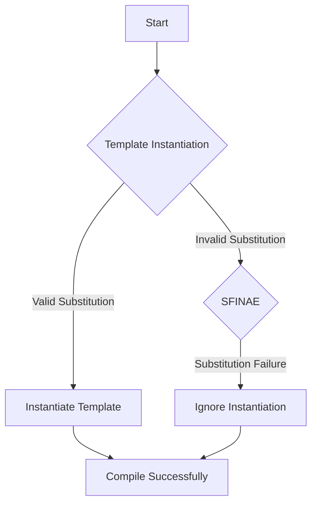

## 9.3 SFINAE and `std::enable_if`

In the realm of C++ template programming, SFINAE (Substitution Failure Is Not An Error) and `std::enable_if` are pivotal concepts that allow developers to write highly flexible and efficient code. These techniques enable compile-time function selection and template specialization, providing a foundation for advanced generic programming. In this section, we will delve into these concepts, exploring their applications, intricacies, and best practices.

### Understanding SFINAE

**Substitution Failure Is Not An Error (SFINAE)** is a cornerstone of C++ template programming. It allows the compiler to ignore certain template instantiations that fail during the substitution process, rather than treating them as errors. This mechanism is crucial for implementing type traits, enabling function overloading based on template parameters, and creating more robust and adaptable code.

#### Key Concepts of SFINAE

1. **Substitution Process**: When a template is instantiated, the compiler substitutes the template arguments into the template definition. If this substitution results in an invalid type or expression, the instantiation is discarded rather than causing a compilation error.

2. **Function Overloading**: SFINAE is often used to enable or disable function overloads based on the properties of template parameters. This allows for more precise control over which functions are available for specific types.

3. **Type Traits**: SFINAE is the backbone of many type trait implementations, allowing the detection of type properties at compile time.

#### Basic SFINAE Example

Let's start with a simple example to illustrate the basic idea of SFINAE:

```cpp
#include <iostream>
#include <type_traits>

// Primary template: checks if a type has a member function `foo`
template <typename T, typename = void>
struct has_foo : std::false_type {};

// Specialization: SFINAE kicks in if T has a member function `foo`
template <typename T>
struct has_foo<T, std::void_t<decltype(std::declval<T>().foo())>> : std::true_type {};

class WithFoo {
public:
    void foo() {}
};

class WithoutFoo {};

int main() {
    std::cout << "WithFoo has foo: " << has_foo<WithFoo>::value << std::endl;
    std::cout << "WithoutFoo has foo: " << has_foo<WithoutFoo>::value << std::endl;
    return 0;
}
```

**Explanation**: In this example, the primary template `has_foo` defaults to `false_type`. The specialization uses `std::void_t` to attempt to instantiate a type that would be valid if `T` has a member function `foo`. If `T` indeed has such a function, the specialization is chosen, resulting in `true_type`.

### `std::enable_if` for Compile-time Function Selection

`std::enable_if` is a utility in the C++ Standard Library that leverages SFINAE to conditionally enable or disable template instantiations. It is commonly used to control function overloads and class template specializations based on compile-time conditions.

#### Using `std::enable_if`

`std::enable_if` is typically used in function templates to enable or disable them based on a boolean condition. Here's the basic syntax:

```cpp
template<bool B, class T = void>
struct enable_if {};

template<class T>
struct enable_if<true, T> { typedef T type; };
```

When `B` is `true`, `enable_if` provides a member typedef `type`, which can be used to conditionally enable a function or class template.

#### Example: Function Overloading with `std::enable_if`

Let's see how `std::enable_if` can be used to select function overloads:

```cpp
#include <iostream>
#include <type_traits>

// Function for integral types
template <typename T>
typename std::enable_if<std::is_integral<T>::value, void>::type
process(T value) {
    std::cout << "Processing integral: " << value << std::endl;
}

// Function for floating-point types
template <typename T>
typename std::enable_if<std::is_floating_point<T>::value, void>::type
process(T value) {
    std::cout << "Processing floating-point: " << value << std::endl;
}

int main() {
    process(42);        // Calls the integral version
    process(3.14);      // Calls the floating-point version
    return 0;
}
```

**Explanation**: In this example, `std::enable_if` is used to create two overloads of the `process` function: one for integral types and another for floating-point types. The appropriate overload is selected based on the type of the argument.

### Advanced SFINAE Techniques

While basic SFINAE and `std::enable_if` provide powerful tools for template specialization, more advanced techniques can further enhance their capabilities. These include using SFINAE in class templates, combining SFINAE with variadic templates, and leveraging C++20 concepts for even more expressive template programming.

#### SFINAE in Class Templates

SFINAE can also be applied to class templates to enable or disable entire template specializations based on compile-time conditions. Here's an example:

```cpp
#include <iostream>
#include <type_traits>

// Primary template
template <typename T, typename Enable = void>
class Container;

// Specialization for integral types
template <typename T>
class Container<T, typename std::enable_if<std::is_integral<T>::value>::type> {
public:
    void info() {
        std::cout << "Container for integral type" << std::endl;
    }
};

// Specialization for floating-point types
template <typename T>
class Container<T, typename std::enable_if<std::is_floating_point<T>::value>::type> {
public:
    void info() {
        std::cout << "Container for floating-point type" << std::endl;
    }
};

int main() {
    Container<int> intContainer;
    intContainer.info();

    Container<double> doubleContainer;
    doubleContainer.info();

    return 0;
}
```

**Explanation**: In this example, the `Container` class template has two specializations: one for integral types and another for floating-point types. `std::enable_if` is used to conditionally enable these specializations based on the type of `T`.

#### Combining SFINAE with Variadic Templates

Variadic templates allow functions and classes to accept any number of template arguments. When combined with SFINAE, they enable powerful and flexible template programming.

```cpp
#include <iostream>
#include <type_traits>

// Function to print all arguments
template <typename... Args>
void print(Args... args) {
    (std::cout << ... << args) << std::endl;
}

// Function to print only integral arguments
template <typename T, typename... Args>
typename std::enable_if<std::is_integral<T>::value, void>::type
print_integrals(T first, Args... args) {
    std::cout << first << " ";
    print_integrals(args...);
}

// Base case for recursion
void print_integrals() {
    std::cout << std::endl;
}

int main() {
    print(1, 2.5, "Hello", 3); // Prints all arguments
    print_integrals(1, 2, 3);  // Prints only integral arguments
    return 0;
}
```

**Explanation**: The `print` function uses a fold expression to print all arguments. The `print_integrals` function uses SFINAE to ensure that only integral arguments are printed, demonstrating the power of combining variadic templates with SFINAE.

### C++20 Concepts: A Modern Alternative

C++20 introduced concepts, which provide a more expressive and readable way to specify template constraints. Concepts can be seen as an evolution of SFINAE, offering better error messages and more intuitive syntax.

#### Defining and Using Concepts

Here's how you can define and use a concept in C++20:

```cpp
#include <iostream>
#include <concepts>

// Define a concept for integral types
template<typename T>
concept Integral = std::is_integral_v<T>;

// Function that only accepts integral types
void process(Integral auto value) {
    std::cout << "Processing integral: " << value << std::endl;
}

int main() {
    process(42); // Valid
    // process(3.14); // Error: 3.14 is not an integral type
    return 0;
}
```

**Explanation**: The `Integral` concept is defined using `std::is_integral_v`. The `process` function is constrained to only accept types that satisfy the `Integral` concept, providing a clear and concise way to express template constraints.

### Design Considerations and Best Practices

When using SFINAE and `std::enable_if`, it's important to consider readability, maintainability, and error diagnostics. Here are some best practices:

1. **Prefer Concepts for New Code**: If you're using C++20, prefer concepts over SFINAE for better readability and error messages.

2. **Use `std::void_t` for Type Detection**: `std::void_t` is a useful utility for detecting the presence of types or members, simplifying SFINAE expressions.

3. **Limit the Use of SFINAE in Function Signatures**: Overusing SFINAE in function signatures can lead to complex and hard-to-read code. Consider alternative designs if possible.

4. **Provide Clear Error Messages**: When using SFINAE, ensure that error messages are as clear as possible to aid in debugging and maintenance.

5. **Document Template Constraints**: Clearly document the constraints and expectations for template parameters to improve code readability and maintainability.

### Differences and Similarities

While SFINAE and `std::enable_if` are closely related, they serve different purposes:

- **SFINAE** is a language feature that allows invalid substitutions to be ignored, enabling template specialization and function overloading.
- **`std::enable_if`** is a utility that leverages SFINAE to conditionally enable or disable template instantiations.

Both techniques are foundational for advanced template programming, but C++20 concepts offer a more modern and expressive alternative.

### Try It Yourself

To deepen your understanding of SFINAE and `std::enable_if`, try modifying the provided code examples:

- **Experiment with Different Type Traits**: Use different type traits, such as `std::is_pointer` or `std::is_class`, to create new overloads or specializations.
- **Combine SFINAE with Other Template Techniques**: Explore how SFINAE interacts with other template techniques, such as CRTP (Curiously Recurring Template Pattern) or policy-based design.
- **Implement a Custom Concept**: If you're using C++20, try implementing a custom concept and refactor existing SFINAE-based code to use it.

### Visualizing SFINAE and `std::enable_if`

To better understand the flow of SFINAE and `std::enable_if`, let's visualize the process using a flowchart:



**Diagram Description**: This flowchart illustrates the process of template instantiation with SFINAE. If a substitution is valid, the template is instantiated. If a substitution fails, SFINAE allows the instantiation to be ignored, preventing a compilation error.

### Knowledge Check

Before we conclude, let's reinforce your understanding with a few questions:

- **What is the primary purpose of SFINAE in C++?**
- **How does `std::enable_if` utilize SFINAE for function overloading?**
- **What are the advantages of using C++20 concepts over traditional SFINAE?**

### Embrace the Journey

Remember, mastering SFINAE and `std::enable_if` is just one step in your journey to becoming an expert C++ developer. As you continue to explore these concepts, you'll unlock new possibilities for writing efficient, flexible, and maintainable code. Keep experimenting, stay curious, and enjoy the journey!

## Quiz Time!



### What does SFINAE stand for in C++?

- [x] Substitution Failure Is Not An Error
- [ ] Substitution Failure Is Now An Error
- [ ] Substitution Failure Is No Error
- [ ] Substitution Failure Is Not A Problem

> **Explanation:** SFINAE stands for "Substitution Failure Is Not An Error," a key concept in C++ template programming.

### How does `std::enable_if` work?

- [x] It conditionally enables or disables template instantiations based on a boolean condition.
- [ ] It always enables template instantiations regardless of conditions.
- [ ] It disables all template instantiations.
- [ ] It enables template instantiations only for integral types.

> **Explanation:** `std::enable_if` uses a boolean condition to enable or disable template instantiations, leveraging SFINAE.

### What is a common use case for SFINAE?

- [x] Enabling or disabling function overloads based on template parameters.
- [ ] Compiling code without any errors.
- [ ] Optimizing runtime performance.
- [ ] Managing memory allocation.

> **Explanation:** SFINAE is commonly used to enable or disable function overloads based on the properties of template parameters.

### What utility is often used with SFINAE to detect the presence of types or members?

- [x] `std::void_t`
- [ ] `std::is_integral`
- [ ] `std::enable_if`
- [ ] `std::optional`

> **Explanation:** `std::void_t` is a utility that simplifies SFINAE expressions for detecting types or members.

### Which C++ version introduced concepts as an alternative to SFINAE?

- [x] C++20
- [ ] C++11
- [ ] C++14
- [ ] C++17

> **Explanation:** C++20 introduced concepts, providing a more expressive and readable way to specify template constraints.

### What is the primary advantage of using concepts over SFINAE?

- [x] Better readability and error messages
- [ ] Faster runtime performance
- [ ] Simplified memory management
- [ ] Increased code duplication

> **Explanation:** Concepts offer better readability and error messages compared to traditional SFINAE techniques.

### In the context of SFINAE, what happens when a substitution fails?

- [x] The instantiation is ignored, and no compilation error occurs.
- [ ] The instantiation is completed with errors.
- [ ] The compiler crashes.
- [ ] The instantiation is retried with different parameters.

> **Explanation:** When a substitution fails, SFINAE allows the instantiation to be ignored, preventing a compilation error.

### What is a key consideration when using SFINAE in function signatures?

- [x] Avoid overusing SFINAE to maintain readability.
- [ ] Always use SFINAE for every function.
- [ ] Ensure SFINAE is used only with integral types.
- [ ] Use SFINAE to increase runtime performance.

> **Explanation:** Overusing SFINAE in function signatures can lead to complex and hard-to-read code, so it's important to use it judiciously.

### How can you refactor SFINAE-based code using C++20 features?

- [x] Use concepts to express template constraints more clearly.
- [ ] Replace all templates with macros.
- [ ] Remove all type checks.
- [ ] Use only runtime checks.

> **Explanation:** Concepts provide a clearer and more expressive way to specify template constraints, making them a good alternative to SFINAE.

### True or False: `std::enable_if` can be used to conditionally enable class template specializations.

- [x] True
- [ ] False

> **Explanation:** `std::enable_if` can be used to conditionally enable or disable class template specializations based on compile-time conditions.


