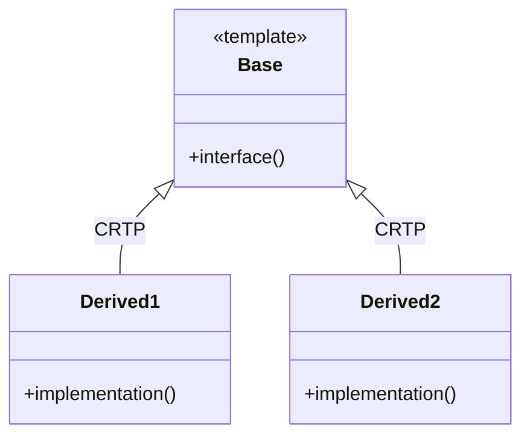

## 9.4 CRTP (Curiously Recurring Template Pattern)

The Curiously Recurring Template Pattern (CRTP) is a powerful idiom in C++ that allows developers to implement mixin behavior and achieve static polymorphism. This pattern leverages C++ templates to enable compile-time polymorphic behavior, offering performance benefits over traditional runtime polymorphism. In this section, we will delve into the intricacies of CRTP, explore its use cases, and provide detailed examples to illustrate its application.

### Understanding CRTP

#### What is CRTP?

CRTP stands for Curiously Recurring Template Pattern, a pattern where a class template takes a derived class as a template parameter. This pattern is often used to implement static polymorphism, allowing the base class to call methods on the derived class without virtual functions. This can lead to more efficient code, as the function calls are resolved at compile time rather than runtime.

#### How Does CRTP Work?

In CRTP, a base class is defined as a template class that takes a derived class as its template parameter. The derived class then inherits from this base class, passing itself as the template argument. This creates a recursive relationship where the base class has access to the derived class's members.

Here is a simple example to illustrate the concept:

```cpp
// Base class template
template <typename Derived>
class Base {
public:
    void interface() {
        // Call a method from the derived class
        static_cast<Derived*>(this)->implementation();
    }
};

// Derived class
class Derived : public Base<Derived> {
public:
    void implementation() {
        std::cout << "Derived implementation" << std::endl;
    }
};

int main() {
    Derived d;
    d.interface();  // Outputs: Derived implementation
    return 0;
}
```

In this example, the `Base` class template defines a method `interface()` that calls a method `implementation()` on the derived class. The derived class `Derived` inherits from `Base<Derived>`, allowing `interface()` to call `implementation()`.

### Key Concepts of CRTP

#### Static Polymorphism

Static polymorphism is a form of polymorphism achieved at compile time. Unlike dynamic polymorphism, which uses virtual functions and vtables, static polymorphism resolves function calls at compile time, resulting in more efficient code. CRTP is a common technique for achieving static polymorphism in C++.

#### Mixin Behavior

Mixin behavior refers to the ability to add functionality to a class through inheritance. In CRTP, mixin classes can be created by defining base classes that provide additional functionality to derived classes. This allows for code reuse and modular design.

#### Compile-Time Polymorphism

Compile-time polymorphism is achieved through templates and CRTP. By using templates, you can write generic code that works with different types, and CRTP allows you to define polymorphic behavior without the overhead of virtual functions.

### Advantages of CRTP

- **Performance**: CRTP avoids the overhead of virtual function calls, as all function calls are resolved at compile time.
- **Flexibility**: CRTP allows for flexible design patterns, enabling mixin behavior and code reuse.
- **Type Safety**: Since CRTP is resolved at compile time, it provides better type safety compared to runtime polymorphism.

### Disadvantages of CRTP

- **Complexity**: CRTP can be complex to understand and implement, especially for developers unfamiliar with templates.
- **Code Bloat**: Since CRTP generates code at compile time, it can lead to code bloat if not used carefully.
- **Limited Use Cases**: CRTP is not suitable for all scenarios, especially when runtime polymorphism is required.

### Use Cases for CRTP

CRTP is commonly used in the following scenarios:

- **Policy-Based Design**: CRTP is often used in policy-based design to define policies as template parameters.
- **Static Interfaces**: CRTP can be used to define static interfaces, allowing for compile-time polymorphism.
- **Mixin Classes**: CRTP enables the creation of mixin classes that add functionality to derived classes.

### Implementing CRTP

#### Basic CRTP Implementation

Let's start with a basic implementation of CRTP to demonstrate its core functionality.

```cpp
#include <iostream>

// Base class template
template <typename Derived>
class Base {
public:
    void interface() {
        static_cast<Derived*>(this)->implementation();
    }
};

// Derived class
class Derived : public Base<Derived> {
public:
    void implementation() {
        std::cout << "Derived implementation" << std::endl;
    }
};

int main() {
    Derived d;
    d.interface();  // Outputs: Derived implementation
    return 0;
}
```

In this example, the `Base` class template defines a method `interface()` that calls a method `implementation()` on the derived class. The derived class `Derived` inherits from `Base<Derived>`, allowing `interface()` to call `implementation()`.

#### CRTP with Multiple Derived Classes

CRTP can be extended to work with multiple derived classes, allowing for more complex designs.

```cpp
#include <iostream>

// Base class template
template <typename Derived>
class Base {
public:
    void interface() {
        static_cast<Derived*>(this)->implementation();
    }
};

// First derived class
class Derived1 : public Base<Derived1> {
public:
    void implementation() {
        std::cout << "Derived1 implementation" << std::endl;
    }
};

// Second derived class
class Derived2 : public Base<Derived2> {
public:
    void implementation() {
        std::cout << "Derived2 implementation" << std::endl;
    }
};

int main() {
    Derived1 d1;
    d1.interface();  // Outputs: Derived1 implementation

    Derived2 d2;
    d2.interface();  // Outputs: Derived2 implementation

    return 0;
}
```

In this example, we have two derived classes, `Derived1` and `Derived2`, both inheriting from `Base` with their respective types. Each derived class provides its own implementation of the `implementation()` method, demonstrating how CRTP can be used with multiple derived classes.

### Advanced CRTP Techniques

#### CRTP for Static Interfaces

CRTP can be used to define static interfaces, allowing for compile-time polymorphism without the overhead of virtual functions.

```cpp
#include <iostream>

// Base class template for static interface
template <typename Derived>
class StaticInterface {
public:
    void execute() {
        static_cast<Derived*>(this)->executeImpl();
    }
};

// Derived class implementing the static interface
class Concrete : public StaticInterface<Concrete> {
public:
    void executeImpl() {
        std::cout << "Concrete execution" << std::endl;
    }
};

int main() {
    Concrete c;
    c.execute();  // Outputs: Concrete execution
    return 0;
}
```

In this example, `StaticInterface` defines a static interface with a method `execute()`. The derived class `Concrete` implements the interface by providing an `executeImpl()` method. This allows for compile-time polymorphism without virtual functions.

#### CRTP for Policy-Based Design

CRTP is often used in policy-based design to define policies as template parameters. This allows for flexible and reusable designs.

```cpp
#include <iostream>

// Policy class for addition
class AdditionPolicy {
public:
    template <typename T>
    T operation(T a, T b) {
        return a + b;
    }
};

// Policy class for multiplication
class MultiplicationPolicy {
public:
    template <typename T>
    T operation(T a, T b) {
        return a * b;
    }
};

// Base class template using CRTP
template <typename Derived>
class Calculator {
public:
    template <typename T>
    T calculate(T a, T b) {
        return static_cast<Derived*>(this)->operation(a, b);
    }
};

// Derived class using addition policy
class Adder : public Calculator<Adder>, public AdditionPolicy {};

// Derived class using multiplication policy
class Multiplier : public Calculator<Multiplier>, public MultiplicationPolicy {};

int main() {
    Adder adder;
    std::cout << "Addition: " << adder.calculate(3, 4) << std::endl;  // Outputs: Addition: 7

    Multiplier multiplier;
    std::cout << "Multiplication: " << multiplier.calculate(3, 4) << std::endl;  // Outputs: Multiplication: 12

    return 0;
}
```

In this example, we define two policy classes, `AdditionPolicy` and `MultiplicationPolicy`, each providing an `operation()` method. The `Calculator` class template uses CRTP to define a `calculate()` method that calls the `operation()` method on the derived class. The derived classes `Adder` and `Multiplier` inherit from `Calculator` and their respective policy classes, allowing for flexible and reusable designs.

### CRTP in Real-World Applications

#### CRTP in Libraries and Frameworks

CRTP is widely used in C++ libraries and frameworks to provide efficient and flexible designs. For example, the Eigen library, a popular C++ library for linear algebra, uses CRTP to implement its expression templates, allowing for efficient matrix operations without the overhead of virtual function calls.

#### CRTP in Game Development

In game development, CRTP can be used to implement static polymorphism for game entities, allowing for efficient and flexible designs. By using CRTP, game developers can define static interfaces for game entities, enabling compile-time polymorphism and reducing the overhead of virtual function calls.

### Visualizing CRTP

To better understand the structure and flow of CRTP, let's visualize the relationship between the base class and derived classes using a class diagram.



In this diagram, the `Base` class is a template class that defines an `interface()` method. The derived classes `Derived1` and `Derived2` inherit from `Base` using CRTP, each providing their own implementation of the `implementation()` method.

### Design Considerations

#### When to Use CRTP

CRTP is best suited for scenarios where compile-time polymorphism is desired, and the overhead of virtual function calls needs to be avoided. It is particularly useful in performance-critical applications, such as game development and numerical computing, where efficiency is paramount.

#### Important Considerations

- **Complexity**: CRTP can be complex to implement and understand, especially for developers unfamiliar with templates. It is important to carefully design and document CRTP-based code to ensure maintainability.
- **Code Bloat**: Since CRTP generates code at compile time, it can lead to code bloat if not used carefully. It is important to balance the benefits of CRTP with the potential increase in code size.
- **Limited Use Cases**: CRTP is not suitable for all scenarios, especially when runtime polymorphism is required. It is important to carefully evaluate the requirements of your application before choosing CRTP.

### Differences and Similarities

CRTP is often compared to other design patterns, such as the Strategy pattern and the Template Method pattern. While CRTP and these patterns share similarities, they have distinct differences:

- **CRTP vs. Strategy Pattern**: The Strategy pattern is a behavioral design pattern that defines a family of algorithms and encapsulates each one. CRTP, on the other hand, is a structural pattern that enables static polymorphism through templates. While both patterns allow for flexible designs, CRTP achieves polymorphism at compile time, whereas the Strategy pattern achieves it at runtime.
- **CRTP vs. Template Method Pattern**: The Template Method pattern is a behavioral design pattern that defines the skeleton of an algorithm, allowing subclasses to override specific steps. CRTP, in contrast, enables static polymorphism by allowing the base class to call methods on the derived class. While both patterns involve templates, CRTP focuses on compile-time polymorphism, whereas the Template Method pattern focuses on defining algorithms.

### Try It Yourself

To deepen your understanding of CRTP, try modifying the code examples provided in this section. Here are some suggestions:

- **Add More Derived Classes**: Extend the examples by adding more derived classes with different implementations of the `implementation()` method. Observe how CRTP allows for flexible and reusable designs.
- **Implement Additional Policies**: In the policy-based design example, try implementing additional policies, such as subtraction or division, and create new derived classes that use these policies.
- **Experiment with Static Interfaces**: Modify the static interface example to add more methods to the interface. Observe how CRTP allows for compile-time polymorphism without virtual functions.

### Conclusion

The Curiously Recurring Template Pattern (CRTP) is a powerful idiom in C++ that enables static polymorphism and mixin behavior. By leveraging templates, CRTP allows developers to write efficient and flexible code, avoiding the overhead of virtual function calls. While CRTP can be complex to implement, it offers significant performance benefits and is widely used in performance-critical applications.

Remember, mastering CRTP requires practice and experimentation. As you continue to explore C++ design patterns, keep experimenting with CRTP and other patterns to deepen your understanding and enhance your skills.

## Quiz Time!



### What does CRTP stand for?

- [x] Curiously Recurring Template Pattern
- [ ] Common Recurring Template Pattern
- [ ] Complex Recursive Template Pattern
- [ ] Comprehensive Recurring Template Pattern

> **Explanation:** CRTP stands for Curiously Recurring Template Pattern, a pattern where a class template takes a derived class as a template parameter.

### What is the primary benefit of using CRTP?

- [x] Achieving static polymorphism
- [ ] Simplifying runtime polymorphism
- [ ] Reducing code complexity
- [ ] Enhancing dynamic memory management

> **Explanation:** CRTP is primarily used to achieve static polymorphism, allowing function calls to be resolved at compile time.

### In CRTP, what role does the base class play?

- [x] It defines a template class that takes a derived class as a parameter.
- [ ] It provides a virtual interface for derived classes.
- [ ] It manages dynamic memory allocation for derived classes.
- [ ] It handles runtime polymorphism for derived classes.

> **Explanation:** In CRTP, the base class is defined as a template class that takes a derived class as a template parameter, enabling static polymorphism.

### What is a common use case for CRTP?

- [x] Implementing mixin behavior
- [ ] Managing dynamic memory allocation
- [ ] Simplifying exception handling
- [ ] Enhancing runtime polymorphism

> **Explanation:** CRTP is commonly used to implement mixin behavior, allowing for code reuse and modular design.

### How does CRTP achieve polymorphism?

- [x] At compile time
- [ ] At runtime
- [ ] Through virtual functions
- [ ] Through dynamic casting

> **Explanation:** CRTP achieves polymorphism at compile time, avoiding the overhead of virtual function calls.

### What is a potential disadvantage of using CRTP?

- [x] Code bloat
- [ ] Increased runtime overhead
- [ ] Reduced type safety
- [ ] Limited compile-time checks

> **Explanation:** Since CRTP generates code at compile time, it can lead to code bloat if not used carefully.

### Which pattern is CRTP often compared to?

- [x] Strategy Pattern
- [ ] Observer Pattern
- [ ] Singleton Pattern
- [ ] Factory Pattern

> **Explanation:** CRTP is often compared to the Strategy Pattern, as both allow for flexible designs, but CRTP achieves polymorphism at compile time.

### What is a key feature of CRTP?

- [x] Static polymorphism
- [ ] Dynamic polymorphism
- [ ] Virtual function tables
- [ ] Runtime type identification

> **Explanation:** A key feature of CRTP is static polymorphism, which allows for compile-time resolution of function calls.

### Can CRTP be used with multiple derived classes?

- [x] True
- [ ] False

> **Explanation:** CRTP can be used with multiple derived classes, each providing its own implementation of the required methods.

### What is a common application of CRTP in libraries?

- [x] Implementing expression templates
- [ ] Managing dynamic memory
- [ ] Simplifying exception handling
- [ ] Enhancing runtime polymorphism

> **Explanation:** CRTP is commonly used in libraries to implement expression templates, allowing for efficient and flexible designs.


