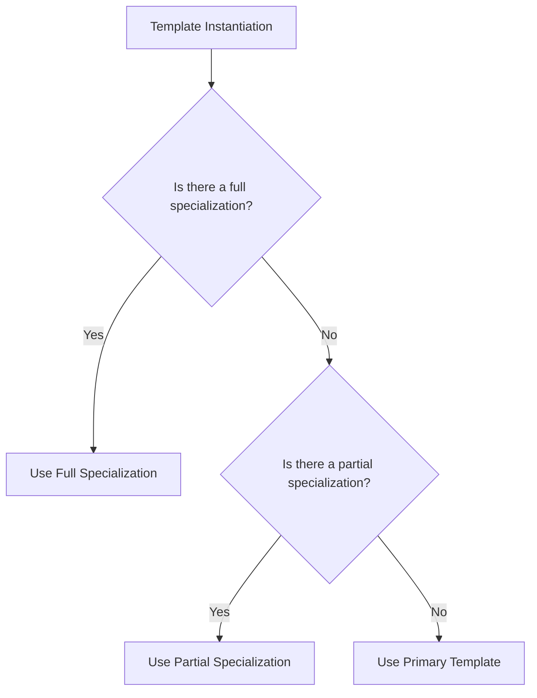

## 9.5 Template Specialization and Partial Specialization

In the world of C++ programming, templates are a powerful feature that allows developers to write generic and reusable code. However, there are times when the generic behavior provided by templates needs to be customized for specific types or conditions. This is where template specialization and partial specialization come into play. In this section, we will delve into the intricacies of these concepts, exploring how they can be used to handle edge cases and optimize code.

### Understanding Template Specialization

Template specialization in C++ allows you to define a specific implementation of a template for a particular type. This is useful when the default template implementation is not suitable for certain types or when you want to optimize the behavior for specific cases.

#### Full Template Specialization

Full template specialization involves providing a complete implementation of a template for a specific type. This means that the specialized template will be used whenever the specified type is encountered.

**Example: Full Template Specialization**

Let's consider a simple example of a template class that calculates the square of a number. We'll specialize this template for the `int` type to demonstrate full template specialization.

```cpp
#include <iostream>

// Primary template
template <typename T>
class Square {
public:
    static T calculate(T value) {
        return value * value;
    }
};

// Full specialization for int
template <>
class Square<int> {
public:
    static int calculate(int value) {
        std::cout << "Specialized for int" << std::endl;
        return value * value;
    }
};

int main() {
    std::cout << "Square of 5.5: " << Square<double>::calculate(5.5) << std::endl;
    std::cout << "Square of 5: " << Square<int>::calculate(5) << std::endl;
    return 0;
}
```

In this example, the `Square` class template is specialized for the `int` type. When the `calculate` method is called with an `int`, the specialized implementation is used, printing a message to indicate that the specialization is active.

#### Partial Template Specialization

Partial template specialization allows you to specialize a template for a subset of its parameters. This is particularly useful when you want to customize behavior based on some, but not all, template parameters.

**Example: Partial Template Specialization**

Consider a template class that holds a pair of values. We can partially specialize this template when both values are of the same type.

```cpp
#include <iostream>

// Primary template
template <typename T1, typename T2>
class Pair {
public:
    static void print() {
        std::cout << "Generic Pair" << std::endl;
    }
};

// Partial specialization for pairs of the same type
template <typename T>
class Pair<T, T> {
public:
    static void print() {
        std::cout << "Specialized Pair with same types" << std::endl;
    }
};

int main() {
    Pair<int, double>::print();  // Outputs: Generic Pair
    Pair<int, int>::print();     // Outputs: Specialized Pair with same types
    return 0;
}
```

In this example, the `Pair` class template is partially specialized for cases where both template parameters are of the same type. This allows us to provide a different implementation for these specific cases.

### Key Differences Between Full and Partial Specialization

Understanding the differences between full and partial specialization is crucial for effectively using these features in C++.

- **Full Specialization**: Provides a complete implementation for a specific type or set of types. It replaces the primary template entirely for the specified types.
- **Partial Specialization**: Allows customization of a template for a subset of its parameters. It retains the primary template's behavior for other parameters while providing specialized behavior for the specified subset.

### When to Use Template Specialization

Template specialization is a powerful tool, but it should be used judiciously. Here are some scenarios where specialization is appropriate:

- **Optimization**: When a specific type can benefit from a more efficient implementation than the generic one.
- **Type-Specific Behavior**: When certain types require different behavior that cannot be achieved through the primary template.
- **Edge Cases**: When handling special cases that do not fit the general pattern of the primary template.

### Design Considerations

When using template specialization, consider the following design considerations:

- **Maintainability**: Specializations can make code harder to understand and maintain. Ensure that the need for specialization is well-documented.
- **Readability**: Clearly distinguish between primary templates and specializations to avoid confusion.
- **Consistency**: Ensure that specializations do not introduce inconsistencies or unexpected behavior.

### Advanced Concepts: SFINAE and Type Traits

Template specialization often goes hand-in-hand with advanced template techniques such as SFINAE (Substitution Failure Is Not An Error) and type traits. These techniques allow for more sophisticated template metaprogramming.

#### SFINAE

SFINAE is a technique that allows a template to be conditionally instantiated based on the validity of certain expressions. This can be used to enable or disable template specializations based on type traits or other conditions.

**Example: SFINAE with Template Specialization**

```cpp
#include <iostream>
#include <type_traits>

// Primary template
template <typename T, typename Enable = void>
class IsIntegral {
public:
    static void check() {
        std::cout << "Not an integral type" << std::endl;
    }
};

// Specialization for integral types
template <typename T>
class IsIntegral<T, typename std::enable_if<std::is_integral<T>::value>::type> {
public:
    static void check() {
        std::cout << "Integral type" << std::endl;
    }
};

int main() {
    IsIntegral<int>::check();    // Outputs: Integral type
    IsIntegral<double>::check(); // Outputs: Not an integral type
    return 0;
}
```

In this example, SFINAE is used to specialize the `IsIntegral` class template for integral types. The `std::enable_if` utility is used to conditionally enable the specialization based on the `std::is_integral` type trait.

#### Type Traits

Type traits are a set of template classes in the C++ Standard Library that provide information about types at compile time. They are often used in conjunction with template specialization to implement type-specific behavior.

**Example: Using Type Traits with Template Specialization**

```cpp
#include <iostream>
#include <type_traits>

// Primary template
template <typename T>
class TypeInfo {
public:
    static void print() {
        std::cout << "Unknown type" << std::endl;
    }
};

// Specialization for integral types
template <typename T>
class TypeInfo<T, typename std::enable_if<std::is_integral<T>::value>::type> {
public:
    static void print() {
        std::cout << "Integral type" << std::endl;
    }
};

// Specialization for floating-point types
template <typename T>
class TypeInfo<T, typename std::enable_if<std::is_floating_point<T>::value>::type> {
public:
    static void print() {
        std::cout << "Floating-point type" << std::endl;
    }
};

int main() {
    TypeInfo<int>::print();       // Outputs: Integral type
    TypeInfo<double>::print();    // Outputs: Floating-point type
    TypeInfo<std::string>::print(); // Outputs: Unknown type
    return 0;
}
```

In this example, type traits are used to specialize the `TypeInfo` class template for integral and floating-point types. This allows the template to provide type-specific information at compile time.

### Visualizing Template Specialization

To better understand the concept of template specialization, let's visualize how the compiler selects the appropriate template implementation based on the provided types.



This diagram illustrates the decision-making process the compiler goes through when instantiating a template. It first checks for a full specialization, then a partial specialization, and finally falls back to the primary template if no specializations are found.

### Try It Yourself

Now that we've covered the basics of template specialization, let's encourage you to experiment with these concepts. Try modifying the examples provided to create your own specializations. Here are a few ideas:

- **Create a specialization for a template function** that handles strings differently from other types.
- **Implement a partial specialization** for a template class that behaves differently when one of the template parameters is a pointer type.
- **Use SFINAE to enable or disable template functions** based on custom conditions.

### References and Further Reading

For more information on template specialization and related topics, consider exploring the following resources:

- [C++ Templates: The Complete Guide](https://www.amazon.com/Cpp-Templates-Complete-Guide/dp/0321714121) by David Vandevoorde and Nicolai M. Josuttis
- [C++ Standard Library Type Traits](https://en.cppreference.com/w/cpp/types) on cppreference.com
- [SFINAE and Enable If Idiom](https://www.fluentcpp.com/2017/05/23/enable-if/) on Fluent C++

### Knowledge Check

Before we wrap up, let's pose a few questions to reinforce your understanding of template specialization:

- What is the difference between full and partial template specialization?
- How can SFINAE be used in conjunction with template specialization?
- What are some common use cases for template specialization?

### Conclusion

Template specialization and partial specialization are powerful features of C++ that allow you to customize template behavior for specific types or conditions. By understanding these concepts, you can write more efficient and flexible code that handles edge cases and optimizes performance. Remember, this is just the beginning. As you continue to explore C++ templates, you'll discover even more ways to leverage their power in your software designs. Keep experimenting, stay curious, and enjoy the journey!

## Quiz Time!



### What is full template specialization?

- [x] A complete implementation of a template for a specific type.
- [ ] A partial implementation of a template for a subset of types.
- [ ] A generic implementation of a template for all types.
- [ ] An implementation that disables a template for specific types.

> **Explanation:** Full template specialization provides a complete implementation of a template for a specific type, replacing the primary template for that type.

### What is partial template specialization?

- [ ] A complete implementation of a template for a specific type.
- [x] A specialization of a template for a subset of its parameters.
- [ ] A generic implementation of a template for all types.
- [ ] An implementation that disables a template for specific types.

> **Explanation:** Partial template specialization allows customization of a template for a subset of its parameters, retaining the primary template's behavior for other parameters.

### What is SFINAE?

- [x] A technique that allows a template to be conditionally instantiated based on the validity of certain expressions.
- [ ] A method for optimizing template instantiation.
- [ ] A way to disable templates for specific types.
- [ ] A tool for debugging template errors.

> **Explanation:** SFINAE (Substitution Failure Is Not An Error) is a technique that allows a template to be conditionally instantiated based on the validity of certain expressions.

### How can type traits be used with template specialization?

- [x] To provide information about types at compile time and enable type-specific behavior.
- [ ] To disable templates for specific types.
- [ ] To optimize template instantiation.
- [ ] To debug template errors.

> **Explanation:** Type traits are used to provide information about types at compile time and enable type-specific behavior, often in conjunction with template specialization.

### When should template specialization be used?

- [x] For optimization and type-specific behavior.
- [ ] For disabling templates.
- [ ] For debugging template errors.
- [ ] For generic implementations.

> **Explanation:** Template specialization should be used for optimization and type-specific behavior when the default template implementation is not suitable.

### What is the primary benefit of using SFINAE?

- [x] It allows for conditional template instantiation based on type traits or other conditions.
- [ ] It optimizes template instantiation.
- [ ] It provides a way to disable templates for specific types.
- [ ] It helps debug template errors.

> **Explanation:** The primary benefit of SFINAE is that it allows for conditional template instantiation based on type traits or other conditions.

### What does the `std::enable_if` utility do?

- [x] It conditionally enables or disables template specializations based on type traits.
- [ ] It optimizes template instantiation.
- [ ] It provides information about types at compile time.
- [ ] It helps debug template errors.

> **Explanation:** The `std::enable_if` utility conditionally enables or disables template specializations based on type traits.

### What is a common use case for partial template specialization?

- [x] Customizing behavior for a subset of template parameters.
- [ ] Disabling templates for specific types.
- [ ] Debugging template errors.
- [ ] Providing generic implementations.

> **Explanation:** A common use case for partial template specialization is customizing behavior for a subset of template parameters.

### What is the role of type traits in template specialization?

- [x] They provide information about types at compile time and enable type-specific behavior.
- [ ] They disable templates for specific types.
- [ ] They optimize template instantiation.
- [ ] They debug template errors.

> **Explanation:** Type traits provide information about types at compile time and enable type-specific behavior, often used in conjunction with template specialization.

### True or False: Template specialization can make code harder to understand and maintain.

- [x] True
- [ ] False

> **Explanation:** Template specialization can make code harder to understand and maintain, so it should be used judiciously and documented well.


