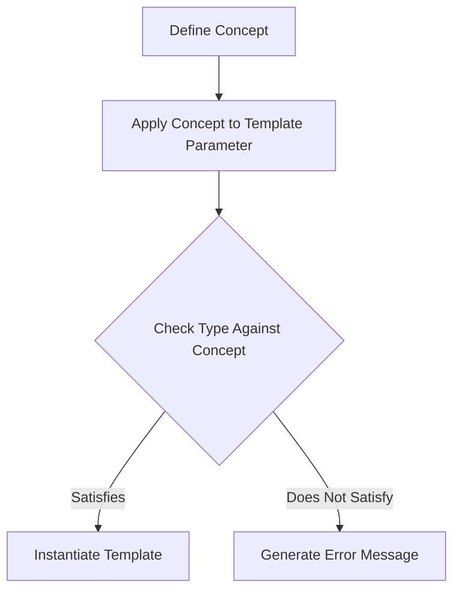

## 9.6 Concept Programming (C++20 Concepts)

Concept Programming in C++20 introduces a powerful mechanism for defining constraints on template parameters, enabling developers to write more robust and expressive generic code. Concepts allow us to specify the requirements that template arguments must satisfy, leading to clearer and more informative error messages when those requirements are not met. In this section, we will explore the intricacies of Concept Programming, providing expert insights and practical examples for seasoned software engineers and architects.

### Introduction to Concepts

Concepts are a new feature in C++20 that allow us to define a set of requirements for template parameters. They act as a compile-time predicate that checks whether a given type satisfies certain properties. By using concepts, we can ensure that our templates are instantiated only with types that meet specific criteria, leading to safer and more maintainable code.

#### Why Use Concepts?

1. **Improved Code Clarity**: Concepts make the intent of template code explicit, improving readability and understanding.
2. **Better Error Messages**: When a type does not satisfy a concept, the compiler provides clear and concise error messages, making it easier to diagnose and fix issues.
3. **Enhanced Code Safety**: By enforcing constraints at compile time, concepts help prevent incorrect template instantiations, reducing runtime errors.
4. **Facilitated Code Maintenance**: Concepts allow for more modular and reusable code by clearly defining the requirements for template parameters.

### Defining Concepts

Let's start by defining a simple concept. Concepts are defined using the `concept` keyword followed by a boolean expression that specifies the requirements a type must satisfy.

```cpp
#include <type_traits>

// Define a concept that checks if a type is integral
template<typename T>
concept Integral = std::is_integral_v<T>;
```

In this example, the `Integral` concept checks if a type `T` is an integral type using the `std::is_integral` type trait. If `T` is an integral type, the concept evaluates to `true`; otherwise, it evaluates to `false`.

#### Using Concepts in Templates

Once a concept is defined, it can be used to constrain template parameters. This is done using the `requires` clause or by specifying the concept directly in the template parameter list.

```cpp
#include <iostream>

// Use the Integral concept to constrain the template parameter
template<Integral T>
T add(T a, T b) {
    return a + b;
}

int main() {
    std::cout << add(3, 5) << std::endl; // Works fine
    // std::cout << add(3.5, 5.5) << std::endl; // Error: double does not satisfy Integral
}
```

In the `add` function, the template parameter `T` is constrained by the `Integral` concept, ensuring that only integral types can be used as arguments.

### Writing Generic Code with Concepts

Concepts enable us to write more expressive and flexible generic code by allowing us to specify precise requirements for template parameters. Let's explore some common use cases and patterns for using concepts in generic programming.

#### Constraining Multiple Parameters

Concepts can be used to constrain multiple template parameters, ensuring that they satisfy specific relationships or properties.

```cpp
#include <concepts>
#include <iostream>

// Define a concept that checks if two types are the same
template<typename T, typename U>
concept Same = std::is_same_v<T, U>;

// Function that requires both parameters to be the same type
template<typename T, typename U>
requires Same<T, U>
void print_same(T a, U b) {
    std::cout << a << " and " << b << " are of the same type." << std::endl;
}

int main() {
    print_same(10, 20); // Works fine
    // print_same(10, 20.0); // Error: int and double are not the same type
}
```

In this example, the `Same` concept ensures that both template parameters `T` and `U` are the same type, preventing the function from being instantiated with different types.

#### Combining Concepts

Concepts can be combined using logical operators to create more complex constraints.

```cpp
#include <concepts>
#include <iostream>

// Define a concept that checks if a type is both integral and signed
template<typename T>
concept SignedIntegral = Integral<T> && std::is_signed_v<T>;

// Function that requires a signed integral type
template<SignedIntegral T>
void print_signed_integral(T value) {
    std::cout << value << " is a signed integral." << std::endl;
}

int main() {
    print_signed_integral(-10); // Works fine
    // print_signed_integral(10u); // Error: unsigned int does not satisfy SignedIntegral
}
```

Here, the `SignedIntegral` concept combines the `Integral` concept with the `std::is_signed` type trait to ensure that the type is both integral and signed.

### Using Concepts for Better Error Messages

One of the significant advantages of using concepts is the improved error messages they provide. When a type does not satisfy a concept, the compiler generates a clear and concise error message, indicating which requirement was not met.

Consider the following example:

```cpp
#include <concepts>
#include <iostream>

// Define a concept that checks if a type is incrementable
template<typename T>
concept Incrementable = requires(T x) {
    ++x;
};

// Function that requires an incrementable type
template<Incrementable T>
void increment(T& value) {
    ++value;
}

int main() {
    int x = 10;
    increment(x); // Works fine

    std::string str = "Hello";
    // increment(str); // Error: std::string does not satisfy Incrementable
}
```

If we attempt to call `increment` with a `std::string`, the compiler will produce an error message indicating that `std::string` does not satisfy the `Incrementable` concept because it lacks the `++` operator.

### Advanced Concept Techniques

Concepts offer several advanced techniques for defining and using constraints in template programming. Let's explore some of these techniques to enhance our understanding of Concept Programming.

#### Concept Specialization

Concepts can be specialized for specific types, allowing us to define different constraints for different types.

```cpp
#include <concepts>
#include <iostream>

// Define a concept that checks if a type is a pointer
template<typename T>
concept Pointer = std::is_pointer_v<T>;

// Specialize the concept for void pointers
template<>
concept Pointer<void*> = true;

// Function that requires a pointer type
template<Pointer T>
void print_pointer(T ptr) {
    std::cout << "Pointer address: " << ptr << std::endl;
}

int main() {
    int x = 10;
    print_pointer(&x); // Works fine

    void* vp = nullptr;
    print_pointer(vp); // Works fine due to specialization
}
```

In this example, the `Pointer` concept is specialized for `void*`, allowing the `print_pointer` function to accept void pointers.

#### Concept Overloading

Concepts can be used to overload functions based on the constraints they impose, enabling more flexible and expressive function interfaces.

```cpp
#include <concepts>
#include <iostream>

// Define a concept that checks if a type is arithmetic
template<typename T>
concept Arithmetic = std::is_arithmetic_v<T>;

// Overload for arithmetic types
template<Arithmetic T>
void print_value(T value) {
    std::cout << "Arithmetic value: " << value << std::endl;
}

// Overload for non-arithmetic types
template<typename T>
void print_value(T value) {
    std::cout << "Non-arithmetic value." << std::endl;
}

int main() {
    print_value(10); // Calls arithmetic overload
    print_value("Hello"); // Calls non-arithmetic overload
}
```

Here, the `print_value` function is overloaded based on whether the type is arithmetic, providing different behavior for arithmetic and non-arithmetic types.

### Visualizing Concept Programming

To better understand the flow and relationships in Concept Programming, let's visualize the process using a Mermaid.js diagram.



**Diagram Description**: This flowchart illustrates the process of Concept Programming in C++. We start by defining a concept and applying it to a template parameter. The compiler then checks if the type satisfies the concept. If it does, the template is instantiated; otherwise, an error message is generated.

### Practical Applications of Concepts

Concepts have numerous practical applications in modern C++ programming, enhancing code safety, readability, and maintainability. Let's explore some real-world scenarios where concepts can be effectively applied.

#### Ensuring Interface Compliance

Concepts can be used to ensure that a type complies with a specific interface, making it easier to work with polymorphic code.

```cpp
#include <concepts>
#include <iostream>

// Define a concept that checks if a type has a print method
template<typename T>
concept Printable = requires(T x) {
    { x.print() } -> std::same_as<void>;
};

// Function that requires a printable type
template<Printable T>
void print_object(T obj) {
    obj.print();
}

// Class that satisfies the Printable concept
class MyClass {
public:
    void print() const {
        std::cout << "MyClass object" << std::endl;
    }
};

int main() {
    MyClass obj;
    print_object(obj); // Works fine

    // int x = 10;
    // print_object(x); // Error: int does not satisfy Printable
}
```

In this example, the `Printable` concept ensures that a type has a `print` method, allowing the `print_object` function to be safely used with any type that satisfies this requirement.

#### Enforcing Type Relationships

Concepts can enforce specific relationships between types, such as ensuring that one type is derived from another.

```cpp
#include <concepts>
#include <iostream>

// Define a concept that checks if a type is derived from another
template<typename Base, typename Derived>
concept DerivedFrom = std::is_base_of_v<Base, Derived>;

// Function that requires a derived type
template<typename Base, DerivedFrom<Base> Derived>
void print_derived(Derived obj) {
    std::cout << "Derived object" << std::endl;
}

// Base class
class BaseClass {};

// Derived class
class DerivedClass : public BaseClass {};

int main() {
    DerivedClass obj;
    print_derived<BaseClass>(obj); // Works fine

    // BaseClass baseObj;
    // print_derived<BaseClass>(baseObj); // Error: BaseClass is not derived from BaseClass
}
```

Here, the `DerivedFrom` concept ensures that the `Derived` type is derived from the `Base` type, preventing incorrect usage of the `print_derived` function.

### Try It Yourself

To deepen your understanding of Concept Programming, try modifying the code examples provided in this section. Experiment with defining your own concepts and applying them to different scenarios. Consider the following challenges:

- Create a concept that checks if a type is a container with a `size` method.
- Implement a function that requires a type to be both `Integral` and `Incrementable`.
- Overload a function using concepts to provide different behavior for floating-point and non-floating-point types.

### References and Further Reading

For more information on C++20 Concepts, consider exploring the following resources:

- [C++20 Concepts: The Complete Guide](https://www.cppstories.com/2020/Concepts/)
- [ISO C++ Committee Papers](http://www.open-std.org/jtc1/sc22/wg21/)
- [cppreference.com: Concepts](https://en.cppreference.com/w/cpp/language/constraints)

### Knowledge Check

Let's reinforce what we've learned with some questions and exercises. Try to answer the following questions to test your understanding of Concept Programming.

## Quiz Time!



### What is the primary purpose of concepts in C++20?

- [x] To define constraints on template parameters
- [ ] To improve runtime performance
- [ ] To replace inheritance
- [ ] To eliminate the need for type traits

> **Explanation:** Concepts are used to define constraints on template parameters, ensuring that only types satisfying specific requirements can be used.

### How do concepts improve error messages in C++?

- [x] By providing clear and concise messages when a type does not satisfy a concept
- [ ] By reducing the number of error messages
- [ ] By eliminating all error messages
- [ ] By providing runtime error messages

> **Explanation:** Concepts improve error messages by providing clear and concise information about why a type does not satisfy a concept.

### Which keyword is used to define a concept in C++20?

- [x] concept
- [ ] template
- [ ] typename
- [ ] class

> **Explanation:** The `concept` keyword is used to define a concept in C++20.

### What does the `requires` clause do in a template?

- [x] It specifies constraints that must be satisfied by template parameters
- [ ] It initializes template parameters
- [ ] It defines default values for template parameters
- [ ] It restricts the number of template parameters

> **Explanation:** The `requires` clause specifies constraints that must be satisfied by template parameters.

### Can concepts be combined using logical operators?

- [x] Yes
- [ ] No

> **Explanation:** Concepts can be combined using logical operators like `&&` and `||` to create more complex constraints.

### What is the result of using a concept that a type does not satisfy?

- [x] A compile-time error
- [ ] A runtime error
- [ ] A warning
- [ ] No effect

> **Explanation:** If a type does not satisfy a concept, a compile-time error is generated.

### Can concepts be specialized for specific types?

- [x] Yes
- [ ] No

> **Explanation:** Concepts can be specialized for specific types, allowing different constraints for different types.

### What is a practical application of concepts in C++?

- [x] Ensuring interface compliance
- [ ] Improving runtime performance
- [ ] Replacing inheritance
- [ ] Eliminating the need for type traits

> **Explanation:** Concepts can be used to ensure that a type complies with a specific interface, making it easier to work with polymorphic code.

### Which of the following is an example of a concept?

- [x] `template<typename T> concept Integral = std::is_integral_v<T>;`
- [ ] `template<typename T> class Integral {};`
- [ ] `template<typename T> struct Integral {};`
- [ ] `template<typename T> typename Integral = std::is_integral_v<T>;`

> **Explanation:** The correct syntax for defining a concept uses the `concept` keyword.

### True or False: Concepts can only be used with function templates.

- [ ] True
- [x] False

> **Explanation:** Concepts can be used with both function templates and class templates.



Remember, mastering Concept Programming is a journey. As you continue to explore and experiment with concepts, you'll discover new ways to enhance your C++ code's robustness and expressiveness. Keep pushing the boundaries of what's possible with C++20 Concepts, and enjoy the journey!
