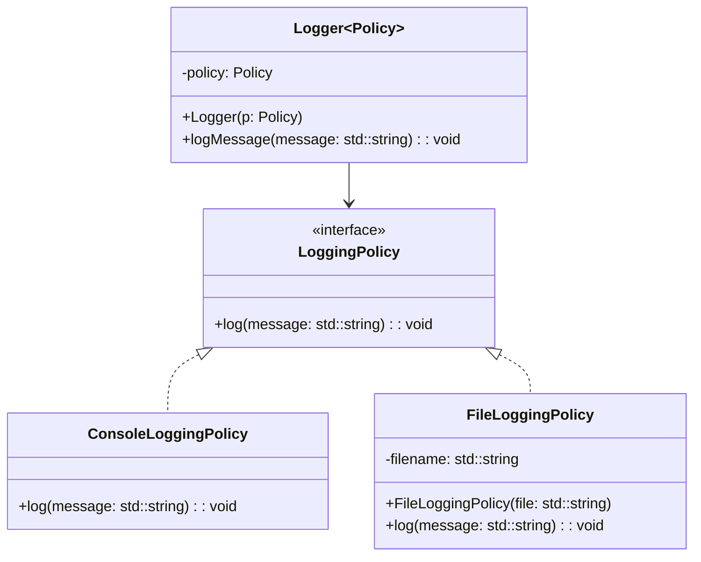

## 9.7 Policy-Based Design

In the realm of C++ programming, creating flexible and reusable libraries is a cornerstone of efficient software development. Policy-Based Design is a powerful technique that leverages C++ templates to achieve this flexibility. By decoupling algorithms from the policies that govern their behavior, developers can create highly adaptable code that can be easily customized for different use cases. In this section, we will delve into the intricacies of Policy-Based Design, explore strategies for implementing template policies, and provide comprehensive examples to illustrate these concepts.

### Understanding Policy-Based Design

**Policy-Based Design** is a design pattern that allows developers to define a set of behaviors or strategies (policies) that can be selected at compile time. This approach enables the creation of highly customizable and efficient libraries by separating the core logic from the specific behaviors that can vary.

#### Key Concepts

- **Policy**: A policy is a class or a set of classes that define specific behavior or strategy. Policies are typically implemented as template parameters, allowing them to be easily swapped or combined.
- **Host Class**: The host class is the primary class that uses policies to define its behavior. It is usually a template class that takes one or more policy classes as template parameters.
- **Policy Interface**: The interface that a policy must adhere to in order to be used by the host class. This ensures that the host class can interact with different policies in a consistent manner.

#### Benefits of Policy-Based Design

- **Flexibility**: Policies can be easily swapped or combined to create different behaviors without modifying the host class.
- **Reusability**: Policies can be reused across different host classes, promoting code reuse.
- **Efficiency**: Since policies are resolved at compile time, there is no runtime overhead associated with dynamic polymorphism.

### Strategies for Template Policies

Implementing template policies requires careful consideration of the design and structure of both the host class and the policies themselves. Here are some strategies to consider:

#### 1. Define Clear Policy Interfaces

Ensure that each policy adheres to a well-defined interface. This allows the host class to interact with different policies seamlessly. Use abstract base classes or concepts (in C++20) to define these interfaces.

#### 2. Use Default Policies

Provide default policies for the host class to simplify usage. This allows users to instantiate the host class without specifying policies, while still providing the option to customize behavior when needed.

#### 3. Combine Policies

Allow multiple policies to be combined to create complex behaviors. This can be achieved by using multiple template parameters or by creating composite policies that aggregate multiple behaviors.

#### 4. Document Policy Requirements

Clearly document the requirements and expectations for each policy. This includes the methods that must be implemented and any assumptions that the host class makes about the policy.

### Implementing the Policy Pattern in Code

Let's explore a practical example of Policy-Based Design by implementing a simple logging system. This system will demonstrate how different logging strategies (policies) can be used to customize the behavior of a logger class.

#### Step 1: Define the Policy Interface

First, we define the interface that each logging policy must adhere to. This interface will consist of a single method, `log`, which takes a message as a parameter.

```cpp
// Policy interface for logging
class LoggingPolicy {
public:
    virtual void log(const std::string& message) const = 0;
};
```

#### Step 2: Implement Concrete Policies

Next, we implement concrete policies that adhere to the `LoggingPolicy` interface. In this example, we'll create two policies: `ConsoleLoggingPolicy` and `FileLoggingPolicy`.

```cpp
#include <iostream>
#include <fstream>

// Console logging policy
class ConsoleLoggingPolicy : public LoggingPolicy {
public:
    void log(const std::string& message) const override {
        std::cout << "Console: " << message << std::endl;
    }
};

// File logging policy
class FileLoggingPolicy : public LoggingPolicy {
private:
    std::string filename;
public:
    FileLoggingPolicy(const std::string& file) : filename(file) {}

    void log(const std::string& message) const override {
        std::ofstream file(filename, std::ios_base::app);
        if (file.is_open()) {
            file << "File: " << message << std::endl;
        }
    }
};
```

#### Step 3: Implement the Host Class

The host class, `Logger`, uses a policy to determine how messages are logged. It is a template class that takes a policy class as a template parameter.

```cpp
template <typename Policy>
class Logger {
private:
    Policy policy;
public:
    Logger(const Policy& p) : policy(p) {}

    void logMessage(const std::string& message) const {
        policy.log(message);
    }
};
```

#### Step 4: Use the Logger with Different Policies

Finally, we demonstrate how to use the `Logger` class with different policies.

```cpp
int main() {
    ConsoleLoggingPolicy consolePolicy;
    FileLoggingPolicy filePolicy("log.txt");

    Logger<ConsoleLoggingPolicy> consoleLogger(consolePolicy);
    Logger<FileLoggingPolicy> fileLogger(filePolicy);

    consoleLogger.logMessage("This is a console log message.");
    fileLogger.logMessage("This is a file log message.");

    return 0;
}
```

### Visualizing Policy-Based Design

To better understand the relationships between the components in Policy-Based Design, let's visualize the structure using a class diagram.



### Design Considerations

When implementing Policy-Based Design, consider the following:

- **Compile-Time vs. Runtime**: Policies are resolved at compile time, which can lead to increased compilation times. However, this trade-off is often acceptable given the performance benefits.
- **Complexity**: While Policy-Based Design can increase flexibility, it can also introduce complexity. Ensure that the added flexibility is justified by the use case.
- **Documentation**: Thoroughly document the policies and their interfaces to aid users in understanding how to implement and use them.

### Differences and Similarities

Policy-Based Design is often compared to other design patterns, such as the Strategy Pattern. While both patterns involve encapsulating behavior, there are key differences:

- **Strategy Pattern**: Typically involves runtime polymorphism, where strategies are selected at runtime. This can introduce runtime overhead.
- **Policy-Based Design**: Uses compile-time polymorphism, where policies are selected at compile time. This eliminates runtime overhead but requires template programming.

### Try It Yourself

To deepen your understanding of Policy-Based Design, try modifying the example code:

- **Add a New Policy**: Implement a new logging policy, such as `NetworkLoggingPolicy`, that sends log messages over a network.
- **Combine Policies**: Create a composite policy that combines multiple logging strategies, such as logging to both the console and a file.
- **Use Concepts**: If you're using C++20, refactor the code to use concepts to define the policy interface.

### Knowledge Check

Before we wrap up, let's reinforce what we've learned:

- **What is a policy in Policy-Based Design?**
- **How does Policy-Based Design differ from the Strategy Pattern?**
- **What are the benefits of using Policy-Based Design?**

### Embrace the Journey

Remember, mastering Policy-Based Design is just the beginning. As you continue to explore C++ design patterns, you'll discover new ways to create flexible and efficient software. Keep experimenting, stay curious, and enjoy the journey!

## Quiz Time!



### What is the primary benefit of Policy-Based Design?

- [x] Flexibility and compile-time customization
- [ ] Runtime polymorphism
- [ ] Simplicity in code
- [ ] Reduced compilation time

> **Explanation:** Policy-Based Design provides flexibility and customization at compile time, allowing for efficient and adaptable code.

### How are policies typically implemented in Policy-Based Design?

- [x] As template parameters
- [ ] As abstract classes
- [ ] As runtime objects
- [ ] As global variables

> **Explanation:** Policies are typically implemented as template parameters, allowing them to be selected and customized at compile time.

### What is a key difference between Policy-Based Design and the Strategy Pattern?

- [x] Policy-Based Design uses compile-time polymorphism
- [ ] Policy-Based Design uses runtime polymorphism
- [ ] Strategy Pattern uses compile-time polymorphism
- [ ] Strategy Pattern is more flexible

> **Explanation:** Policy-Based Design uses compile-time polymorphism, while the Strategy Pattern typically uses runtime polymorphism.

### What is a potential drawback of Policy-Based Design?

- [x] Increased compilation times
- [ ] Increased runtime overhead
- [ ] Lack of flexibility
- [ ] Difficulty in testing

> **Explanation:** Policy-Based Design can lead to increased compilation times due to the use of templates and compile-time resolution.

### Which of the following is NOT a benefit of Policy-Based Design?

- [ ] Flexibility
- [ ] Reusability
- [x] Reduced complexity
- [ ] Efficiency

> **Explanation:** While Policy-Based Design offers flexibility, reusability, and efficiency, it can also introduce complexity.

### In Policy-Based Design, what is the role of the host class?

- [x] To use policies to define its behavior
- [ ] To implement the policy interface
- [ ] To provide default policies
- [ ] To manage runtime polymorphism

> **Explanation:** The host class uses policies to define its behavior by taking policy classes as template parameters.

### What is a common strategy for implementing template policies?

- [x] Define clear policy interfaces
- [ ] Use runtime type identification
- [ ] Avoid using templates
- [ ] Implement policies as global variables

> **Explanation:** Defining clear policy interfaces ensures that the host class can interact with different policies seamlessly.

### How can multiple policies be combined in Policy-Based Design?

- [x] By using multiple template parameters
- [ ] By using inheritance
- [ ] By using global variables
- [ ] By using runtime polymorphism

> **Explanation:** Multiple policies can be combined by using multiple template parameters or creating composite policies.

### What should be documented when implementing Policy-Based Design?

- [x] Policy requirements and interfaces
- [ ] Only the host class
- [ ] Only the concrete policies
- [ ] Nothing, as it is self-explanatory

> **Explanation:** It's important to document policy requirements and interfaces to aid users in understanding how to implement and use them.

### True or False: Policy-Based Design eliminates runtime overhead by using compile-time polymorphism.

- [x] True
- [ ] False

> **Explanation:** Policy-Based Design uses compile-time polymorphism, which eliminates runtime overhead associated with dynamic polymorphism.


