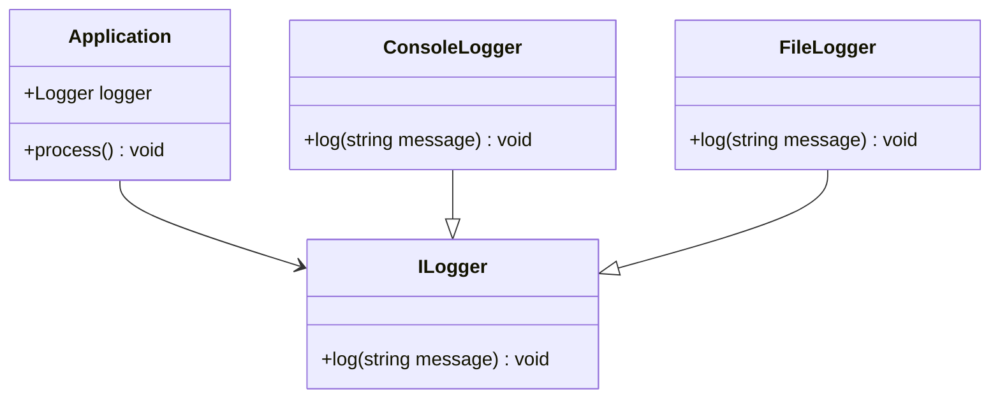

## 9.8 Dependency Injection with Templates

In the realm of software design, **Dependency Injection (DI)** is a powerful pattern that promotes loose coupling and enhances the flexibility of code. When combined with C++ templates, DI can be elevated to a new level, leveraging compile-time polymorphism to inject behavior and dependencies. This section delves into the intricacies of using templates for dependency injection, providing expert insights and practical examples to master this technique.

### Understanding Dependency Injection

**Dependency Injection** is a design pattern used to implement Inversion of Control (IoC) between classes and their dependencies. Instead of a class creating its dependencies internally, dependencies are provided to the class, typically through constructor parameters, setters, or interface methods. This approach decouples the class from its dependencies, making it easier to modify, test, and maintain.

### The Role of Templates in Dependency Injection

C++ templates offer a unique advantage in implementing DI by allowing dependencies to be injected at compile-time. This approach, known as **compile-time polymorphism**, provides several benefits:

- **Type Safety**: Errors related to dependency mismatches are caught at compile-time.
- **Performance**: Compile-time injection eliminates runtime overhead associated with dynamic polymorphism.
- **Flexibility**: Templates enable the injection of various behaviors and strategies, enhancing code reusability.

### Injecting Behavior via Template Parameters

To inject behavior using templates, we define a class template that accepts a type parameter representing the dependency. This parameter can be a class, function, or any other type that provides the required behavior.

#### Example: Logger Injection

Consider a scenario where we want to inject different logging behaviors into a class. We can achieve this using templates:

```cpp
#include <iostream>
#include <string>

// Define a simple Logger interface
class ILogger {
public:
    virtual void log(const std::string& message) = 0;
};

// ConsoleLogger implementation
class ConsoleLogger : public ILogger {
public:
    void log(const std::string& message) override {
        std::cout << "Console: " << message << std::endl;
    }
};

// FileLogger implementation
class FileLogger : public ILogger {
public:
    void log(const std::string& message) override {
        // Assume file logging implementation
        std::cout << "File: " << message << std::endl;
    }
};

// Template class that accepts a Logger type
template <typename Logger>
class Application {
    Logger logger;
public:
    void process() {
        logger.log("Processing data...");
    }
};

int main() {
    Application<ConsoleLogger> app1;
    app1.process();

    Application<FileLogger> app2;
    app2.process();

    return 0;
}
```

In this example, the `Application` class template accepts a `Logger` type, allowing us to inject different logging behaviors at compile-time. The `ConsoleLogger` and `FileLogger` classes implement the `ILogger` interface, providing specific logging strategies.

### Reducing Coupling with Templates

One of the primary goals of DI is to reduce coupling between classes and their dependencies. Templates facilitate this by decoupling the implementation from the interface, allowing for greater flexibility and easier testing.

#### Example: Strategy Pattern with Templates

The Strategy pattern is a behavioral design pattern that enables selecting an algorithm's behavior at runtime. By using templates, we can implement the Strategy pattern with compile-time polymorphism:

```cpp
#include <iostream>

// Define a strategy interface
class IStrategy {
public:
    virtual void execute() = 0;
};

// Concrete strategy implementations
class StrategyA : public IStrategy {
public:
    void execute() override {
        std::cout << "Executing Strategy A" << std::endl;
    }
};

class StrategyB : public IStrategy {
public:
    void execute() override {
        std::cout << "Executing Strategy B" << std::endl;
    }
};

// Template class that accepts a Strategy type
template <typename Strategy>
class Context {
    Strategy strategy;
public:
    void performTask() {
        strategy.execute();
    }
};

int main() {
    Context<StrategyA> contextA;
    contextA.performTask();

    Context<StrategyB> contextB;
    contextB.performTask();

    return 0;
}
```

In this example, the `Context` class template accepts a `Strategy` type, allowing us to inject different strategies at compile-time. This approach reduces coupling between the `Context` class and specific strategy implementations.

### Compile-time Polymorphism

Compile-time polymorphism is a powerful feature of C++ templates that allows for the selection of behavior at compile-time rather than runtime. This approach provides several advantages:

- **Efficiency**: Compile-time polymorphism eliminates the need for virtual function calls, reducing runtime overhead.
- **Safety**: Type mismatches and other errors are caught during compilation, improving code reliability.
- **Flexibility**: Templates enable the injection of various behaviors and strategies, enhancing code reusability.

#### Example: Policy-based Design

Policy-based design is a technique that uses templates to inject policies or strategies into a class. This approach allows for flexible and reusable code by separating the policy from the implementation.

```cpp
#include <iostream>

// Define a policy interface
class IPolicy {
public:
    virtual void applyPolicy() = 0;
};

// Concrete policy implementations
class PolicyX : public IPolicy {
public:
    void applyPolicy() override {
        std::cout << "Applying Policy X" << std::endl;
    }
};

class PolicyY : public IPolicy {
public:
    void applyPolicy() override {
        std::cout << "Applying Policy Y" << std::endl;
    }
};

// Template class that accepts a Policy type
template <typename Policy>
class PolicyManager {
    Policy policy;
public:
    void manage() {
        policy.applyPolicy();
    }
};

int main() {
    PolicyManager<PolicyX> managerX;
    managerX.manage();

    PolicyManager<PolicyY> managerY;
    managerY.manage();

    return 0;
}
```

In this example, the `PolicyManager` class template accepts a `Policy` type, allowing us to inject different policies at compile-time. This approach provides flexibility and reusability by decoupling the policy from the implementation.

### Design Considerations

When using templates for dependency injection, consider the following design considerations:

- **Type Constraints**: Ensure that the injected types satisfy the required interface or behavior. Use static assertions or concepts (C++20) to enforce constraints.
- **Code Bloat**: Be mindful of code bloat due to template instantiations. Use templates judiciously to avoid excessive code generation.
- **Compile-time Errors**: Leverage compile-time errors to catch issues early in the development process. This approach improves code reliability and maintainability.

### Differences and Similarities with Other Patterns

Dependency Injection with templates shares similarities with other design patterns, such as the Strategy and Policy-based design patterns. However, it differs in its use of compile-time polymorphism and type safety. Unlike runtime polymorphism, which relies on virtual functions, compile-time polymorphism uses templates to achieve flexibility and efficiency.

### Visualizing Dependency Injection with Templates

To better understand how Dependency Injection with templates works, let's visualize the process using a class diagram:



**Diagram Description**: This class diagram illustrates the relationship between the `Application` class and the `ILogger` interface. The `ConsoleLogger` and `FileLogger` classes implement the `ILogger` interface, providing specific logging behaviors. The `Application` class uses a template parameter to inject the desired logger type.

### Try It Yourself

To deepen your understanding of Dependency Injection with templates, try modifying the code examples provided in this section. Experiment with different strategies, policies, and behaviors to see how templates can enhance flexibility and maintainability.

- **Modify the Logger Example**: Add a new `DatabaseLogger` class that logs messages to a database. Inject this logger into the `Application` class using templates.
- **Extend the Strategy Example**: Implement additional strategies, such as `StrategyC` and `StrategyD`, and inject them into the `Context` class.
- **Experiment with Policies**: Create new policies, such as `PolicyZ`, and inject them into the `PolicyManager` class.

### References and Links

- [C++ Templates: The Complete Guide](https://www.amazon.com/C-Templates-Complete-Guide-2nd/dp/0321714121) - A comprehensive resource on C++ templates.
- [Modern C++ Design: Generic Programming and Design Patterns Applied](https://www.amazon.com/Modern-Design-Generic-Programming-Patterns/dp/0201704315) - A classic book on generic programming and design patterns in C++.
- [Dependency Injection in C++](https://en.wikipedia.org/wiki/Dependency_injection) - Wikipedia article on Dependency Injection.

### Knowledge Check

- **What is Dependency Injection, and how does it promote loose coupling?**
- **How do templates facilitate compile-time polymorphism in C++?**
- **What are the benefits of using templates for Dependency Injection?**
- **How does the Strategy pattern differ from Policy-based design?**
- **What are some design considerations when using templates for Dependency Injection?**

### Embrace the Journey

Remember, mastering Dependency Injection with templates is just the beginning. As you progress, you'll discover more advanced techniques and patterns that will further enhance your C++ programming skills. Keep experimenting, stay curious, and enjoy the journey!

## Quiz Time!



### What is Dependency Injection?

- [x] A design pattern that promotes loose coupling by providing dependencies externally.
- [ ] A method for increasing coupling between classes.
- [ ] A runtime mechanism for resolving dependencies.
- [ ] A pattern that eliminates the need for interfaces.

> **Explanation:** Dependency Injection is a design pattern that promotes loose coupling by providing dependencies externally, rather than having a class create them internally.

### How do templates facilitate compile-time polymorphism?

- [x] By allowing behavior to be selected at compile-time.
- [ ] By using virtual functions for runtime polymorphism.
- [ ] By dynamically allocating memory for objects.
- [ ] By enforcing runtime type checks.

> **Explanation:** Templates facilitate compile-time polymorphism by allowing behavior to be selected at compile-time, eliminating the need for virtual functions and runtime overhead.

### What is a key benefit of using templates for Dependency Injection?

- [x] Type safety and compile-time error checking.
- [ ] Increased runtime overhead.
- [ ] Reduced flexibility in code.
- [ ] Dependence on dynamic polymorphism.

> **Explanation:** A key benefit of using templates for Dependency Injection is type safety and compile-time error checking, which improves code reliability.

### How does the Strategy pattern differ from Policy-based design?

- [x] Strategy pattern is typically used for runtime behavior selection, while Policy-based design uses compile-time selection.
- [ ] Strategy pattern uses compile-time selection, while Policy-based design uses runtime selection.
- [ ] Both patterns are identical in their approach.
- [ ] Strategy pattern does not involve behavior selection.

> **Explanation:** The Strategy pattern is typically used for runtime behavior selection, while Policy-based design uses compile-time selection via templates.

### What is a design consideration when using templates for Dependency Injection?

- [x] Managing code bloat due to template instantiations.
- [ ] Ensuring runtime type checks.
- [ ] Increasing coupling between classes.
- [ ] Avoiding compile-time errors.

> **Explanation:** A design consideration when using templates for Dependency Injection is managing code bloat due to template instantiations, which can lead to excessive code generation.

### What is compile-time polymorphism?

- [x] A mechanism where behavior is selected at compile-time using templates.
- [ ] A mechanism where behavior is selected at runtime using virtual functions.
- [ ] A method for dynamically allocating memory.
- [ ] A runtime error checking mechanism.

> **Explanation:** Compile-time polymorphism is a mechanism where behavior is selected at compile-time using templates, providing efficiency and type safety.

### What is the role of templates in reducing coupling?

- [x] They decouple implementation from interface, allowing flexible dependency injection.
- [ ] They increase coupling by enforcing strict type checks.
- [ ] They eliminate the need for interfaces.
- [ ] They provide runtime error checking.

> **Explanation:** Templates reduce coupling by decoupling implementation from interface, allowing flexible dependency injection and enhancing code maintainability.

### What is a potential drawback of using templates?

- [x] Code bloat due to multiple template instantiations.
- [ ] Increased runtime overhead.
- [ ] Reduced type safety.
- [ ] Dependence on dynamic polymorphism.

> **Explanation:** A potential drawback of using templates is code bloat due to multiple template instantiations, which can lead to larger binary sizes.

### How can templates enforce type constraints?

- [x] Using static assertions or concepts (C++20).
- [ ] By relying on runtime type checks.
- [ ] By using dynamic_cast for type safety.
- [ ] By eliminating the need for interfaces.

> **Explanation:** Templates can enforce type constraints using static assertions or concepts (C++20), ensuring that injected types satisfy the required interface or behavior.

### True or False: Compile-time polymorphism eliminates the need for virtual functions.

- [x] True
- [ ] False

> **Explanation:** True. Compile-time polymorphism eliminates the need for virtual functions by selecting behavior at compile-time using templates, reducing runtime overhead.


