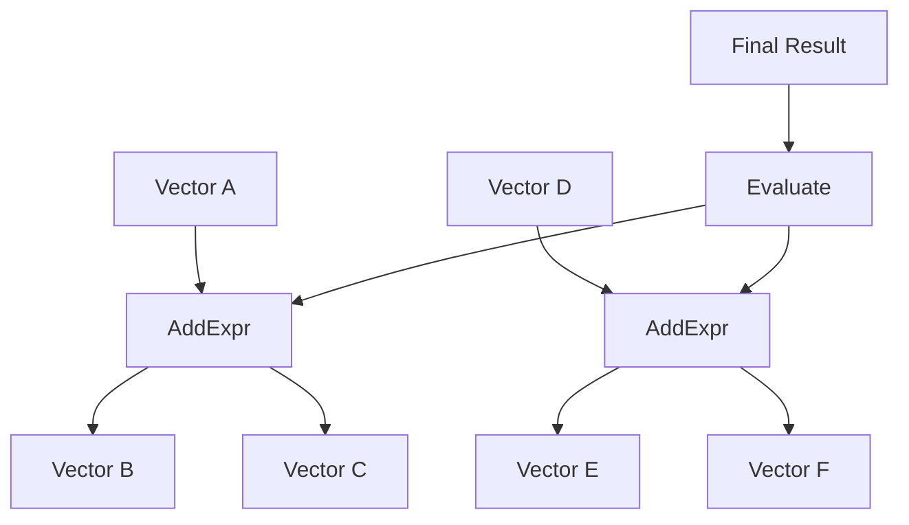

## 9.9 Expression Templates and Lazy Evaluation

In the realm of high-performance computing, particularly in numerical and scientific applications, efficiency is paramount. One of the advanced techniques that C++ developers can leverage to enhance performance is the use of **expression templates** combined with **lazy evaluation**. These techniques allow for the construction of efficient numerical libraries by minimizing unnecessary computations and memory allocations. In this section, we will delve into the concepts of expression templates and lazy evaluation, explore their applications, and provide practical examples to illustrate their power.

### Introduction to Expression Templates

Expression templates are a C++ programming technique used to optimize the performance of mathematical expressions. The primary goal is to avoid the creation of temporary objects that can degrade performance, especially in complex numerical computations.

#### What Are Expression Templates?

Expression templates are a form of template metaprogramming that represent mathematical expressions as a compile-time structure. Instead of evaluating expressions immediately, they build a representation of the expression that can be evaluated later, often in a more optimized manner.

**Key Benefits:**
- **Avoidance of Temporary Objects:** By constructing expressions at compile-time, expression templates eliminate the need for intermediate temporary objects, which can be costly in terms of both time and space.
- **Improved Performance:** By deferring evaluation, expression templates can optimize the computation by combining operations and reducing the number of passes over data.

#### How Expression Templates Work

Expression templates work by overloading operators to return objects that represent the expression rather than performing the computation immediately. These objects are then combined to form a larger expression tree, which can be evaluated in a single pass.

**Example:**

Consider a simple vector addition operation:

```cpp
#include <iostream>
#include <vector>

// A simple vector class
class Vector {
public:
    std::vector<double> data;

    Vector(size_t size) : data(size) {}

    // Overload the addition operator
    Vector operator+(const Vector& other) const {
        Vector result(data.size());
        for (size_t i = 0; i < data.size(); ++i) {
            result.data[i] = data[i] + other.data[i];
        }
        return result;
    }
};
```

In the above example, the `operator+` creates a temporary `Vector` object to store the result of the addition. In complex expressions involving multiple operations, this can lead to the creation of numerous temporary objects.

**Expression Template Approach:**

```cpp
#include <iostream>
#include <vector>

// Forward declaration of the AddExpr class
template<typename L, typename R>
class AddExpr;

// A simple vector class using expression templates
class Vector {
public:
    std::vector<double> data;

    Vector(size_t size) : data(size) {}

    // Constructor for expression templates
    template<typename L, typename R>
    Vector(const AddExpr<L, R>& expr) : data(expr.size()) {
        for (size_t i = 0; i < data.size(); ++i) {
            data[i] = expr[i];
        }
    }

    // Overload the addition operator to return an expression
    template<typename R>
    AddExpr<Vector, R> operator+(const R& other) const {
        return AddExpr<Vector, R>(*this, other);
    }
};

// Expression template for addition
template<typename L, typename R>
class AddExpr {
    const L& lhs;
    const R& rhs;

public:
    AddExpr(const L& lhs, const R& rhs) : lhs(lhs), rhs(rhs) {}

    double operator[](size_t i) const {
        return lhs[i] + rhs[i];
    }

    size_t size() const {
        return lhs.size();
    }
};
```

In this example, the `operator+` returns an `AddExpr` object that represents the addition operation. The actual computation is deferred until the result is needed, at which point the entire expression can be evaluated in a single pass.

### Lazy Evaluation

Lazy evaluation is a strategy that delays the evaluation of an expression until its value is actually needed. This can lead to significant performance improvements by avoiding unnecessary computations.

#### Why Use Lazy Evaluation?

- **Efficiency:** By deferring computation, lazy evaluation can combine multiple operations into a single pass, reducing the overall computational cost.
- **Resource Management:** It helps in managing resources efficiently by avoiding unnecessary memory allocations and deallocations.

#### Implementing Lazy Evaluation

Lazy evaluation can be implemented using expression templates by constructing a representation of the expression that is only evaluated when required.

**Example:**

Let's extend our previous example to include lazy evaluation:

```cpp
#include <iostream>
#include <vector>

// A simple vector class using expression templates and lazy evaluation
class Vector {
public:
    std::vector<double> data;

    Vector(size_t size) : data(size) {}

    template<typename L, typename R>
    Vector(const AddExpr<L, R>& expr) : data(expr.size()) {
        for (size_t i = 0; i < data.size(); ++i) {
            data[i] = expr[i];
        }
    }

    template<typename R>
    AddExpr<Vector, R> operator+(const R& other) const {
        return AddExpr<Vector, R>(*this, other);
    }

    double operator[](size_t i) const {
        return data[i];
    }

    size_t size() const {
        return data.size();
    }
};

// Expression template for addition with lazy evaluation
template<typename L, typename R>
class AddExpr {
    const L& lhs;
    const R& rhs;

public:
    AddExpr(const L& lhs, const R& rhs) : lhs(lhs), rhs(rhs) {}

    double operator[](size_t i) const {
        return lhs[i] + rhs[i];
    }

    size_t size() const {
        return lhs.size();
    }
};
```

In this implementation, the `AddExpr` class represents the addition operation, and the actual computation is deferred until the `Vector` constructor is called. This allows for the entire expression to be evaluated in a single pass, minimizing the creation of temporary objects.

### Use Cases in Scientific Computing

Expression templates and lazy evaluation are particularly useful in scientific computing, where complex mathematical expressions are common, and performance is critical.

#### Numerical Libraries

Numerical libraries often involve operations on large datasets, such as matrices and vectors. Expression templates can be used to optimize these operations by eliminating unnecessary temporary objects and combining multiple operations into a single pass.

**Example:**

Consider a matrix multiplication operation:

```cpp
#include <iostream>
#include <vector>

// A simple matrix class
class Matrix {
public:
    std::vector<std::vector<double>> data;

    Matrix(size_t rows, size_t cols) : data(rows, std::vector<double>(cols)) {}

    // Overload the multiplication operator
    Matrix operator*(const Matrix& other) const {
        size_t rows = data.size();
        size_t cols = other.data[0].size();
        Matrix result(rows, cols);
        for (size_t i = 0; i < rows; ++i) {
            for (size_t j = 0; j < cols; ++j) {
                for (size_t k = 0; k < data[0].size(); ++k) {
                    result.data[i][j] += data[i][k] * other.data[k][j];
                }
            }
        }
        return result;
    }
};
```

In this example, the `operator*` creates a temporary `Matrix` object to store the result of the multiplication. By using expression templates, we can optimize this operation to avoid the creation of temporary objects.

**Expression Template Approach:**

```cpp
#include <iostream>
#include <vector>

// Forward declaration of the MulExpr class
template<typename L, typename R>
class MulExpr;

// A simple matrix class using expression templates
class Matrix {
public:
    std::vector<std::vector<double>> data;

    Matrix(size_t rows, size_t cols) : data(rows, std::vector<double>(cols)) {}

    // Constructor for expression templates
    template<typename L, typename R>
    Matrix(const MulExpr<L, R>& expr) : data(expr.rows(), std::vector<double>(expr.cols())) {
        for (size_t i = 0; i < expr.rows(); ++i) {
            for (size_t j = 0; j < expr.cols(); ++j) {
                data[i][j] = expr(i, j);
            }
        }
    }

    // Overload the multiplication operator to return an expression
    template<typename R>
    MulExpr<Matrix, R> operator*(const R& other) const {
        return MulExpr<Matrix, R>(*this, other);
    }
};

// Expression template for multiplication
template<typename L, typename R>
class MulExpr {
    const L& lhs;
    const R& rhs;

public:
    MulExpr(const L& lhs, const R& rhs) : lhs(lhs), rhs(rhs) {}

    double operator()(size_t i, size_t j) const {
        double sum = 0;
        for (size_t k = 0; k < lhs.data[0].size(); ++k) {
            sum += lhs.data[i][k] * rhs.data[k][j];
        }
        return sum;
    }

    size_t rows() const {
        return lhs.data.size();
    }

    size_t cols() const {
        return rhs.data[0].size();
    }
};
```

In this implementation, the `operator*` returns a `MulExpr` object that represents the multiplication operation. The actual computation is deferred until the `Matrix` constructor is called, allowing for the entire expression to be evaluated in a single pass.

### Visualizing Expression Templates

To better understand how expression templates work, let's visualize the process using a diagram. The following diagram illustrates the construction of an expression tree for a simple vector addition operation:



**Diagram Explanation:**
- **Nodes A, C, D, G, and H** represent the original vectors involved in the operations.
- **Nodes B and F** represent the expression templates for the addition operations.
- **Node J** represents the evaluation step, where the entire expression tree is evaluated in a single pass to produce the final result.

### Design Considerations

When implementing expression templates and lazy evaluation, there are several important considerations to keep in mind:

#### When to Use Expression Templates

- **Performance-Critical Applications:** Expression templates are most beneficial in applications where performance is critical, such as numerical libraries and scientific computing.
- **Complex Expressions:** They are particularly useful in scenarios involving complex expressions with multiple operations, where the creation of temporary objects can significantly degrade performance.

#### Potential Pitfalls

- **Complexity:** Expression templates can add complexity to the code, making it harder to read and maintain. It's important to balance the performance benefits with the added complexity.
- **Compile-Time Overhead:** Since expression templates rely on template metaprogramming, they can increase compile-time overhead. This may not be a concern for small projects but can become significant in large codebases.

### Differences and Similarities with Other Patterns

Expression templates share some similarities with other optimization techniques, such as:

- **Template Metaprogramming:** Both expression templates and template metaprogramming involve using templates to perform computations at compile-time.
- **Lazy Evaluation:** Expression templates often employ lazy evaluation, a technique also used in functional programming to defer computation until necessary.

However, expression templates are distinct in their focus on optimizing mathematical expressions by avoiding temporary objects and combining operations.

### Try It Yourself

Now that we've explored the concepts of expression templates and lazy evaluation, let's encourage you to experiment with these techniques. Try modifying the code examples provided to implement additional operations, such as subtraction or division. Observe how the use of expression templates affects the performance of your code.

### Knowledge Check

Before we conclude, let's reinforce your understanding with a few questions:

- **What are the primary benefits of using expression templates in numerical libraries?**
- **How does lazy evaluation contribute to performance optimization?**
- **What are some potential pitfalls to be aware of when using expression templates?**

### Conclusion

Expression templates and lazy evaluation are powerful techniques for optimizing performance in numerical libraries and scientific computing applications. By avoiding temporary objects and deferring computation, they enable developers to build efficient and high-performance code. As you continue your journey in mastering C++ design patterns, consider incorporating these techniques into your projects to achieve optimal performance.

## Quiz Time!



### What is the primary goal of expression templates?

- [x] To avoid the creation of temporary objects
- [ ] To simplify code readability
- [ ] To increase compile-time
- [ ] To enhance security

> **Explanation:** Expression templates are designed to optimize performance by avoiding the creation of temporary objects during complex mathematical operations.

### How do expression templates improve performance?

- [x] By deferring computation and combining operations
- [ ] By simplifying code syntax
- [ ] By increasing memory usage
- [ ] By reducing compile-time

> **Explanation:** Expression templates improve performance by deferring computation and allowing multiple operations to be combined into a single pass, reducing the need for temporary objects.

### What is lazy evaluation?

- [x] A strategy that delays the evaluation of an expression until its value is needed
- [ ] A method to simplify code syntax
- [ ] A technique to increase compile-time
- [ ] A way to enhance security

> **Explanation:** Lazy evaluation is a strategy that delays the evaluation of an expression until its value is actually needed, which can improve performance by avoiding unnecessary computations.

### In which scenarios are expression templates most beneficial?

- [x] Performance-critical applications
- [ ] Small-scale projects
- [ ] Simple expressions
- [ ] Applications with minimal computations

> **Explanation:** Expression templates are most beneficial in performance-critical applications, especially those involving complex expressions with multiple operations.

### What is a potential pitfall of using expression templates?

- [x] Increased code complexity
- [ ] Simplified code readability
- [ ] Reduced performance
- [ ] Enhanced security

> **Explanation:** Expression templates can add complexity to the code, making it harder to read and maintain, which is a potential pitfall to consider.

### What is the relationship between expression templates and template metaprogramming?

- [x] Both involve using templates to perform computations at compile-time
- [ ] Expression templates simplify template metaprogramming
- [ ] Template metaprogramming is unrelated to expression templates
- [ ] Expression templates increase runtime performance

> **Explanation:** Both expression templates and template metaprogramming involve using templates to perform computations at compile-time, although they focus on different aspects.

### How does lazy evaluation contribute to resource management?

- [x] By avoiding unnecessary memory allocations and deallocations
- [ ] By increasing memory usage
- [ ] By simplifying code syntax
- [ ] By reducing compile-time

> **Explanation:** Lazy evaluation contributes to resource management by avoiding unnecessary memory allocations and deallocations, leading to more efficient use of resources.

### What is a key benefit of using expression templates in scientific computing?

- [x] Improved performance in numerical computations
- [ ] Simplified code syntax
- [ ] Increased compile-time
- [ ] Enhanced security

> **Explanation:** Expression templates are particularly useful in scientific computing for improving performance in numerical computations by optimizing the evaluation of complex expressions.

### What is the role of the `AddExpr` class in the expression template example?

- [x] To represent the addition operation as an expression
- [ ] To perform the addition operation immediately
- [ ] To simplify code syntax
- [ ] To increase compile-time

> **Explanation:** The `AddExpr` class represents the addition operation as an expression, allowing the actual computation to be deferred until needed.

### Expression templates can increase compile-time overhead.

- [x] True
- [ ] False

> **Explanation:** Expression templates rely on template metaprogramming, which can increase compile-time overhead, especially in large codebases.



Remember, this is just the beginning. As you progress, you'll build more complex and efficient numerical libraries. Keep experimenting, stay curious, and enjoy the journey!
