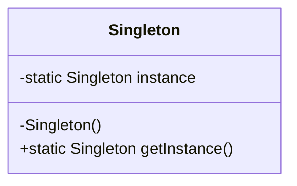

## 1.1 What Are Design Patterns in D?

### Introduction

Design patterns are a crucial aspect of software engineering, providing time-tested solutions to common design challenges. In the context of the D programming language, design patterns play a pivotal role in crafting robust, scalable, and maintainable systems. This section delves into the essence of design patterns, their relevance in D, and how D's unique features enhance their implementation.

### Definition and Relevance

**Design Patterns** are reusable solutions to common problems in software design. They are not finished designs that can be directly transformed into code but are templates for how to solve a problem in various situations. In D, design patterns help developers leverage the language's strengths to create efficient and elegant solutions.

#### Why Design Patterns Matter

1. **Standardized Solutions**: Design patterns provide a standard terminology and are specific to particular scenarios. This helps in reducing the complexity of the design process.

2. **Improved Communication**: By using design patterns, developers can communicate more effectively. Patterns provide a shared language that can be used to convey complex ideas succinctly.

3. **Enhanced Maintainability**: Patterns lead to code that is easier to understand and maintain. They encapsulate best practices and reduce the risk of introducing errors when modifying code.

4. **Facilitating Reusability**: Patterns promote code reuse, which can lead to faster development times and reduced costs.

### Role in Software Development

Design patterns serve as a bridge between the theoretical aspects of software design and practical implementation. They help in:

- **Abstracting Complexity**: By providing a high-level view of the system architecture, design patterns help manage complexity.
  
- **Encouraging Best Practices**: Patterns encapsulate best practices, ensuring that developers follow a proven approach to solving problems.

- **Supporting Agile Development**: In agile environments, where requirements change frequently, design patterns provide a flexible framework that can adapt to new requirements.

### D-Specific Considerations

The D programming language offers unique features that influence the implementation of design patterns. These features include:

1. **Templates and Generics**: D's powerful template system allows for the creation of highly reusable and type-safe components. This is particularly useful in implementing patterns like Singleton or Factory.

2. **Compile-Time Function Execution (CTFE)**: CTFE enables the evaluation of functions at compile time, allowing for optimizations and more efficient code generation.

3. **Mixins and Metaprogramming**: D's mixin feature allows for code generation and reuse, which can simplify the implementation of complex patterns.

4. **Memory Safety Features**: D provides attributes like `@safe`, `@trusted`, and `@system` to ensure memory safety, which is crucial when implementing patterns that manage resources.

5. **Concurrency Support**: With built-in support for concurrency and parallelism, D makes it easier to implement patterns that require concurrent execution, such as the Observer or Command patterns.

### Implementing Design Patterns in D

Let's explore how some common design patterns can be implemented in D, highlighting the language's unique features.

#### Singleton Pattern

**Intent**: Ensure a class has only one instance and provide a global point of access to it.

**Implementation**:

```d
class Singleton {
    private static Singleton instance;

    // Private constructor to prevent instantiation
    private this() {}

    // Static method to provide access to the instance
    public static Singleton getInstance() {
        if (instance is null) {
            instance = new Singleton();
        }
        return instance;
    }
}
```

**Key Considerations**: Use D's `synchronized` keyword to make the `getInstance` method thread-safe if needed.

#### Factory Method Pattern

**Intent**: Define an interface for creating an object, but let subclasses alter the type of objects that will be created.

**Implementation**:

```d
interface Product {
    void use();
}

class ConcreteProductA : Product {
    void use() {
        writeln("Using Product A");
    }
}

class ConcreteProductB : Product {
    void use() {
        writeln("Using Product B");
    }
}

abstract class Creator {
    abstract Product factoryMethod();

    void someOperation() {
        auto product = factoryMethod();
        product.use();
    }
}

class ConcreteCreatorA : Creator {
    Product factoryMethod() {
        return new ConcreteProductA();
    }
}

class ConcreteCreatorB : Creator {
    Product factoryMethod() {
        return new ConcreteProductB();
    }
}
```

**Key Considerations**: Leverage D's interfaces and abstract classes to define the product and creator hierarchies.

### Visualizing Design Patterns

To better understand the structure and flow of design patterns, let's visualize the Singleton pattern using a class diagram.



**Diagram Explanation**: The diagram illustrates the Singleton class with a private static instance and a public static method to access the instance.

### Try It Yourself

Experiment with the provided code examples by:

- Modifying the Singleton pattern to include thread safety using the `synchronized` keyword.
- Extending the Factory Method pattern to include additional product types and creators.

### Knowledge Check

- **Question**: What are the benefits of using design patterns in D?
- **Exercise**: Implement a simple Observer pattern in D using delegates.

### Embrace the Journey

Remember, mastering design patterns in D is a journey. As you explore these patterns, you'll gain a deeper understanding of how to leverage D's features to build efficient and maintainable systems. Keep experimenting, stay curious, and enjoy the process!

### References and Links

- [Design Patterns: Elements of Reusable Object-Oriented Software](https://en.wikipedia.org/wiki/Design_Patterns) - A foundational book on design patterns.
- [D Programming Language Documentation](https://dlang.org/) - Official documentation for the D programming language.

## Quiz Time!



### What is the primary purpose of design patterns in software development?

- [x] To provide reusable solutions to common design problems
- [ ] To enforce strict coding standards
- [ ] To replace the need for documentation
- [ ] To eliminate the need for testing

> **Explanation:** Design patterns offer reusable solutions to common design problems, facilitating better communication and maintainability.

### Which feature of D allows for code execution at compile time?

- [x] Compile-Time Function Execution (CTFE)
- [ ] Mixins
- [ ] Templates
- [ ] Interfaces

> **Explanation:** CTFE in D allows functions to be executed at compile time, enabling optimizations and efficient code generation.

### How do design patterns improve communication among developers?

- [x] By providing a shared language and standardized solutions
- [ ] By enforcing strict coding guidelines
- [ ] By reducing the need for meetings
- [ ] By eliminating code comments

> **Explanation:** Design patterns provide a common vocabulary and standardized solutions, improving communication among developers.

### What is a key benefit of using the Singleton pattern?

- [x] Ensures a class has only one instance
- [ ] Allows multiple instances of a class
- [ ] Simplifies memory management
- [ ] Enhances code readability

> **Explanation:** The Singleton pattern ensures that a class has only one instance, providing a global point of access.

### Which D feature is particularly useful for implementing the Factory Method pattern?

- [x] Interfaces and abstract classes
- [ ] Mixins
- [ ] CTFE
- [ ] Slices

> **Explanation:** Interfaces and abstract classes in D are useful for defining the product and creator hierarchies in the Factory Method pattern.

### What role do design patterns play in agile development?

- [x] They provide a flexible framework that can adapt to changing requirements
- [ ] They enforce strict adherence to initial designs
- [ ] They eliminate the need for documentation
- [ ] They reduce the need for testing

> **Explanation:** Design patterns offer a flexible framework that can adapt to changing requirements, supporting agile development.

### How do design patterns enhance maintainability?

- [x] By encapsulating best practices and reducing complexity
- [ ] By enforcing strict coding standards
- [ ] By eliminating the need for comments
- [ ] By reducing code size

> **Explanation:** Design patterns encapsulate best practices, leading to code that is easier to understand and maintain.

### What is a unique feature of D that influences design pattern implementation?

- [x] Mixins and metaprogramming
- [ ] Strict typing
- [ ] Dynamic typing
- [ ] Lack of concurrency support

> **Explanation:** D's mixins and metaprogramming capabilities allow for code generation and reuse, influencing design pattern implementation.

### Which design pattern is used to define an interface for creating an object?

- [x] Factory Method
- [ ] Singleton
- [ ] Observer
- [ ] Strategy

> **Explanation:** The Factory Method pattern defines an interface for creating an object, allowing subclasses to alter the type of objects created.

### True or False: Design patterns eliminate the need for testing.

- [ ] True
- [x] False

> **Explanation:** Design patterns do not eliminate the need for testing; they provide reusable solutions that still require validation through testing.


