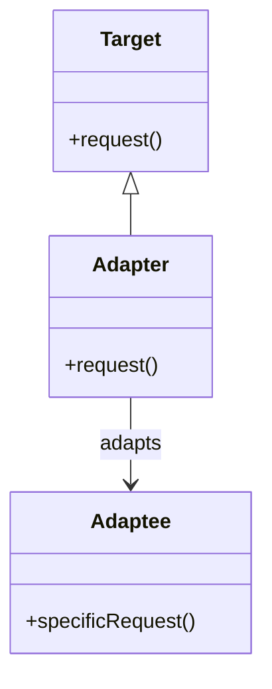

## 1.2 Types of Design Patterns in D

Design patterns are essential tools in the software engineer's toolkit, providing time-tested solutions to common design problems. In the D programming language, these patterns are adapted to leverage D's unique features, such as templates, mixins, and compile-time function execution. This section explores the various types of design patterns in D, focusing on creational, structural, behavioral, and systems programming patterns. Each pattern type serves a distinct purpose and is suited to different scenarios in software development.

### Creational Patterns

Creational patterns deal with object creation mechanisms, aiming to create objects in a manner suitable to the situation. These patterns abstract the instantiation process, making the system independent of how its objects are created, composed, and represented.

#### Singleton Pattern

**Intent**: Ensure a class has only one instance and provide a global point of access to it.

**Key Participants**:
- Singleton: The class that is responsible for creating and managing its own unique instance.

**Applicability**: Use the Singleton pattern when there must be exactly one instance of a class, and it must be accessible from a well-known access point.

**Sample Code Snippet**:
```d
class Singleton {
    private static Singleton instance;

    static Singleton getInstance() {
        if (instance is null) {
            instance = new Singleton();
        }
        return instance;
    }

    private this() {
        // Private constructor to prevent instantiation
    }
}
```

**Design Considerations**: In D, you can use `shared static this()` for initialization, ensuring thread safety.

#### Factory Method Pattern

**Intent**: Define an interface for creating an object, but let subclasses alter the type of objects that will be created.

**Key Participants**:
- Creator: Declares the factory method.
- ConcreteCreator: Implements the factory method to return an instance of a ConcreteProduct.

**Applicability**: Use this pattern when a class cannot anticipate the class of objects it must create.

**Sample Code Snippet**:
```d
interface Product {
    void use();
}

class ConcreteProductA : Product {
    void use() {
        writeln("Using Product A");
    }
}

class ConcreteProductB : Product {
    void use() {
        writeln("Using Product B");
    }
}

abstract class Creator {
    abstract Product factoryMethod();
}

class ConcreteCreatorA : Creator {
    Product factoryMethod() {
        return new ConcreteProductA();
    }
}

class ConcreteCreatorB : Creator {
    Product factoryMethod() {
        return new ConcreteProductB();
    }
}
```

**Design Considerations**: D's templates can be used to create more flexible factory methods.

### Structural Patterns

Structural patterns ease the design by identifying a simple way to realize relationships among entities. They help ensure that if one part of a system changes, the entire system doesn't need to change.

#### Adapter Pattern

**Intent**: Convert the interface of a class into another interface clients expect. Adapter lets classes work together that couldn't otherwise because of incompatible interfaces.

**Key Participants**:
- Target: Defines the domain-specific interface that Client uses.
- Adapter: Adapts the interface of Adaptee to the Target interface.
- Adaptee: Defines an existing interface that needs adapting.

**Applicability**: Use the Adapter pattern when you want to use an existing class, and its interface does not match the one you need.

**Sample Code Snippet**:
```d
interface Target {
    void request();
}

class Adaptee {
    void specificRequest() {
        writeln("Specific request");
    }
}

class Adapter : Target {
    private Adaptee adaptee;

    this(Adaptee adaptee) {
        this.adaptee = adaptee;
    }

    void request() {
        adaptee.specificRequest();
    }
}
```

**Design Considerations**: D's mixins can be used to dynamically adapt interfaces at compile time.

#### Composite Pattern

**Intent**: Compose objects into tree structures to represent part-whole hierarchies. Composite lets clients treat individual objects and compositions of objects uniformly.

**Key Participants**:
- Component: Declares the interface for objects in the composition.
- Leaf: Represents leaf objects in the composition.
- Composite: Defines behavior for components having children.

**Applicability**: Use the Composite pattern when you want to represent part-whole hierarchies of objects.

**Sample Code Snippet**:
```d
interface Component {
    void operation();
}

class Leaf : Component {
    void operation() {
        writeln("Leaf operation");
    }
}

class Composite : Component {
    private Component[] children;

    void add(Component component) {
        children ~= component;
    }

    void operation() {
        foreach (child; children) {
            child.operation();
        }
    }
}
```

**Design Considerations**: D's dynamic arrays and ranges can be used to manage collections of components efficiently.

### Behavioral Patterns

Behavioral patterns identify common communication patterns among objects and realize these patterns. They help make complex behavior manageable and understandable.

#### Observer Pattern

**Intent**: Define a one-to-many dependency between objects so that when one object changes state, all its dependents are notified and updated automatically.

**Key Participants**:
- Subject: Knows its observers and provides an interface for attaching and detaching Observer objects.
- Observer: Defines an updating interface for objects that should be notified of changes in a Subject.

**Applicability**: Use the Observer pattern when a change to one object requires changing others, and you don't know how many objects need to be changed.

**Sample Code Snippet**:
```d
interface Observer {
    void update();
}

class ConcreteObserver : Observer {
    void update() {
        writeln("Observer updated");
    }
}

class Subject {
    private Observer[] observers;

    void attach(Observer observer) {
        observers ~= observer;
    }

    void notifyObservers() {
        foreach (observer; observers) {
            observer.update();
        }
    }
}
```

**Design Considerations**: D's delegates can be used to implement callback mechanisms efficiently.

#### Strategy Pattern

**Intent**: Define a family of algorithms, encapsulate each one, and make them interchangeable. Strategy lets the algorithm vary independently from clients that use it.

**Key Participants**:
- Strategy: Declares an interface common to all supported algorithms.
- ConcreteStrategy: Implements the algorithm using the Strategy interface.
- Context: Maintains a reference to a Strategy object.

**Applicability**: Use the Strategy pattern when you want to define a class that will have one behavior among a set of behaviors.

**Sample Code Snippet**:
```d
interface Strategy {
    void execute();
}

class ConcreteStrategyA : Strategy {
    void execute() {
        writeln("Executing Strategy A");
    }
}

class ConcreteStrategyB : Strategy {
    void execute() {
        writeln("Executing Strategy B");
    }
}

class Context {
    private Strategy strategy;

    this(Strategy strategy) {
        this.strategy = strategy;
    }

    void executeStrategy() {
        strategy.execute();
    }
}
```

**Design Considerations**: D's function pointers and delegates can be used to implement strategies dynamically.

### Systems Programming Patterns

Systems programming patterns are particularly relevant to systems programming, leveraging D's capabilities to interact with hardware and manage resources efficiently.

#### RAII (Resource Acquisition Is Initialization)

**Intent**: Ensure that resources are properly released by tying resource management to object lifetime.

**Key Participants**:
- Resource Manager: Acquires resources in its constructor and releases them in its destructor.

**Applicability**: Use RAII when you need to ensure that resources are released in a timely manner.

**Sample Code Snippet**:
```d
class Resource {
    this() {
        writeln("Resource acquired");
    }

    ~this() {
        writeln("Resource released");
    }
}

void main() {
    {
        auto resource = new Resource();
        // Use resource
    } // Resource is automatically released here
}
```

**Design Considerations**: D's garbage collector can be bypassed using `@nogc` and manual memory management techniques.

#### Inline Assembly

**Intent**: Perform low-level operations directly in D code using inline assembly.

**Key Participants**:
- Inline Assembly Block: Contains assembly instructions embedded within D code.

**Applicability**: Use inline assembly when you need to perform operations that are not directly supported by D.

**Sample Code Snippet**:
```d
void main() {
    int result;
    asm {
        mov EAX, 1;
        add EAX, 2;
        mov result, EAX;
    }
    writeln("Result: ", result); // Output: Result: 3
}
```

**Design Considerations**: Inline assembly should be used sparingly and only when necessary, as it can compromise portability and readability.

### Visualizing Design Patterns

To better understand the relationships and interactions between different design patterns, we can use diagrams. Below is a class diagram illustrating the Adapter pattern:



**Description**: This diagram shows how the Adapter class implements the Target interface and adapts the Adaptee class's interface to be compatible with the Target interface.

### Try It Yourself

Experiment with the provided code examples by modifying them to suit different scenarios. For instance, try implementing a new strategy in the Strategy pattern or adding a new type of product in the Factory Method pattern. This hands-on approach will deepen your understanding of how these patterns can be applied in real-world applications.

### References and Links

- [Design Patterns: Elements of Reusable Object-Oriented Software](https://en.wikipedia.org/wiki/Design_Patterns) - A foundational book on design patterns.
- [D Programming Language](https://dlang.org/) - Official website for the D programming language.
- [MDN Web Docs](https://developer.mozilla.org/en-US/docs/Web/JavaScript/Guide) - A comprehensive resource for web technologies.

### Knowledge Check

- What is the primary purpose of creational patterns?
- How does the Adapter pattern help in software design?
- Why is the Observer pattern useful in event-driven programming?
- What are the benefits of using RAII in systems programming?

### Embrace the Journey

Remember, mastering design patterns is a journey. As you continue to explore and experiment with these patterns in D, you'll gain deeper insights into building robust and scalable software systems. Keep experimenting, stay curious, and enjoy the journey!

## Quiz Time!



### What is the main purpose of creational patterns?

- [x] To abstract the instantiation process
- [ ] To define communication between objects
- [ ] To manage resource allocation
- [ ] To optimize performance

> **Explanation:** Creational patterns focus on abstracting the instantiation process to make the system independent of how its objects are created.

### Which pattern is used to ensure a class has only one instance?

- [x] Singleton Pattern
- [ ] Factory Method Pattern
- [ ] Adapter Pattern
- [ ] Observer Pattern

> **Explanation:** The Singleton pattern ensures a class has only one instance and provides a global point of access to it.

### What is the key benefit of the Adapter pattern?

- [x] It allows incompatible interfaces to work together
- [ ] It ensures only one instance of a class exists
- [ ] It defines a family of algorithms
- [ ] It manages resource allocation

> **Explanation:** The Adapter pattern converts the interface of a class into another interface clients expect, allowing incompatible interfaces to work together.

### In the Observer pattern, what is the role of the Subject?

- [x] To maintain a list of observers and notify them of changes
- [ ] To define an updating interface
- [ ] To encapsulate a family of algorithms
- [ ] To manage resource allocation

> **Explanation:** The Subject in the Observer pattern maintains a list of observers and provides an interface for attaching and detaching them, notifying them of changes.

### Which pattern is particularly useful for systems programming in D?

- [x] RAII
- [ ] Strategy Pattern
- [ ] Composite Pattern
- [ ] Factory Method Pattern

> **Explanation:** RAII (Resource Acquisition Is Initialization) is particularly useful in systems programming for managing resources efficiently.

### What is the primary purpose of the Strategy pattern?

- [x] To define a family of algorithms and make them interchangeable
- [ ] To convert one interface into another
- [ ] To ensure a class has only one instance
- [ ] To manage resource allocation

> **Explanation:** The Strategy pattern defines a family of algorithms, encapsulates each one, and makes them interchangeable.

### How does the Composite pattern help in software design?

- [x] It allows clients to treat individual objects and compositions uniformly
- [ ] It ensures only one instance of a class exists
- [ ] It defines a family of algorithms
- [ ] It manages resource allocation

> **Explanation:** The Composite pattern lets clients treat individual objects and compositions of objects uniformly, representing part-whole hierarchies.

### What is a key feature of D that can be used in the Adapter pattern?

- [x] Mixins
- [ ] Inline Assembly
- [ ] RAII
- [ ] Singleton

> **Explanation:** D's mixins can be used to dynamically adapt interfaces at compile time, making them a key feature for implementing the Adapter pattern.

### Which pattern is used to perform low-level operations directly in D code?

- [x] Inline Assembly
- [ ] Adapter Pattern
- [ ] Observer Pattern
- [ ] Strategy Pattern

> **Explanation:** Inline Assembly is used to perform low-level operations directly in D code using embedded assembly instructions.

### True or False: The Factory Method pattern allows subclasses to alter the type of objects that will be created.

- [x] True
- [ ] False

> **Explanation:** True. The Factory Method pattern defines an interface for creating an object but lets subclasses alter the type of objects that will be created.




