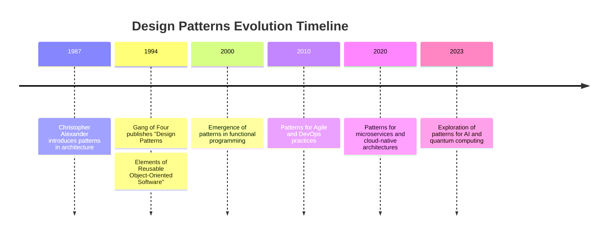

## 1.3 History and Evolution of Design Patterns

Design patterns have become a cornerstone of software engineering, providing reusable solutions to common problems. This section delves into the history and evolution of design patterns, highlighting their origins, development over time, and current trends, with a special focus on their application in the D programming language.

### Origins of Design Patterns

The concept of design patterns in software engineering was inspired by the work of architect Christopher Alexander, who introduced patterns in the context of building architecture. Alexander's idea was to capture design solutions that could be reused across different projects. This concept was adapted to software engineering in the late 1980s and early 1990s.

#### The Influence of the "Gang of Four" (GoF)

The formal introduction of design patterns to software engineering is credited to the "Gang of Four" (GoF), consisting of Erich Gamma, Richard Helm, Ralph Johnson, and John Vlissides. Their seminal book, "Design Patterns: Elements of Reusable Object-Oriented Software," published in 1994, cataloged 23 design patterns that addressed common problems in object-oriented design. These patterns were categorized into three types:

- **Creational Patterns**: Deal with object creation mechanisms, trying to create objects in a manner suitable to the situation.
- **Structural Patterns**: Concerned with object composition and typically identify simple ways to realize relationships between different objects.
- **Behavioral Patterns**: Focus on communication between objects, what goes on between objects, and how they operate together.

The GoF patterns provided a shared vocabulary for software developers, enabling them to discuss and apply these solutions more effectively.

### Evolution of Design Patterns

Since the publication of the GoF book, design patterns have evolved significantly, adapting to new programming paradigms and languages. Let's explore how design patterns have developed over time and their relevance in modern software development.

#### Expansion Beyond Object-Oriented Programming

Initially, design patterns were closely associated with object-oriented programming (OOP). However, as programming paradigms evolved, so did the applicability of design patterns. Functional programming, aspect-oriented programming, and reactive programming have all influenced the development of new patterns or adaptations of existing ones.

For example, functional programming has introduced patterns like monads and functors, which are not covered by the traditional GoF patterns. These patterns address concerns specific to functional languages, such as immutability and higher-order functions.

#### Influence of Modern Programming Languages

Modern programming languages, including D, have introduced features that impact the implementation and utility of design patterns. Languages with advanced type systems, metaprogramming capabilities, and concurrency support have led to the creation of new patterns or the adaptation of existing ones.

In D, features like templates, mixins, and compile-time function execution (CTFE) allow for more flexible and efficient implementations of design patterns. For instance, the Singleton pattern can be implemented using D's `static` keyword and templates, providing a more elegant solution than traditional approaches.

#### The Role of Design Patterns in Agile and DevOps

The rise of Agile methodologies and DevOps practices has also influenced the evolution of design patterns. These approaches emphasize flexibility, rapid iteration, and collaboration, which align well with the principles of design patterns. Patterns such as Continuous Integration and Continuous Deployment (CI/CD) have emerged to address challenges specific to Agile and DevOps environments.

### Modern Trends in Design Patterns

As software development continues to evolve, so do design patterns. Let's explore some of the modern trends and future directions in the field of design patterns.

#### Domain-Specific Patterns

With the increasing complexity of software systems, there is a growing need for domain-specific patterns. These patterns address challenges unique to specific domains, such as web development, mobile applications, or cloud computing. For example, patterns like Model-View-Controller (MVC) and Model-View-ViewModel (MVVM) are prevalent in web and mobile development.

#### Patterns for Concurrency and Parallelism

Concurrency and parallelism have become critical in modern software development, especially with the rise of multi-core processors and distributed systems. Patterns such as the Actor model, Futures, and Promises have gained prominence in addressing concurrency challenges. In D, the `std.concurrency` and `std.parallelism` modules provide tools for implementing these patterns effectively.

#### Patterns in Microservices and Cloud-Native Architectures

The shift towards microservices and cloud-native architectures has led to the development of patterns that address the unique challenges of these environments. Patterns like Circuit Breaker, Service Discovery, and API Gateway are essential for building resilient and scalable microservices.

#### The Future of Design Patterns

The future of design patterns is likely to be shaped by emerging technologies and paradigms. As artificial intelligence, machine learning, and quantum computing become more prevalent, new patterns will emerge to address the challenges and opportunities these technologies present.

### Code Examples: Implementing Design Patterns in D

Let's explore how some traditional design patterns can be implemented in D, leveraging its unique features.

#### Singleton Pattern in D

The Singleton pattern ensures a class has only one instance and provides a global point of access to it. In D, we can use the `static` keyword and templates to implement this pattern efficiently.

```d
class Singleton {
    private static Singleton instance;

    // Private constructor to prevent instantiation
    private this() {}

    // Static method to get the instance
    static Singleton getInstance() {
        if (instance is null) {
            instance = new Singleton();
        }
        return instance;
    }
}

void main() {
    auto singleton1 = Singleton.getInstance();
    auto singleton2 = Singleton.getInstance();

    assert(singleton1 is singleton2); // Both references point to the same instance
}
```

#### Factory Method Pattern in D

The Factory Method pattern defines an interface for creating an object but lets subclasses alter the type of objects that will be created. In D, we can use interfaces and classes to implement this pattern.

```d
interface Product {
    void use();
}

class ConcreteProductA : Product {
    void use() {
        writeln("Using Product A");
    }
}

class ConcreteProductB : Product {
    void use() {
        writeln("Using Product B");
    }
}

abstract class Creator {
    abstract Product factoryMethod();
}

class ConcreteCreatorA : Creator {
    Product factoryMethod() {
        return new ConcreteProductA();
    }
}

class ConcreteCreatorB : Creator {
    Product factoryMethod() {
        return new ConcreteProductB();
    }
}

void main() {
    Creator creatorA = new ConcreteCreatorA();
    Product productA = creatorA.factoryMethod();
    productA.use();

    Creator creatorB = new ConcreteCreatorB();
    Product productB = creatorB.factoryMethod();
    productB.use();
}
```

### Visualizing the Evolution of Design Patterns

To better understand the evolution of design patterns, let's visualize the timeline and key milestones using a Mermaid.js diagram.



### References and Further Reading

- [Design Patterns: Elements of Reusable Object-Oriented Software](https://en.wikipedia.org/wiki/Design_Patterns) by Erich Gamma, Richard Helm, Ralph Johnson, and John Vlissides
- [Christopher Alexander's Pattern Language](https://en.wikipedia.org/wiki/Pattern_language)
- [Functional Programming Patterns](https://www.manning.com/books/functional-programming-patterns-in-scala-and-clojure)
- [Microservices Patterns](https://microservices.io/patterns/index.html)

### Knowledge Check

Let's reinforce what we've learned with some questions and exercises.

1. **Explain the significance of the Gang of Four in the history of design patterns.**
2. **Describe how design patterns have evolved with the rise of functional programming.**
3. **Provide an example of a domain-specific pattern and its application.**
4. **Discuss the impact of modern programming languages on the implementation of design patterns.**
5. **Identify a pattern that addresses concurrency challenges and explain its use.**

### Embrace the Journey

Remember, understanding the history and evolution of design patterns is just the beginning. As you continue your journey in mastering design patterns in D, you'll discover new ways to apply these timeless solutions to modern challenges. Keep experimenting, stay curious, and enjoy the journey!

## Quiz Time!



### Who introduced the concept of patterns in architecture that inspired software design patterns?

- [x] Christopher Alexander
- [ ] Erich Gamma
- [ ] Richard Helm
- [ ] Ralph Johnson

> **Explanation:** Christopher Alexander introduced the concept of patterns in architecture, which later inspired software design patterns.

### Which book is credited with formally introducing design patterns to software engineering?

- [x] "Design Patterns: Elements of Reusable Object-Oriented Software"
- [ ] "The Pragmatic Programmer"
- [ ] "Clean Code"
- [ ] "Refactoring: Improving the Design of Existing Code"

> **Explanation:** The book "Design Patterns: Elements of Reusable Object-Oriented Software" by the Gang of Four is credited with formally introducing design patterns to software engineering.

### What are the three categories of design patterns introduced by the Gang of Four?

- [x] Creational, Structural, Behavioral
- [ ] Functional, Reactive, Procedural
- [ ] Agile, DevOps, Microservices
- [ ] Domain-Specific, Concurrency, Cloud-Native

> **Explanation:** The Gang of Four introduced three categories of design patterns: Creational, Structural, and Behavioral.

### How have modern programming languages influenced design patterns?

- [x] By introducing features like advanced type systems and metaprogramming
- [ ] By eliminating the need for design patterns
- [ ] By making design patterns obsolete
- [ ] By restricting the use of design patterns

> **Explanation:** Modern programming languages have influenced design patterns by introducing features like advanced type systems and metaprogramming, which allow for more flexible and efficient implementations.

### Which pattern is commonly used in microservices architectures?

- [x] Circuit Breaker
- [ ] Singleton
- [ ] Factory Method
- [ ] Observer

> **Explanation:** The Circuit Breaker pattern is commonly used in microservices architectures to handle failures gracefully.

### What is a key trend in the evolution of design patterns?

- [x] The development of domain-specific patterns
- [ ] The decline of design patterns
- [ ] The elimination of object-oriented patterns
- [ ] The focus on procedural patterns

> **Explanation:** A key trend in the evolution of design patterns is the development of domain-specific patterns to address unique challenges in specific domains.

### Which D language feature allows for efficient implementation of the Singleton pattern?

- [x] `static` keyword
- [ ] `interface`
- [ ] `mixin`
- [ ] `alias`

> **Explanation:** The `static` keyword in D allows for efficient implementation of the Singleton pattern by ensuring a single instance of a class.

### What is the significance of the Factory Method pattern?

- [x] It defines an interface for creating objects, allowing subclasses to alter the type of objects created.
- [ ] It ensures a class has only one instance.
- [ ] It provides a way to access elements of a collection sequentially.
- [ ] It allows an object to alter its behavior when its internal state changes.

> **Explanation:** The Factory Method pattern defines an interface for creating objects, allowing subclasses to alter the type of objects created.

### Which pattern addresses concurrency challenges?

- [x] Actor model
- [ ] Singleton
- [ ] Decorator
- [ ] Proxy

> **Explanation:** The Actor model is a pattern that addresses concurrency challenges by using message passing to manage state and behavior.

### True or False: Design patterns are only applicable to object-oriented programming.

- [ ] True
- [x] False

> **Explanation:** False. Design patterns are applicable to various programming paradigms, including functional and reactive programming.


