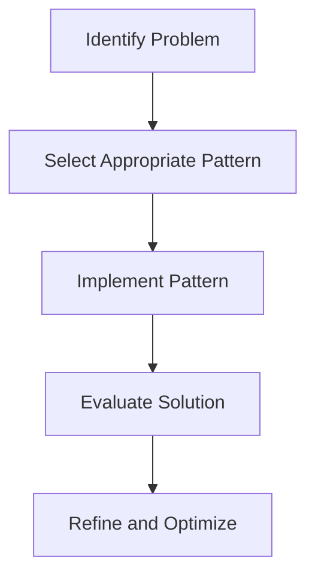
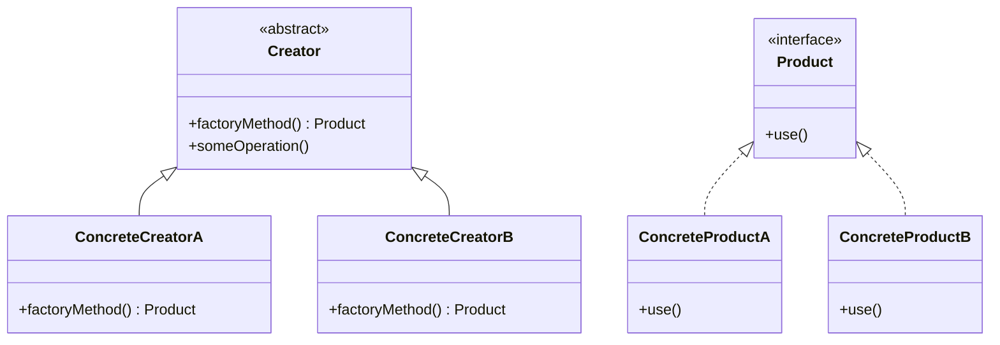
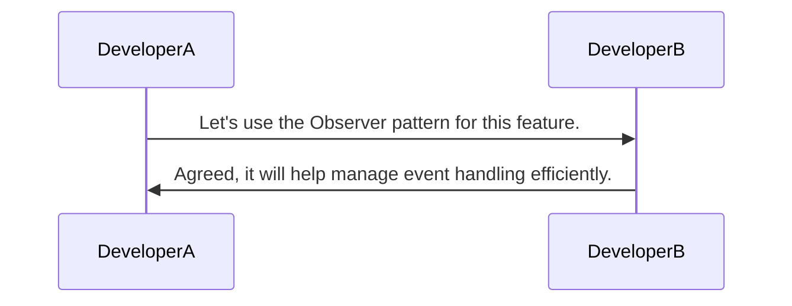
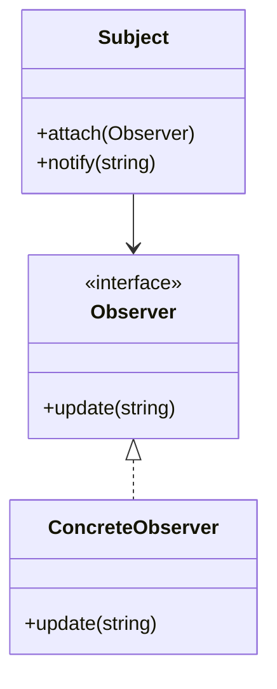

## 1.4 Importance of Design Patterns in Software Development

Design patterns are a cornerstone of modern software engineering, offering a toolkit of solutions to common problems that arise in software design. They are not just abstract concepts but practical tools that can significantly enhance the quality, maintainability, and efficiency of software systems. In this section, we will delve into the importance of design patterns in software development, focusing on their role in problem-solving, code reusability, communication, and improving code quality and maintainability.

### Problem-Solving: How Design Patterns Provide Proven Solutions to Common Problems

Design patterns are essentially blueprints for solving recurring design problems. They encapsulate best practices and provide a proven approach to tackling specific challenges. By leveraging design patterns, developers can avoid reinventing the wheel and instead apply tried-and-tested solutions to common issues.

#### Understanding the Problem-Solving Aspect

When faced with a complex problem, developers can turn to design patterns to find a structured approach. For instance, the Singleton pattern is a well-known solution for ensuring a class has only one instance, which is particularly useful in scenarios like managing a connection pool or logging service.

#### Code Example: Singleton Pattern in D

```d
module singletonExample;

class Logger {
    private static Logger _instance;
    private this() {} // Private constructor

    static Logger getInstance() {
        if (_instance is null) {
            _instance = new Logger();
        }
        return _instance;
    }

    void log(string message) {
        writeln("Log: ", message);
    }
}

void main() {
    auto logger = Logger.getInstance();
    logger.log("This is a singleton logger.");
}
```

In this example, the `Logger` class uses the Singleton pattern to ensure only one instance is created. This pattern is a classic example of how design patterns provide a structured solution to a common problem.

#### Visualizing Problem-Solving with Design Patterns



This flowchart illustrates the process of using design patterns to solve problems. By identifying the problem, selecting the appropriate pattern, implementing it, and then evaluating and refining the solution, developers can efficiently address design challenges.

### Code Reusability: Enhancing Reusability Through Well-Defined Patterns

One of the key benefits of design patterns is their ability to enhance code reusability. By abstracting common solutions into patterns, developers can create modular and reusable code components that can be applied across different projects.

#### The Role of Design Patterns in Code Reusability

Design patterns promote reusability by providing a standard way to solve problems. This standardization means that once a pattern is implemented, it can be reused in different contexts without modification. For example, the Factory Method pattern allows for the creation of objects without specifying the exact class of object that will be created, promoting flexibility and reusability.

#### Code Example: Factory Method Pattern in D

```d
module factoryMethodExample;

interface Product {
    void use();
}

class ConcreteProductA : Product {
    void use() {
        writeln("Using Product A");
    }
}

class ConcreteProductB : Product {
    void use() {
        writeln("Using Product B");
    }
}

abstract class Creator {
    abstract Product factoryMethod();

    void someOperation() {
        auto product = factoryMethod();
        product.use();
    }
}

class ConcreteCreatorA : Creator {
    Product factoryMethod() {
        return new ConcreteProductA();
    }
}

class ConcreteCreatorB : Creator {
    Product factoryMethod() {
        return new ConcreteProductB();
    }
}

void main() {
    Creator creatorA = new ConcreteCreatorA();
    creatorA.someOperation();

    Creator creatorB = new ConcreteCreatorB();
    creatorB.someOperation();
}
```

In this example, the Factory Method pattern is used to create different types of products. This pattern enhances reusability by allowing the creation of new product types without modifying existing code.

#### Visualizing Code Reusability with Design Patterns



This class diagram illustrates the Factory Method pattern, showing how different creators can produce different products, enhancing code reusability.

### Communication: Serving as a Common Language Among Developers

Design patterns serve as a common language among developers, facilitating communication and collaboration. By using well-known patterns, developers can convey complex design ideas succinctly and clearly.

#### The Communication Aspect of Design Patterns

When developers discuss design patterns, they are using a shared vocabulary that transcends individual projects or languages. This shared understanding allows for more effective collaboration and reduces the potential for misunderstandings.

#### Example: Communicating with Design Patterns

Consider a team discussing the implementation of a new feature. By referencing design patterns, such as the Observer pattern for event handling, team members can quickly align on the approach without needing to delve into detailed explanations.

#### Visualizing Communication with Design Patterns



This sequence diagram illustrates how design patterns facilitate communication between developers, allowing them to quickly agree on a design approach.

### Quality and Maintainability: Improving Code Quality and Ease of Maintenance

Design patterns play a crucial role in improving the quality and maintainability of code. By providing a structured approach to design, patterns help ensure that code is robust, scalable, and easy to maintain.

#### Enhancing Code Quality with Design Patterns

Design patterns encourage best practices and promote clean, organized code. By following established patterns, developers can avoid common pitfalls and create systems that are easier to understand and maintain.

#### Code Example: Observer Pattern in D

```d
module observerExample;

interface Observer {
    void update(string message);
}

class ConcreteObserver : Observer {
    void update(string message) {
        writeln("Observer received: ", message);
    }
}

class Subject {
    private Observer[] observers;

    void attach(Observer observer) {
        observers ~= observer;
    }

    void notify(string message) {
        foreach (observer; observers) {
            observer.update(message);
        }
    }
}

void main() {
    auto observer = new ConcreteObserver();
    auto subject = new Subject();
    subject.attach(observer);
    subject.notify("Hello, Observers!");
}
```

In this example, the Observer pattern is used to manage event notifications. This pattern improves code quality by decoupling the subject from its observers, making the system more flexible and easier to maintain.

#### Visualizing Quality and Maintainability with Design Patterns



This class diagram illustrates the Observer pattern, highlighting the relationship between subjects and observers, which enhances code maintainability.

### Try It Yourself

To deepen your understanding of design patterns, try modifying the code examples provided. For instance, in the Singleton pattern example, experiment with making the `Logger` class thread-safe. In the Factory Method pattern, add a new product type and see how easily it integrates with the existing code. These exercises will help reinforce the concepts and demonstrate the flexibility and power of design patterns.

### Knowledge Check

- Explain how design patterns provide solutions to common software design problems.
- Describe how design patterns enhance code reusability.
- Discuss the role of design patterns in facilitating communication among developers.
- Identify ways in which design patterns improve code quality and maintainability.

### Embrace the Journey

As you continue your journey in mastering design patterns, remember that these patterns are tools to aid in the design process. They are not rigid rules but flexible guidelines that can be adapted to fit the specific needs of your project. Keep experimenting, stay curious, and enjoy the process of creating robust and maintainable software systems.

## Quiz Time!



### What is the primary purpose of design patterns in software development?

- [x] To provide proven solutions to common design problems
- [ ] To enforce strict coding standards
- [ ] To replace the need for documentation
- [ ] To eliminate the need for testing

> **Explanation:** Design patterns offer proven solutions to recurring design problems, helping developers avoid reinventing the wheel.

### How do design patterns enhance code reusability?

- [x] By providing a standard way to solve problems
- [ ] By making code more complex
- [ ] By reducing the need for comments
- [ ] By increasing the number of lines of code

> **Explanation:** Design patterns standardize solutions, making them reusable across different projects and contexts.

### In what way do design patterns facilitate communication among developers?

- [x] By serving as a common language
- [ ] By increasing the number of meetings
- [ ] By requiring more documentation
- [ ] By making code harder to read

> **Explanation:** Design patterns provide a shared vocabulary that helps developers communicate complex ideas succinctly.

### Which design pattern is commonly used to ensure a class has only one instance?

- [x] Singleton Pattern
- [ ] Factory Method Pattern
- [ ] Observer Pattern
- [ ] Strategy Pattern

> **Explanation:** The Singleton pattern ensures that a class has only one instance, which is useful for managing shared resources.

### What is a key benefit of using the Factory Method pattern?

- [x] It allows for the creation of objects without specifying their exact class
- [ ] It ensures a class has only one instance
- [ ] It decouples subjects from observers
- [ ] It simplifies event handling

> **Explanation:** The Factory Method pattern promotes flexibility by allowing the creation of objects without specifying their exact class.

### How do design patterns improve code quality?

- [x] By encouraging best practices and organized code
- [ ] By making code more complex
- [ ] By reducing the need for testing
- [ ] By increasing the number of lines of code

> **Explanation:** Design patterns encourage best practices, leading to clean, organized, and maintainable code.

### What role does the Observer pattern play in software design?

- [x] It manages event notifications
- [ ] It ensures a class has only one instance
- [ ] It simplifies object creation
- [ ] It increases code complexity

> **Explanation:** The Observer pattern is used to manage event notifications, decoupling subjects from their observers.

### How can design patterns be adapted to fit specific project needs?

- [x] By using them as flexible guidelines
- [ ] By enforcing strict adherence to patterns
- [ ] By eliminating the need for testing
- [ ] By increasing code complexity

> **Explanation:** Design patterns are flexible guidelines that can be adapted to fit the specific needs of a project.

### What is a common misconception about design patterns?

- [x] They are rigid rules that must be followed
- [ ] They are only useful for large projects
- [ ] They replace the need for documentation
- [ ] They eliminate the need for testing

> **Explanation:** Design patterns are not rigid rules but flexible guidelines that can be adapted to different contexts.

### True or False: Design patterns eliminate the need for testing.

- [ ] True
- [x] False

> **Explanation:** Design patterns do not eliminate the need for testing; they provide structured solutions that still require thorough testing.




