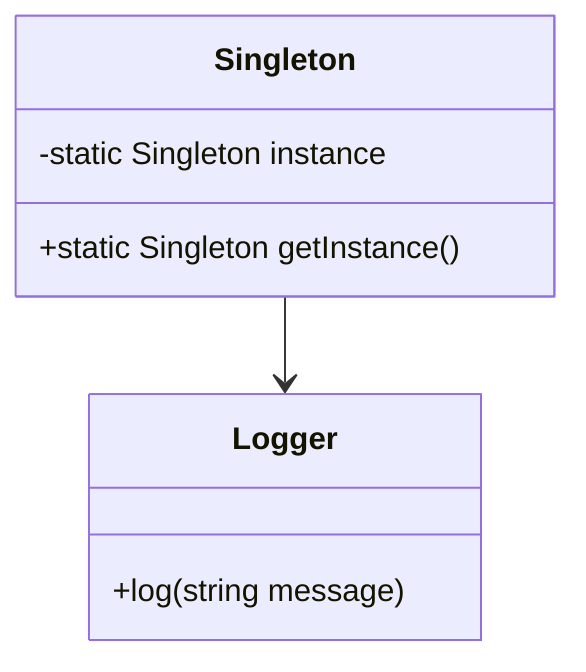
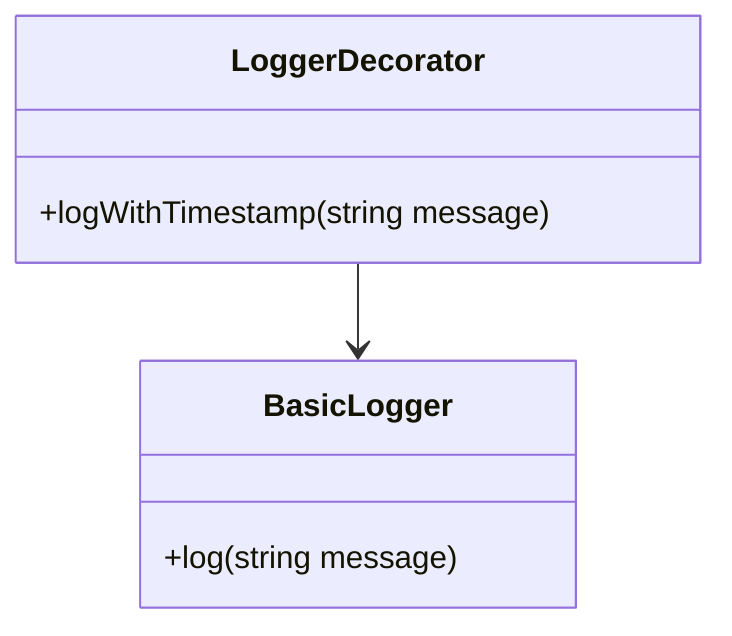

## 1.5 Benefits of Using Design Patterns in D

Design patterns are a cornerstone of effective software engineering, providing reusable solutions to common problems. In the D programming language, design patterns take on a new dimension, leveraging D's unique features such as templates, mixins, and metaprogramming. This section explores the myriad benefits of using design patterns in D, focusing on performance optimization, enhanced expressiveness, and real-world applications.

### Leverage D Features

D's powerful language features make it an ideal candidate for implementing design patterns. Let's delve into how these features can be harnessed to create robust and efficient software.

#### Templates and Generics

Templates in D allow for the creation of generic and reusable code components. By using templates, we can implement design patterns that are both flexible and type-safe. For example, the Singleton pattern can be implemented using templates to ensure that only one instance of a class is created, regardless of the type.

```d
// Singleton pattern using templates
template Singleton(T) {
    static T instance;
    static T getInstance() {
        if (instance is null) {
            instance = new T();
        }
        return instance;
    }
}

class Logger {
    void log(string message) {
        writeln(message);
    }
}

void main() {
    auto logger = Singleton!Logger.getInstance();
    logger.log("This is a singleton logger.");
}
```

In this example, the `Singleton` template ensures that only one instance of `Logger` is created. This pattern can be applied to any class, making it a versatile solution.

#### Mixins and Metaprogramming

Mixins in D provide a powerful mechanism for code reuse and composition. By using mixins, we can dynamically inject code into classes, enabling the implementation of patterns like Decorator and Proxy with minimal boilerplate.

```d
// Decorator pattern using mixins
mixin template LoggerDecorator() {
    void logWithTimestamp(string message) {
        import std.datetime;
        auto timestamp = Clock.currTime.toISOExtString();
        writeln("[" ~ timestamp ~ "] " ~ message);
    }
}

class BasicLogger {
    void log(string message) {
        writeln(message);
    }
}

class TimestampedLogger : BasicLogger {
    mixin LoggerDecorator;
}

void main() {
    auto logger = new TimestampedLogger();
    logger.logWithTimestamp("This is a decorated log message.");
}
```

Here, the `LoggerDecorator` mixin adds a timestamp to log messages, demonstrating how mixins can enhance functionality without modifying the original class.

#### Compile-Time Function Execution (CTFE)

CTFE allows for the execution of code at compile time, enabling optimizations and checks that would otherwise be performed at runtime. This feature can be used to implement patterns like Factory Method, where object creation logic is determined at compile time.

```d
// Factory Method pattern with CTFE
enum ShapeType { Circle, Square }

interface Shape {
    void draw();
}

class Circle : Shape {
    void draw() {
        writeln("Drawing a circle.");
    }
}

class Square : Shape {
    void draw() {
        writeln("Drawing a square.");
    }
}

Shape createShape(ShapeType type) {
    static if (type == ShapeType.Circle) {
        return new Circle();
    } else static if (type == ShapeType.Square) {
        return new Square();
    } else {
        assert(false, "Unknown shape type.");
    }
}

void main() {
    auto shape = createShape(ShapeType.Circle);
    shape.draw();
}
```

In this example, the `createShape` function uses CTFE to determine the type of shape to create, ensuring that the correct object is instantiated without runtime overhead.

### Performance Optimization

Design patterns in D are not just about code organization; they also play a crucial role in performance optimization. By applying patterns strategically, we can write efficient and performant systems software.

#### Efficient Resource Management

Patterns like RAII (Resource Acquisition Is Initialization) and Scoped Classes ensure that resources are acquired and released efficiently, minimizing memory leaks and resource contention.

```d
// RAII pattern for resource management
class FileHandler {
    File file;

    this(string filename) {
        file = File(filename, "r");
    }

    ~this() {
        file.close();
    }

    void read() {
        writeln(file.readln());
    }
}

void main() {
    {
        auto handler = new FileHandler("example.txt");
        handler.read();
    } // File is automatically closed here
}
```

The `FileHandler` class demonstrates the RAII pattern, where the file is automatically closed when the object goes out of scope, ensuring efficient resource management.

#### Concurrency and Parallelism

D's support for concurrency and parallelism, combined with patterns like the Actor Model and Task-Based Concurrency, allows for the development of high-performance applications that can efficiently utilize multi-core processors.

```d
// Actor Model pattern for concurrency
import std.concurrency;
import std.stdio;

void worker(Tid parentTid) {
    receive(
        (string msg) {
            writeln("Worker received: ", msg);
            send(parentTid, "Done");
        }
    );
}

void main() {
    auto tid = spawn(&worker, thisTid);
    send(tid, "Hello, Actor!");
    receive(
        (string msg) {
            writeln("Main received: ", msg);
        }
    );
}
```

In this example, the Actor Model pattern is used to create a simple concurrent application where messages are passed between the main thread and a worker thread.

### Enhanced Expressiveness

Design patterns enhance the expressiveness and clarity of code, making it easier to understand and maintain. By using patterns, we can convey complex design concepts succinctly and effectively.

#### Fluent Interfaces with UFCS

The Uniform Function Call Syntax (UFCS) in D allows for the creation of fluent interfaces, enabling method chaining and improving code readability.

```d
// Fluent interface using UFCS
struct Query {
    string query;

    Query select(string fields) {
        query ~= "SELECT " ~ fields ~ " ";
        return this;
    }

    Query from(string table) {
        query ~= "FROM " ~ table ~ " ";
        return this;
    }

    Query where(string condition) {
        query ~= "WHERE " ~ condition ~ " ";
        return this;
    }

    void execute() {
        writeln("Executing query: ", query);
    }
}

void main() {
    Query().select("*").from("users").where("age > 18").execute();
}
```

The `Query` struct demonstrates a fluent interface, allowing for intuitive and expressive query construction using UFCS.

#### Code Reuse and Composition

Patterns like Composite and Strategy promote code reuse and composition, enabling the creation of modular and maintainable systems.

```d
// Strategy pattern for code reuse
interface CompressionStrategy {
    void compress(string data);
}

class ZipCompression : CompressionStrategy {
    void compress(string data) {
        writeln("Compressing using ZIP: ", data);
    }
}

class RarCompression : CompressionStrategy {
    void compress(string data) {
        writeln("Compressing using RAR: ", data);
    }
}

class Compressor {
    CompressionStrategy strategy;

    this(CompressionStrategy strategy) {
        this.strategy = strategy;
    }

    void compressData(string data) {
        strategy.compress(data);
    }
}

void main() {
    auto zipCompressor = new Compressor(new ZipCompression());
    zipCompressor.compressData("example data");

    auto rarCompressor = new Compressor(new RarCompression());
    rarCompressor.compressData("example data");
}
```

The Strategy pattern in this example allows for the selection of different compression algorithms at runtime, promoting flexibility and code reuse.

### Real-World Applications

Design patterns are not just theoretical constructs; they have practical applications in real-world systems programming, networking, and more.

#### Systems Programming

In systems programming, patterns like Singleton and Factory Method are used to manage resources and create objects efficiently, ensuring that systems software is both robust and performant.

#### Networking

Patterns like Proxy and Adapter are invaluable in networking applications, enabling seamless communication between different systems and protocols.

```d
// Proxy pattern for networking
interface NetworkService {
    void request();
}

class RealNetworkService : NetworkService {
    void request() {
        writeln("Performing network request.");
    }
}

class NetworkServiceProxy : NetworkService {
    RealNetworkService realService;

    this() {
        realService = new RealNetworkService();
    }

    void request() {
        writeln("Proxy: Checking access rights...");
        realService.request();
    }
}

void main() {
    auto service = new NetworkServiceProxy();
    service.request();
}
```

The Proxy pattern in this example adds an access control layer to a network service, demonstrating its utility in networking applications.

### Try It Yourself

To deepen your understanding of design patterns in D, try modifying the code examples provided. For instance, experiment with different strategies in the Strategy pattern example or add additional methods to the fluent interface. By actively engaging with the code, you'll gain a deeper appreciation for the power and flexibility of design patterns in D.

### Visualizing Design Patterns in D

To better understand how design patterns work in D, let's visualize some of the key concepts using Mermaid.js diagrams.

#### Singleton Pattern Diagram



**Diagram Description:** This class diagram illustrates the Singleton pattern, showing the relationship between the `Singleton` class and the `Logger` class.

#### Decorator Pattern Diagram



**Diagram Description:** This class diagram depicts the Decorator pattern, highlighting how the `LoggerDecorator` class extends the functionality of the `BasicLogger` class.

### References and Links

For further reading on design patterns and the D programming language, consider the following resources:

- [Design Patterns: Elements of Reusable Object-Oriented Software](https://www.amazon.com/Design-Patterns-Elements-Reusable-Object-Oriented/dp/0201633612) by Erich Gamma et al.
- [The D Programming Language](https://dlang.org/) - Official D Language Website
- [Dlang Tour](https://tour.dlang.org/) - Interactive Tour of the D Programming Language

### Knowledge Check

To reinforce your understanding of the benefits of using design patterns in D, consider the following questions and exercises:

- How do templates enhance the flexibility of design patterns in D?
- What are the advantages of using mixins for code reuse?
- How can CTFE be used to optimize object creation in D?
- Implement a new design pattern using D's unique features and test its performance.

### Embrace the Journey

Remember, mastering design patterns in D is a journey. As you continue to explore and experiment with these patterns, you'll discover new ways to optimize and enhance your software. Stay curious, keep learning, and enjoy the process of becoming an expert in systems programming with D.

## Quiz Time!



### What is a key benefit of using templates in D for design patterns?

- [x] They allow for type-safe and flexible code components.
- [ ] They eliminate the need for any runtime checks.
- [ ] They automatically optimize memory usage.
- [ ] They enforce strict compile-time constraints.

> **Explanation:** Templates in D enable the creation of type-safe and flexible code components, making them ideal for implementing design patterns.

### How do mixins contribute to code reuse in D?

- [x] By dynamically injecting code into classes.
- [ ] By enforcing strict inheritance hierarchies.
- [ ] By eliminating the need for interfaces.
- [ ] By providing automatic memory management.

> **Explanation:** Mixins allow for dynamic code injection, enhancing code reuse and composition without modifying the original class.

### What role does CTFE play in design patterns?

- [x] It allows for compile-time optimizations and checks.
- [ ] It eliminates the need for runtime error handling.
- [ ] It automatically generates documentation.
- [ ] It enforces strict runtime constraints.

> **Explanation:** CTFE enables compile-time optimizations and checks, which can be leveraged in design patterns for efficient object creation.

### Which pattern is demonstrated by the `FileHandler` class?

- [x] RAII (Resource Acquisition Is Initialization)
- [ ] Singleton
- [ ] Factory Method
- [ ] Observer

> **Explanation:** The `FileHandler` class uses the RAII pattern to manage resources efficiently, ensuring that the file is closed when the object goes out of scope.

### What is a key advantage of using the Actor Model pattern in D?

- [x] It facilitates message passing between threads.
- [ ] It eliminates the need for synchronization.
- [ ] It automatically balances load across processors.
- [ ] It enforces strict type checking.

> **Explanation:** The Actor Model pattern facilitates message passing between threads, enabling efficient concurrency in D applications.

### How does the Proxy pattern enhance networking applications?

- [x] By adding an access control layer to services.
- [ ] By automatically compressing network data.
- [ ] By eliminating the need for encryption.
- [ ] By enforcing strict protocol adherence.

> **Explanation:** The Proxy pattern adds an access control layer, enhancing security and functionality in networking applications.

### What is a benefit of using fluent interfaces with UFCS?

- [x] They improve code readability and expressiveness.
- [ ] They enforce strict compile-time constraints.
- [ ] They automatically optimize performance.
- [ ] They eliminate the need for error handling.

> **Explanation:** Fluent interfaces with UFCS improve code readability and expressiveness, making complex operations more intuitive.

### Which feature of D is highlighted by the Strategy pattern example?

- [x] Code reuse and flexibility.
- [ ] Automatic memory management.
- [ ] Compile-time error checking.
- [ ] Strict type enforcement.

> **Explanation:** The Strategy pattern example highlights code reuse and flexibility, allowing for different algorithms to be selected at runtime.

### How can design patterns improve systems programming in D?

- [x] By managing resources and creating objects efficiently.
- [ ] By eliminating the need for low-level operations.
- [ ] By enforcing strict compile-time constraints.
- [ ] By automatically generating documentation.

> **Explanation:** Design patterns improve systems programming by managing resources and creating objects efficiently, ensuring robust and performant software.

### True or False: Design patterns in D are only theoretical constructs with no practical applications.

- [ ] True
- [x] False

> **Explanation:** Design patterns have practical applications in real-world systems programming, networking, and more, providing reusable solutions to common problems.


