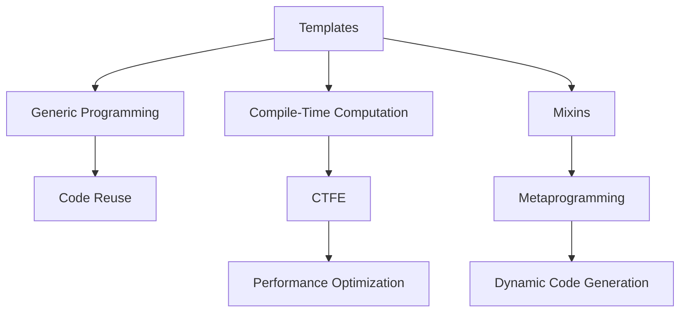

## 1.6 Overview of D Features Relevant to Design Patterns

The D programming language offers a rich set of features that make it particularly well-suited for implementing design patterns in systems programming. In this section, we will explore some of these features, including templates and generics, mixins and metaprogramming, ranges and lazy evaluation, compile-time function execution (CTFE), memory safety, and concurrency support. By understanding these features, you will be better equipped to leverage D's capabilities in creating efficient, scalable, and maintainable software systems.

### Templates and Generics

**Templates** in D are a powerful tool for generic programming, allowing you to write flexible and reusable code. Unlike some other languages, D's templates are more akin to compile-time functions, enabling you to perform complex computations and generate code based on types and values.

#### Key Concepts

- **Type Parameters**: Templates can accept type parameters, allowing you to write functions and data structures that work with any data type.
- **Value Parameters**: In addition to types, templates can also take value parameters, enabling more flexible code generation.
- **Specialization**: You can specialize templates for specific types or values, providing custom implementations when needed.

#### Code Example

```d
// A generic function using templates
T max(T)(T a, T b) {
    return a > b ? a : b;
}

void main() {
    writeln(max(10, 20)); // Works with integers
    writeln(max(10.5, 20.5)); // Works with floats
}
```

In this example, the `max` function is defined as a template, allowing it to work with any type that supports the `>` operator.

### Mixins and Metaprogramming

**Mixins** in D provide a way to include code at compile time, offering a powerful mechanism for metaprogramming. This feature allows you to generate code based on compile-time conditions, making it easier to implement flexible and reusable design patterns.

#### Key Concepts

- **String Mixins**: Insert code from a string at compile time, enabling dynamic code generation.
- **Template Mixins**: Include the contents of a template at a specific point in your code, facilitating code reuse.

#### Code Example

```d
// Using string mixins for dynamic code generation
string generateGetterSetter(string fieldName) {
    return q{
        private int } ~ fieldName ~ q{;
        int get} ~ fieldName ~ q{() { return } ~ fieldName ~ q{; }
        void set} ~ fieldName ~ q{(int value) { } ~ fieldName ~ q{ = value; }
    };
}

mixin(generateGetterSetter("age"));

void main() {
    setage(30);
    writeln(getage());
}
```

This example demonstrates how string mixins can be used to generate getter and setter methods for a field dynamically.

### Ranges and Lazy Evaluation

**Ranges** in D provide a powerful abstraction for working with sequences of data. They enable lazy evaluation, which can lead to more efficient data processing by deferring computation until it is actually needed.

#### Key Concepts

- **Input Ranges**: The simplest form of ranges, allowing you to iterate over a sequence of elements.
- **Output Ranges**: Allow you to write elements to a sequence.
- **Lazy Evaluation**: Computations are deferred until the result is needed, improving performance by avoiding unnecessary calculations.

#### Code Example

```d
import std.algorithm;
import std.range;
import std.stdio;

void main() {
    auto numbers = iota(1, 10); // Create a range from 1 to 9
    auto evenNumbers = numbers.filter!(n => n % 2 == 0);
    evenNumbers.each!writeln; // Outputs: 2, 4, 6, 8
}
```

In this example, the `filter` function is used to create a lazy range of even numbers, demonstrating the power of ranges and lazy evaluation.

### Compile-Time Function Execution (CTFE)

**Compile-Time Function Execution (CTFE)** allows you to perform computations at compile time, which can lead to significant performance improvements by reducing runtime overhead.

#### Key Concepts

- **Compile-Time Evaluation**: Functions can be evaluated at compile time if all their inputs are known at compile time.
- **Performance Optimization**: By moving computations to compile time, you can reduce the amount of work done at runtime.

#### Code Example

```d
// A function that can be executed at compile time
int factorial(int n) {
    return n <= 1 ? 1 : n * factorial(n - 1);
}

enum fact5 = factorial(5); // Computed at compile time

void main() {
    writeln(fact5); // Outputs: 120
}
```

This example shows how the `factorial` function is evaluated at compile time, resulting in a compile-time constant `fact5`.

### Memory Safety

D provides several attributes to ensure memory safety, which is crucial when implementing design patterns that manage resources.

#### Key Concepts

- **@safe**: Guarantees that the code does not perform any unsafe operations.
- **@trusted**: Marks code as safe, even if it contains operations that the compiler cannot verify.
- **@system**: Indicates that the code may perform unsafe operations and should be used with caution.

#### Code Example

```d
@safe int safeFunction(int[] arr) {
    return arr.length > 0 ? arr[0] : 0;
}

@trusted int trustedFunction(int[] arr) {
    // Assume this function is safe, even if the compiler cannot verify it
    return arr.length > 0 ? arr[0] : 0;
}

@system int systemFunction(int* ptr) {
    // Unsafe operation, use with caution
    return *ptr;
}
```

This example illustrates the use of `@safe`, `@trusted`, and `@system` attributes to control the safety level of functions.

### Concurrency Support

D offers built-in support for concurrent programming, making it easier to implement design patterns that require parallel execution.

#### Key Concepts

- **Fibers**: Lightweight threads that can be used for cooperative multitasking.
- **Message Passing**: Use `std.concurrency` for safe communication between threads.
- **Parallelism**: Utilize `std.parallelism` for data parallelism and task parallelism.

#### Code Example

```d
import std.concurrency;
import std.stdio;

void worker() {
    receive((int msg) {
        writeln("Received message: ", msg);
    });
}

void main() {
    auto tid = spawn(&worker);
    send(tid, 42);
}
```

In this example, a worker thread is spawned, and a message is sent to it using `std.concurrency`, demonstrating D's concurrency support.

### Visualizing D's Features

To better understand how these features interact, let's visualize the relationship between templates, mixins, and CTFE in D.



This diagram illustrates how templates enable generic programming and code reuse, while also supporting compile-time computation through CTFE. Mixins facilitate metaprogramming and dynamic code generation.

### Try It Yourself

Experiment with the code examples provided in this section. Try modifying the template parameters, creating your own mixins, or implementing a simple range-based algorithm. This hands-on approach will deepen your understanding of D's features and how they can be applied to design patterns.

### References and Links

For further reading on D's features, consider exploring the following resources:

- [D Programming Language Official Website](https://dlang.org/)
- [D Language Specification](https://dlang.org/spec/spec.html)
- [D Templates Documentation](https://dlang.org/spec/template.html)
- [D Mixins Documentation](https://dlang.org/spec/template-mixin.html)
- [D Ranges Documentation](https://dlang.org/phobos/std_range.html)

### Knowledge Check

To reinforce your understanding of D's features, consider the following questions:

- How do templates in D differ from those in C++?
- What are the benefits of using mixins for code generation?
- How does lazy evaluation improve performance in D?
- What are the safety guarantees provided by the `@safe` attribute?
- How can CTFE be used to optimize runtime performance?

### Embrace the Journey

Remember, mastering D's features is a journey. As you continue to explore and experiment, you'll discover new ways to leverage these capabilities in your software projects. Stay curious, keep learning, and enjoy the process!

## Quiz Time!



### What is the primary benefit of using templates in D?

- [x] They enable generic programming and code reuse.
- [ ] They allow for runtime code generation.
- [ ] They improve runtime performance by optimizing memory usage.
- [ ] They provide built-in concurrency support.

> **Explanation:** Templates in D enable generic programming and code reuse by allowing functions and data structures to work with any data type.

### How do mixins in D facilitate metaprogramming?

- [x] By allowing compile-time code generation.
- [ ] By providing built-in concurrency support.
- [ ] By optimizing memory usage at runtime.
- [ ] By enabling lazy evaluation of data.

> **Explanation:** Mixins in D allow for compile-time code generation, which is a key aspect of metaprogramming.

### What is a key advantage of using ranges in D?

- [x] They enable lazy evaluation for efficient data processing.
- [ ] They provide built-in concurrency support.
- [ ] They improve memory safety by preventing unsafe operations.
- [ ] They allow for compile-time function execution.

> **Explanation:** Ranges in D enable lazy evaluation, which defers computation until the result is needed, improving data processing efficiency.

### What does the `@safe` attribute guarantee in D?

- [x] The code does not perform any unsafe operations.
- [ ] The code is optimized for performance.
- [ ] The code supports concurrency.
- [ ] The code can be executed at compile time.

> **Explanation:** The `@safe` attribute in D guarantees that the code does not perform any unsafe operations.

### How does CTFE improve performance in D?

- [x] By performing computations at compile time, reducing runtime overhead.
- [ ] By optimizing memory usage at runtime.
- [ ] By enabling lazy evaluation of data.
- [ ] By providing built-in concurrency support.

> **Explanation:** CTFE in D improves performance by performing computations at compile time, which reduces the amount of work done at runtime.

### What is the role of fibers in D's concurrency model?

- [x] They are lightweight threads used for cooperative multitasking.
- [ ] They enable compile-time code generation.
- [ ] They provide memory safety guarantees.
- [ ] They allow for lazy evaluation of data.

> **Explanation:** Fibers in D are lightweight threads used for cooperative multitasking, playing a key role in D's concurrency model.

### How can message passing be achieved in D?

- [x] Using `std.concurrency` for safe communication between threads.
- [ ] By using templates for generic programming.
- [ ] By leveraging mixins for code generation.
- [ ] By utilizing ranges for data processing.

> **Explanation:** Message passing in D can be achieved using `std.concurrency`, which facilitates safe communication between threads.

### What is a key feature of template mixins in D?

- [x] They allow for the inclusion of template contents at specific points in code.
- [ ] They provide built-in concurrency support.
- [ ] They enable lazy evaluation of data.
- [ ] They guarantee memory safety.

> **Explanation:** Template mixins in D allow for the inclusion of template contents at specific points in code, facilitating code reuse.

### What is the primary purpose of the `@trusted` attribute in D?

- [x] To mark code as safe, even if it contains operations the compiler cannot verify.
- [ ] To enable compile-time function execution.
- [ ] To provide built-in concurrency support.
- [ ] To optimize memory usage at runtime.

> **Explanation:** The `@trusted` attribute in D is used to mark code as safe, even if it contains operations the compiler cannot verify.

### True or False: CTFE allows for runtime code generation in D.

- [ ] True
- [x] False

> **Explanation:** False. CTFE allows for compile-time function execution, not runtime code generation.


