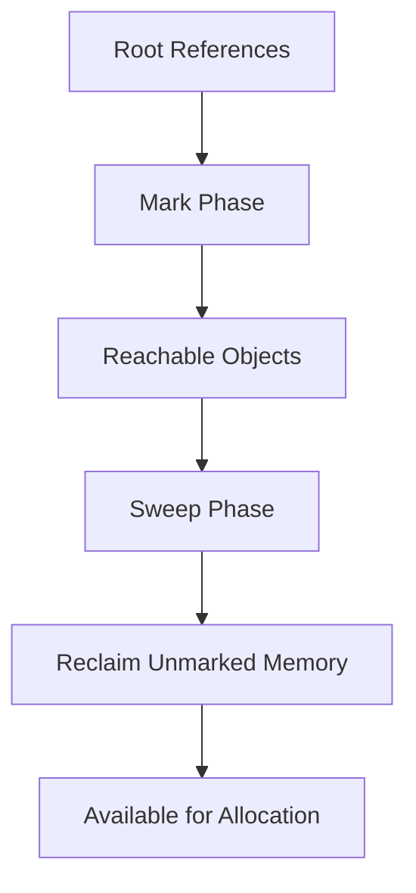

## 10.1 Understanding D's Garbage Collector

In the realm of systems programming, efficient memory management is a cornerstone of high-performance applications. The D programming language, known for its blend of high-level and low-level capabilities, offers a garbage collector (GC) to automate memory management. Understanding how D's garbage collector operates, its impact on performance, and its appropriate use cases is crucial for expert software engineers and architects aiming to leverage D for advanced systems programming.

### GC Mechanism: How the Garbage Collector Works

The garbage collector in D is a crucial component that simplifies memory management by automatically reclaiming memory that is no longer in use. This process involves identifying and freeing memory that is unreachable from any part of the program. Let's delve into the mechanics of D's garbage collector:

#### 1. **Tracing Garbage Collection**

D employs a tracing garbage collector, which periodically scans the memory to identify objects that are no longer reachable. The GC uses a mark-and-sweep algorithm, which consists of two main phases:

- **Mark Phase**: The GC traverses the object graph starting from root references (e.g., global variables, stack variables) and marks all reachable objects.
- **Sweep Phase**: The GC scans the heap and reclaims memory occupied by unmarked objects, making it available for future allocations.

#### 2. **Generational Collection**

D's garbage collector is generational, meaning it categorizes objects based on their lifespan. Objects that survive multiple collections are promoted to older generations, which are collected less frequently. This approach optimizes performance by focusing on young objects, which are more likely to become unreachable quickly.

#### 3. **Incremental Collection**

To minimize pause times, D's garbage collector can operate incrementally. Instead of stopping the entire program to perform a full collection, it performs smaller, incremental collections, reducing latency and improving responsiveness.

#### 4. **Concurrent Collection**

In some configurations, D's garbage collector can run concurrently with the program, further reducing pause times by performing collection activities in parallel with program execution.

### Impact on Performance

While garbage collection simplifies memory management, it introduces certain performance considerations. Understanding these impacts is essential for making informed decisions about when and how to use the GC in D.

#### 1. **Pauses and Latency**

Garbage collection can cause pauses in program execution, known as "stop-the-world" events, where the program halts to allow the GC to perform its tasks. These pauses can lead to latency issues, particularly in real-time or high-performance applications. However, D's incremental and concurrent collection strategies help mitigate these effects.

#### 2. **Memory Overhead**

The garbage collector requires additional memory to manage its operations, including metadata for tracking object references and maintaining the generational hierarchy. This overhead can affect the overall memory footprint of the application.

#### 3. **CPU Utilization**

Garbage collection consumes CPU resources, which can impact the performance of CPU-bound applications. The trade-off between CPU usage and memory management convenience must be carefully balanced.

### Use Cases and Examples

The decision to use D's garbage collector depends on the specific requirements and constraints of your application. Here are some scenarios where the GC is beneficial:

#### 1. **General Applications**

For many applications, the convenience of automatic memory management outweighs the performance trade-offs. The GC simplifies development by eliminating the need for manual memory management, reducing the risk of memory leaks and dangling pointers.

#### 2. **Non-critical Systems**

In systems where minor performance trade-offs are acceptable, such as desktop applications or non-real-time services, the GC can be a valuable tool. It allows developers to focus on core functionality without being bogged down by memory management concerns.

#### 3. **Prototyping and Development**

During the initial stages of development, using the GC can accelerate prototyping by allowing rapid iteration without worrying about memory management. Once the application is stable, performance-critical sections can be optimized or rewritten to minimize GC impact.

### Code Examples

Let's explore some code examples to illustrate the use of D's garbage collector:

```d
import std.stdio;

class Node {
    int value;
    Node* next;
}

void main() {
    // Create a linked list
    Node head = new Node();
    head.value = 1;
    head.next = new Node();
    head.next.value = 2;

    // Print the list
    Node* current = &head;
    while (current !is null) {
        writeln(current.value);
        current = current.next;
    }

    // The garbage collector will automatically reclaim memory
    // when the nodes are no longer reachable
}
```

In this example, we create a simple linked list. The garbage collector automatically manages the memory for the `Node` objects, freeing developers from manual memory management tasks.

### Visualizing D's Garbage Collector

To better understand how D's garbage collector operates, let's visualize the process using a diagram:



**Diagram Description**: This diagram illustrates the mark-and-sweep process of D's garbage collector. The GC starts from root references, marks reachable objects, sweeps the heap to reclaim unmarked memory, and makes it available for future allocations.

### Try It Yourself

To deepen your understanding of D's garbage collector, try modifying the code example above. Experiment with creating more complex data structures, such as trees or graphs, and observe how the GC handles memory management. Consider measuring the impact of GC on performance by timing operations or monitoring memory usage.

### References and Links

For further reading on D's garbage collector and memory management, consider exploring the following resources:

- [D Programming Language Official Documentation](https://dlang.org/)
- [Memory Management in D](https://dlang.org/spec/garbage.html)
- [Understanding Garbage Collection](https://en.wikipedia.org/wiki/Garbage_collection_(computer_science))

### Knowledge Check

To reinforce your understanding of D's garbage collector, consider the following questions:

- How does D's garbage collector determine which objects to reclaim?
- What are the potential performance impacts of using a garbage collector?
- In what scenarios is it beneficial to use D's garbage collector?

### Embrace the Journey

Remember, mastering memory management in D is a journey. As you continue to explore the capabilities of D's garbage collector, you'll gain insights into optimizing performance and balancing convenience with control. Keep experimenting, stay curious, and enjoy the journey!

## Quiz Time!



### What type of garbage collector does D use?

- [x] Tracing garbage collector
- [ ] Reference counting garbage collector
- [ ] Manual memory management
- [ ] None of the above

> **Explanation:** D uses a tracing garbage collector, which periodically scans memory to identify and reclaim unreachable objects.

### What is the primary advantage of using a garbage collector in D?

- [x] Simplifies memory management
- [ ] Increases CPU utilization
- [ ] Reduces memory overhead
- [ ] Eliminates all memory-related performance issues

> **Explanation:** The primary advantage of using a garbage collector is that it simplifies memory management by automatically reclaiming memory that is no longer in use.

### How does D's garbage collector minimize pause times?

- [x] Incremental and concurrent collection
- [ ] Increasing memory overhead
- [ ] Using reference counting
- [ ] Manual memory management

> **Explanation:** D's garbage collector minimizes pause times through incremental and concurrent collection strategies, reducing latency and improving responsiveness.

### In which phase does the garbage collector identify unreachable objects?

- [ ] Sweep phase
- [x] Mark phase
- [ ] Allocation phase
- [ ] Deallocation phase

> **Explanation:** During the mark phase, the garbage collector identifies unreachable objects by traversing the object graph and marking all reachable objects.

### What is a potential drawback of using a garbage collector?

- [x] Increased CPU utilization
- [ ] Reduced memory overhead
- [ ] Simplified memory management
- [ ] Improved performance

> **Explanation:** A potential drawback of using a garbage collector is increased CPU utilization, as the GC consumes CPU resources during its operations.

### What is the purpose of the sweep phase in garbage collection?

- [x] Reclaim memory occupied by unmarked objects
- [ ] Mark all reachable objects
- [ ] Allocate new memory
- [ ] Increase memory overhead

> **Explanation:** The sweep phase reclaims memory occupied by unmarked objects, making it available for future allocations.

### Which of the following is a use case for D's garbage collector?

- [x] General applications
- [ ] Real-time systems
- [ ] High-performance computing
- [ ] Manual memory management

> **Explanation:** D's garbage collector is suitable for general applications where the convenience of automatic memory management outweighs the performance trade-offs.

### What is the impact of generational collection on performance?

- [x] Optimizes performance by focusing on young objects
- [ ] Increases memory overhead
- [ ] Reduces CPU utilization
- [ ] Eliminates all memory-related issues

> **Explanation:** Generational collection optimizes performance by focusing on young objects, which are more likely to become unreachable quickly.

### How does D's garbage collector handle memory management for linked lists?

- [x] Automatically reclaims memory for unreachable nodes
- [ ] Requires manual memory management
- [ ] Uses reference counting
- [ ] Increases memory overhead

> **Explanation:** D's garbage collector automatically reclaims memory for unreachable nodes in linked lists, freeing developers from manual memory management tasks.

### True or False: D's garbage collector can operate concurrently with the program.

- [x] True
- [ ] False

> **Explanation:** True. In some configurations, D's garbage collector can run concurrently with the program, reducing pause times by performing collection activities in parallel with program execution.


