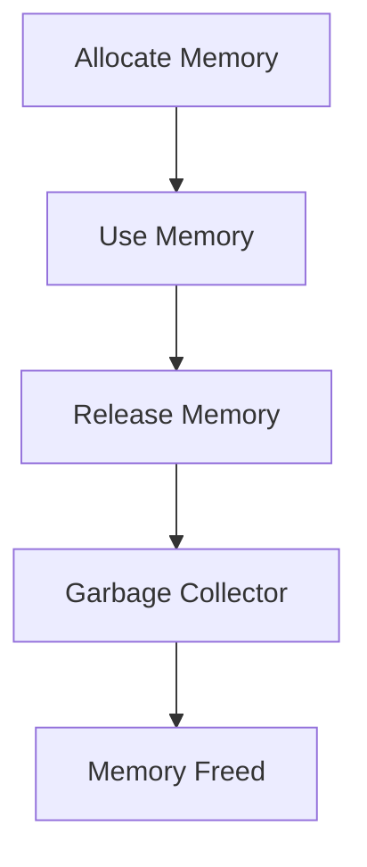

## 10.10 Best Practices for Memory Safety

Ensuring memory safety is a critical aspect of systems programming, especially when working with a language like D, which offers both high-level abstractions and low-level capabilities. Memory safety involves preventing common programming errors that can lead to vulnerabilities, such as buffer overflows, memory leaks, and use-after-free errors. In this section, we will explore best practices for achieving memory safety in D, leveraging its unique features and capabilities.

### Safe Coding Standards

Adhering to safe coding standards is the foundation of memory safety. These standards provide guidelines that help developers write code that is less prone to errors and vulnerabilities.

#### Use `@safe` Functions

D provides a powerful attribute system to enforce memory safety. The `@safe` attribute ensures that a function does not perform any unsafe operations, such as pointer arithmetic or casting between incompatible types.

```d
@safe int add(int a, int b) {
    return a + b;
}
```

By default, functions are `@system`, meaning they can perform any operation. Marking functions as `@safe` helps catch unsafe operations at compile time.

#### Prefer Immutable and Const

Using `immutable` and `const` keywords can prevent unintended modifications to data, reducing the risk of memory corruption.

```d
void processData(const int[] data) {
    // data cannot be modified here
}
```

Immutable data is guaranteed not to change, which can also enable certain compiler optimizations.

#### Avoid Manual Memory Management

Whenever possible, rely on D's garbage collector to manage memory. Manual memory management can lead to errors such as double-free or memory leaks. If manual management is necessary, use RAII (Resource Acquisition Is Initialization) to ensure resources are released properly.

```d
class Resource {
    this() {
        // Acquire resource
    }
    ~this() {
        // Release resource
    }
}
```

### Regular Testing

Testing is crucial for identifying and fixing memory safety issues early in the development process.

#### Unit and Integration Tests

Unit tests help verify the correctness of individual components, while integration tests ensure that components work together as expected. Both are essential for catching memory-related issues.

```d
unittest {
    assert(add(2, 3) == 5);
}
```

Use D's built-in `unittest` blocks to create and run tests easily.

#### Fuzz Testing

Fuzz testing involves providing random data to your program to uncover unexpected behavior and potential vulnerabilities. It is particularly effective for finding memory safety issues.

### Use Cases and Examples

Understanding real-world use cases can help illustrate the importance of memory safety and how to achieve it.

#### Software Reliability

Memory safety is a key factor in building reliable software systems. By preventing memory-related errors, you can reduce crashes and improve the stability of your applications.

#### Compliance Requirements

Many industries have strict compliance requirements regarding software safety and security. Adhering to memory safety best practices can help meet these standards and avoid legal and financial repercussions.

### Practical Examples

Let's explore some practical examples of memory safety in D.

#### Example 1: Safe Array Access

Accessing arrays safely is crucial to prevent buffer overflows. Use D's range checking to ensure safe access.

```d
void printElement(int[] arr, size_t index) @safe {
    if (index < arr.length) {
        writeln(arr[index]);
    } else {
        writeln("Index out of bounds");
    }
}
```

#### Example 2: Avoiding Use-After-Free

Use-after-free errors occur when a program continues to use memory after it has been freed. Using RAII can help prevent this.

```d
class SafeResource {
    int* resource;
    this() {
        resource = new int(42);
    }
    ~this() {
        delete resource;
    }
}
```

### Visualizing Memory Safety

To better understand memory safety, let's visualize how D's memory management works.



This diagram illustrates the typical lifecycle of memory in a D program, highlighting the role of the garbage collector in freeing memory.

### References and Links

For further reading on memory safety and related topics, consider the following resources:

- [D Programming Language Documentation](https://dlang.org/)
- [Memory Safety in D](https://dlang.org/spec/memory-safe-d.html)
- [SafeD: A Memory Safe Subset of D](https://dlang.org/safed.html)

### Knowledge Check

To reinforce your understanding of memory safety in D, consider the following questions:

1. What is the purpose of the `@safe` attribute in D?
2. How can `immutable` and `const` keywords help with memory safety?
3. Why is fuzz testing important for memory safety?
4. What is RAII, and how does it help prevent memory leaks?
5. How does D's garbage collector contribute to memory safety?

### Embrace the Journey

Remember, mastering memory safety is an ongoing journey. As you continue to explore and experiment with D, you'll develop a deeper understanding of its capabilities and how to leverage them to build safe, reliable software. Keep experimenting, stay curious, and enjoy the journey!

## Quiz Time!



### What is the primary purpose of the `@safe` attribute in D?

- [x] To ensure that a function does not perform unsafe operations
- [ ] To improve the performance of a function
- [ ] To allow manual memory management
- [ ] To enable multithreading

> **Explanation:** The `@safe` attribute in D is used to ensure that a function does not perform unsafe operations, such as pointer arithmetic or casting between incompatible types.

### How do `immutable` and `const` keywords contribute to memory safety?

- [x] They prevent unintended modifications to data
- [ ] They allow for faster execution of code
- [ ] They enable manual memory management
- [ ] They are used for error handling

> **Explanation:** `immutable` and `const` keywords prevent unintended modifications to data, reducing the risk of memory corruption and enhancing memory safety.

### Why is fuzz testing important for memory safety?

- [x] It helps uncover unexpected behavior and potential vulnerabilities
- [ ] It improves the readability of code
- [ ] It ensures compliance with industry standards
- [ ] It speeds up the development process

> **Explanation:** Fuzz testing is important for memory safety because it helps uncover unexpected behavior and potential vulnerabilities by providing random data to the program.

### What is RAII, and how does it help prevent memory leaks?

- [x] RAII is a programming idiom that ensures resources are released properly
- [ ] RAII is a tool for debugging memory issues
- [ ] RAII is a method for optimizing code performance
- [ ] RAII is a technique for parallel programming

> **Explanation:** RAII (Resource Acquisition Is Initialization) is a programming idiom that ensures resources are released properly, helping to prevent memory leaks.

### How does D's garbage collector contribute to memory safety?

- [x] It automatically manages memory allocation and deallocation
- [ ] It improves the performance of the program
- [ ] It allows for manual memory management
- [ ] It enables multithreading

> **Explanation:** D's garbage collector contributes to memory safety by automatically managing memory allocation and deallocation, reducing the risk of memory-related errors.

### What is a common error that RAII helps prevent?

- [x] Use-after-free errors
- [ ] Syntax errors
- [ ] Logic errors
- [ ] Compilation errors

> **Explanation:** RAII helps prevent use-after-free errors by ensuring that resources are properly released when they are no longer needed.

### Which of the following is a benefit of using `@safe` functions?

- [x] Compile-time checking for unsafe operations
- [ ] Faster execution of code
- [ ] Easier debugging
- [ ] Improved readability

> **Explanation:** `@safe` functions provide compile-time checking for unsafe operations, enhancing memory safety.

### What is the role of unit tests in memory safety?

- [x] To verify the correctness of individual components
- [ ] To improve the performance of the program
- [ ] To enable multithreading
- [ ] To manage memory allocation

> **Explanation:** Unit tests play a role in memory safety by verifying the correctness of individual components, helping to catch memory-related issues early.

### How can fuzz testing help improve memory safety?

- [x] By uncovering unexpected behavior and potential vulnerabilities
- [ ] By improving code readability
- [ ] By speeding up the development process
- [ ] By ensuring compliance with industry standards

> **Explanation:** Fuzz testing helps improve memory safety by uncovering unexpected behavior and potential vulnerabilities through random data input.

### True or False: Manual memory management is always preferred over using D's garbage collector for memory safety.

- [ ] True
- [x] False

> **Explanation:** False. Manual memory management is not always preferred over using D's garbage collector for memory safety. The garbage collector helps manage memory automatically, reducing the risk of errors.


