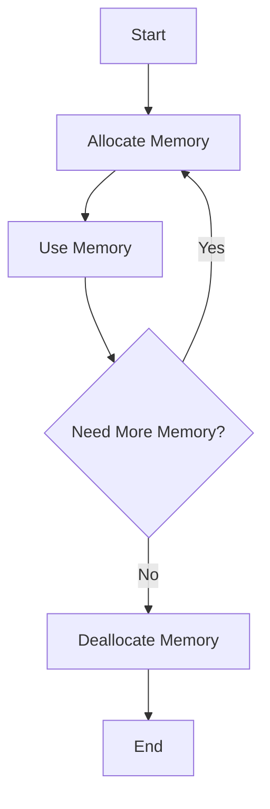

## 10.2 Writing `@nogc` Code

In the realm of systems programming, where performance and resource constraints are paramount, the D programming language offers a powerful feature: the ability to write `@nogc` code. This approach allows developers to eliminate the use of the garbage collector (GC), ensuring predictable performance and efficient resource utilization. In this section, we will delve into the techniques and best practices for writing `@nogc` code, explore its use cases, and provide practical examples to illustrate its application.

### Understanding `@nogc` in D

The `@nogc` attribute in D is a function attribute that indicates the function does not perform any garbage collection operations. This is crucial in scenarios where GC pauses are unacceptable, such as in real-time and embedded systems. By adhering to `@nogc` constraints, developers can ensure that their code remains free from GC-induced latency.

### Techniques for Writing `@nogc` Code

#### Avoiding Allocations

One of the primary strategies for writing `@nogc` code is to avoid heap allocations, which are typically managed by the garbage collector. Instead, developers can leverage stack allocations and preallocated memory buffers.

- **Stack Allocation**: Use stack-allocated variables whenever possible. Stack allocations are automatically managed and do not require GC intervention.

```d
void processData() @nogc {
    int[10] stackArray; // Stack allocation
    // Perform operations on stackArray
}
```

- **Preallocated Memory**: Allocate memory upfront and reuse it throughout the program's lifecycle. This technique is especially useful in embedded systems with limited memory.

```d
struct Buffer {
    ubyte[1024] data;
}

void processBuffer(ref Buffer buffer) @nogc {
    // Use buffer.data without additional allocations
}
```

#### Using `@nogc` Libraries and Functions

D's standard library provides several `@nogc` functions and modules. Familiarize yourself with these to ensure your code remains GC-free.

- **`std.experimental.allocator`**: This module offers a variety of allocators that can be used to manage memory manually, bypassing the GC.

```d
import std.experimental.allocator.mallocator;

void example() @nogc {
    auto allocator = Mallocator.instance;
    void* memory = allocator.allocate(1024);
    // Use memory
    allocator.deallocate(memory);
}
```

- **`std.range`**: Many range operations can be performed without triggering GC allocations. Use ranges to process data efficiently.

```d
import std.range;

void processRange() @nogc {
    auto r = iota(0, 10); // Range without allocations
    foreach (n; r) {
        // Process n
    }
}
```

### Use Cases for `@nogc` Code

#### Real-Time Systems

In real-time systems, consistent performance is critical. GC pauses can introduce latency, making `@nogc` code essential for meeting real-time constraints.

- **Example**: A real-time audio processing application where audio buffers must be processed within strict time limits.

```d
void processAudioBuffer(ref AudioBuffer buffer) @nogc {
    // Process audio data without GC pauses
}
```

#### Embedded Systems

Embedded systems often operate with limited resources, making efficient memory management crucial. `@nogc` code allows developers to maximize resource utilization.

- **Example**: A microcontroller application that controls a robotic arm, where memory is scarce and must be managed manually.

```d
void controlRoboticArm(ref ArmState state) @nogc {
    // Update arm state without heap allocations
}
```

### Challenges and Considerations

While writing `@nogc` code offers significant benefits, it also presents challenges that developers must address:

- **Manual Memory Management**: Without the GC, developers must manually manage memory, which can lead to errors such as memory leaks and buffer overflows if not handled carefully.

- **Limited Library Support**: Not all libraries and functions are `@nogc`. Developers may need to implement custom solutions or modify existing libraries to ensure GC-free operation.

- **Increased Complexity**: Writing `@nogc` code can increase code complexity, as developers must carefully manage memory and avoid common pitfalls associated with manual memory management.

### Best Practices for `@nogc` Code

- **Use `@nogc` Libraries**: Leverage libraries and modules that are designed for `@nogc` use to minimize the risk of inadvertently introducing GC operations.

- **Profile and Test**: Regularly profile and test your code to ensure it remains `@nogc` and performs as expected. Use tools like `dmd`'s `-vgc` flag to identify GC allocations.

- **Document Code**: Clearly document areas of your code that require manual memory management to aid in maintenance and debugging.

### Visualizing `@nogc` Code Flow

To better understand the flow of `@nogc` code, consider the following diagram illustrating the process of managing memory manually without GC intervention:



**Diagram Description**: This flowchart represents the typical process of managing memory in `@nogc` code. Memory is allocated, used, and then deallocated manually, ensuring no GC involvement.

### Try It Yourself

Experiment with the following code example to gain hands-on experience with `@nogc` programming. Modify the buffer size or processing logic to see how it affects performance and memory usage.

```d
import std.stdio;

struct Buffer {
    ubyte[256] data;
}

void processBuffer(ref Buffer buffer) @nogc {
    foreach (i, ref byte; buffer.data) {
        byte = cast(ubyte)(i % 256); // Simple processing
    }
}

void main() @nogc {
    Buffer buffer;
    processBuffer(buffer);
    writeln("Buffer processed successfully.");
}
```

### References and Further Reading

- [D Language Specification: Attributes](https://dlang.org/spec/attribute.html)
- [D Language Memory Management](https://dlang.org/spec/garbage.html)
- [D Programming Language: `@nogc`](https://dlang.org/phobos/std_experimental_allocator.html)

### Knowledge Check

To reinforce your understanding of `@nogc` code, consider the following questions and challenges:

- **Question**: What are the primary benefits of writing `@nogc` code in real-time systems?
- **Challenge**: Modify the provided code example to use a different allocator from `std.experimental.allocator`.

### Embrace the Journey

Remember, mastering `@nogc` programming is a journey. As you progress, you'll develop a deeper understanding of memory management and performance optimization. Keep experimenting, stay curious, and enjoy the journey!

## Quiz Time!



### What is the primary purpose of the `@nogc` attribute in D?

- [x] To ensure that a function does not perform garbage collection operations.
- [ ] To enable garbage collection in a function.
- [ ] To optimize memory usage automatically.
- [ ] To disable all memory allocations.

> **Explanation:** The `@nogc` attribute is used to indicate that a function does not perform any garbage collection operations, ensuring predictable performance.

### Which of the following is a technique to avoid heap allocations in `@nogc` code?

- [x] Using stack allocation.
- [ ] Using dynamic arrays.
- [ ] Using garbage collector.
- [ ] Using global variables.

> **Explanation:** Stack allocation is a technique to avoid heap allocations, which are managed by the garbage collector.

### What is a common use case for `@nogc` code?

- [x] Real-time systems.
- [ ] Web development.
- [ ] Database management.
- [ ] GUI applications.

> **Explanation:** Real-time systems benefit from `@nogc` code due to the need for consistent performance without GC pauses.

### Which module in D provides allocators for manual memory management?

- [x] `std.experimental.allocator`
- [ ] `std.range`
- [ ] `std.algorithm`
- [ ] `std.array`

> **Explanation:** The `std.experimental.allocator` module provides allocators for manual memory management, allowing developers to bypass the GC.

### What is a potential challenge of writing `@nogc` code?

- [x] Manual memory management.
- [ ] Automatic memory optimization.
- [ ] Increased garbage collection.
- [ ] Simplified code structure.

> **Explanation:** Writing `@nogc` code requires manual memory management, which can be challenging and error-prone.

### How can you identify GC allocations in your D code?

- [x] Use the `dmd` compiler's `-vgc` flag.
- [ ] Use the `dmd` compiler's `-O` flag.
- [ ] Use the `dmd` compiler's `-release` flag.
- [ ] Use the `dmd` compiler's `-debug` flag.

> **Explanation:** The `-vgc` flag in the `dmd` compiler helps identify GC allocations in your code.

### What is a benefit of using preallocated memory in `@nogc` code?

- [x] It avoids runtime heap allocations.
- [ ] It increases garbage collection frequency.
- [ ] It simplifies code logic.
- [ ] It automatically manages memory.

> **Explanation:** Preallocated memory avoids runtime heap allocations, which are managed by the garbage collector.

### Which of the following is a best practice for `@nogc` code?

- [x] Use `@nogc` libraries and functions.
- [ ] Avoid profiling and testing.
- [ ] Use dynamic memory allocation.
- [ ] Rely on garbage collection.

> **Explanation:** Using `@nogc` libraries and functions is a best practice to ensure your code remains GC-free.

### True or False: Writing `@nogc` code can increase code complexity.

- [x] True
- [ ] False

> **Explanation:** Writing `@nogc` code can increase code complexity due to the need for manual memory management.

### What should you do to maintain `@nogc` code?

- [x] Regularly profile and test the code.
- [ ] Avoid using any libraries.
- [ ] Use only dynamic arrays.
- [ ] Ignore memory management.

> **Explanation:** Regularly profiling and testing the code helps maintain `@nogc` code and ensure it performs as expected.


