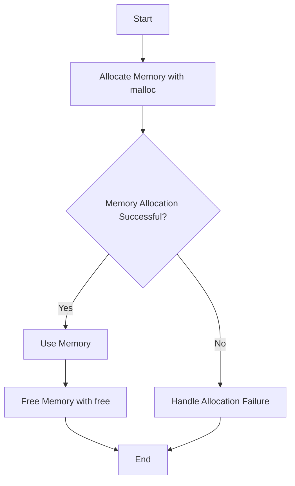

## 10.3 Manual Memory Management Techniques

In the realm of systems programming, efficient memory management is paramount. While D provides a garbage collector (GC) for automatic memory management, there are scenarios where manual memory management is necessary to achieve optimal performance, especially in high-performance applications or when interfacing with C libraries. This section delves into manual memory management techniques in D, focusing on manual allocation, ownership models, and practical use cases.

### Manual Allocation

Manual memory allocation involves directly managing memory using functions like `malloc` and `free`. This approach provides fine-grained control over memory usage, allowing developers to optimize performance and resource utilization.

#### Using `malloc` and `free`

In D, you can use the C standard library functions `malloc` and `free` to allocate and deallocate memory manually. This is particularly useful when interfacing with C libraries or when you need precise control over memory allocation.

```d
import core.stdc.stdlib : malloc, free;
import std.stdio : writeln;

void main() {
    // Allocate memory for an array of 10 integers
    int* array = cast(int*) malloc(10 * int.sizeof);

    if (array is null) {
        writeln("Memory allocation failed");
        return;
    }

    // Initialize the array
    for (int i = 0; i < 10; i++) {
        array[i] = i * i;
    }

    // Print the array
    for (int i = 0; i < 10; i++) {
        writeln("array[", i, "] = ", array[i]);
    }

    // Free the allocated memory
    free(array);
}
```

**Key Points:**
- **Allocation**: `malloc` allocates a block of memory of the specified size and returns a pointer to it. The memory is uninitialized.
- **Deallocation**: `free` releases the allocated memory back to the system. Failing to free memory leads to memory leaks.
- **Casting**: The result of `malloc` is cast to the appropriate pointer type.

### Ownership Models

Ownership models define how memory is managed and who is responsible for its lifecycle. In D, several patterns can be used to manage memory ownership effectively.

#### RAII Patterns

Resource Acquisition Is Initialization (RAII) is a pattern where resources are acquired and released by objects. In D, RAII can be implemented using structs with destructors.

```d
import std.stdio : writeln;

struct Resource {
    int* data;

    this(size_t size) {
        data = cast(int*) malloc(size * int.sizeof);
        if (data is null) {
            throw new Exception("Memory allocation failed");
        }
    }

    ~this() {
        if (data !is null) {
            free(data);
            writeln("Memory freed");
        }
    }
}

void main() {
    {
        Resource res = Resource(10);
        // Use res.data
    } // res goes out of scope, and memory is freed automatically
}
```

**Key Points:**
- **Automatic Cleanup**: The destructor `~this()` is called automatically when the object goes out of scope, ensuring that resources are released.
- **Exception Safety**: RAII provides a strong guarantee that resources will be released even if an exception is thrown.

### Use Cases and Examples

Manual memory management is crucial in scenarios where performance is critical or when interfacing with other languages.

#### High-Performance Applications

In high-performance applications, minimizing the overhead of memory management can lead to significant performance gains. Manual memory management allows for precise control over memory allocation and deallocation, reducing the impact of the garbage collector.

```d
import core.stdc.stdlib : malloc, free;
import std.stdio : writeln;

void processLargeDataSet(size_t size) {
    int* data = cast(int*) malloc(size * int.sizeof);

    if (data is null) {
        writeln("Memory allocation failed");
        return;
    }

    // Process data
    for (size_t i = 0; i < size; i++) {
        data[i] = i * 2;
    }

    // Perform operations on data
    // ...

    free(data);
}

void main() {
    processLargeDataSet(1000000);
}
```

**Key Points:**
- **Efficiency**: Manual memory management can reduce the overhead associated with garbage collection.
- **Control**: Developers have full control over when and how memory is allocated and freed.

#### Interfacing with C

When interfacing with C libraries, manual memory management is often necessary to ensure compatibility and correct operation.

```d
extern (C) void cFunction(int* data, size_t size);

void main() {
    size_t size = 100;
    int* data = cast(int*) malloc(size * int.sizeof);

    if (data is null) {
        writeln("Memory allocation failed");
        return;
    }

    // Initialize data
    for (size_t i = 0; i < size; i++) {
        data[i] = i;
    }

    // Call the C function
    cFunction(data, size);

    free(data);
}
```

**Key Points:**
- **Compatibility**: Manual memory management ensures that memory is allocated in a way that is compatible with C functions.
- **Safety**: Care must be taken to ensure that memory is correctly allocated and freed to prevent leaks and undefined behavior.

### Visualizing Memory Management

To better understand manual memory management, let's visualize the process of allocating and freeing memory using a flowchart.



**Diagram Explanation:**
- **Start**: The process begins with a request to allocate memory.
- **Allocate Memory**: Memory is allocated using `malloc`.
- **Check Success**: If allocation is successful, the memory is used; otherwise, an error is handled.
- **Free Memory**: Once the memory is no longer needed, it is freed using `free`.
- **End**: The process concludes after memory is freed or an error is handled.

### Try It Yourself

Experiment with the code examples provided by modifying the size of the allocated memory or the operations performed on the data. Observe how changes affect performance and memory usage. Consider implementing additional error handling or logging to track memory allocation and deallocation.

### Knowledge Check

- **Question**: What is the primary advantage of using manual memory management in high-performance applications?
- **Question**: How does RAII help in managing memory in D?
- **Question**: Why is manual memory management important when interfacing with C libraries?

### Summary

Manual memory management in D provides developers with the tools to optimize performance and ensure compatibility with C libraries. By understanding and applying techniques like manual allocation and RAII, developers can effectively manage memory in high-performance applications.

Remember, mastering manual memory management is a journey. As you gain experience, you'll develop a deeper understanding of how to balance performance and safety in your applications. Keep experimenting, stay curious, and enjoy the journey!

## Quiz Time!



### What is the primary advantage of using manual memory management in high-performance applications?

- [x] Reduced overhead from garbage collection
- [ ] Simpler code structure
- [ ] Easier debugging
- [ ] Automatic memory safety

> **Explanation:** Manual memory management reduces the overhead associated with garbage collection, which can lead to performance improvements in high-performance applications.

### How does RAII help in managing memory in D?

- [x] It ensures automatic cleanup of resources
- [ ] It prevents memory leaks by using garbage collection
- [ ] It simplifies code by removing the need for destructors
- [ ] It allows for dynamic memory allocation

> **Explanation:** RAII ensures that resources are automatically cleaned up when an object goes out of scope, providing a strong guarantee against resource leaks.

### Why is manual memory management important when interfacing with C libraries?

- [x] To ensure compatibility with C functions
- [ ] To simplify code structure
- [ ] To avoid using D's garbage collector
- [ ] To enable automatic memory safety

> **Explanation:** Manual memory management ensures that memory is allocated in a way that is compatible with C functions, which is crucial when interfacing with C libraries.

### What function is used to allocate memory manually in D?

- [x] malloc
- [ ] new
- [ ] alloc
- [ ] calloc

> **Explanation:** The `malloc` function is used to allocate memory manually in D, similar to its use in C.

### What is the role of the `free` function in manual memory management?

- [x] To release allocated memory back to the system
- [ ] To allocate memory for objects
- [ ] To initialize memory
- [ ] To check for memory leaks

> **Explanation:** The `free` function releases allocated memory back to the system, preventing memory leaks.

### Which of the following is a key feature of RAII?

- [x] Automatic resource management
- [ ] Manual memory deallocation
- [ ] Dynamic memory allocation
- [ ] Use of garbage collection

> **Explanation:** RAII provides automatic resource management by ensuring that resources are released when an object goes out of scope.

### What is a potential risk of manual memory management?

- [x] Memory leaks
- [ ] Automatic memory safety
- [ ] Simplified code structure
- [ ] Reduced performance

> **Explanation:** A potential risk of manual memory management is memory leaks, which occur when allocated memory is not properly freed.

### In the context of D, what does RAII stand for?

- [x] Resource Acquisition Is Initialization
- [ ] Resource Allocation Is Immediate
- [ ] Resource Access Is Immediate
- [ ] Resource Allocation Is Initialization

> **Explanation:** RAII stands for Resource Acquisition Is Initialization, a pattern where resources are acquired and released by objects.

### What is the purpose of casting the result of `malloc` in D?

- [x] To convert the void pointer to the appropriate type
- [ ] To allocate memory for objects
- [ ] To initialize memory
- [ ] To check for memory leaks

> **Explanation:** The result of `malloc` is cast to the appropriate pointer type to convert the void pointer returned by `malloc` to the desired type.

### True or False: Manual memory management in D is always preferable to using the garbage collector.

- [ ] True
- [x] False

> **Explanation:** False. Manual memory management is not always preferable; it is used in specific scenarios where performance is critical or when interfacing with C libraries. The garbage collector is suitable for many applications where ease of use and safety are prioritized.


