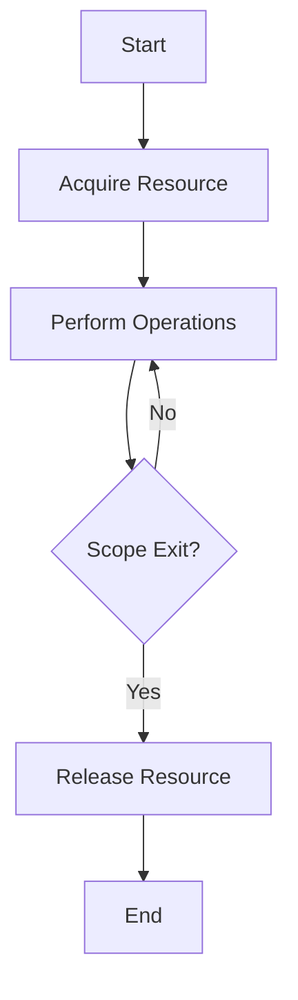

## 10.4 Scoped Resource Management with RAII

In the realm of systems programming, efficient resource management is paramount. The D programming language, with its unique features, offers powerful tools for managing resources effectively. One such tool is the concept of **Resource Acquisition Is Initialization (RAII)**. This technique binds the lifetime of resources to the lifetime of objects, ensuring that resources are automatically released when they are no longer needed. In this section, we will explore how RAII can be implemented in D, focusing on the use of scope guards to ensure cleanup, and examining practical use cases such as managing file descriptors and network connections.

### Understanding RAII

**Resource Acquisition Is Initialization (RAII)** is a programming idiom that ties resource management to object lifetime. When an object is created, it acquires resources, and when it is destroyed, it releases them. This approach is particularly beneficial in preventing resource leaks, which can lead to performance degradation and system instability.

#### Key Concepts of RAII

- **Initialization**: Resources are acquired during the initialization of an object.
- **Destruction**: Resources are released when the object is destroyed.
- **Automatic Management**: The language runtime automatically handles resource cleanup, reducing the burden on developers.

RAII is widely used in C++ and has been effectively adapted to D, leveraging D's features like destructors and scope guards.

### Implementing RAII in D

D provides several constructs that facilitate RAII, including destructors and scope guards. Let's delve into these features and see how they can be used to manage resources efficiently.

#### Destructors in D

Destructors in D are special member functions that are called when an object goes out of scope. They are defined using the `~this()` syntax. Destructors are ideal for releasing resources that were acquired during the object's lifetime.

```d
class FileHandler {
    private File file;

    this(string filename) {
        file = File(filename, "r");
        // Acquire resource
    }

    ~this() {
        file.close();
        // Release resource
    }
}
```

In the example above, the `FileHandler` class acquires a file resource upon initialization and releases it in the destructor.

#### Scope Guards

Scope guards in D provide a more flexible way to manage resources. They allow you to specify actions that should be taken when a scope is exited, regardless of whether it is exited normally or due to an exception. This is achieved using the `scope` keyword.

```d
void processFile(string filename) {
    File file = File(filename, "r");
    scope(exit) file.close(); // Ensures file is closed when scope exits

    // Perform file operations
}
```

In this example, the `scope(exit)` statement ensures that the file is closed when the function scope is exited, providing a robust mechanism for resource cleanup.

### Use Cases and Examples

RAII and scope guards are particularly useful in scenarios where resources need to be managed carefully, such as file descriptors and network connections.

#### Managing File Descriptors

File descriptors are a limited resource, and failing to close them can lead to resource exhaustion. RAII can be used to ensure that file descriptors are properly managed.

```d
void readFile(string filename) {
    File file = File(filename, "r");
    scope(exit) file.close();

    // Read file contents
}
```

By using a scope guard, we ensure that the file descriptor is closed when the function exits, preventing resource leaks.

#### Managing Network Connections

Network connections are another resource that requires careful management. RAII can be used to ensure that connections are properly closed.

```d
void connectToServer(string address) {
    NetworkConnection conn = NetworkConnection(address);
    scope(exit) conn.disconnect();

    // Communicate with server
}
```

In this example, the network connection is automatically disconnected when the function scope is exited, ensuring that resources are released.

### Visualizing RAII with Scope Guards

To better understand how RAII and scope guards work, let's visualize the process using a flowchart.



**Figure 1**: This flowchart illustrates the RAII process, where resources are acquired at the beginning and released upon scope exit.

### Design Considerations

When implementing RAII in D, consider the following:

- **Exception Safety**: Ensure that resources are released even if an exception occurs. Scope guards are particularly useful for this purpose.
- **Resource Ownership**: Clearly define which object owns a resource to avoid double freeing.
- **Performance**: While RAII simplifies resource management, be mindful of the overhead associated with destructors and scope guards.

### Differences and Similarities with Other Patterns

RAII is often compared to other resource management patterns, such as garbage collection. Unlike garbage collection, which automatically manages memory, RAII provides deterministic resource management, making it suitable for systems programming where resource control is critical.

### Try It Yourself

To deepen your understanding of RAII in D, try modifying the examples provided:

- **Experiment with Different Resources**: Implement RAII for other resources, such as database connections or thread handles.
- **Combine RAII with Other Patterns**: Explore how RAII can be integrated with other design patterns, such as the Factory Method or Singleton.

### Knowledge Check

Before we conclude, let's reinforce what we've learned with a few questions:

1. What is the primary benefit of using RAII?
2. How do scope guards enhance resource management in D?
3. Why is exception safety important in RAII?

### Embrace the Journey

Remember, mastering RAII is just one step in your journey to becoming a proficient D programmer. As you continue to explore the language, you'll discover more powerful tools and techniques that will enhance your ability to build robust and efficient systems. Keep experimenting, stay curious, and enjoy the journey!

## Quiz Time!



### What does RAII stand for?

- [x] Resource Acquisition Is Initialization
- [ ] Resource Allocation Is Initialization
- [ ] Resource Acquisition Is Immediate
- [ ] Resource Allocation Is Immediate

> **Explanation:** RAII stands for Resource Acquisition Is Initialization, a programming idiom that ties resource management to object lifetime.

### What is the primary purpose of RAII?

- [x] To bind resource lifetimes to object lifetimes
- [ ] To delay resource acquisition until necessary
- [ ] To manually manage resources
- [ ] To avoid using destructors

> **Explanation:** RAII binds resource lifetimes to object lifetimes, ensuring resources are automatically released when objects are destroyed.

### How do scope guards in D help with resource management?

- [x] They ensure resources are released when a scope is exited
- [ ] They prevent resources from being acquired
- [ ] They delay resource release until program termination
- [ ] They require manual resource release

> **Explanation:** Scope guards in D ensure resources are released when a scope is exited, providing robust resource management.

### What keyword is used in D to define a destructor?

- [x] `~this()`
- [ ] `destructor()`
- [ ] `delete()`
- [ ] `destroy()`

> **Explanation:** In D, destructors are defined using the `~this()` syntax.

### Which of the following is a use case for RAII?

- [x] Managing file descriptors
- [x] Managing network connections
- [ ] Delaying resource acquisition
- [ ] Avoiding resource initialization

> **Explanation:** RAII is commonly used for managing file descriptors and network connections, ensuring resources are properly released.

### What is a key advantage of using RAII over garbage collection?

- [x] Deterministic resource management
- [ ] Automatic memory management
- [ ] Delayed resource release
- [ ] Manual resource management

> **Explanation:** RAII provides deterministic resource management, making it suitable for systems programming where resource control is critical.

### What does the `scope(exit)` statement do in D?

- [x] Ensures a block of code is executed when a scope is exited
- [ ] Delays resource release until program termination
- [ ] Prevents resource acquisition
- [ ] Requires manual resource release

> **Explanation:** The `scope(exit)` statement in D ensures a block of code is executed when a scope is exited, aiding in resource cleanup.

### Why is exception safety important in RAII?

- [x] To ensure resources are released even if an exception occurs
- [ ] To prevent exceptions from being thrown
- [ ] To delay resource release
- [ ] To manually manage resources

> **Explanation:** Exception safety is important in RAII to ensure resources are released even if an exception occurs, preventing resource leaks.

### What is a potential downside of using destructors in RAII?

- [x] Overhead associated with destructors
- [ ] Manual resource management
- [ ] Delayed resource release
- [ ] Lack of exception safety

> **Explanation:** While RAII simplifies resource management, there can be overhead associated with destructors.

### True or False: RAII is only applicable to memory management.

- [ ] True
- [x] False

> **Explanation:** False. RAII is applicable to various types of resources, not just memory management.


