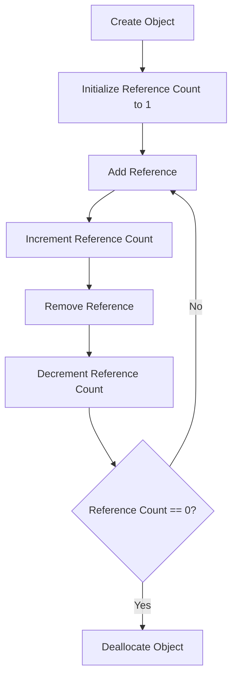

## 10.5 Reference Counting and Smart Pointers

In the realm of systems programming, efficient memory management is paramount. The D programming language offers several mechanisms to manage memory, among which reference counting and smart pointers stand out as powerful tools. These mechanisms help in automatic memory management, ensuring that resources are efficiently utilized and memory leaks are minimized. In this section, we will delve into the concepts of reference counting and smart pointers, explore D's built-in support through the `RefCounted` struct, and discuss use cases and examples that highlight their importance in managing shared resources and ensuring memory safety.

### Understanding Reference Counting

Reference counting is a technique used to manage the lifecycle of an object by keeping track of how many references point to it. When the reference count drops to zero, the object can be safely deallocated. This approach helps in automatic memory management, reducing the risk of memory leaks and dangling pointers.

#### Key Concepts

- **Reference Count**: A counter associated with an object that tracks the number of active references to it.
- **Increment/Decrement**: Operations that increase or decrease the reference count as references are added or removed.
- **Deallocation**: The process of freeing memory when the reference count reaches zero.

### Implementing Smart Pointers

Smart pointers are abstractions that manage the lifecycle of objects through reference counting. They automatically handle the increment and decrement of reference counts, ensuring that objects are deallocated when no longer needed.

#### `RefCounted` Struct in D

D provides a built-in `RefCounted` struct that simplifies the implementation of reference counting. It encapsulates an object and manages its reference count, providing a convenient way to handle shared ownership.

```d
import std.typecons;

struct MyData {
    int value;
}

void main() {
    auto data = RefCounted!MyData(MyData(42));
    writeln(data.get.value); // Access the underlying data
}
```

In this example, `RefCounted!MyData` creates a reference-counted wrapper around an instance of `MyData`. The `get` method is used to access the underlying data.

#### Key Features of `RefCounted`

- **Automatic Reference Counting**: Automatically increments and decrements the reference count as the `RefCounted` object is copied or destroyed.
- **Thread Safety**: Ensures that reference counting operations are thread-safe, preventing race conditions in concurrent environments.
- **Ease of Use**: Provides a simple interface for managing shared resources without manual reference counting.

### Use Cases and Examples

#### Managing Shared Resources

Reference counting is particularly useful in scenarios where multiple parts of a program need to share ownership of a resource. By using smart pointers, we can ensure that the resource is only deallocated when all references are gone.

```d
import std.typecons;
import std.stdio;

struct SharedResource {
    string name;
}

void useResource(RefCounted!SharedResource resource) {
    writeln("Using resource: ", resource.get.name);
}

void main() {
    auto resource = RefCounted!SharedResource(SharedResource("Shared Data"));
    useResource(resource);
    writeln("Resource still available: ", resource.get.name);
}
```

In this example, the `SharedResource` is shared between the `main` function and the `useResource` function. The resource is automatically managed by the `RefCounted` struct, ensuring it remains available as long as there are active references.

#### Memory Safety

Smart pointers help prevent memory leaks by ensuring that objects are deallocated when no longer needed. This is particularly important in complex systems where manual memory management can lead to errors.

```d
import std.typecons;
import std.stdio;

struct Node {
    int value;
    RefCounted!Node next;
}

void main() {
    auto node1 = RefCounted!Node(Node(1, null));
    auto node2 = RefCounted!Node(Node(2, node1));
    writeln("Node 2 value: ", node2.get.value);
    writeln("Node 1 value: ", node2.get.next.get.value);
}
```

In this linked list example, each `Node` contains a reference to the next node. The `RefCounted` struct ensures that nodes are deallocated when they are no longer referenced, preventing memory leaks.

### Visualizing Reference Counting

To better understand how reference counting works, let's visualize the process using a flowchart.



**Figure 1: Reference Counting Flowchart**

This flowchart illustrates the lifecycle of an object managed by reference counting. The reference count is incremented and decremented as references are added and removed. When the count reaches zero, the object is deallocated.

### Design Considerations

When using reference counting and smart pointers, consider the following:

- **Cyclic References**: Reference counting cannot handle cyclic references, where two or more objects reference each other, preventing their deallocation. Use weak references or other techniques to break cycles.
- **Performance Overhead**: Reference counting introduces some overhead due to the need to manage reference counts. Evaluate the performance impact in performance-critical applications.
- **Thread Safety**: Ensure that reference counting operations are thread-safe, especially in concurrent environments. D's `RefCounted` provides built-in thread safety.

### Differences and Similarities

Reference counting and garbage collection are both automatic memory management techniques, but they differ in their approach:

- **Reference Counting**: Manages memory by tracking references to objects. Immediate deallocation when the count reaches zero.
- **Garbage Collection**: Periodically scans memory to identify and deallocate unused objects. May introduce pauses due to collection cycles.

### Try It Yourself

To deepen your understanding of reference counting and smart pointers, try modifying the code examples:

- **Experiment with Cyclic References**: Create a scenario with cyclic references and observe the behavior. Implement a solution to break the cycle.
- **Measure Performance**: Compare the performance of reference counting with manual memory management in a simple application.
- **Implement Custom Smart Pointer**: Create your own smart pointer implementation using D's features and compare it with `RefCounted`.

### References and Links

- [D Language Reference](https://dlang.org/spec/spec.html)
- [D Programming Language: Memory Management](https://dlang.org/memory.html)
- [Smart Pointers in D](https://dlang.org/phobos/std_typecons.html#RefCounted)

### Knowledge Check

- **What is reference counting and how does it work?**
- **How does the `RefCounted` struct in D simplify reference counting?**
- **What are the advantages and disadvantages of using reference counting?**
- **How can cyclic references be handled in a reference counting system?**

### Embrace the Journey

Remember, mastering memory management is a journey. As you explore reference counting and smart pointers, you'll gain insights into efficient resource management and memory safety. Keep experimenting, stay curious, and enjoy the journey!

## Quiz Time!



### What is the primary purpose of reference counting?

- [x] To manage the lifecycle of an object by tracking references.
- [ ] To allocate memory for new objects.
- [ ] To optimize CPU usage.
- [ ] To handle network connections.

> **Explanation:** Reference counting is used to manage the lifecycle of an object by keeping track of how many references point to it.

### Which D struct simplifies the implementation of reference counting?

- [x] `RefCounted`
- [ ] `SmartPointer`
- [ ] `AutoPtr`
- [ ] `UniquePtr`

> **Explanation:** The `RefCounted` struct in D provides built-in support for reference counting.

### What happens when the reference count of an object reaches zero?

- [x] The object is deallocated.
- [ ] The object is duplicated.
- [ ] The reference count is reset.
- [ ] The object is moved to a different memory location.

> **Explanation:** When the reference count reaches zero, the object can be safely deallocated.

### What is a potential issue with reference counting?

- [x] Cyclic references
- [ ] High memory usage
- [ ] Slow execution speed
- [ ] Lack of thread safety

> **Explanation:** Cyclic references can prevent objects from being deallocated in a reference counting system.

### How can cyclic references be handled in a reference counting system?

- [x] Using weak references
- [ ] Increasing the reference count
- [ ] Decreasing the reference count
- [ ] Ignoring the references

> **Explanation:** Weak references can be used to break cycles and allow objects to be deallocated.

### What is a disadvantage of reference counting compared to garbage collection?

- [x] Performance overhead
- [ ] Lack of memory safety
- [ ] Inability to manage resources
- [ ] Complexity in implementation

> **Explanation:** Reference counting introduces some overhead due to the need to manage reference counts.

### What is an advantage of using smart pointers?

- [x] Automatic memory management
- [ ] Manual memory allocation
- [ ] Increased code complexity
- [ ] Reduced code readability

> **Explanation:** Smart pointers provide automatic memory management, reducing the risk of memory leaks.

### How does `RefCounted` ensure thread safety?

- [x] By providing built-in thread-safe operations
- [ ] By using locks for every operation
- [ ] By disabling concurrent access
- [ ] By duplicating objects for each thread

> **Explanation:** `RefCounted` ensures thread safety by providing built-in thread-safe operations.

### What is a key feature of smart pointers?

- [x] They automatically manage the lifecycle of objects.
- [ ] They require manual reference counting.
- [ ] They are only used for single-threaded applications.
- [ ] They increase the complexity of memory management.

> **Explanation:** Smart pointers automatically manage the lifecycle of objects, simplifying memory management.

### True or False: Reference counting can handle cyclic references without any additional mechanisms.

- [ ] True
- [x] False

> **Explanation:** Reference counting cannot handle cyclic references without additional mechanisms like weak references.


