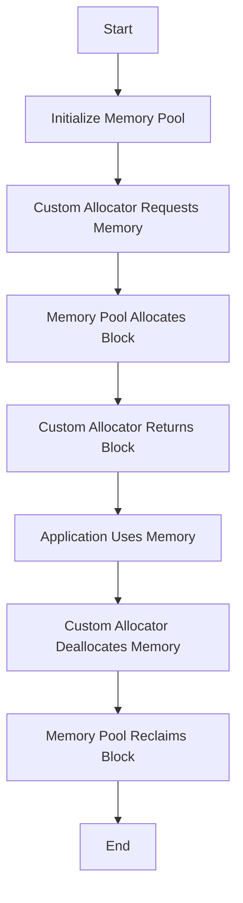

## 10.6 Custom Allocators and Memory Pools

In the realm of systems programming, efficient memory management is crucial for achieving high performance and reliability. The D programming language offers advanced features that allow developers to implement custom allocators and memory pools, providing fine-grained control over memory allocation and deallocation. This section delves into the concepts of custom allocators and memory pools, their use cases, and how they can be implemented in D to optimize performance in demanding applications such as game development and high-frequency trading systems.

### Understanding Memory Pools

Memory pools are a memory management technique where a large block of memory is preallocated and divided into smaller chunks for allocation. This approach reduces the overhead associated with frequent allocations and deallocations, as it minimizes interactions with the system's general-purpose allocator.

#### Key Benefits of Memory Pools

- **Reduced Fragmentation**: By allocating memory in fixed-size blocks, memory pools help reduce fragmentation, leading to more efficient use of memory.
- **Improved Performance**: Memory pools can significantly speed up allocation and deallocation operations, as they often involve simple pointer arithmetic rather than complex system calls.
- **Predictable Memory Usage**: Preallocating memory allows developers to predict and control memory usage more effectively, which is crucial in systems with limited resources.

### Implementing Memory Pools in D

Let's explore how to implement a simple memory pool in D. We'll create a memory pool that allocates fixed-size blocks of memory.

```d
import std.stdio;
import std.exception;

class MemoryPool {
    private ubyte[] pool;
    private size_t blockSize;
    private size_t poolSize;
    private size_t nextFreeBlock;

    this(size_t blockSize, size_t blockCount) {
        this.blockSize = blockSize;
        this.poolSize = blockSize * blockCount;
        this.pool = new ubyte[poolSize];
        this.nextFreeBlock = 0;
    }

    void* allocate() {
        enforce(nextFreeBlock + blockSize <= poolSize, "Memory pool exhausted");
        void* block = &pool[nextFreeBlock];
        nextFreeBlock += blockSize;
        return block;
    }

    void deallocate(void* block) {
        // In a simple memory pool, deallocation might be a no-op
        // or involve adding the block back to a free list.
    }
}

void main() {
    auto pool = new MemoryPool(64, 10); // 10 blocks of 64 bytes each
    void* block1 = pool.allocate();
    writeln("Allocated block at: ", block1);
    // Use the block...
    pool.deallocate(block1);
}
```

In this example, we define a `MemoryPool` class that preallocates a pool of memory divided into fixed-size blocks. The `allocate` method returns a pointer to the next available block, while the `deallocate` method is a placeholder for potential future enhancements, such as maintaining a free list.

### Custom Allocators: Fine-Grained Control

Custom allocators provide developers with the ability to tailor memory allocation strategies to the specific needs of their applications. This can lead to significant performance improvements, especially in scenarios where the default allocator is not optimal.

#### Advantages of Custom Allocators

- **Fine-Grained Control**: Custom allocators allow developers to optimize memory allocation patterns based on the application's specific requirements.
- **Reduced Overhead**: By bypassing the general-purpose allocator, custom allocators can reduce the overhead associated with memory management.
- **Enhanced Performance**: Tailoring allocation strategies can lead to faster allocation and deallocation times, improving overall application performance.

### Implementing a Custom Allocator in D

Let's implement a simple custom allocator in D that uses a memory pool to allocate memory.

```d
import std.stdio;
import std.exception;

class CustomAllocator {
    private MemoryPool pool;

    this(size_t blockSize, size_t blockCount) {
        pool = new MemoryPool(blockSize, blockCount);
    }

    void* allocate(size_t size) {
        enforce(size <= pool.blockSize, "Requested size exceeds block size");
        return pool.allocate();
    }

    void deallocate(void* block) {
        pool.deallocate(block);
    }
}

void main() {
    auto allocator = new CustomAllocator(64, 10); // 10 blocks of 64 bytes each
    void* block1 = allocator.allocate(32);
    writeln("Allocated block at: ", block1);
    // Use the block...
    allocator.deallocate(block1);
}
```

In this example, the `CustomAllocator` class uses a `MemoryPool` to allocate memory. The `allocate` method ensures that the requested size does not exceed the block size, while the `deallocate` method delegates deallocation to the memory pool.

### Use Cases and Examples

Custom allocators and memory pools are particularly useful in scenarios where performance and memory efficiency are critical. Let's explore two common use cases: game development and high-frequency trading.

#### Game Development

In game development, performance is paramount. Games often require frequent allocation and deallocation of objects, such as game entities, textures, and audio buffers. Custom allocators and memory pools can help reduce the overhead associated with these operations, leading to smoother gameplay and reduced latency.

```d
class GameEntity {
    // Game entity data...
}

void main() {
    auto entityAllocator = new CustomAllocator(GameEntity.sizeof, 1000); // Pool for 1000 entities
    GameEntity* entity = cast(GameEntity*)entityAllocator.allocate(GameEntity.sizeof);
    // Initialize and use the entity...
    entityAllocator.deallocate(entity);
}
```

In this example, we use a custom allocator to manage memory for game entities, ensuring efficient allocation and deallocation.

#### High-Frequency Trading

High-frequency trading systems require ultra-low latency and high throughput. Custom allocators can help achieve these goals by minimizing the time spent on memory management operations.

```d
class TradeOrder {
    // Trade order data...
}

void main() {
    auto orderAllocator = new CustomAllocator(TradeOrder.sizeof, 10000); // Pool for 10000 orders
    TradeOrder* order = cast(TradeOrder*)orderAllocator.allocate(TradeOrder.sizeof);
    // Process the order...
    orderAllocator.deallocate(order);
}
```

In this example, we use a custom allocator to manage memory for trade orders, ensuring that memory management does not become a bottleneck in the trading system.

### Visualizing Memory Pool and Custom Allocator Workflow

To better understand how memory pools and custom allocators work together, let's visualize the workflow using a Mermaid.js diagram.



This diagram illustrates the flow of memory allocation and deallocation using a custom allocator and memory pool. The process begins with initializing the memory pool, followed by the custom allocator requesting memory. The memory pool allocates a block, which is then returned to the application. Once the application is done using the memory, the custom allocator deallocates it, and the memory pool reclaims the block.

### Try It Yourself

Experiment with the provided code examples by modifying the block size and count in the `MemoryPool` and `CustomAllocator` classes. Observe how these changes affect memory allocation and deallocation performance. Consider implementing additional features, such as a free list for deallocated blocks, to further optimize memory management.

### Knowledge Check

- What are the key benefits of using memory pools?
- How do custom allocators provide fine-grained control over memory allocation?
- In what scenarios are custom allocators and memory pools particularly useful?
- How can you modify the provided code examples to improve memory management efficiency?

### Embrace the Journey

Remember, mastering memory management is an ongoing journey. As you continue to explore custom allocators and memory pools, you'll gain deeper insights into optimizing performance and efficiency in your applications. Keep experimenting, stay curious, and enjoy the process of learning and discovery!

## Quiz Time!



### What is a primary benefit of using memory pools?

- [x] Reduced fragmentation
- [ ] Increased memory usage
- [ ] Slower allocation times
- [ ] Complex system calls

> **Explanation:** Memory pools reduce fragmentation by allocating memory in fixed-size blocks, leading to more efficient use of memory.

### How do custom allocators enhance performance?

- [x] By providing fine-grained control over memory allocation
- [ ] By increasing the overhead of memory management
- [ ] By using the system's general-purpose allocator
- [ ] By slowing down allocation and deallocation times

> **Explanation:** Custom allocators enhance performance by allowing developers to tailor memory allocation strategies to the specific needs of their applications.

### In which scenario are custom allocators particularly useful?

- [x] High-frequency trading
- [ ] Simple web applications
- [ ] Static websites
- [ ] Basic command-line tools

> **Explanation:** Custom allocators are particularly useful in high-frequency trading systems, where ultra-low latency and high throughput are required.

### What is the role of the `deallocate` method in a memory pool?

- [x] To reclaim memory blocks
- [ ] To allocate new memory blocks
- [ ] To increase memory fragmentation
- [ ] To slow down memory operations

> **Explanation:** The `deallocate` method reclaims memory blocks, allowing them to be reused, which is crucial for efficient memory management.

### What is a potential enhancement for a simple memory pool?

- [x] Implementing a free list for deallocated blocks
- [ ] Increasing the block size indefinitely
- [ ] Removing the `allocate` method
- [ ] Using complex system calls for allocation

> **Explanation:** Implementing a free list for deallocated blocks can optimize memory management by allowing blocks to be reused efficiently.

### What is a key advantage of preallocating memory in a pool?

- [x] Predictable memory usage
- [ ] Unpredictable memory usage
- [ ] Increased system calls
- [ ] Higher memory fragmentation

> **Explanation:** Preallocating memory allows developers to predict and control memory usage more effectively, which is crucial in systems with limited resources.

### How can you optimize a custom allocator?

- [x] By tailoring allocation strategies to application needs
- [ ] By using the default system allocator
- [ ] By ignoring memory fragmentation
- [ ] By increasing allocation overhead

> **Explanation:** Optimizing a custom allocator involves tailoring allocation strategies to the specific needs of the application, reducing overhead and improving performance.

### What is the primary function of a memory pool?

- [x] To manage memory allocation and deallocation efficiently
- [ ] To increase memory fragmentation
- [ ] To slow down memory operations
- [ ] To use complex system calls

> **Explanation:** The primary function of a memory pool is to manage memory allocation and deallocation efficiently, reducing fragmentation and improving performance.

### What is a common use case for memory pools in game development?

- [x] Allocating game entities efficiently
- [ ] Increasing game latency
- [ ] Slowing down gameplay
- [ ] Using complex system calls

> **Explanation:** Memory pools are commonly used in game development to allocate game entities efficiently, reducing latency and improving performance.

### True or False: Custom allocators can reduce the overhead associated with memory management.

- [x] True
- [ ] False

> **Explanation:** Custom allocators can reduce the overhead associated with memory management by bypassing the general-purpose allocator and optimizing allocation strategies.


