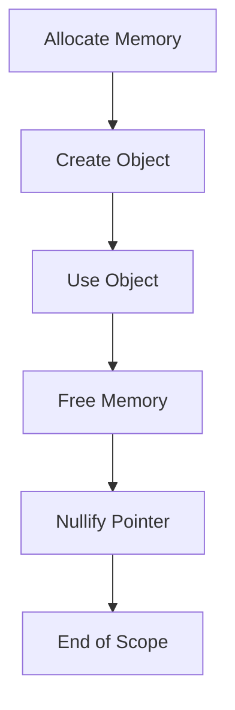

## 10.7 Avoiding Common Memory Pitfalls

Memory management is a critical aspect of systems programming, especially in a language like D that offers both high-level abstractions and low-level control. In this section, we will explore common memory pitfalls such as dangling pointers, memory leaks, and security vulnerabilities, and provide strategies to avoid them. By understanding these pitfalls, you can write more robust, efficient, and secure D programs.

### Dangling Pointers: Preventing Use-After-Free Errors

Dangling pointers occur when a pointer continues to reference a memory location after it has been freed. This can lead to undefined behavior, crashes, or security vulnerabilities. Let's explore how to prevent these issues in D.

#### Understanding Dangling Pointers

A dangling pointer arises when an object is deleted or goes out of scope, but a pointer still references its memory location. Accessing this memory can lead to unpredictable results.

```d
import std.stdio;

void main() {
    int* ptr = new int(42);
    writeln(*ptr); // Outputs: 42
    delete ptr;    // Free the memory
    // ptr is now a dangling pointer
    // writeln(*ptr); // Undefined behavior if uncommented
}
```

#### Strategies to Avoid Dangling Pointers

1. **Use `@safe` Code**: D's `@safe` attribute prevents certain unsafe operations, including direct pointer arithmetic and dereferencing null pointers.

2. **Smart Pointers**: Utilize reference counting or smart pointers to manage object lifetimes automatically.

3. **Scope Guards**: Use D's `scope` statement to ensure resources are released when they go out of scope.

4. **Nullify Pointers**: Set pointers to `null` after freeing memory to avoid accidental dereferencing.

```d
import std.stdio;

void main() {
    int* ptr = new int(42);
    writeln(*ptr); // Outputs: 42
    delete ptr;
    ptr = null;    // Nullify the pointer
    // Safe to check if(ptr) before dereferencing
}
```

### Memory Leaks: Identifying and Fixing Leaks

Memory leaks occur when allocated memory is not freed, leading to increased memory usage and potential exhaustion. Let's discuss how to detect and fix memory leaks in D.

#### Leak Detection Tools

1. **Valgrind**: A popular tool for detecting memory leaks and other memory-related errors.

2. **DMD's Built-in Leak Detector**: The DMD compiler includes a basic memory leak detector that can be enabled with the `-profile=gc` flag.

3. **Custom Allocators**: Implement custom allocators that track allocations and deallocations to identify leaks.

#### Fixing Memory Leaks

1. **RAII (Resource Acquisition Is Initialization)**: Use RAII to manage resources, ensuring they are released when objects go out of scope.

2. **Manual Memory Management**: Carefully pair `new` and `delete` operations, and ensure all allocated memory is freed.

3. **Garbage Collection**: Leverage D's garbage collector for automatic memory management, but be aware of its limitations and potential for non-deterministic behavior.

```d
import std.stdio;

class Resource {
    ~this() {
        writeln("Resource released");
    }
}

void main() {
    {
        auto res = new Resource();
        // Resource is automatically released when it goes out of scope
    }
    writeln("End of scope");
}
```

### Use Cases and Examples

#### Long-Running Applications: Ensuring Stability

In long-running applications, memory leaks can accumulate over time, leading to performance degradation or crashes. Use the following strategies to ensure stability:

1. **Regular Profiling**: Periodically profile your application to detect and fix memory leaks.

2. **Resource Management**: Use RAII and scope guards to manage resources effectively.

3. **Garbage Collection Tuning**: Adjust garbage collector settings to optimize performance for long-running applications.

#### Security: Preventing Vulnerabilities

Memory management issues can lead to security vulnerabilities, such as buffer overflows and use-after-free errors. To enhance security:

1. **Bounds Checking**: Use D's array bounds checking to prevent buffer overflows.

2. **Safe Code Practices**: Write `@safe` code to avoid unsafe operations.

3. **Static Analysis**: Use static analysis tools to detect potential security vulnerabilities in your code.

### Visualizing Memory Management in D

To better understand memory management in D, let's visualize the lifecycle of an object and how it interacts with pointers and memory allocation.



**Figure 1**: The lifecycle of an object in D, from allocation to deallocation.

### Try It Yourself

Experiment with the following code to understand memory management in D:

1. Modify the code to introduce a memory leak and use a tool like Valgrind to detect it.
2. Implement a smart pointer to manage the lifetime of an object automatically.
3. Use the `scope` statement to ensure resources are released when they go out of scope.

### Knowledge Check

- Explain the concept of a dangling pointer and how it can lead to undefined behavior.
- Describe how RAII can be used to manage resources in D.
- List tools and techniques for detecting memory leaks in D programs.

### Embrace the Journey

Remember, mastering memory management is a journey. As you continue to explore D programming, keep experimenting with different strategies and tools to enhance your understanding and skills. Stay curious, and enjoy the process of becoming a more proficient systems programmer.

## Quiz Time!



### What is a dangling pointer?

- [x] A pointer that references memory that has been freed
- [ ] A pointer that references a null value
- [ ] A pointer that references a valid memory location
- [ ] A pointer that is never used

> **Explanation:** A dangling pointer occurs when a pointer continues to reference a memory location after it has been freed, leading to undefined behavior.

### Which tool can be used to detect memory leaks in D programs?

- [x] Valgrind
- [ ] GDB
- [ ] GCC
- [ ] Make

> **Explanation:** Valgrind is a popular tool for detecting memory leaks and other memory-related errors.

### What is the purpose of the `@safe` attribute in D?

- [x] To prevent unsafe operations such as pointer arithmetic
- [ ] To optimize code for performance
- [ ] To enable garbage collection
- [ ] To allow inline assembly

> **Explanation:** The `@safe` attribute in D prevents certain unsafe operations, including direct pointer arithmetic and dereferencing null pointers.

### How can RAII help in memory management?

- [x] By ensuring resources are released when objects go out of scope
- [ ] By increasing the speed of memory allocation
- [ ] By preventing all memory leaks automatically
- [ ] By disabling garbage collection

> **Explanation:** RAII (Resource Acquisition Is Initialization) ensures that resources are released when objects go out of scope, helping to manage memory effectively.

### What is a common cause of memory leaks?

- [x] Forgetting to free allocated memory
- [ ] Using too many variables
- [ ] Writing too many functions
- [ ] Using arrays

> **Explanation:** Memory leaks often occur when allocated memory is not freed, leading to increased memory usage.

### What is the benefit of using smart pointers?

- [x] They automatically manage the lifetime of objects
- [ ] They increase the speed of pointer arithmetic
- [ ] They allow for more complex data structures
- [ ] They disable garbage collection

> **Explanation:** Smart pointers automatically manage the lifetime of objects, reducing the risk of memory leaks and dangling pointers.

### How can you prevent a dangling pointer?

- [x] Set the pointer to null after freeing memory
- [ ] Use more global variables
- [ ] Avoid using pointers altogether
- [ ] Use inline assembly

> **Explanation:** Setting a pointer to null after freeing memory helps prevent accidental dereferencing of a dangling pointer.

### What is a potential security risk associated with memory management?

- [x] Buffer overflows
- [ ] Slow execution speed
- [ ] Excessive logging
- [ ] Too many function calls

> **Explanation:** Buffer overflows are a common security risk associated with improper memory management.

### What is the role of garbage collection in D?

- [x] To automatically manage memory allocation and deallocation
- [ ] To increase the speed of the program
- [ ] To prevent all memory leaks
- [ ] To allow for inline assembly

> **Explanation:** Garbage collection in D automatically manages memory allocation and deallocation, reducing the risk of memory leaks.

### True or False: Using `@safe` code guarantees no memory leaks.

- [ ] True
- [x] False

> **Explanation:** While `@safe` code prevents certain unsafe operations, it does not guarantee that there will be no memory leaks, as leaks can still occur due to logical errors in the code.


