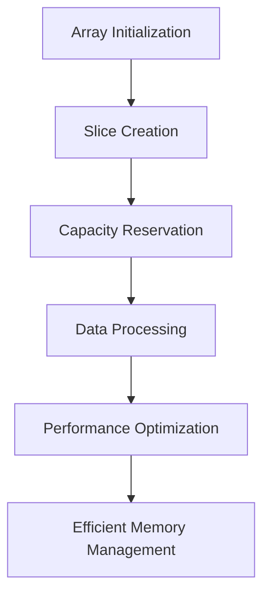

## 10.8 Efficient Use of Slices and Arrays

In the realm of systems programming, efficient memory management is paramount. The D programming language provides powerful constructs like slices and arrays that, when used effectively, can significantly enhance the performance and scalability of your applications. In this section, we will delve into the intricacies of managing arrays and slices, exploring strategies to avoid reallocations, reserve capacity, and optimize data processing.

### Understanding Arrays and Slices in D

Before we dive into optimization techniques, let's establish a solid understanding of arrays and slices in D.

#### Arrays

Arrays in D are fixed-size collections of elements of the same type. They are allocated on the stack or heap, depending on their size and scope. Arrays provide fast access to elements due to their contiguous memory layout, but their fixed size can be a limitation in dynamic scenarios.

```d
int[5] fixedArray = [1, 2, 3, 4, 5]; // A fixed-size array of integers
```

#### Slices

Slices are dynamic views into arrays, allowing you to work with subarrays without copying data. They are more flexible than arrays, enabling dynamic resizing and efficient manipulation of data.

```d
int[] dynamicArray = [1, 2, 3, 4, 5]; // A dynamic array
int[] slice = dynamicArray[1..4];     // A slice of the dynamic array
```

### Managing Arrays: Understanding Capacity and Length

Efficient use of arrays and slices begins with understanding their capacity and length. The `length` property of an array or slice indicates the number of elements it currently holds, while the `capacity` refers to the amount of memory allocated for potential elements.

#### Avoiding Reallocations

Reallocations can be costly in terms of performance, especially in systems programming where efficiency is crucial. Let's explore strategies to minimize reallocations.

##### Reserving Capacity

One of the most effective ways to avoid reallocations is by preallocating space using the `reserve` method. This method allows you to specify the desired capacity of a slice, reducing the need for frequent reallocations as the slice grows.

```d
int[] numbers;
numbers.reserve(100); // Reserve space for 100 elements

foreach (i; 0 .. 100) {
    numbers ~= i; // Append elements without reallocating
}
```

By reserving capacity, you ensure that the slice has enough space to accommodate new elements, minimizing the overhead associated with memory allocation.

### Use Cases and Examples

To illustrate the efficient use of slices and arrays, let's explore some practical use cases and examples.

#### Data Processing: Minimizing Overhead

In data processing applications, minimizing overhead is critical for achieving high performance. By leveraging slices, you can process large datasets efficiently without incurring the cost of copying data.

```d
void processData(int[] data) {
    foreach (ref element; data) {
        element *= 2; // Process each element in place
    }
}

int[] dataset = [1, 2, 3, 4, 5];
processData(dataset); // Efficiently process data using slices
```

In this example, the `processData` function operates directly on the slice, avoiding unnecessary data copying and reducing memory overhead.

#### Performance Optimization: Enhancing Efficiency

Performance optimization is a key consideration in systems programming. By using slices and arrays judiciously, you can enhance the efficiency of your applications.

Consider a scenario where you need to implement a buffer for network data. Using slices, you can efficiently manage the buffer's capacity and avoid frequent reallocations.

```d
struct NetworkBuffer {
    ubyte[] buffer;
    
    void appendData(ubyte[] data) {
        if (buffer.length + data.length > buffer.capacity) {
            buffer.reserve(buffer.length + data.length);
        }
        buffer ~= data; // Append data to the buffer
    }
}

NetworkBuffer netBuffer;
netBuffer.appendData([0x01, 0x02, 0x03]); // Efficiently manage buffer capacity
```

By reserving capacity and appending data efficiently, you can optimize the performance of your network buffer, reducing the impact of memory allocations.

### Visualizing Array and Slice Operations

To further enhance your understanding, let's visualize the operations on arrays and slices using a diagram.



**Figure 1:** Visualizing the lifecycle of arrays and slices in D programming.

### Try It Yourself

To solidify your understanding, try modifying the code examples provided. Experiment with different capacities, data sizes, and processing techniques to observe their impact on performance.

### References and Further Reading

- [D Language Reference](https://dlang.org/spec/index.html)
- [D Programming Language: Arrays and Slices](https://dlang.org/spec/arrays.html)
- [Efficient Memory Management in D](https://dlang.org/blog/2017/05/24/memory-management-in-d/)

### Knowledge Check

- How does reserving capacity help in avoiding reallocations?
- What is the difference between an array and a slice in D?
- How can slices be used to minimize data processing overhead?

### Embrace the Journey

Remember, mastering the efficient use of slices and arrays is just the beginning. As you progress, you'll unlock new levels of performance and scalability in your systems programming endeavors. Keep experimenting, stay curious, and enjoy the journey!

## Quiz Time!



### What is the primary advantage of using slices over arrays in D?

- [x] Slices allow dynamic resizing and efficient data manipulation.
- [ ] Slices are faster than arrays in all operations.
- [ ] Slices consume less memory than arrays.
- [ ] Slices are always allocated on the stack.

> **Explanation:** Slices provide a dynamic view into arrays, allowing for efficient resizing and manipulation without copying data.

### How can you avoid reallocations when working with slices?

- [x] By using the `reserve` method to preallocate space.
- [ ] By using fixed-size arrays instead of slices.
- [ ] By copying data to a new slice each time.
- [ ] By using global variables.

> **Explanation:** The `reserve` method allows you to preallocate memory, reducing the need for reallocations as the slice grows.

### What property of a slice indicates the number of elements it currently holds?

- [x] `length`
- [ ] `capacity`
- [ ] `size`
- [ ] `count`

> **Explanation:** The `length` property of a slice indicates the number of elements it currently holds.

### Which of the following is a fixed-size collection of elements in D?

- [x] Array
- [ ] Slice
- [ ] List
- [ ] Map

> **Explanation:** Arrays in D are fixed-size collections of elements, whereas slices are dynamic views into arrays.

### What is the purpose of the `reserve` method in D?

- [x] To preallocate memory for a slice to avoid reallocations.
- [ ] To decrease the length of a slice.
- [ ] To convert an array to a slice.
- [ ] To sort the elements of a slice.

> **Explanation:** The `reserve` method is used to preallocate memory for a slice, helping to avoid reallocations.

### In the context of slices, what does the term "capacity" refer to?

- [x] The amount of memory allocated for potential elements.
- [ ] The current number of elements in the slice.
- [ ] The maximum number of elements a slice can ever hold.
- [ ] The speed at which elements can be accessed.

> **Explanation:** Capacity refers to the amount of memory allocated for potential elements in a slice.

### Which operation can be costly in terms of performance when working with slices?

- [x] Reallocations
- [ ] Accessing elements
- [ ] Iterating over elements
- [ ] Printing elements

> **Explanation:** Reallocations can be costly because they involve allocating new memory and copying existing data.

### How can slices help in minimizing data processing overhead?

- [x] By allowing in-place processing without data copying.
- [ ] By reducing the number of elements processed.
- [ ] By increasing the speed of the CPU.
- [ ] By using more memory.

> **Explanation:** Slices allow in-place processing, which minimizes overhead by avoiding unnecessary data copying.

### True or False: Arrays in D can dynamically resize themselves.

- [ ] True
- [x] False

> **Explanation:** Arrays in D are fixed-size and cannot dynamically resize themselves. Slices provide dynamic resizing capabilities.

### Which of the following is NOT a benefit of using slices in D?

- [ ] Efficient data manipulation
- [ ] Dynamic resizing
- [x] Guaranteed memory savings
- [ ] Avoiding data copying

> **Explanation:** While slices offer efficient data manipulation and dynamic resizing, they do not inherently guarantee memory savings.


