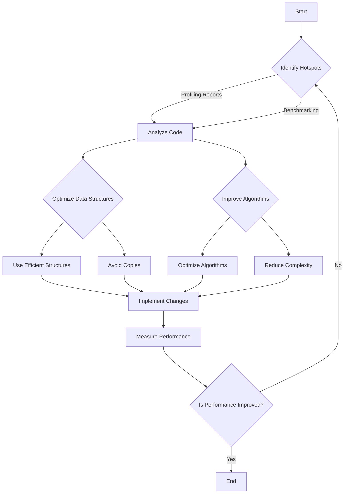

## 10.9 Memory Profiling and Optimization

In the realm of systems programming, efficient memory management is crucial for building high-performance applications. Memory profiling and optimization are essential practices that help developers understand memory usage patterns, identify bottlenecks, and optimize resource consumption. In this section, we will delve into the intricacies of memory profiling and optimization in the D programming language, exploring tools, techniques, and best practices to enhance your software's performance.

### Profiling Tools: Analyzing Memory Usage

Memory profiling involves analyzing an application's memory usage to identify inefficiencies and potential areas for optimization. D provides several tools and techniques to facilitate this process.

#### 1. D's Built-in Profiling Tools

D comes with built-in profiling capabilities that can be leveraged to analyze memory usage. The `-profile` flag can be used during compilation to gather memory allocation statistics.

```bash
dmd -profile=gc myapp.d
```

This command compiles `myapp.d` with garbage collection profiling enabled, providing insights into memory allocations and deallocations.

#### 2. Third-Party Profiling Tools

Several third-party tools can be used alongside D to perform more detailed memory profiling:

- **Valgrind**: A powerful tool for detecting memory leaks and profiling memory usage. It can be used with D applications by compiling with debugging symbols.

- **Heaptrack**: A tool for tracking memory allocations and identifying memory leaks. It provides detailed reports on memory usage patterns.

- **Massif**: A heap profiler that is part of the Valgrind suite, useful for understanding heap memory usage over time.

#### 3. Custom Profiling Solutions

For more specific needs, developers can implement custom profiling solutions using D's metaprogramming capabilities. By instrumenting code with custom logging and analysis, developers can gain insights into memory usage patterns specific to their applications.

### Optimization Techniques

Once memory usage patterns are understood, the next step is to optimize memory usage. This involves identifying hotspots and applying targeted optimization techniques.

#### Identifying Hotspots

Hotspots are areas of code that consume a significant amount of memory or are executed frequently. Identifying these areas is crucial for effective optimization.

- **Profiling Reports**: Use profiling reports to identify functions or modules with high memory usage.
- **Code Analysis**: Manually analyze code to identify inefficient algorithms or data structures.
- **Benchmarking**: Perform benchmarking to measure the performance impact of different code paths.

#### Optimization Strategies

Once hotspots are identified, apply the following optimization strategies:

1. **Data Structure Optimization**

   - **Use Efficient Data Structures**: Choose data structures that minimize memory usage. For example, use arrays instead of linked lists when possible.
   - **Avoid Unnecessary Copies**: Minimize copying of large data structures by using references or pointers.

2. **Algorithmic Improvements**

   - **Optimize Algorithms**: Refactor algorithms to reduce memory usage. For example, use in-place algorithms that modify data without additional allocations.
   - **Reduce Complexity**: Simplify algorithms to reduce the number of operations and memory usage.

3. **Garbage Collection Tuning**

   - **Adjust GC Parameters**: Tune garbage collection parameters to optimize memory usage. For example, adjust the GC heap size to reduce collection frequency.
   - **Use `@nogc` Code**: Write `@nogc` code to avoid garbage collection overhead in performance-critical sections.

4. **Manual Memory Management**

   - **Use Custom Allocators**: Implement custom memory allocators for specific use cases to reduce fragmentation and improve performance.
   - **Manage Resources Explicitly**: Use RAII (Resource Acquisition Is Initialization) to manage resources explicitly and avoid memory leaks.

5. **Lazy Initialization**

   - **Delay Initialization**: Initialize objects only when needed to reduce memory usage.
   - **Use Lazy Data Structures**: Implement lazy data structures that allocate memory only when accessed.

### Use Cases and Examples

To illustrate the application of memory profiling and optimization techniques, let's explore some real-world use cases and examples.

#### Application Scaling: Preparing for Increased Load

As applications scale, memory usage can become a bottleneck. Profiling and optimizing memory usage is essential to ensure scalability.

**Example: Web Server Optimization**

Consider a web server written in D that handles a large number of concurrent connections. Profiling reveals that memory usage spikes during peak loads due to inefficient data structures.

**Solution:**

- **Optimize Data Structures**: Replace linked lists with arrays for handling connection queues.
- **Use Memory Pools**: Implement memory pools to manage connection objects efficiently.

```d
// Example of using a memory pool for connection objects
class Connection {
    // Connection details
}

class ConnectionPool {
    Connection[] pool;
    size_t index;

    this(size_t size) {
        pool = new Connection[size];
        index = 0;
    }

    Connection acquire() {
        if (index < pool.length) {
            return pool[index++];
        }
        return null; // Handle pool exhaustion
    }

    void release(Connection conn) {
        // Return connection to pool
        if (index > 0) {
            pool[--index] = conn;
        }
    }
}
```

#### Cost Reduction: Minimizing Resource Consumption

In cloud environments, reducing memory usage can lead to significant cost savings. Profiling and optimizing memory usage can help minimize resource consumption.

**Example: Data Processing Pipeline**

Consider a data processing pipeline that processes large datasets. Profiling reveals that memory usage is high due to redundant data copies.

**Solution:**

- **Use In-Place Algorithms**: Refactor algorithms to process data in place, reducing memory usage.
- **Optimize Data Structures**: Use compact data structures to minimize memory footprint.

```d
// Example of an in-place algorithm for data processing
void processData(int[] data) {
    foreach (ref value; data) {
        value *= 2; // Process data in place
    }
}
```

### Visualizing Memory Optimization

To better understand memory optimization techniques, let's visualize the process using a flowchart.



**Diagram Description:** This flowchart illustrates the memory optimization process, starting with identifying hotspots, analyzing code, optimizing data structures and algorithms, and measuring performance improvements.

### Try It Yourself

To reinforce your understanding of memory profiling and optimization, try the following exercises:

1. **Profile a D Application**: Use D's built-in profiling tools to analyze the memory usage of a sample application. Identify hotspots and propose optimization strategies.

2. **Implement a Memory Pool**: Create a memory pool for managing objects in a D application. Measure the performance impact of using the memory pool compared to dynamic allocations.

3. **Optimize a Data Processing Algorithm**: Refactor a data processing algorithm to use in-place processing. Measure the memory usage before and after optimization.

### Knowledge Check

Before we conclude, let's summarize the key takeaways:

- Memory profiling is essential for understanding memory usage patterns and identifying optimization opportunities.
- D provides built-in and third-party tools for memory profiling, including Valgrind and Heaptrack.
- Optimization techniques include data structure optimization, algorithmic improvements, garbage collection tuning, and manual memory management.
- Real-world use cases demonstrate the importance of memory optimization for application scaling and cost reduction.

### Embrace the Journey

Remember, memory profiling and optimization are ongoing processes. As you continue to develop and maintain applications, regularly profile memory usage and apply optimization techniques to ensure optimal performance. Keep experimenting, stay curious, and enjoy the journey of mastering memory management in D programming!

## Quiz Time!



### What is the primary purpose of memory profiling in D programming?

- [x] To analyze memory usage and identify optimization opportunities
- [ ] To compile code with debugging symbols
- [ ] To implement custom memory allocators
- [ ] To manage resources explicitly

> **Explanation:** Memory profiling is used to analyze memory usage patterns and identify areas for optimization.

### Which tool is part of the Valgrind suite and useful for understanding heap memory usage over time?

- [ ] Heaptrack
- [x] Massif
- [ ] D's Built-in Profiler
- [ ] Custom Profiling Solutions

> **Explanation:** Massif is a heap profiler that is part of the Valgrind suite, useful for understanding heap memory usage over time.

### What is a common strategy for optimizing data structures in D programming?

- [ ] Use linked lists instead of arrays
- [x] Use efficient data structures to minimize memory usage
- [ ] Avoid using references or pointers
- [ ] Increase the complexity of algorithms

> **Explanation:** Using efficient data structures helps minimize memory usage and improve performance.

### What is the benefit of using in-place algorithms for data processing?

- [x] They reduce memory usage by modifying data without additional allocations
- [ ] They increase the complexity of the code
- [ ] They require more memory for processing
- [ ] They are slower than traditional algorithms

> **Explanation:** In-place algorithms modify data without additional allocations, reducing memory usage.

### Which of the following is a technique for tuning garbage collection in D?

- [ ] Use linked lists for data structures
- [x] Adjust GC parameters to optimize memory usage
- [ ] Increase the frequency of garbage collection
- [ ] Avoid using `@nogc` code

> **Explanation:** Adjusting GC parameters can help optimize memory usage and reduce collection frequency.

### What is a memory pool used for in D programming?

- [ ] To increase memory usage
- [x] To manage objects efficiently and reduce fragmentation
- [ ] To implement custom memory allocators
- [ ] To delay initialization of objects

> **Explanation:** Memory pools manage objects efficiently, reducing fragmentation and improving performance.

### How can lazy initialization help reduce memory usage?

- [x] By initializing objects only when needed
- [ ] By increasing the complexity of the code
- [ ] By allocating memory for all objects at startup
- [ ] By using linked lists for data structures

> **Explanation:** Lazy initialization reduces memory usage by delaying object initialization until needed.

### What is the role of RAII in memory management?

- [x] To manage resources explicitly and avoid memory leaks
- [ ] To increase memory usage
- [ ] To implement custom memory allocators
- [ ] To delay initialization of objects

> **Explanation:** RAII manages resources explicitly, ensuring proper cleanup and avoiding memory leaks.

### Which of the following is a benefit of profiling memory usage in cloud environments?

- [x] It can lead to significant cost savings by reducing resource consumption
- [ ] It increases the complexity of the code
- [ ] It requires more memory for processing
- [ ] It is slower than traditional algorithms

> **Explanation:** Profiling memory usage in cloud environments can help reduce resource consumption and lead to cost savings.

### True or False: Memory profiling and optimization are one-time processes.

- [ ] True
- [x] False

> **Explanation:** Memory profiling and optimization are ongoing processes that should be regularly performed to ensure optimal performance.


