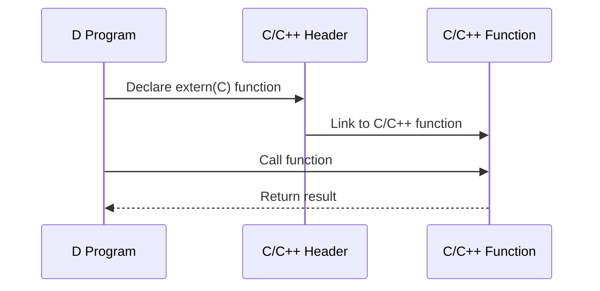

## 11.1 Interfacing with C and C++ Libraries

Interfacing with C and C++ libraries is a powerful feature of the D programming language that allows developers to leverage existing codebases, extend functionality, and reuse mature and well-tested libraries. This capability is crucial for systems programming, where performance and access to low-level system resources are often required. In this section, we will explore the techniques and tools available in D for interfacing with C and C++ libraries, discuss the challenges involved, and provide practical examples to guide you through the process.

### Purpose

The primary purpose of interfacing with C and C++ libraries in D is to extend the functionality of D applications by reusing existing libraries. This can significantly reduce development time and effort, as it allows developers to build upon a foundation of proven code. Additionally, interfacing with system APIs and other low-level services is often necessary in systems programming, making this capability essential for expert software engineers and architects.

### Interoperability Techniques

#### `extern(C)` and `extern(C++)`

To interface with C and C++ libraries, D provides the `extern` keyword, which allows you to declare functions and variables with C or C++ linkage. This is crucial for ensuring that the D compiler generates the correct function signatures and calling conventions.

```d
// Example of using extern(C) to declare a C function
extern(C) {
    int printf(const char* format, ...);
}

// Example of using extern(C++) to declare a C++ function
extern(C++) {
    class MyCppClass {
        void myCppMethod();
    }
}
```

- **`extern(C)`**: Use this for interfacing with C libraries. It ensures that the D compiler uses the C calling convention and name mangling.
- **`extern(C++)`**: Use this for interfacing with C++ libraries. It handles C++ name mangling and calling conventions, which can be more complex due to features like function overloading.

#### Name Mangling and ABI Considerations

When interfacing with C++, understanding name mangling and the Application Binary Interface (ABI) is crucial. Name mangling is the process by which C++ compilers encode additional information (such as function signatures) into the names of functions to support features like overloading. D's `extern(C++)` helps manage this complexity, but developers must still be aware of potential issues, such as differences in ABI between compilers or platforms.

### Binding Generation Tools

#### Using `dstep`

`dstep` is a tool that automatically generates D bindings from C headers. This can save a significant amount of time and effort, especially for large libraries.

- **Installation**: You can install `dstep` using D's package manager, `dub`.
- **Usage**: Run `dstep` on a C header file to generate a D module with the necessary bindings.

```bash
dstep mylibrary.h -o mylibrary.d
```

#### Manual Binding

While tools like `dstep` are convenient, there are cases where manual binding is necessary. This approach provides finer control over the binding process and allows you to handle complex cases that automated tools might not manage well.

- **Define C/C++ Functions**: Use `extern(C)` or `extern(C++)` to declare the functions you need.
- **Handle Complex Types**: Manually translate complex C/C++ types to their D equivalents.

```d
// Manual binding example
extern(C) {
    struct MyStruct {
        int field1;
        double field2;
    }

    MyStruct* createMyStruct();
    void destroyMyStruct(MyStruct* ptr);
}
```

### Use Cases and Examples

#### Reusing Legacy Libraries

One of the most common use cases for interfacing with C and C++ libraries is reusing legacy libraries. These libraries are often well-tested and optimized, making them valuable resources for new projects.

- **Example**: Suppose you have a legacy C library for image processing. You can create D bindings to use its functions in your D application, leveraging its capabilities without rewriting the code.

```d
extern(C) {
    void processImage(const char* imagePath);
}

void main() {
    processImage("example.jpg");
}
```

#### Accessing System APIs

Interfacing with system APIs is another critical use case. Many operating systems provide C-based APIs for interacting with system resources, and D's interoperability features make it easy to access these APIs.

- **Example**: Accessing a system API to retrieve system information.

```d
extern(C) {
    int getSystemInfo(char* buffer, int bufferSize);
}

void main() {
    char[256] buffer;
    getSystemInfo(buffer.ptr, buffer.length);
    writeln("System Info: ", buffer);
}
```

### Visualizing Interfacing with C and C++ Libraries

To better understand how D interfaces with C and C++ libraries, let's visualize the process using a sequence diagram.



This diagram illustrates the flow of a D program calling a C/C++ function. The D program declares the function using `extern(C)` or `extern(C++)`, links to the C/C++ function, and then calls it, receiving the result.

### Challenges and Considerations

Interfacing with C and C++ libraries is not without its challenges. Here are some considerations to keep in mind:

- **ABI Compatibility**: Ensure that the ABI used by the C/C++ library matches the one expected by the D compiler. Differences in ABI can lead to runtime errors.
- **Memory Management**: Be cautious with memory management, especially when dealing with pointers and dynamic memory allocation. Ensure that memory allocated in C/C++ is properly managed in D.
- **Error Handling**: C and C++ libraries may use different error handling mechanisms. Consider how errors will be propagated and handled in your D code.

### Try It Yourself

To get hands-on experience with interfacing with C and C++ libraries, try modifying the code examples provided in this section. Experiment with different C/C++ functions and libraries, and see how they can be integrated into your D applications.

### References and Links

- [D Language Specification: Interfacing to C](https://dlang.org/spec/interfaceToC.html)
- [D Language Specification: Interfacing to C++](https://dlang.org/spec/cpp_interface.html)
- [dstep GitHub Repository](https://github.com/jacob-carlborg/dstep)

### Knowledge Check

- What is the purpose of using `extern(C)` and `extern(C++)` in D?
- How does `dstep` help in generating D bindings from C headers?
- What are some challenges you might face when interfacing with C/C++ libraries?

### Embrace the Journey

Interfacing with C and C++ libraries in D opens up a world of possibilities for leveraging existing codebases and extending the functionality of your applications. As you explore this capability, remember that each challenge is an opportunity to learn and grow as a developer. Keep experimenting, stay curious, and enjoy the journey!

## Quiz Time!



### What is the primary purpose of interfacing with C and C++ libraries in D?

- [x] To extend functionality by reusing existing libraries
- [ ] To rewrite existing libraries in D
- [ ] To replace C and C++ libraries with D equivalents
- [ ] To avoid using system APIs

> **Explanation:** Interfacing with C and C++ libraries allows developers to extend functionality by reusing existing, well-tested libraries.

### Which keyword is used in D to declare functions with C linkage?

- [x] extern(C)
- [ ] extern(D)
- [ ] extern(C++)
- [ ] extern(System)

> **Explanation:** The `extern(C)` keyword is used to declare functions with C linkage in D.

### What tool can be used to automatically generate D bindings from C headers?

- [x] dstep
- [ ] dub
- [ ] dmd
- [ ] ldc

> **Explanation:** `dstep` is a tool that automatically generates D bindings from C headers.

### What is name mangling?

- [x] Encoding additional information into function names
- [ ] A method of optimizing code execution
- [ ] A technique for memory management
- [ ] A way to handle exceptions

> **Explanation:** Name mangling is the process of encoding additional information, such as function signatures, into function names to support features like overloading.

### Which of the following is a challenge when interfacing with C/C++ libraries?

- [x] ABI Compatibility
- [ ] Lack of documentation
- [ ] Limited functionality
- [ ] Inability to handle errors

> **Explanation:** ABI compatibility is a challenge when interfacing with C/C++ libraries, as differences in ABI can lead to runtime errors.

### What does the `extern(C++)` keyword handle in D?

- [x] C++ name mangling and calling conventions
- [ ] C calling conventions
- [ ] D-specific optimizations
- [ ] Memory management

> **Explanation:** The `extern(C++)` keyword handles C++ name mangling and calling conventions in D.

### Why might manual binding be necessary?

- [x] To handle complex cases that automated tools might not manage well
- [ ] To avoid using automated tools
- [ ] To simplify the binding process
- [ ] To ensure compatibility with all libraries

> **Explanation:** Manual binding provides finer control and allows handling of complex cases that automated tools might not manage well.

### What is a common use case for interfacing with C/C++ libraries?

- [x] Reusing legacy libraries
- [ ] Developing new libraries
- [ ] Simplifying code
- [ ] Avoiding system APIs

> **Explanation:** A common use case for interfacing with C/C++ libraries is reusing legacy libraries, which are often well-tested and optimized.

### How can you ensure ABI compatibility when interfacing with C/C++ libraries?

- [x] Ensure the ABI matches the one expected by the D compiler
- [ ] Use only `extern(C)` for all libraries
- [ ] Avoid using complex data types
- [ ] Rewrite the library in D

> **Explanation:** Ensuring that the ABI used by the C/C++ library matches the one expected by the D compiler is crucial for ABI compatibility.

### True or False: Interfacing with C and C++ libraries in D is only useful for accessing system APIs.

- [ ] True
- [x] False

> **Explanation:** Interfacing with C and C++ libraries in D is useful for a variety of purposes, including reusing legacy libraries and extending functionality, not just accessing system APIs.


