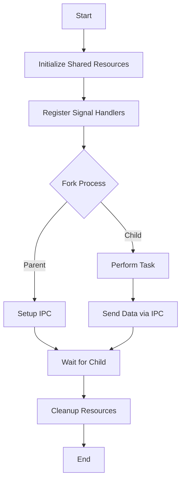

## 11.10 Systems-Level Concurrency Patterns

In the realm of systems programming, concurrency is a cornerstone for building efficient, responsive, and high-performance applications. The D programming language, with its blend of high-level abstractions and low-level capabilities, offers a robust platform for implementing systems-level concurrency patterns. This section delves into the intricacies of handling interrupts, ensuring memory visibility, achieving lock-free synchronization, and managing inter-process communication. By mastering these patterns, you can harness the full potential of multi-core systems and meet the demands of real-time applications.

### Interrupt Handling

Interrupts are signals emitted by hardware or software indicating an event that needs immediate attention. In systems programming, handling interrupts efficiently is crucial for maintaining system responsiveness and stability.

#### Signal Processing

Signals are a form of inter-process communication used to notify a process that a specific event has occurred. In D, signal handling can be implemented using the `core.sys.posix.signal` module, which provides a way to define custom handlers for various signals.

```d
import core.sys.posix.signal;
import std.stdio;

extern (C) void signalHandler(int signum) {
    writeln("Interrupt signal (", signum, ") received.");
    // Perform cleanup and exit
    exit(signum);
}

void main() {
    signal(SIGINT, &signalHandler); // Register signal handler for SIGINT
    writeln("Press Ctrl+C to trigger the signal handler.");
    while (true) {
        // Simulate work
    }
}
```

In this example, we define a signal handler for `SIGINT` (triggered by Ctrl+C) that performs cleanup before exiting. This pattern is essential for gracefully handling interruptions in long-running processes.

#### Safe Interruption

Designing interruptible code involves ensuring that your program can safely pause and resume operations without corrupting data or leaving resources in an inconsistent state. This often requires careful management of shared resources and state.

**Key Considerations:**
- **Atomic Operations**: Use atomic operations to modify shared state safely.
- **Resource Cleanup**: Ensure that resources are released or reset when an interruption occurs.
- **State Management**: Maintain a consistent state across interruptions.

### Memory Barriers and Synchronization

Memory barriers are used to enforce ordering constraints on memory operations, ensuring that changes made by one thread are visible to others. This is crucial in multi-threaded environments where the order of operations can affect program correctness.

#### Ensuring Memory Visibility

Memory visibility issues arise when changes made by one thread are not immediately visible to others. D provides the `core.atomic` module to facilitate memory synchronization using atomic operations and memory barriers.

```d
import core.atomic;
import std.stdio;

shared int counter = 0;

void incrementCounter() {
    atomicOp!"+="(counter, 1); // Atomic increment
}

void main() {
    import std.parallelism;
    auto tasks = taskPool.map!(a => incrementCounter())(0 .. 10);
    tasks.wait();
    writeln("Final counter value: ", counter);
}
```

In this example, `atomicOp` ensures that the increment operation is atomic, preventing race conditions and ensuring memory visibility across threads.

#### Lock-Free Programming

Lock-free programming involves designing algorithms that do not require locks, reducing contention and improving performance. This is achieved by using atomic operations and memory barriers to coordinate access to shared resources.

**Advantages:**
- **Reduced Contention**: Avoids the overhead of acquiring and releasing locks.
- **Improved Scalability**: Better performance on multi-core systems.

**Example:**
```d
import core.atomic;
import std.stdio;

shared int counter = 0;

void lockFreeIncrement() {
    int expected;
    do {
        expected = counter;
    } while (!atomicCas(&counter, expected, expected + 1)); // Compare and swap
}

void main() {
    import std.parallelism;
    auto tasks = taskPool.map!(a => lockFreeIncrement())(0 .. 10);
    tasks.wait();
    writeln("Final counter value: ", counter);
}
```

Here, `atomicCas` (compare and swap) is used to implement a lock-free increment operation, ensuring that the counter is updated atomically without locks.

### Process Synchronization

Process synchronization is essential for coordinating actions between processes, especially when they share resources or need to communicate.

#### Inter-Process Communication (IPC)

IPC mechanisms allow processes to communicate and synchronize their actions. Common IPC methods include pipes, message queues, and shared memory.

**Example: Using Pipes for IPC**
```d
import core.sys.posix.unistd;
import std.stdio;

void main() {
    int[2] pipefd;
    pipe(pipefd.ptr);

    if (fork() == 0) {
        // Child process
        close(pipefd[0]); // Close read end
        write(pipefd[1], "Hello from child\n".ptr, 17);
        close(pipefd[1]);
    } else {
        // Parent process
        close(pipefd[1]); // Close write end
        char[20] buffer;
        read(pipefd[0], buffer.ptr, 20);
        writeln("Parent received: ", buffer);
        close(pipefd[0]);
    }
}
```

In this example, a pipe is used for communication between a parent and child process. The child writes a message to the pipe, and the parent reads it.

#### Shared Memory

Shared memory allows multiple processes to access the same memory segment, providing a fast and efficient way to share data.

**Example: Using Shared Memory**
```d
import core.sys.posix.sys.mman;
import core.sys.posix.unistd;
import std.stdio;

void main() {
    size_t size = 4096;
    void* shm = mmap(null, size, PROT_READ | PROT_WRITE, MAP_SHARED | MAP_ANONYMOUS, -1, 0);

    if (fork() == 0) {
        // Child process
        cast(char*)shm[0] = 'A';
        munmap(shm, size);
    } else {
        // Parent process
        sleep(1); // Ensure child writes first
        writeln("Parent read: ", cast(char*)shm[0]);
        munmap(shm, size);
    }
}
```

In this example, `mmap` is used to create a shared memory segment accessible by both parent and child processes.

### Use Cases and Examples

#### High-Performance Computing

In high-performance computing (HPC), maximizing throughput and minimizing latency are critical. Systems-level concurrency patterns enable efficient utilization of multi-core systems, allowing applications to scale and perform complex computations in parallel.

**Example: Parallel Matrix Multiplication**
```d
import std.parallelism;
import std.stdio;

void multiplyMatrices(int[][] a, int[][] b, int[][] result) {
    foreach (i, row; a) {
        foreach (j, _; b[0]) {
            result[i][j] = taskPool.reduce!"a + b"(0, 0 .. b.length, (acc, k) => acc + row[k] * b[k][j]);
        }
    }
}

void main() {
    int[][] a = [[1, 2], [3, 4]];
    int[][] b = [[5, 6], [7, 8]];
    int[][] result = new int[2][2];

    multiplyMatrices(a, b, result);
    writeln("Result: ", result);
}
```

This example demonstrates parallel matrix multiplication using D's `std.parallelism` module, showcasing how concurrency patterns can be applied to computationally intensive tasks.

#### Real-Time Applications

Real-time applications require strict timing constraints, often necessitating precise control over concurrency and synchronization. Systems-level concurrency patterns help ensure that tasks meet their deadlines and respond predictably to events.

**Example: Real-Time Task Scheduling**
```d
import core.thread;
import std.stdio;

void realTimeTask() {
    while (true) {
        writeln("Executing real-time task");
        Thread.sleep(dur!"msecs"(100)); // Simulate periodic task
    }
}

void main() {
    Thread task = new Thread(&realTimeTask);
    task.priority = ThreadPriority.high;
    task.start();
    Thread.sleep(dur!"secs"(1)); // Let the task run for a while
    task.join();
}
```

In this example, a real-time task is scheduled with high priority, ensuring it executes periodically with minimal delay.

### Visualizing Systems-Level Concurrency

To better understand the flow of systems-level concurrency patterns, let's visualize the interaction between processes, memory synchronization, and interrupt handling using Mermaid.js diagrams.



**Diagram Description:** This flowchart illustrates a typical systems-level concurrency pattern where a parent process initializes shared resources, registers signal handlers, forks a child process, and sets up inter-process communication. The child performs a task and sends data back to the parent, which waits for the child to complete before cleaning up resources.

### References and Further Reading

- [D Programming Language: Concurrency](https://dlang.org/concurrency.html)
- [POSIX Signal Handling](https://pubs.opengroup.org/onlinepubs/9699919799/basedefs/signal.h.html)
- [Memory Barriers: A Hardware View for Software Hackers](https://www.kernel.org/doc/Documentation/memory-barriers.txt)

### Knowledge Check

To reinforce your understanding of systems-level concurrency patterns, consider the following questions and exercises:

1. **Explain** how signal handling can be used to gracefully terminate a long-running process.
2. **Demonstrate** the use of atomic operations to implement a lock-free stack.
3. **Provide** an example of using shared memory for inter-process communication.
4. **Include** a diagram illustrating the flow of a real-time application with multiple concurrent tasks.

### Embrace the Journey

Remember, mastering systems-level concurrency patterns is a journey. As you explore these patterns, you'll gain the skills to build robust, high-performance applications that leverage the full power of modern multi-core systems. Keep experimenting, stay curious, and enjoy the journey!

## Quiz Time!



### What is the primary purpose of signal handling in systems programming?

- [x] To respond to asynchronous events or interrupts
- [ ] To manage memory allocation
- [ ] To perform input/output operations
- [ ] To handle exceptions

> **Explanation:** Signal handling is used to respond to asynchronous events or interrupts, allowing a program to react to external signals like `SIGINT`.

### Which module in D provides atomic operations for memory synchronization?

- [x] core.atomic
- [ ] std.parallelism
- [ ] core.thread
- [ ] std.concurrency

> **Explanation:** The `core.atomic` module in D provides atomic operations for memory synchronization, ensuring safe access to shared resources.

### What is a key advantage of lock-free programming?

- [x] Reduced contention and improved scalability
- [ ] Simplified code structure
- [ ] Increased memory usage
- [ ] Easier debugging

> **Explanation:** Lock-free programming reduces contention and improves scalability by avoiding the overhead of locks, making it suitable for multi-core systems.

### How does shared memory facilitate inter-process communication?

- [x] By allowing multiple processes to access the same memory segment
- [ ] By sending messages through a network socket
- [ ] By writing to a file on disk
- [ ] By using a database

> **Explanation:** Shared memory allows multiple processes to access the same memory segment, providing a fast and efficient way to share data.

### In the context of real-time applications, what is a critical requirement?

- [x] Meeting strict timing constraints
- [ ] Maximizing memory usage
- [ ] Reducing code complexity
- [ ] Increasing network bandwidth

> **Explanation:** Real-time applications require meeting strict timing constraints to ensure tasks execute predictably and on time.

### Which function is used to create a shared memory segment in D?

- [x] mmap
- [ ] fork
- [ ] signal
- [ ] atomicOp

> **Explanation:** The `mmap` function is used to create a shared memory segment, allowing processes to access the same memory space.

### What is the role of memory barriers in concurrency?

- [x] To enforce ordering constraints on memory operations
- [ ] To allocate memory dynamically
- [ ] To handle exceptions
- [ ] To perform input/output operations

> **Explanation:** Memory barriers enforce ordering constraints on memory operations, ensuring changes made by one thread are visible to others.

### Which of the following is a common IPC method?

- [x] Pipes
- [ ] Threads
- [ ] Functions
- [ ] Classes

> **Explanation:** Pipes are a common method for inter-process communication, allowing data to be passed between processes.

### What is the purpose of the `atomicCas` function?

- [x] To perform a compare-and-swap operation atomically
- [ ] To allocate memory
- [ ] To create a new thread
- [ ] To handle signals

> **Explanation:** The `atomicCas` function performs a compare-and-swap operation atomically, useful for implementing lock-free algorithms.

### True or False: Lock-free programming eliminates the need for synchronization in concurrent applications.

- [ ] True
- [x] False

> **Explanation:** False. Lock-free programming reduces the need for locks but still requires synchronization mechanisms like atomic operations to ensure correctness.




