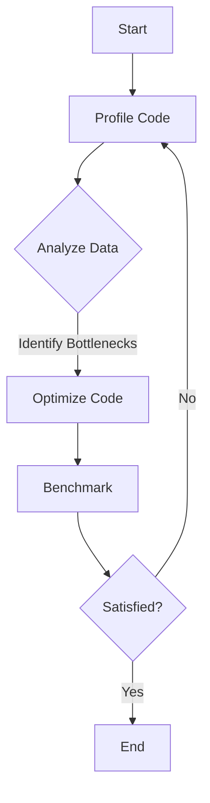

## 11.11 Performance Profiling and Optimization Techniques

In the realm of systems programming, performance is paramount. The D programming language, with its blend of high-level and low-level capabilities, offers a unique platform for building efficient software. However, achieving optimal performance requires more than just writing code; it involves a systematic approach to profiling and optimization. In this section, we will delve into the tools and techniques that can help you master performance profiling and optimization in D.

### Profiling Tools

Profiling is the process of measuring the space (memory) and time complexity of a program. It helps identify bottlenecks and areas for improvement. In D, you have access to both built-in and third-party profiling tools.

#### Built-in Profilers

D provides built-in profiling capabilities that can be enabled during compilation. These tools allow you to gather data on function call counts, execution times, and memory usage.

**Example: Enabling Profiling in D**

To enable profiling, you can compile your D program with the `-profile` flag:

```bash
dmd -profile myprogram.d
```

This generates a `trace.log` file containing profiling data. You can analyze this file to identify which functions consume the most resources.

#### Third-Party Tools

While D's built-in profiler is useful, third-party tools like `valgrind` and `perf` offer more advanced features and detailed insights.

**Valgrind**

Valgrind is a powerful tool for memory debugging, memory leak detection, and profiling. It can be used to analyze D programs by running them through Valgrind's suite of tools.

```bash
valgrind --tool=callgrind ./myprogram
```

**Perf**

Perf is a performance analyzing tool in Linux that provides a wide range of profiling capabilities. It can be used to profile D applications by capturing performance data at the system level.

```bash
perf record ./myprogram
perf report
```

### Benchmarking

Benchmarking involves measuring the performance of a program under controlled conditions to ensure consistent and repeatable results. It is crucial for comparing different implementations and optimization strategies.

#### Creating Benchmarks

To create effective benchmarks, isolate the code you want to test and run it multiple times to account for variability. Use D's `std.datetime` module to measure execution time.

**Example: Benchmarking a Function**

```d
import std.datetime;

void myFunction() {
    // Function logic
}

void main() {
    auto start = Clock.currTime();
    myFunction();
    auto end = Clock.currTime();
    writeln("Execution time: ", end - start);
}
```

#### Analyzing Results

Once you have collected benchmarking data, analyze it to identify trends and outliers. Look for functions with high execution times or frequent calls, as these are prime candidates for optimization.

### Optimization Strategies

Optimization is the process of modifying a system to make some aspect of it work more efficiently. In D, optimization can be approached at both the algorithmic and micro levels.

#### Algorithmic Improvements

Algorithmic improvements focus on enhancing the overall efficiency of your code. This often involves selecting the right data structures and algorithms to minimize time complexity.

**Example: Choosing the Right Data Structure**

Consider using a `HashMap` instead of a `List` for lookups to reduce time complexity from O(n) to O(1).

#### Micro-Optimizations

Micro-optimizations involve refining small sections of code to improve performance. This can include loop unrolling, inlining functions, and reducing memory allocations.

**Example: Loop Unrolling**

```d
// Original loop
for (int i = 0; i < 100; i++) {
    process(i);
}

// Unrolled loop
for (int i = 0; i < 100; i += 4) {
    process(i);
    process(i + 1);
    process(i + 2);
    process(i + 3);
}
```

### Use Cases and Examples

Let's explore some practical examples of performance optimization in D.

#### Optimizing Critical Paths

Critical paths are the sequences of dependent tasks that determine the minimum time required to complete a project. Optimizing these paths can significantly enhance performance.

**Example: Reducing Function Call Overhead**

If a function is called frequently, consider inlining it to reduce call overhead. Use the `inline` attribute in D to suggest inlining to the compiler.

```d
inline void frequentlyCalledFunction() {
    // Function logic
}
```

#### Load Testing

Load testing involves simulating high-stress conditions to ensure your application can handle peak loads. Use tools like Apache JMeter or custom scripts to perform load testing on D applications.

**Example: Load Testing with a Custom Script**

```d
import std.stdio;
import std.parallelism;

void handleRequest(int id) {
    // Simulate request handling
    writeln("Handling request ", id);
}

void main() {
    foreach (i; parallel(0 .. 1000)) {
        handleRequest(i);
    }
}
```

### Visualizing Performance Data

Visualizing performance data can help you understand complex interactions and identify bottlenecks. Use Hugo-compatible Mermaid.js diagrams to create flowcharts and sequence diagrams.



### References and Links

- [D Programming Language Official Website](https://dlang.org/)
- [Valgrind Documentation](http://valgrind.org/docs/manual/manual.html)
- [Perf Wiki](https://perf.wiki.kernel.org/index.php/Main_Page)

### Knowledge Check

- What are the benefits of using third-party profiling tools like Valgrind and Perf?
- How can you measure execution time in a D program?
- What is the difference between algorithmic improvements and micro-optimizations?

### Embrace the Journey

Remember, performance optimization is an ongoing process. As you continue to develop your skills in D programming, keep experimenting with different techniques and tools. Stay curious, and enjoy the journey of mastering performance profiling and optimization!

### Quiz Time!



### What is the primary purpose of profiling in programming?

- [x] To measure the space and time complexity of a program
- [ ] To write more code
- [ ] To compile code faster
- [ ] To debug syntax errors

> **Explanation:** Profiling is used to measure the space and time complexity of a program, helping identify bottlenecks and areas for improvement.

### Which tool is used for memory debugging and leak detection in D programs?

- [ ] Perf
- [x] Valgrind
- [ ] GDB
- [ ] DMD

> **Explanation:** Valgrind is a powerful tool for memory debugging, memory leak detection, and profiling.

### What is the purpose of benchmarking in performance optimization?

- [x] To measure performance under controlled conditions
- [ ] To write more efficient code
- [ ] To debug syntax errors
- [ ] To compile code faster

> **Explanation:** Benchmarking involves measuring the performance of a program under controlled conditions to ensure consistent and repeatable results.

### What is a critical path in performance optimization?

- [x] The sequence of dependent tasks that determine the minimum time required to complete a project
- [ ] The shortest path in a graph
- [ ] The longest path in a graph
- [ ] A path with no dependencies

> **Explanation:** Critical paths are the sequences of dependent tasks that determine the minimum time required to complete a project.

### What is the benefit of using the `inline` attribute in D?

- [x] It suggests inlining to the compiler, reducing function call overhead
- [ ] It makes the code run faster
- [ ] It increases memory usage
- [ ] It decreases memory usage

> **Explanation:** The `inline` attribute in D suggests inlining to the compiler, which can reduce function call overhead.

### Which of the following is an example of a micro-optimization?

- [x] Loop unrolling
- [ ] Choosing the right data structure
- [ ] Reducing algorithm complexity
- [ ] Using a more efficient algorithm

> **Explanation:** Micro-optimizations involve refining small sections of code, such as loop unrolling, to improve performance.

### What is the purpose of load testing?

- [x] To simulate high-stress conditions and ensure the application can handle peak loads
- [ ] To measure execution time
- [ ] To debug syntax errors
- [ ] To compile code faster

> **Explanation:** Load testing involves simulating high-stress conditions to ensure your application can handle peak loads.

### What does the `-profile` flag do when compiling a D program?

- [x] Enables profiling, generating a `trace.log` file with profiling data
- [ ] Compiles the code faster
- [ ] Debugs syntax errors
- [ ] Optimizes the code

> **Explanation:** The `-profile` flag enables profiling, generating a `trace.log` file with profiling data.

### What is the benefit of using third-party tools like Perf?

- [x] They offer advanced features and detailed insights for profiling
- [ ] They compile code faster
- [ ] They debug syntax errors
- [ ] They optimize code automatically

> **Explanation:** Third-party tools like Perf offer advanced features and detailed insights for profiling.

### True or False: Algorithmic improvements focus on refining small sections of code.

- [ ] True
- [x] False

> **Explanation:** Algorithmic improvements focus on enhancing the overall efficiency of your code, often involving selecting the right data structures and algorithms.


