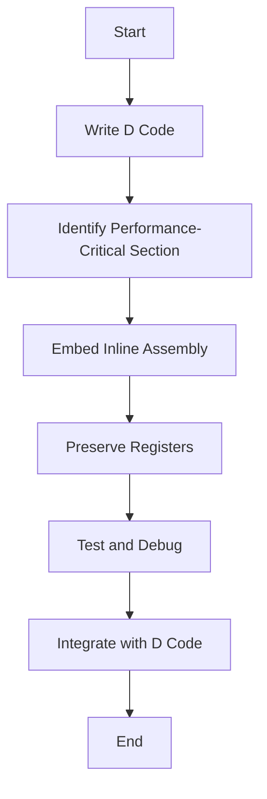

## 11.2 Inline Assembly and Low-Level Operations

In the realm of systems programming, the ability to perform low-level operations and directly interact with hardware is crucial. The D programming language provides powerful features that allow developers to write inline assembly code, enabling precise control over hardware and performance-critical sections of code. In this section, we will explore the use of inline assembly in D, discuss best practices, and provide practical examples to illustrate its application.

### Purpose of Inline Assembly

Inline assembly is used to perform operations that require direct hardware access or specific processor instructions that are not easily accessible through high-level programming constructs. It is particularly useful in scenarios where performance optimization is critical, or when interfacing with hardware components that require precise control.

### Inline Assembly in D

#### Using `asm` Blocks

D supports inline assembly through the use of `asm` blocks, allowing developers to embed assembly code directly within D programs. This feature provides the flexibility to optimize specific sections of code by leveraging processor-specific instructions.

```d
void exampleFunction() {
    int result;
    asm {
        // Inline assembly code
        mov EAX, 5;  // Move the value 5 into the EAX register
        add EAX, 10; // Add 10 to the value in EAX
        mov result, EAX; // Move the result into the D variable
    }
    writeln("Result: ", result); // Output: Result: 15
}
```

In the example above, we use an `asm` block to perform simple arithmetic operations using assembly instructions. The `mov` instruction is used to transfer data between registers and variables, while the `add` instruction performs addition.

#### Supported Architectures

D's inline assembly is compatible with several CPU architectures, including x86 and x86_64. However, the specific instructions available depend on the target architecture. It is essential to understand the architecture you are working with to write effective assembly code.

### Best Practices for Inline Assembly

#### Integrating with D Code

When integrating assembly code with D, it is crucial to ensure that the assembly code does not interfere with the D runtime or violate the language's safety guarantees. Here are some best practices:

- **Preserve Registers**: Ensure that any registers modified by the assembly code are restored to their original state before exiting the `asm` block.
- **Use Comments**: Clearly comment on the purpose and functionality of the assembly code to aid in understanding and maintenance.
- **Minimal Use**: Limit the use of inline assembly to performance-critical sections where high-level code cannot achieve the desired efficiency.

#### Debugging and Maintenance

Debugging assembly code can be challenging due to its low-level nature. To maintain manageability:

- **Use Descriptive Labels**: Label sections of assembly code to make it easier to follow the flow of execution.
- **Test Thoroughly**: Ensure that the assembly code is thoroughly tested, especially when dealing with different architectures.
- **Document Assumptions**: Clearly document any assumptions made about the hardware or execution environment.

### Use Cases and Examples

#### Performance-Critical Paths

Inline assembly is often used to optimize performance-critical paths in applications. For example, in a graphics rendering engine, certain mathematical operations may be optimized using assembly to achieve real-time performance.

```d
void optimizedFunction() {
    double result;
    asm {
        // Example of using SSE instructions for floating-point operations
        movsd xmm0, [someDoubleValue]; // Load a double value into xmm0
        addsd xmm0, [anotherDoubleValue]; // Add another double value
        movsd result, xmm0; // Store the result back into a D variable
    }
    writeln("Optimized Result: ", result);
}
```

In this example, we use SSE (Streaming SIMD Extensions) instructions to perform floating-point arithmetic, which can be significantly faster than using standard D operations.

#### Hardware Interaction

Inline assembly is also used for direct hardware interaction, such as accessing special hardware features or performing I/O operations.

```d
void hardwareInteraction() {
    asm {
        // Example of using assembly for I/O operations
        mov DX, 0x3F8; // Set the port address for COM1
        mov AL, 'A'; // Load the character 'A' into AL
        out DX, AL; // Output the character to the port
    }
}
```

This example demonstrates how to send a character to a serial port using assembly instructions, which is useful in embedded systems or low-level device drivers.

### Visualizing Inline Assembly Integration

To better understand how inline assembly integrates with D code, consider the following flowchart that illustrates the process:



**Caption**: This flowchart outlines the process of integrating inline assembly into a D program, from identifying performance-critical sections to testing and debugging.

### References and Links

For further reading on inline assembly and low-level operations, consider the following resources:

- [D Language Specification - Inline Assembly](https://dlang.org/spec/iasm.html)
- [Intel x86 Assembly Language Reference](https://www.intel.com/content/www/us/en/developer/articles/technical/intel-sdm.html)
- [AMD64 Architecture Programmer's Manual](https://developer.amd.com/resources/developer-guides-manuals/)

### Knowledge Check

To reinforce your understanding of inline assembly and low-level operations in D, consider the following questions:

1. What are the primary use cases for inline assembly in D?
2. How can you ensure that inline assembly code does not interfere with the D runtime?
3. What are some best practices for debugging and maintaining inline assembly code?

### Embrace the Journey

Remember, mastering inline assembly and low-level operations is a journey that requires patience and practice. As you experiment with these techniques, you'll gain a deeper understanding of how software interacts with hardware, enabling you to write more efficient and powerful programs. Keep exploring, stay curious, and enjoy the process!

### Quiz Time!



### What is the primary purpose of using inline assembly in D?

- [x] To perform operations that require direct hardware access or specific processor instructions
- [ ] To simplify high-level code
- [ ] To replace all D code with assembly
- [ ] To make code more readable

> **Explanation:** Inline assembly is used for operations that require direct hardware access or specific processor instructions, which are not easily accessible through high-level programming constructs.

### Which D language feature allows embedding assembly code?

- [x] `asm` blocks
- [ ] `inline` keyword
- [ ] `assembly` keyword
- [ ] `native` blocks

> **Explanation:** D uses `asm` blocks to embed assembly code directly within D programs.

### What should you ensure when integrating assembly code with D?

- [x] Preserve registers modified by the assembly code
- [ ] Use as many registers as possible
- [ ] Avoid using comments
- [ ] Ignore architecture differences

> **Explanation:** It is crucial to preserve registers modified by the assembly code to ensure the D runtime is not affected.

### What is a common use case for inline assembly?

- [x] Optimizing performance-critical paths
- [ ] Simplifying code logic
- [ ] Enhancing code readability
- [ ] Replacing all D functions

> **Explanation:** Inline assembly is often used to optimize performance-critical paths where high-level code cannot achieve the desired efficiency.

### Which architecture is NOT supported by D's inline assembly?

- [ ] x86
- [ ] x86_64
- [x] ARM
- [ ] IA-32

> **Explanation:** D's inline assembly primarily supports x86 and x86_64 architectures.

### What is a best practice for debugging assembly code?

- [x] Use descriptive labels and comments
- [ ] Avoid testing thoroughly
- [ ] Ignore hardware assumptions
- [ ] Use minimal comments

> **Explanation:** Using descriptive labels and comments helps make assembly code more understandable and easier to debug.

### How can inline assembly be used for hardware interaction?

- [x] By accessing special hardware features or performing I/O operations
- [ ] By simplifying hardware logic
- [ ] By replacing hardware drivers
- [ ] By avoiding hardware-specific code

> **Explanation:** Inline assembly can be used to access special hardware features or perform I/O operations directly.

### What is a key consideration when writing inline assembly?

- [x] Architecture compatibility
- [ ] Code readability
- [ ] High-level language features
- [ ] Avoiding all registers

> **Explanation:** Ensuring architecture compatibility is crucial when writing inline assembly to use the correct instructions.

### What is the benefit of using SSE instructions in assembly?

- [x] Faster floating-point arithmetic
- [ ] Simplified code structure
- [ ] Enhanced code readability
- [ ] Reduced code size

> **Explanation:** SSE instructions can perform floating-point arithmetic faster than standard operations, optimizing performance.

### True or False: Inline assembly should be used extensively throughout all D programs.

- [ ] True
- [x] False

> **Explanation:** Inline assembly should be used sparingly and only in performance-critical sections where high-level code cannot achieve the desired efficiency.




