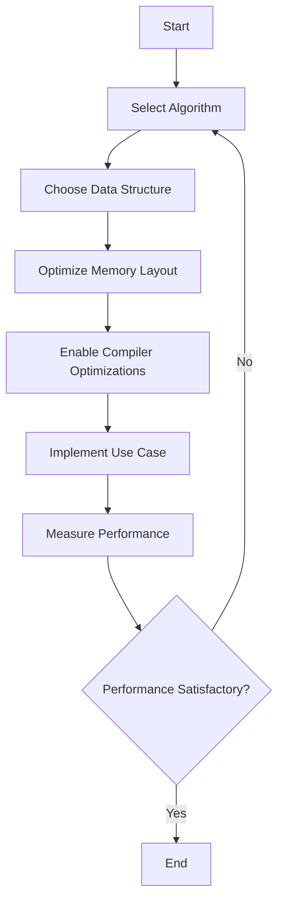

## 11.3 Writing High-Performance Native Code

In the realm of systems programming, writing high-performance native code is crucial for achieving optimal speed and efficiency. The D programming language, with its blend of high-level and low-level capabilities, offers a unique platform for crafting such code. This section delves into various strategies and techniques for optimizing performance in D, focusing on algorithm efficiency, memory layout, compiler optimizations, and practical use cases.

### Optimizing for Speed

#### Efficient Algorithms

Efficient algorithms are the backbone of high-performance applications. Selecting or designing algorithms that minimize computational complexity is essential. Let's explore how to choose and implement efficient algorithms in D.

- **Algorithm Selection**: Choose algorithms with the lowest time complexity for your specific problem. For example, prefer quicksort over bubble sort for large datasets due to its average-case time complexity of O(n log n).

- **Algorithm Design**: Design algorithms that leverage D's features such as templates and compile-time function execution (CTFE) to enhance performance.

**Example: Implementing QuickSort in D**

```d
import std.stdio;

void quickSort(T)(T[] arr, int low, int high) {
    if (low < high) {
        int pi = partition(arr, low, high);
        quickSort(arr, low, pi - 1);
        quickSort(arr, pi + 1, high);
    }
}

int partition(T)(T[] arr, int low, int high) {
    T pivot = arr[high];
    int i = low - 1;
    for (int j = low; j < high; j++) {
        if (arr[j] <= pivot) {
            i++;
            swap(arr[i], arr[j]);
        }
    }
    swap(arr[i + 1], arr[high]);
    return i + 1;
}

void swap(T)(ref T a, ref T b) {
    T temp = a;
    a = b;
    b = temp;
}

void main() {
    int[] data = [10, 7, 8, 9, 1, 5];
    quickSort(data, 0, data.length - 1);
    writeln("Sorted array: ", data);
}
```

**Try It Yourself**: Modify the `quickSort` function to sort in descending order. Experiment with different pivot selection strategies to observe their impact on performance.

#### Data Structures

Choosing the right data structures is equally important. The D language provides a rich set of built-in data structures, but understanding their performance characteristics is key.

- **Arrays and Slices**: Use arrays for fixed-size collections and slices for dynamic collections. Slices provide a view into an array and are efficient for operations like slicing and concatenation.

- **Associative Arrays**: Utilize associative arrays for key-value pairs, but be mindful of their average O(1) access time and potential hash collisions.

- **Custom Data Structures**: Implement custom data structures using D's templates and metaprogramming capabilities to tailor performance to specific use cases.

**Example: Using Slices for Efficient Data Manipulation**

```d
import std.stdio;

void manipulateData(int[] data) {
    auto slice = data[1 .. $ - 1]; // Exclude first and last elements
    foreach (ref elem; slice) {
        elem *= 2; // Double each element
    }
}

void main() {
    int[] data = [1, 2, 3, 4, 5];
    manipulateData(data);
    writeln("Modified data: ", data);
}
```

**Try It Yourself**: Implement a function that rotates elements in a slice. Experiment with different slice operations to understand their performance implications.

### Memory Layout and Alignment

Efficient memory layout and alignment are critical for optimizing performance, especially in systems programming where cache utilization can significantly impact speed.

#### Struct Packing

Struct packing involves controlling the memory layout of data structures to minimize padding and improve cache efficiency.

- **Align Attribute**: Use the `align` attribute to specify memory alignment for structs. Proper alignment can reduce cache misses and improve performance.

**Example: Struct Packing with Align Attribute**

```d
import std.stdio;

struct PackedStruct {
    align(1):
    ubyte a;
    ushort b;
    uint c;
}

void main() {
    writeln("Size of PackedStruct: ", PackedStruct.sizeof);
}
```

**Try It Yourself**: Experiment with different alignment values and observe their impact on the size of the struct. Consider the trade-offs between alignment and performance.

#### Cache Optimization

Writing code that leverages CPU cache effectively can lead to significant performance gains.

- **Data Locality**: Arrange data structures to maximize spatial and temporal locality. Accessing contiguous memory locations reduces cache misses.

- **Loop Unrolling**: Unroll loops to increase instruction-level parallelism and improve cache utilization.

**Example: Loop Unrolling for Cache Optimization**

```d
import std.stdio;

void sumArray(int[] data) {
    int sum = 0;
    for (int i = 0; i < data.length; i += 4) {
        sum += data[i] + data[i + 1] + data[i + 2] + data[i + 3];
    }
    writeln("Sum: ", sum);
}

void main() {
    int[] data = [1, 2, 3, 4, 5, 6, 7, 8];
    sumArray(data);
}
```

**Try It Yourself**: Modify the loop to handle arrays of different sizes. Experiment with different unrolling factors to find the optimal balance between performance and code size.

### Compiler Optimizations

Compiler optimizations can significantly enhance the performance of native code. Understanding and leveraging these optimizations is crucial for high-performance programming.

#### Flags and Settings

Use compiler options to enable various optimization levels and settings.

- **Optimization Levels**: Use `-O`, `-O2`, or `-O3` flags to enable different levels of optimization. Higher levels may increase compilation time but result in faster code.

- **Inlining**: Use `-inline` to enable function inlining, reducing function call overhead.

**Example: Enabling Compiler Optimizations**

```bash
dmd -O -inline -release myprogram.d
```

**Try It Yourself**: Compile your D programs with different optimization flags and measure the performance impact. Experiment with enabling and disabling specific optimizations.

#### Profile-Guided Optimization

Profile-guided optimization (PGO) involves feeding runtime profiles back into the compiler to optimize code paths based on actual usage patterns.

- **Instrumentation**: Compile the program with instrumentation to collect runtime data.

- **Optimization**: Use the collected data to guide the compiler in optimizing frequently executed paths.

**Example: Profile-Guided Optimization Workflow**

```bash
dmd -fprofile-generate myprogram.d

./myprogram

dmd -fprofile-use myprogram.d
```

**Try It Yourself**: Implement PGO in a sample program and compare the performance before and after optimization. Analyze the profile data to understand the program's execution patterns.

### Use Cases and Examples

High-performance native code is essential in various domains, from real-time systems to high-throughput applications. Let's explore some practical use cases.

#### Real-Time Systems

Real-time systems require meeting strict performance requirements, often with deterministic execution times.

- **Low-Latency Operations**: Optimize code for minimal latency, ensuring timely responses to external events.

- **Predictable Execution**: Use techniques like fixed-point arithmetic and deterministic scheduling to achieve predictable execution times.

**Example: Low-Latency Event Handling**

```d
import std.stdio;

void handleEvent(int event) {
    // Simulate low-latency processing
    writeln("Handling event: ", event);
}

void main() {
    int[] events = [1, 2, 3, 4, 5];
    foreach (event; events) {
        handleEvent(event);
    }
}
```

**Try It Yourself**: Implement a real-time event processing system with strict latency requirements. Experiment with different scheduling strategies to optimize performance.

#### High-Throughput Applications

High-throughput applications aim to maximize data processing rates, often in parallel or distributed environments.

- **Parallel Processing**: Use D's concurrency features, such as `std.parallelism`, to parallelize data processing tasks.

- **Efficient I/O**: Optimize input/output operations to minimize bottlenecks in data flow.

**Example: Parallel Data Processing with std.parallelism**

```d
import std.stdio;
import std.parallelism;

void processData(int[] data) {
    foreach (elem; taskPool.parallel(data)) {
        writeln("Processing: ", elem);
    }
}

void main() {
    int[] data = [1, 2, 3, 4, 5];
    processData(data);
}
```

**Try It Yourself**: Implement a high-throughput data processing pipeline using parallelism. Experiment with different data partitioning strategies to optimize throughput.

### Visualizing Performance Optimization

To better understand the impact of various optimization techniques, let's visualize the process of optimizing a D program for performance.



**Diagram Description**: This flowchart illustrates the iterative process of optimizing a D program for performance, starting from algorithm selection and ending with performance measurement.

### References and Links

- [D Programming Language Official Website](https://dlang.org/)
- [MDN Web Docs on Algorithms](https://developer.mozilla.org/en-US/docs/Web/JavaScript/Guide/Algorithms)
- [W3Schools Data Structures Tutorial](https://www.w3schools.com/js/js_data_structures.asp)

### Knowledge Check

- What are the key factors to consider when selecting an algorithm for high-performance applications?
- How does struct packing affect memory layout and performance?
- What are the benefits of using profile-guided optimization in D?

### Embrace the Journey

Remember, writing high-performance native code is an ongoing journey of learning and experimentation. As you explore different optimization techniques, you'll gain a deeper understanding of how to harness the full potential of the D programming language. Keep experimenting, stay curious, and enjoy the process!

## Quiz Time!



### What is the primary goal of selecting efficient algorithms in high-performance applications?

- [x] Minimize computational complexity
- [ ] Maximize memory usage
- [ ] Increase code readability
- [ ] Simplify debugging

> **Explanation:** Efficient algorithms aim to minimize computational complexity, which directly impacts performance.

### Which D feature can be used to control memory layout in structs?

- [x] align attribute
- [ ] @safe attribute
- [ ] @nogc attribute
- [ ] @trusted attribute

> **Explanation:** The `align` attribute is used to control memory layout and alignment in structs.

### What is the purpose of loop unrolling in cache optimization?

- [x] Increase instruction-level parallelism
- [ ] Reduce code size
- [ ] Simplify code logic
- [ ] Enhance code readability

> **Explanation:** Loop unrolling increases instruction-level parallelism, improving cache utilization and performance.

### Which compiler flag enables function inlining in D?

- [x] -inline
- [ ] -O3
- [ ] -release
- [ ] -fprofile-generate

> **Explanation:** The `-inline` flag enables function inlining, reducing function call overhead.

### What is the first step in profile-guided optimization?

- [x] Compile with instrumentation
- [ ] Optimize with profile data
- [ ] Measure performance
- [ ] Select an algorithm

> **Explanation:** The first step in profile-guided optimization is to compile the program with instrumentation to collect runtime data.

### How can data locality be improved in D programs?

- [x] Arrange data structures to maximize spatial and temporal locality
- [ ] Use complex data structures
- [ ] Increase memory usage
- [ ] Simplify code logic

> **Explanation:** Arranging data structures to maximize spatial and temporal locality reduces cache misses and improves performance.

### What is a key consideration when implementing real-time systems?

- [x] Low-latency operations
- [ ] High memory usage
- [ ] Complex algorithms
- [ ] Simplified code logic

> **Explanation:** Real-time systems require low-latency operations to ensure timely responses to external events.

### Which D module is used for parallel data processing?

- [x] std.parallelism
- [ ] std.concurrency
- [ ] std.algorithm
- [ ] std.range

> **Explanation:** The `std.parallelism` module is used for parallel data processing in D.

### What is the benefit of using slices in D?

- [x] Efficient data manipulation
- [ ] Increased memory usage
- [ ] Simplified code logic
- [ ] Enhanced code readability

> **Explanation:** Slices provide a view into an array, allowing for efficient data manipulation without additional memory allocation.

### True or False: Profile-guided optimization involves feeding runtime profiles back into the compiler.

- [x] True
- [ ] False

> **Explanation:** Profile-guided optimization uses runtime profiles to guide the compiler in optimizing code paths based on actual usage patterns.


