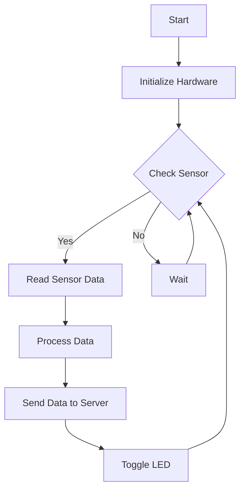

## 11.4 Embedded Systems Programming

Embedded systems programming is a specialized domain within software engineering that focuses on developing software for devices with limited resources. These devices often operate in real-time environments and require efficient, reliable, and low-level control over hardware. In this section, we will explore how the D programming language can be leveraged for embedded systems programming, focusing on design patterns, techniques, and best practices.

### Constraints in Embedded Systems

Embedded systems present unique challenges due to their constraints, which include limited resources and the need for bare-metal programming.

#### Limited Resources

Embedded systems typically have constrained memory, processing power, and storage. This necessitates careful management of resources to ensure efficient operation. Developers must optimize code for size and performance, often using low-level programming techniques.

#### Bare-Metal Programming

Bare-metal programming involves writing software that runs directly on the hardware without an operating system. This requires a deep understanding of the hardware architecture and direct interaction with hardware components, such as registers and peripherals.

### D in Embedded Contexts

The D programming language offers several features that make it suitable for embedded systems programming. These include cross-compilation capabilities and runtime considerations.

#### Cross-Compilation

Cross-compilation is the process of compiling code on one architecture to run on another. D supports cross-compilation, allowing developers to write code on a desktop environment and deploy it on an embedded device. This is achieved using the D compiler's cross-compilation features, which can target various architectures.

#### Runtime Considerations

Embedded systems often require minimizing or eliminating the need for a runtime environment. D provides options to reduce dependencies on its runtime and garbage collector, making it suitable for resource-constrained environments.

### Techniques for Success

To effectively use D in embedded systems programming, developers can employ several techniques, including using `@nogc` and `-betterC`, and interacting with hardware.

#### Using `@nogc` and `-betterC`

The `@nogc` attribute in D is used to indicate that a function does not perform any garbage collection. This is crucial in embedded systems, where garbage collection can introduce unwanted latency. The `-betterC` flag further reduces dependencies on the D runtime, allowing for more efficient and predictable code execution.

```d
// Example of a @nogc function
@nogc
void toggleLED() {
    // Directly manipulate hardware registers to toggle an LED
    // Assume LED_PORT and LED_PIN are defined elsewhere
    LED_PORT ^= (1 << LED_PIN);
}
```

#### Hardware Access

Interacting with hardware is a fundamental aspect of embedded systems programming. D allows for direct manipulation of hardware registers and peripherals, enabling precise control over the device.

```d
// Example of accessing a hardware register
void configureTimer() {
    // Assume TIMER_CONTROL is a memory-mapped register
    TIMER_CONTROL = 0x01; // Set the timer to a specific mode
}
```

### Use Cases and Examples

D can be used in various embedded systems applications, including IoT devices and microcontrollers.

#### IoT Devices

The Internet of Things (IoT) involves connecting everyday objects to the internet, enabling them to send and receive data. D's efficiency and cross-compilation capabilities make it suitable for developing software for IoT devices.

```d
// Example of an IoT device sending data
void sendDataToServer() {
    // Assume network setup and server address are configured
    auto data = "sensor reading";
    network.send(serverAddress, data);
}
```

#### Microcontrollers

Microcontrollers are small-scale embedded systems used in a wide range of applications. D can be used to program microcontrollers, providing a high-level language with low-level capabilities.

```d
// Example of programming a microcontroller to read a sensor
void readSensor() {
    // Assume SENSOR_PORT is a memory-mapped register
    auto sensorValue = SENSOR_PORT;
    processSensorData(sensorValue);
}
```

### Visualizing Embedded Systems Programming with D

To better understand the flow of embedded systems programming in D, let's visualize the process using a flowchart.



**Figure 1:** Flowchart of an embedded system using D to read sensor data, process it, and send it to a server.

### References and Links

For further reading on embedded systems programming and the D language, consider the following resources:

- [D Programming Language Official Website](https://dlang.org/)
- [Embedded Systems Programming on Wikipedia](https://en.wikipedia.org/wiki/Embedded_system)
- [Cross-Compilation with D](https://wiki.dlang.org/Cross-compilation)

### Knowledge Check

Let's reinforce what we've learned with a few questions:

1. What are the main constraints of embedded systems?
2. How does the `@nogc` attribute benefit embedded systems programming?
3. What is the purpose of the `-betterC` flag in D?
4. How can D be used in IoT applications?
5. What is the significance of cross-compilation in embedded systems programming?

### Embrace the Journey

Embedded systems programming with D offers a unique opportunity to leverage a high-level language in resource-constrained environments. By understanding the constraints and techniques discussed in this section, you can effectively develop software for embedded systems. Remember, this is just the beginning. As you progress, you'll build more complex and interactive systems. Keep experimenting, stay curious, and enjoy the journey!

## Quiz Time!



### What is a primary constraint of embedded systems?

- [x] Limited resources
- [ ] Unlimited processing power
- [ ] High memory availability
- [ ] Extensive storage capacity

> **Explanation:** Embedded systems often have limited resources, such as memory and processing power, which require careful management.

### What does the `@nogc` attribute in D indicate?

- [x] The function does not perform garbage collection
- [ ] The function is garbage collected
- [ ] The function is not safe
- [ ] The function is deprecated

> **Explanation:** The `@nogc` attribute indicates that a function does not perform any garbage collection, which is beneficial in resource-constrained environments.

### What is the purpose of the `-betterC` flag in D?

- [x] To reduce dependencies on the D runtime
- [ ] To enable garbage collection
- [ ] To increase code size
- [ ] To enhance memory usage

> **Explanation:** The `-betterC` flag reduces dependencies on the D runtime, making the code more suitable for embedded systems.

### How can D be used in IoT applications?

- [x] By writing efficient, cross-compiled code for IoT devices
- [ ] By using only high-level abstractions
- [ ] By relying on extensive operating systems
- [ ] By avoiding hardware interaction

> **Explanation:** D can be used in IoT applications by writing efficient, cross-compiled code that interacts directly with hardware.

### What is cross-compilation?

- [x] Compiling code on one architecture to run on another
- [ ] Compiling code on the same architecture
- [ ] Running code without compilation
- [ ] Avoiding compilation altogether

> **Explanation:** Cross-compilation involves compiling code on one architecture to run on another, which is essential for developing embedded systems.

### Which of the following is a use case for D in embedded systems?

- [x] Programming microcontrollers
- [ ] Developing desktop applications
- [ ] Creating web pages
- [ ] Designing databases

> **Explanation:** D can be used to program microcontrollers, which are a common component of embedded systems.

### What is bare-metal programming?

- [x] Writing software without an operating system
- [ ] Writing software with extensive libraries
- [ ] Writing software for cloud environments
- [ ] Writing software for virtual machines

> **Explanation:** Bare-metal programming involves writing software that runs directly on the hardware without an operating system.

### How does D interact with hardware in embedded systems?

- [x] By directly manipulating hardware registers
- [ ] By using high-level abstractions
- [ ] By relying on operating systems
- [ ] By avoiding hardware interaction

> **Explanation:** D interacts with hardware by directly manipulating hardware registers, allowing for precise control over the device.

### What is a benefit of using D for embedded systems programming?

- [x] High-level language with low-level capabilities
- [ ] Extensive runtime dependencies
- [ ] Limited cross-compilation support
- [ ] High memory usage

> **Explanation:** D offers a high-level language with low-level capabilities, making it suitable for embedded systems programming.

### True or False: Embedded systems programming with D requires an operating system.

- [ ] True
- [x] False

> **Explanation:** Embedded systems programming with D does not require an operating system, as it can be used for bare-metal programming.


