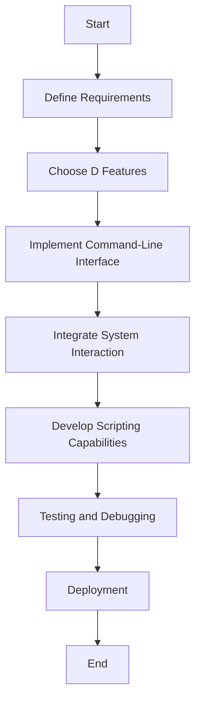

## 11.5 Developing System Utilities and Tools

In the realm of systems programming, developing robust and efficient system utilities and tools is a crucial skill. The D programming language, with its blend of high-level expressiveness and low-level control, offers a powerful platform for building such utilities. In this section, we will explore how to leverage D's features to create command-line applications, interact with the system, and develop scripts for automation and tooling.

### Command-Line Applications

Command-line applications are a staple in systems programming, providing a straightforward interface for users to interact with software. In D, creating command-line applications is streamlined by its standard library, which offers tools for argument parsing, input/output operations, and more.

#### Argument Parsing

Handling command-line arguments efficiently is essential for any command-line application. D's `std.getopt` module simplifies this process by providing a flexible and powerful way to parse command-line options.

```d
import std.stdio;
import std.getopt;

void main(string[] args) {
    string filename;
    bool verbose;

    auto opts = getopt(args,
        "file|f", &filename, "Specify the file to process",
        "verbose|v", &verbose, "Enable verbose output"
    );

    if (filename.empty) {
        writeln("Error: No file specified.");
        return;
    }

    writeln("Processing file: ", filename);
    if (verbose) {
        writeln("Verbose mode enabled.");
    }
}
```

In this example, we define two command-line options: `--file` (or `-f`) to specify a filename and `--verbose` (or `-v`) to enable verbose output. The `getopt` function automatically handles parsing and provides helpful error messages for invalid input.

#### Input/Output Operations

Reading from and writing to files and streams is a fundamental aspect of command-line applications. D's `std.stdio` module provides a straightforward interface for these operations.

```d
import std.stdio;

void readFile(string filename) {
    try {
        auto file = File(filename, "r");
        foreach (line; file.byLine()) {
            writeln(line);
        }
    } catch (Exception e) {
        writeln("Error reading file: ", e.msg);
    }
}

void writeFile(string filename, string content) {
    try {
        auto file = File(filename, "w");
        file.write(content);
    } catch (Exception e) {
        writeln("Error writing file: ", e.msg);
    }
}
```

These functions demonstrate how to read from and write to files using D. The `File` class provides methods for opening files in different modes, and the `byLine` method allows for efficient line-by-line reading.

### System Interaction

Interacting with the underlying system is a key capability for system utilities. D provides several modules to facilitate this, including access to environment variables and process control.

#### Environment Variables

Environment variables are a common way to configure applications. D's `std.process` module allows easy access to these variables.

```d
import std.stdio;
import std.process;

void printEnvVar(string varName) {
    string value = environment.get(varName, "Not set");
    writeln(varName, ": ", value);
}

void setEnvVar(string varName, string value) {
    environment[varName] = value;
    writeln("Set ", varName, " to ", value);
}
```

In this example, `printEnvVar` retrieves the value of an environment variable, while `setEnvVar` sets a new value. This functionality is useful for configuring applications dynamically based on the environment.

#### Process Control

Launching and managing subprocesses is another critical aspect of system utilities. D's `std.process` module provides a comprehensive API for process control.

```d
import std.stdio;
import std.process;

void runCommand(string command) {
    try {
        auto result = executeShell(command);
        writeln("Output: ", result.output);
        writeln("Exit code: ", result.status);
    } catch (Exception e) {
        writeln("Error executing command: ", e.msg);
    }
}
```

The `executeShell` function runs a shell command and returns its output and exit status. This is useful for automating tasks and integrating with other system tools.

### Scripting Capabilities

D's expressive syntax and powerful features make it an excellent choice for scripting. By leveraging D's scripting capabilities, developers can create scripts that are both efficient and easy to maintain.

#### Shebang Support

D supports writing scripts that can be executed directly from the command line using a shebang (`#!`) line. This allows D scripts to be used in place of traditional shell scripts.

```d
#!/usr/bin/env rdmd
import std.stdio;

void main() {
    writeln("Hello, D script!");
}
```

By using `rdmd` (the D runtime compiler), we can execute D scripts directly, making it easy to develop and test scripts without a separate compilation step.

#### Rapid Development

D's combination of high-level constructs and low-level control makes it ideal for rapid development of system utilities. Developers can quickly prototype and iterate on tools, leveraging D's rich standard library and metaprogramming capabilities.

### Use Cases and Examples

Let's explore some practical use cases for developing system utilities and tools with D.

#### Automation Scripts

D can replace traditional shell scripts with more powerful and maintainable programs. For example, a backup script that compresses files and uploads them to a server can be implemented in D with enhanced error handling and logging.

```d
import std.stdio;
import std.process;
import std.file;

void backupFiles(string[] files, string destination) {
    foreach (file; files) {
        string compressedFile = file ~ ".gz";
        executeShell("gzip " ~ file);
        executeShell("scp " ~ compressedFile ~ " " ~ destination);
        writeln("Backed up: ", file);
    }
}

void main() {
    string[] files = ["file1.txt", "file2.txt"];
    string destination = "user@server:/backup/";
    backupFiles(files, destination);
}
```

This script compresses each file using `gzip` and uploads it to a remote server using `scp`. The use of D allows for better error handling and logging compared to a shell script.

#### Development Tools

D's metaprogramming capabilities make it suitable for creating custom development tools, such as compilers, linters, or formatters. By leveraging D's compile-time features, developers can build tools that are both efficient and easy to extend.

### Visualizing System Utilities and Tools Development

To better understand the flow of developing system utilities and tools in D, let's visualize the process using a flowchart.



This flowchart outlines the typical steps involved in developing a system utility or tool using D, from defining requirements to deployment.

### Try It Yourself

To deepen your understanding, try modifying the code examples provided:

- Add additional command-line options to the argument parsing example.
- Implement error handling for the file operations.
- Extend the backup script to include logging and error reporting.

### Knowledge Check

Before we conclude, let's reinforce what we've learned with a few questions:

- How does D's `std.getopt` module simplify argument parsing?
- What are the benefits of using D for scripting compared to traditional shell scripts?
- How can D's metaprogramming capabilities be leveraged in developing system utilities?

### Embrace the Journey

Remember, developing system utilities and tools is an iterative process. As you continue to explore D's capabilities, you'll discover new ways to enhance your tools and streamline your workflows. Keep experimenting, stay curious, and enjoy the journey!

## Quiz Time!



### What module in D is used for parsing command-line arguments?

- [x] std.getopt
- [ ] std.stdio
- [ ] std.process
- [ ] std.file

> **Explanation:** The `std.getopt` module in D is specifically designed for parsing command-line arguments, making it easy to handle options and flags.

### Which D module provides access to environment variables?

- [ ] std.stdio
- [x] std.process
- [ ] std.file
- [ ] std.getopt

> **Explanation:** The `std.process` module provides functions to access and manipulate environment variables in D.

### How can D scripts be executed directly from the command line?

- [x] Using a shebang line with rdmd
- [ ] Compiling with dmd
- [ ] Using std.getopt
- [ ] By importing std.stdio

> **Explanation:** D scripts can be executed directly using a shebang line with `rdmd`, which allows them to run without a separate compilation step.

### What is the primary advantage of using D for automation scripts over shell scripts?

- [x] Enhanced error handling and logging
- [ ] Faster execution speed
- [ ] Simpler syntax
- [ ] Better compatibility with other languages

> **Explanation:** D offers enhanced error handling and logging capabilities compared to traditional shell scripts, making it a more robust choice for automation.

### Which feature of D is particularly useful for creating custom development tools?

- [ ] std.stdio
- [ ] std.process
- [x] Metaprogramming capabilities
- [ ] std.file

> **Explanation:** D's metaprogramming capabilities allow developers to create efficient and extensible custom development tools.

### What is the purpose of the `executeShell` function in D?

- [x] To run shell commands and capture their output
- [ ] To parse command-line arguments
- [ ] To read from and write to files
- [ ] To access environment variables

> **Explanation:** The `executeShell` function in D is used to run shell commands and capture their output and exit status.

### How can you access a specific environment variable in D?

- [x] Using the `environment` associative array in std.process
- [ ] By reading from a file
- [ ] Using std.getopt
- [ ] By importing std.stdio

> **Explanation:** The `environment` associative array in `std.process` allows you to access and modify environment variables in D.

### What is a common use case for developing system utilities in D?

- [x] Automation scripts
- [ ] Web development
- [ ] Game development
- [ ] Mobile app development

> **Explanation:** Automation scripts are a common use case for system utilities developed in D, leveraging its powerful features for task automation.

### Which D feature allows for efficient line-by-line reading of files?

- [ ] std.getopt
- [x] byLine method in std.stdio
- [ ] executeShell
- [ ] environment associative array

> **Explanation:** The `byLine` method in `std.stdio` allows for efficient line-by-line reading of files in D.

### True or False: D's `std.stdio` module is used for process control.

- [ ] True
- [x] False

> **Explanation:** False. D's `std.process` module is used for process control, not `std.stdio`.


