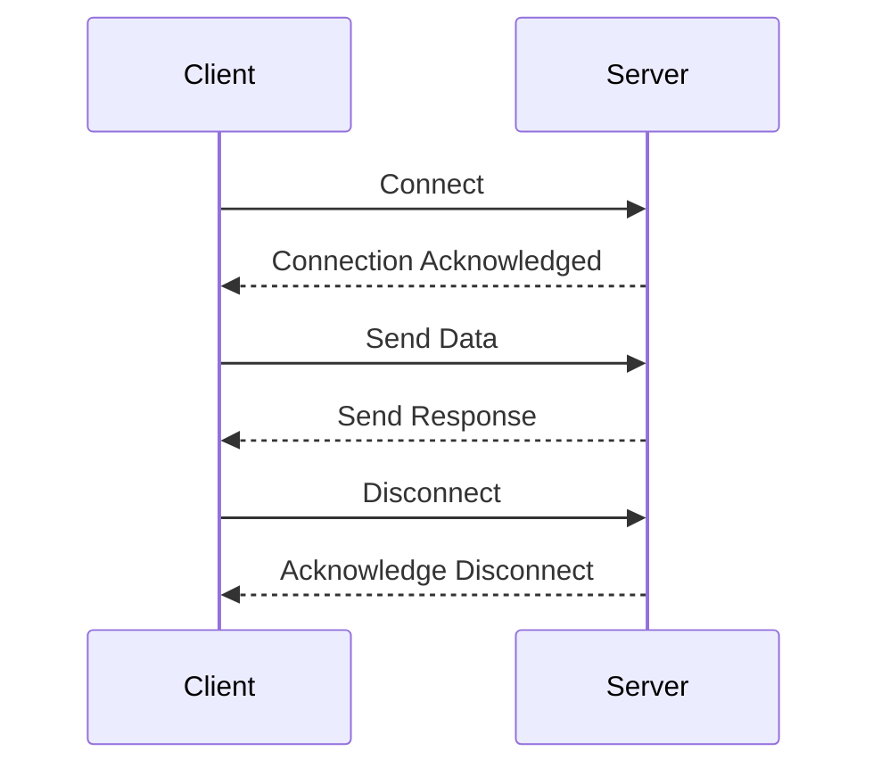

## 11.6 Network Programming and Protocols

Network programming is a cornerstone of modern software development, enabling communication between systems and devices. In this section, we delve into the world of network programming and protocols using the D programming language, focusing on socket programming, protocol implementation, and security considerations. By the end of this chapter, you'll be equipped to build robust, secure, and efficient network applications.

### Socket Programming

Socket programming is the foundation of network communication. It allows applications to send and receive data over a network. In D, socket programming can be efficiently implemented using the `std.socket` module, which provides a comprehensive API for both TCP and UDP communication.

#### TCP/UDP Communication

TCP (Transmission Control Protocol) and UDP (User Datagram Protocol) are the two primary protocols used for network communication. TCP is connection-oriented, ensuring reliable data transfer, while UDP is connectionless, offering faster, albeit less reliable, communication.

**TCP Communication Example:**

```d
import std.socket;
import std.stdio;

void main() {
    // Create a TCP socket
    auto socket = new TcpSocket();
    socket.connect(new InternetAddress("127.0.0.1", 8080));

    // Send data
    socket.send("Hello, Server!");

    // Receive data
    char[1024] buffer;
    auto bytesReceived = socket.receive(buffer);
    writeln("Received: ", buffer[0 .. bytesReceived]);

    // Close the socket
    socket.close();
}
```

**UDP Communication Example:**

```d
import std.socket;
import std.stdio;

void main() {
    // Create a UDP socket
    auto socket = new UdpSocket();
    socket.bind(new InternetAddress("127.0.0.1", 8080));

    // Send data
    socket.send("Hello, UDP!", new InternetAddress("127.0.0.1", 9090));

    // Receive data
    char[1024] buffer;
    InternetAddress sender;
    auto bytesReceived = socket.receive(buffer, sender);
    writeln("Received from ", sender.toString(), ": ", buffer[0 .. bytesReceived]);

    // Close the socket
    socket.close();
}
```

#### Non-Blocking I/O

Non-blocking I/O is crucial for building responsive network applications. It allows a program to continue executing while waiting for network operations to complete. In D, non-blocking I/O can be implemented using the `select` function or event-driven models.

**Non-Blocking I/O Example:**

```d
import std.socket;
import std.stdio;
import core.sys.posix.sys.select;

void main() {
    auto socket = new TcpSocket();
    socket.bind(new InternetAddress("127.0.0.1", 8080));
    socket.listen(5);

    fd_set readfds;
    FD_ZERO(&readfds);
    FD_SET(socket.handle, &readfds);

    timeval timeout;
    timeout.tv_sec = 5;
    timeout.tv_usec = 0;

    if (select(socket.handle + 1, &readfds, null, null, &timeout) > 0) {
        if (FD_ISSET(socket.handle, &readfds)) {
            auto client = socket.accept();
            writeln("Client connected: ", client.remoteAddress.toString());
            client.close();
        }
    }

    socket.close();
}
```

### Protocol Implementation

Protocols define the rules for data exchange over a network. Implementing protocols involves designing message formats and handling communication logic. In D, you can implement both custom and standard protocols.

#### Custom Protocols

Designing custom protocols allows you to tailor communication to specific application needs. This involves defining message structures and handling serialization and deserialization.

**Custom Protocol Example:**

```d
struct CustomMessage {
    int id;
    string data;

    void serialize(out char[] buffer) {
        // Serialize the message into the buffer
    }

    static CustomMessage deserialize(const char[] buffer) {
        // Deserialize the buffer into a CustomMessage
    }
}

void main() {
    CustomMessage message = {1, "Hello, Custom Protocol!"};
    char[256] buffer;
    message.serialize(buffer);

    auto receivedMessage = CustomMessage.deserialize(buffer);
    writeln("Received Message ID: ", receivedMessage.id);
    writeln("Received Message Data: ", receivedMessage.data);
}
```

#### Standard Protocols

Working with standard protocols like HTTP, FTP, and SMTP involves using existing libraries or implementing protocol-specific logic. D's ecosystem provides libraries for handling these protocols efficiently.

**HTTP Protocol Example:**

```d
import std.net.curl;
import std.stdio;

void main() {
    auto response = get("http://example.com");
    writeln("Response: ", response);
}
```

### Security Considerations

Security is paramount in network programming. Ensuring secure communication involves encryption, authentication, and protection against common vulnerabilities.

#### Encryption

Encryption ensures that data exchanged over a network remains confidential. SSL/TLS are widely used protocols for securing network communication.

**SSL/TLS Example:**

```d
import std.socket;
import std.stdio;
import std.net.curl;

void main() {
    auto response = get("https://secure.example.com");
    writeln("Secure Response: ", response);
}
```

#### Authentication

Authentication verifies the identity of communicating parties. Implementing secure authentication mechanisms is essential for protecting network applications.

**Authentication Example:**

```d
import std.socket;
import std.stdio;

void authenticateUser(string username, string password) {
    // Implement authentication logic
    if (username == "admin" && password == "password") {
        writeln("Authentication successful");
    } else {
        writeln("Authentication failed");
    }
}

void main() {
    authenticateUser("admin", "password");
}
```

### Use Cases and Examples

Network programming in D can be applied to a wide range of use cases, from developing servers and clients to building real-time data exchange applications.

#### Servers and Clients

Developing network services and client applications involves implementing server-client architectures, handling multiple connections, and managing data exchange.

**Server Example:**

```d
import std.socket;
import std.stdio;

void main() {
    auto server = new TcpSocket();
    server.bind(new InternetAddress("127.0.0.1", 8080));
    server.listen(5);

    while (true) {
        auto client = server.accept();
        writeln("Client connected: ", client.remoteAddress.toString());
        client.send("Welcome to the server!");
        client.close();
    }

    server.close();
}
```

**Client Example:**

```d
import std.socket;
import std.stdio;

void main() {
    auto client = new TcpSocket();
    client.connect(new InternetAddress("127.0.0.1", 8080));

    char[1024] buffer;
    auto bytesReceived = client.receive(buffer);
    writeln("Server says: ", buffer[0 .. bytesReceived]);

    client.close();
}
```

#### Real-Time Data Exchange

Building applications requiring low-latency communication involves optimizing data transfer and handling real-time updates.

**Real-Time Data Exchange Example:**

```d
import std.socket;
import std.stdio;

void main() {
    auto socket = new UdpSocket();
    socket.bind(new InternetAddress("127.0.0.1", 8080));

    while (true) {
        char[1024] buffer;
        InternetAddress sender;
        auto bytesReceived = socket.receive(buffer, sender);
        writeln("Real-time data from ", sender.toString(), ": ", buffer[0 .. bytesReceived]);
    }

    socket.close();
}
```

### Visualizing Network Communication

To better understand network communication, let's visualize a simple client-server interaction using a sequence diagram.



This diagram illustrates the sequence of messages exchanged between a client and a server during a typical interaction.

### Try It Yourself

Experiment with the provided code examples by modifying the IP addresses, ports, and messages. Try implementing additional features such as handling multiple clients, adding encryption, or designing a custom protocol.

### Knowledge Check

- What are the differences between TCP and UDP communication?
- How can you implement non-blocking I/O in D?
- What are the key considerations when designing a custom protocol?
- How does SSL/TLS enhance network security?
- What are some common use cases for network programming in D?

### Embrace the Journey

Remember, mastering network programming and protocols in D is a journey. As you progress, you'll build more complex and secure network applications. Keep experimenting, stay curious, and enjoy the journey!

## Quiz Time!



### What is the primary difference between TCP and UDP?

- [x] TCP is connection-oriented, while UDP is connectionless.
- [ ] TCP is faster than UDP.
- [ ] UDP provides error correction, while TCP does not.
- [ ] UDP is more secure than TCP.

> **Explanation:** TCP is connection-oriented, ensuring reliable data transfer, while UDP is connectionless, offering faster communication without reliability guarantees.

### How can non-blocking I/O be implemented in D?

- [x] Using the `select` function or event-driven models.
- [ ] By using synchronous socket operations.
- [ ] By using only UDP sockets.
- [ ] By implementing a custom protocol.

> **Explanation:** Non-blocking I/O in D can be implemented using the `select` function or event-driven models, allowing the program to continue executing while waiting for network operations.

### What is the purpose of SSL/TLS in network communication?

- [x] To encrypt data for secure communication.
- [ ] To speed up data transfer.
- [ ] To compress data.
- [ ] To authenticate users.

> **Explanation:** SSL/TLS is used to encrypt data, ensuring secure communication over the network.

### Which module in D is primarily used for socket programming?

- [x] `std.socket`
- [ ] `std.net.curl`
- [ ] `std.stdio`
- [ ] `std.file`

> **Explanation:** The `std.socket` module in D provides a comprehensive API for socket programming, including TCP and UDP communication.

### What is a common use case for UDP communication?

- [x] Real-time data exchange.
- [ ] Secure data transfer.
- [ ] Reliable file transfer.
- [ ] Email communication.

> **Explanation:** UDP is often used for real-time data exchange due to its low latency, despite its lack of reliability.

### What is a key consideration when designing a custom protocol?

- [x] Defining message structures and handling serialization.
- [ ] Ensuring the protocol is faster than TCP.
- [ ] Using only standard libraries.
- [ ] Avoiding encryption.

> **Explanation:** Designing a custom protocol involves defining message structures and handling serialization and deserialization.

### How can you secure authentication in network applications?

- [x] Implementing secure authentication mechanisms.
- [ ] Using only UDP for communication.
- [ ] Avoiding encryption.
- [ ] Using plain text passwords.

> **Explanation:** Secure authentication mechanisms are essential for verifying the identity of communicating parties and protecting network applications.

### What is the role of the `std.net.curl` module in D?

- [x] To handle HTTP requests and responses.
- [ ] To manage socket connections.
- [ ] To implement custom protocols.
- [ ] To encrypt data.

> **Explanation:** The `std.net.curl` module in D is used for handling HTTP requests and responses, making it useful for working with standard protocols like HTTP.

### What is a benefit of using non-blocking I/O?

- [x] It allows the program to continue executing while waiting for network operations.
- [ ] It ensures data is always received in order.
- [ ] It guarantees faster data transfer.
- [ ] It simplifies protocol implementation.

> **Explanation:** Non-blocking I/O allows the program to continue executing while waiting for network operations, improving responsiveness.

### True or False: TCP is faster than UDP.

- [ ] True
- [x] False

> **Explanation:** UDP is generally faster than TCP because it is connectionless and does not guarantee reliable data transfer, reducing overhead.


