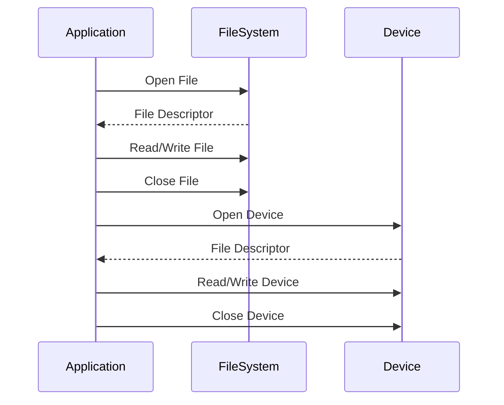

## 11.7 File System and Device Interactions

In the realm of systems programming, interacting with the file system and devices is a fundamental skill. The D programming language offers robust features and libraries to facilitate these interactions, making it an excellent choice for expert software engineers and architects. This section delves into the intricacies of file handling, directory operations, and device I/O in D, providing you with the knowledge to build efficient and high-performance systems.

### File Handling

File handling is a crucial aspect of systems programming, enabling applications to read from and write to files. In D, the `std.stdio` and `std.file` modules provide comprehensive support for file operations.

#### Reading and Writing

To manage files effectively, you need to understand how to open, read, write, and close files. Let's explore these operations using D's standard library.

```d
import std.stdio;
import std.file;

void main() {
    // Writing to a file
    File file = File("example.txt", "w");
    file.writeln("Hello, D Programming!");
    file.close();

    // Reading from a file
    string content = readText("example.txt");
    writeln("File Content: ", content);
}
```

- **Opening a File**: Use the `File` constructor with the desired mode (`"r"` for reading, `"w"` for writing, etc.).
- **Writing to a File**: Use `writeln` to write data to the file.
- **Reading from a File**: Use `readText` from `std.file` to read the entire content of a file.
- **Closing a File**: Always close the file using `close` to release resources.

#### File Metadata

Accessing file metadata is essential for understanding file attributes and permissions. D provides functions to retrieve this information.

```d
import std.file;
import std.stdio;

void main() {
    // Get file metadata
    FileInfo info = getFileInfo("example.txt");
    writeln("File Size: ", info.size, " bytes");
    writeln("Last Modified: ", info.timeLastModified);
    writeln("Is Readable: ", info.isReadable);
}
```

- **File Size**: Use `info.size` to get the file size in bytes.
- **Last Modified Time**: Use `info.timeLastModified` to get the last modified timestamp.
- **Permissions**: Check if the file is readable, writable, or executable using `info.isReadable`, `info.isWritable`, and `info.isExecutable`.

### Directory Operations

Working with directories involves traversing directory structures and monitoring changes. D provides tools to handle these tasks efficiently.

#### Traversal

Enumerating files and directories is a common requirement in systems programming. D's `std.file` module offers functions to traverse directories.

```d
import std.file;
import std.stdio;

void main() {
    foreach (entry; dirEntries(".", SpanMode.shallow)) {
        if (entry.isDir) {
            writeln("Directory: ", entry.name);
        } else {
            writeln("File: ", entry.name);
        }
    }
}
```

- **Directory Entries**: Use `dirEntries` to iterate over files and directories in a given path.
- **Checking Type**: Use `entry.isDir` to check if an entry is a directory.

#### Monitoring

Monitoring file system changes is vital for applications that need to respond to file modifications. While D does not have built-in support for file system monitoring, you can use external libraries or system-specific APIs to achieve this functionality.

### Device I/O

Interacting with hardware devices is a critical aspect of systems programming. D allows you to communicate with devices through file descriptors and handle serial communication.

#### Interacting with Devices

Devices in Unix-like systems are represented as files. You can interact with these devices using file descriptors.

```d
import core.sys.posix.unistd;
import core.sys.posix.fcntl;
import std.stdio;

void main() {
    int fd = open("/dev/someDevice", O_RDWR);
    if (fd < 0) {
        writeln("Failed to open device");
        return;
    }

    // Perform read/write operations using fd

    close(fd);
}
```

- **Opening a Device**: Use `open` with the device path and desired flags (`O_RDWR` for read/write).
- **File Descriptor**: Use the returned file descriptor to perform read/write operations.
- **Closing a Device**: Use `close` to release the file descriptor.

#### Serial Communication

Handling serial ports and USB devices requires understanding of serial communication protocols. D can interface with these devices using system calls.

```d
import core.sys.posix.termios;
import core.sys.posix.unistd;
import std.stdio;

void main() {
    int fd = open("/dev/ttyS0", O_RDWR | O_NOCTTY);
    if (fd < 0) {
        writeln("Failed to open serial port");
        return;
    }

    termios options;
    tcgetattr(fd, &options);
    cfsetispeed(&options, B9600);
    cfsetospeed(&options, B9600);
    tcsetattr(fd, TCSANOW, &options);

    // Perform read/write operations

    close(fd);
}
```

- **Opening a Serial Port**: Use `open` with the serial port path.
- **Configuring Serial Port**: Use `termios` to set baud rate and other options.
- **Performing I/O**: Use the file descriptor for read/write operations.

### Use Cases and Examples

Understanding file system and device interactions is crucial for building system utilities and device drivers.

#### System Utilities

Creating tools that manipulate files and directories is a common use case. For example, a utility to back up files can be implemented using D's file handling capabilities.

```d
import std.file;
import std.stdio;

void backupFile(string source, string destination) {
    copy(source, destination);
    writeln("Backup completed: ", source, " -> ", destination);
}

void main() {
    backupFile("example.txt", "backup_example.txt");
}
```

- **Copying Files**: Use `copy` from `std.file` to duplicate files.
- **Logging**: Use `writeln` to log operations.

#### Device Drivers

Writing user-space drivers or interfacing with kernel modules requires a deep understanding of device I/O. D's ability to interact with low-level system calls makes it suitable for such tasks.

```d
import core.sys.posix.unistd;
import core.sys.posix.fcntl;
import std.stdio;

void main() {
    int fd = open("/dev/myDevice", O_RDWR);
    if (fd < 0) {
        writeln("Failed to open device");
        return;
    }

    // Implement device-specific logic

    close(fd);
}
```

- **Device-Specific Logic**: Implement logic specific to the device being interfaced.
- **Error Handling**: Ensure robust error handling for device interactions.

### Visualizing File System and Device Interactions

To better understand the flow of file system and device interactions, let's visualize the process using a sequence diagram.



**Diagram Description**: This sequence diagram illustrates the interaction between an application, the file system, and a device. The application opens a file or device, performs read/write operations, and then closes the file or device.

### Try It Yourself

Experiment with the code examples provided in this section. Try modifying the file paths, changing file permissions, or interacting with different devices. This hands-on approach will deepen your understanding of file system and device interactions in D.

### References and Links

- [D Language Documentation](https://dlang.org/library.html)
- [POSIX File System API](https://pubs.opengroup.org/onlinepubs/9699919799/basedefs/fcntl.h.html)
- [Serial Programming Guide for POSIX Operating Systems](https://www.cmrr.umn.edu/~strupp/serial.html)

### Knowledge Check

- What are the key functions for reading and writing files in D?
- How do you access file metadata in D?
- Describe the process of enumerating files and directories.
- What are the steps to interact with a device using file descriptors?
- How can you configure a serial port in D?

### Embrace the Journey

Remember, mastering file system and device interactions is just one aspect of systems programming. As you continue to explore the D programming language, you'll discover more powerful features and capabilities. Keep experimenting, stay curious, and enjoy the journey!

## Quiz Time!



### What module in D is primarily used for file handling?

- [x] std.stdio
- [ ] std.math
- [ ] std.string
- [ ] std.array

> **Explanation:** The `std.stdio` module in D is primarily used for file handling operations such as reading and writing files.

### How do you retrieve file metadata in D?

- [x] Using the getFileInfo function
- [ ] Using the readText function
- [ ] Using the writeText function
- [ ] Using the open function

> **Explanation:** The `getFileInfo` function is used to retrieve metadata about a file, such as its size and last modified time.

### Which function is used to enumerate files and directories in D?

- [x] dirEntries
- [ ] readDir
- [ ] listFiles
- [ ] enumerate

> **Explanation:** The `dirEntries` function is used to enumerate files and directories in a specified path.

### What is the purpose of the termios structure in serial communication?

- [x] To configure serial port settings
- [ ] To read from a file
- [ ] To write to a file
- [ ] To close a file

> **Explanation:** The `termios` structure is used to configure serial port settings such as baud rate and data bits.

### How do you open a device file in D?

- [x] Using the open function with the device path
- [ ] Using the read function with the device path
- [ ] Using the write function with the device path
- [ ] Using the close function with the device path

> **Explanation:** The `open` function is used to open a device file by specifying the device path and desired flags.

### What is the role of the FileInfo structure in D?

- [x] To store metadata about a file
- [ ] To read data from a file
- [ ] To write data to a file
- [ ] To close a file

> **Explanation:** The `FileInfo` structure stores metadata about a file, such as its size and permissions.

### Which function is used to copy files in D?

- [x] copy
- [ ] move
- [ ] delete
- [ ] rename

> **Explanation:** The `copy` function is used to duplicate files from one location to another.

### What is the significance of the O_RDWR flag when opening a device?

- [x] It allows both reading and writing to the device
- [ ] It allows only reading from the device
- [ ] It allows only writing to the device
- [ ] It prevents any operations on the device

> **Explanation:** The `O_RDWR` flag allows both reading and writing operations on the device.

### How do you close a file or device in D?

- [x] Using the close function
- [ ] Using the open function
- [ ] Using the read function
- [ ] Using the write function

> **Explanation:** The `close` function is used to release resources associated with a file or device.

### True or False: D provides built-in support for monitoring file system changes.

- [ ] True
- [x] False

> **Explanation:** D does not provide built-in support for monitoring file system changes; external libraries or system-specific APIs are needed for this functionality.


