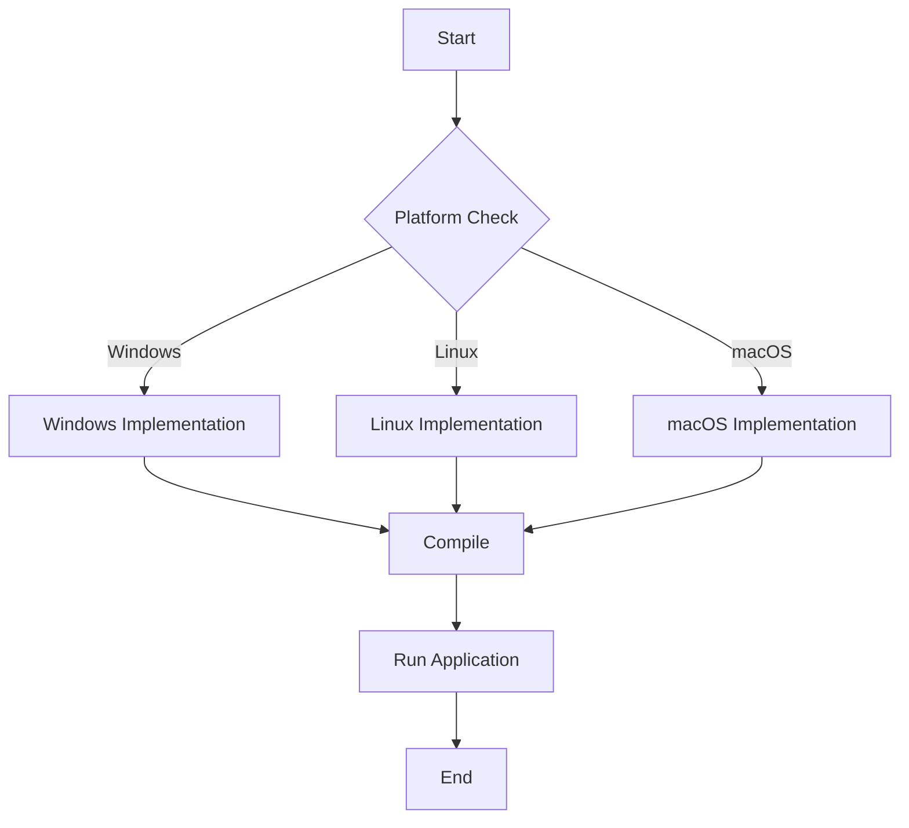

## 11.8 Cross-Platform Development Strategies

In today's diverse computing landscape, developing software that runs seamlessly across multiple platforms is crucial. The D programming language, with its powerful features and flexibility, is well-suited for cross-platform development. In this section, we'll explore strategies for building cross-platform applications using D, focusing on platform abstraction, leveraging standard libraries, and ensuring third-party library portability.

### Platform Abstraction

Cross-platform development often requires abstracting platform-specific details to create a unified codebase. This involves using conditional compilation, abstract interfaces, and other techniques to handle platform-specific variations.

#### Conditional Compilation

Conditional compilation allows developers to include or exclude code based on the target platform. In D, this is achieved using `version` statements. By defining platform-specific versions, you can write code that adapts to different environments.

```d
version(Windows) {
    import core.sys.windows.windows;
    void platformSpecificFunction() {
        // Windows-specific implementation
    }
} else version(Posix) {
    import core.sys.posix.unistd;
    void platformSpecificFunction() {
        // POSIX-specific implementation
    }
} else {
    static assert(0, "Unsupported platform");
}
```

In this example, `platformSpecificFunction` is implemented differently for Windows and POSIX systems. The `static assert` ensures that unsupported platforms are caught during compilation.

#### Abstract Interfaces

Abstract interfaces provide a way to define platform-agnostic APIs. By designing interfaces that encapsulate platform-specific details, you can create a consistent API for your application.

```d
interface FileSystem {
    void readFile(string path);
    void writeFile(string path, string content);
}

class WindowsFileSystem : FileSystem {
    void readFile(string path) {
        // Windows-specific file reading
    }
    void writeFile(string path, string content) {
        // Windows-specific file writing
    }
}

class PosixFileSystem : FileSystem {
    void readFile(string path) {
        // POSIX-specific file reading
    }
    void writeFile(string path, string content) {
        // POSIX-specific file writing
    }
}
```

By using interfaces, you can switch between different implementations without changing the code that uses the interface.

### Standard Libraries

D's standard library, `Phobos`, provides a wealth of cross-platform functionalities. Leveraging these modules can significantly reduce the complexity of cross-platform development.

#### Leveraging `std` Modules

Modules like `std.file`, `std.process`, and `std.socket` offer platform-independent APIs for common tasks such as file manipulation, process management, and networking.

```d
import std.file;
import std.stdio;

void main() {
    string content = readText("example.txt");
    writeln("File content: ", content);
}
```

The `std.file` module abstracts file operations, allowing you to read and write files without worrying about platform-specific details.

### Third-Party Libraries

When using third-party libraries, ensuring their portability across platforms is essential. This involves selecting libraries that support multiple platforms and managing dependencies effectively.

#### Portability

Choose libraries that are actively maintained and have a track record of cross-platform support. Check for platform-specific features and ensure they align with your target environments.

#### Use Cases and Examples

Let's explore some practical scenarios where cross-platform development strategies are applied.

##### Application Porting

Porting applications between platforms like Windows, Linux, and macOS involves adapting the codebase to handle platform-specific differences. This can include file paths, system calls, and GUI components.

```d
version(Windows) {
    // Windows-specific code
} else version(Linux) {
    // Linux-specific code
} else version(OSX) {
    // macOS-specific code
}
```

By using conditional compilation and abstract interfaces, you can create a codebase that adapts to different platforms with minimal changes.

##### Universal Tools

Developing tools that run consistently across environments requires careful consideration of platform-specific features. For example, a command-line tool should handle different terminal behaviors and file system structures.

```d
import std.process;

void runCommand(string command) {
    auto result = executeShell(command);
    writeln("Output: ", result.output);
}
```

The `std.process` module provides a cross-platform way to execute shell commands, making it easier to develop universal tools.

### Visualizing Cross-Platform Development

To better understand the flow of cross-platform development, let's visualize the process using a flowchart.



This flowchart illustrates the decision-making process for implementing platform-specific code and compiling the application for different platforms.

### Try It Yourself

Experiment with the code examples provided by modifying them to include additional platform-specific features or by creating new abstract interfaces for other system components. This hands-on approach will deepen your understanding of cross-platform development in D.

### Knowledge Check

- What are the benefits of using conditional compilation in cross-platform development?
- How do abstract interfaces help in creating platform-agnostic APIs?
- Why is it important to choose portable third-party libraries?

### Embrace the Journey

Cross-platform development in D is a rewarding endeavor that opens up new possibilities for your applications. Remember, this is just the beginning. As you progress, you'll build more complex and versatile applications. Keep experimenting, stay curious, and enjoy the journey!

## Quiz Time!



### What is the primary purpose of conditional compilation in D?

- [x] To include or exclude code based on the target platform
- [ ] To optimize code performance
- [ ] To enhance code readability
- [ ] To manage memory allocation

> **Explanation:** Conditional compilation allows developers to write platform-specific code that is included or excluded based on the target platform.

### How do abstract interfaces contribute to cross-platform development?

- [x] By providing a consistent API across different platforms
- [ ] By improving code performance
- [ ] By reducing memory usage
- [ ] By simplifying error handling

> **Explanation:** Abstract interfaces define platform-agnostic APIs, allowing developers to switch between different implementations without changing the code that uses the interface.

### Which D module provides platform-independent file operations?

- [x] std.file
- [ ] std.process
- [ ] std.socket
- [ ] std.stdio

> **Explanation:** The `std.file` module in D's standard library provides platform-independent APIs for file operations.

### What should you consider when choosing third-party libraries for cross-platform development?

- [x] Portability across target platforms
- [ ] Code readability
- [ ] Memory usage
- [ ] Compilation speed

> **Explanation:** Ensuring that third-party libraries are portable across target platforms is crucial for cross-platform development.

### What is the role of `version` statements in D?

- [x] To handle platform-specific code
- [ ] To manage memory allocation
- [ ] To enhance code readability
- [ ] To optimize code performance

> **Explanation:** `version` statements in D are used for conditional compilation, allowing developers to write platform-specific code.

### What is a key benefit of using D's standard library for cross-platform development?

- [x] It provides cross-platform functionalities
- [ ] It enhances code readability
- [ ] It reduces memory usage
- [ ] It simplifies error handling

> **Explanation:** D's standard library, `Phobos`, offers modules with cross-platform functionalities, simplifying the development process.

### What is an example of a cross-platform development strategy?

- [x] Using abstract interfaces
- [ ] Optimizing code performance
- [ ] Reducing memory usage
- [ ] Simplifying error handling

> **Explanation:** Using abstract interfaces is a strategy to create platform-agnostic APIs, facilitating cross-platform development.

### What is the purpose of the `static assert` in the provided code example?

- [x] To catch unsupported platforms during compilation
- [ ] To optimize code performance
- [ ] To enhance code readability
- [ ] To manage memory allocation

> **Explanation:** The `static assert` ensures that unsupported platforms are caught during compilation, preventing runtime errors.

### How can you develop universal tools in D?

- [x] By handling different terminal behaviors and file system structures
- [ ] By optimizing code performance
- [ ] By reducing memory usage
- [ ] By simplifying error handling

> **Explanation:** Developing universal tools involves handling platform-specific features like terminal behaviors and file system structures.

### True or False: Cross-platform development in D is only possible with third-party libraries.

- [ ] True
- [x] False

> **Explanation:** Cross-platform development in D is facilitated by both the standard library and third-party libraries, not solely by third-party libraries.


